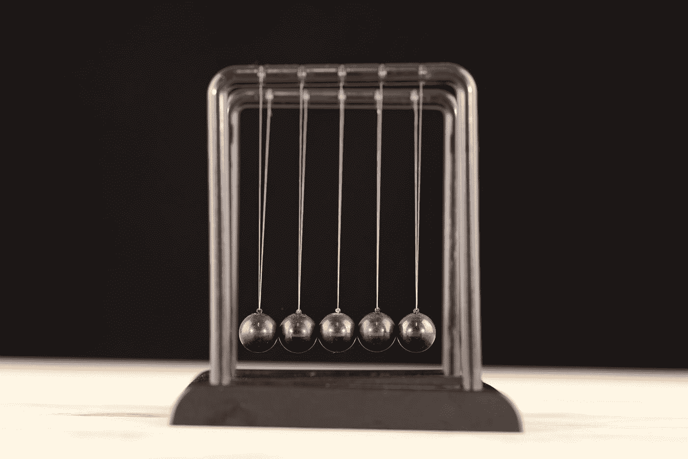
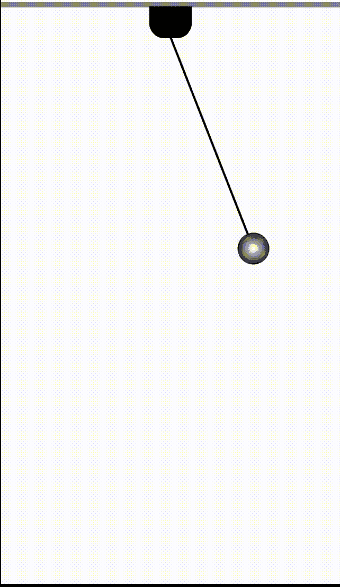

# 在 SwiftUI 中创建钟摆摆动动画

> 原文：<https://betterprogramming.pub/create-a-pendulum-swing-animation-in-swiftui-animationtutorial-series-b9154f3523f7>

## 利用 RotationEffect 修改器创建单摆摆动动画



[engin akyurt](https://unsplash.com/@enginakyurt?utm_source=medium&utm_medium=referral) 在 [Unsplash](https://unsplash.com?utm_source=medium&utm_medium=referral) 上拍摄的照片

# 实施分解

*   使用矩形视图为钟摆创建一个悬挂底座
*   从悬挂底座创建一个钟摆支架——使用矩形视图并指定唯一的左下角和右下角半径
*   使用矩形视图为钟摆创建一条绳子
*   创建一个球——使用圆形视图，并填充有角度的辐射
*   使用`RotationEffect`左右摆动钟摆

# **悬挂底座**

这里我们简单的用一个矩形视图做一个类似屋顶的视图。我们将称之为`TopBase`，并将`color`指定为灰色。从下面的代码你可以看到我们将如何创建悬挂基地。

# **摆式支架**

一旦钟摆悬挂基地创建，我们将快速创建钟摆持有人。为了创建钟摆支架，我们将使用一个带有自定义视图修改器的`Rectangle` `View`,该修改器将`Bottom`左右裁剪一个圆角半径。为了剪辑`Rectangle`视图的左右角`Bottom`，我们将使用下面的`extension`和`shape`

一旦扩展被设置，我们将创建我们的钟摆架视图，如下所示。

# **摆绳**

一旦创建了支架，我们将再次使用矩形视图来创建摆绳。您可以使用下面的代码来创建摆绳视图。我们将给它一个`width of 2`和`height of 200`

## **球**

为了创建`Ball`,我们将使用一个圆形视图并用一个径向渐变来遮盖它，这样`Ball`将得到一些 3D 效果。

```
RadialGradient(gradient: Gradient(colors: [.clear, .black, .black, .black]), center: .center, startRadius: 1, endRadius: 50)
```

我们将使用上面的`Gradient`来掩盖我们的`Circle`。

# 动画🎬

为了设置像钟摆摆动这样的动画，我们需要一个`state`设置器来告诉我们球是在右边还是左边。此外，我们需要确保动画永远重复。

我们将首先引入我们的`state`变量，它将告诉我们球是在其最大(右)还是最小(左)位置。我们将建立一个 Enum，称为`RotationState`，它可以有两种状态`Min`和`Max`。

当动画或球到达`Max`状态时，我们需要将`state`(旋转状态)切换到`Min`，反之亦然。

# **对齐视图内容视图**

我们将在 VStack 中创建一个`VStack`,我们将添加我们的`TopBase`,固定器，以及另一个包含`PendulumRope`和球的`VStack`。
为什么我创建了另一个`VStack`并将摆绳和球视图放在里面，因为我们只需要旋转摆绳和`Ball`而不是`TopBase`和支架。我们可以在下面的代码中看到相同的设置。

这里我们要做的是，我们将添加一个`rotationEffect`修改器到我们的第二个`VStack`中，它包含了`PendulumRope`和球。

旋转角度将由我们的`state`变量驱动。当`state`设置为最大时，我们将旋转角度设置为-40 度，当`state`设置为最小时，我们将旋转角度设置为 40 度。同样，我们将在`onAppear`视图修改器中的`withAnimation`闭包内切换它。

# 最终动画



我希望你明白我们如何使用`rotationEffect`来创建一个类似钟摆摆动的动画。

感谢阅读。