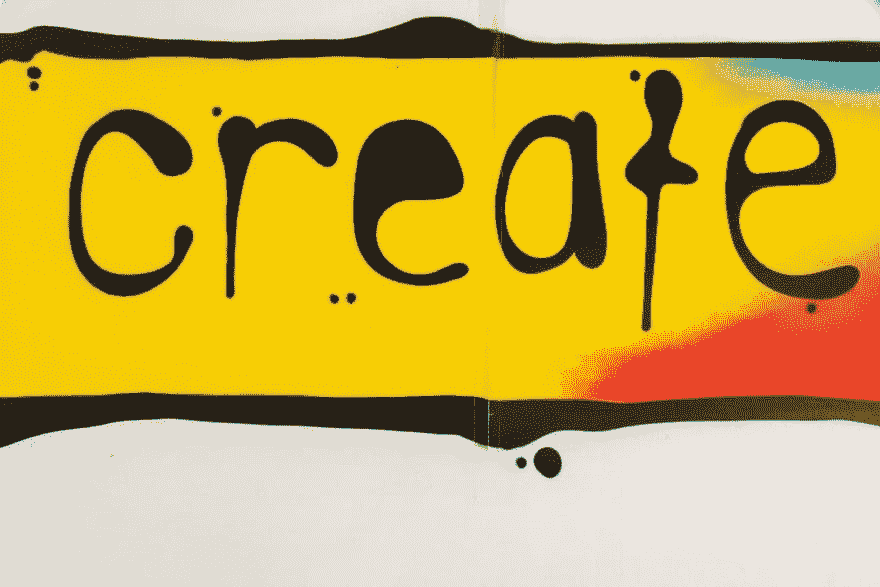
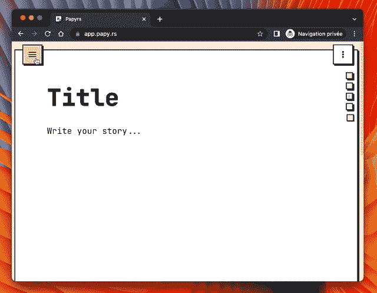
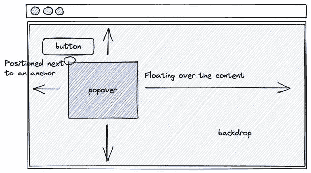
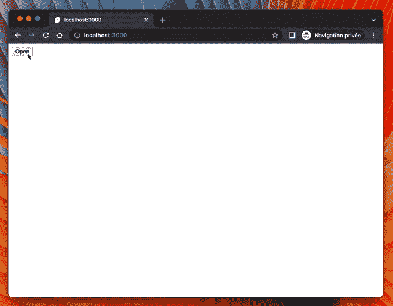

# 创建一个苗条的 Popover

> 原文：<https://betterprogramming.pub/create-a-popover-in-svelte-fe7dd2eeebb1>

## 如何在没有任何其他库或依赖项的情况下创建一个 popover。



照片由[缺口缺口](https://unsplash.com/@jannerboy62?utm_source=Papyrs&utm_medium=referral)在[缺口](https://unsplash.com/?utm_source=unsplash&utm_medium=referral&utm_content=creditCopyText)上拍摄

我已经实现了我上一个项目 [Papyrs](https://papy.rs/) 的 UI 组件，没有任何第三方设计系统库——也就是说，我从头开始创建所有组件。我这样做是为了获得对我固执己见的布局中的各种砖块的完全控制和灵活性。

在这篇博文中，我分享了如何在[svelet](https://svelte.dev/)中开发 popover 组件。



# 骨骼

popover 是一个浮动容器，它呈现在锚(通常是一个按钮)旁边的内容上，启动它的显示。为了提高覆盖图的视觉焦点，通常使用背景来部分模糊其背后的视图。



我们可以通过在名为`Popover.svelte`的组件中复制上述框架来开始实现，该组件包含一个`button`和`div`。

```
<button>Open</button>

<div
    role="dialog"
    aria-labelledby="Title"
    aria-describedby="Description"
    aria-orientation="vertical"
>
    <div>Backdrop</div>
    <div>Content</div>
</div>
```

为了提高可访问性，我们可以设置`dialog`角色并提供一些`aria`信息(更多细节参见 [MDN 文档](https://developer.mozilla.org/en-US/docs/Web/Accessibility/ARIA/Roles/dialog_role))。

# 动画

我们创建一个`boolean`状态— `visible` —来显示或关闭弹出窗口。当点击`button`时，状态被设置为`true`，覆盖图被渲染。相反，当背景被点击时，它转向`false`并关闭。

此外，我们在 popover 上添加了一个 click 监听器，它除了停止事件传播之外什么也不做。当用户与其内容交互时，这有助于避免关闭覆盖图。

多亏了[过渡指令](https://svelte.dev/tutorial/transition)——也被称为“苗条的黑魔法”,我们还可以让覆盖图优雅地出现和消失😁。

```
<script lang="ts">
  import { fade, scale } from 'svelte/transition';
  import { quintOut } from 'svelte/easing';

  let visible = false;
</script>

<button on:click={() => (visible = true)}>Open</button>

{#if visible}
  <div
    role="dialog"
    aria-labelledby="Title"
    aria-describedby="Description"
    aria-orientation="vertical"
    transition:fade
    on:click|stopPropagation
  >
    <div
      on:click|stopPropagation={() => (visible = false)}
      transition:scale={{ delay: 25, duration: 150, easing: quintOut }}
    >
      Backdrop
    </div>
    <div>Content</div>
  </div>
{/if}
```

# 定位在内容上

无论页面是否滚动，弹出窗口都应该呈现在所有内容上。因此，我们可以使用`fixed`位置作为起点。它的内容和背景都设置为`absolute`位置。背景也应该覆盖屏幕，但它是覆盖层的子层，因此是“绝对的”，内容应该放在锚点旁边。

我们添加到解决方案中的其余 CSS 代码是宽度、高度或颜色的最小样式设置。

```
<script lang="ts">
  import { fade, scale } from 'svelte/transition';
  import { quintOut } from 'svelte/easing';

  let visible = false;
</script>

<button on:click={() => (visible = true)}>Open</button>

{#if visible}
  <div
    role="dialog"
    aria-labelledby="Title"
    aria-describedby="Description"
    aria-orientation="vertical"
    transition:fade
    class="popover"
    on:click|stopPropagation
  >
    <div
      on:click|stopPropagation={() => (visible = false)}
      transition:scale={{ delay: 25, duration: 150, easing: quintOut }}
      class="backdrop"
    />
    <div class="wrapper">Content</div>
  </div>
{/if}

<style>
  .popover {
    position: fixed;
    inset: 0;

    z-index: 997;
  }

  .backdrop {
    position: absolute;
    inset: 0;

    background: rgba(0, 0, 0, 0.3);
  }

  .wrapper {
    position: absolute;

    min-width: 200px;
    max-width: 200px;

    min-height: 100px;

    width: fit-content;
    height: auto;

    overflow: hidden;

    display: flex;
    flex-direction: column;
    align-items: flex-start;

    background: white;
    color: black;
  }
</style>
```

# 锚旁边的位置

要设置按钮旁边的覆盖，我们必须获得该元素的引用，以找到它在视口中的位置。为此我们可以`bind`锚。

当引用准备好或者窗口被调整大小时(如果用户调整浏览器的大小，位置可能会改变)，我们使用 [getBoundingClientRect()](https://developer.mozilla.org/en-US/docs/Web/API/Element/getBoundingClientRect) 方法来查询关于位置的信息。

我们最终将这些 JavaScript 信息翻译成 CSS 变量，以便在我们想要设置的确切位置呈现 popover 的内容。

```
<script lang="ts">
  // ...

  let anchor: HTMLButtonElement | undefined = undefined;

  let bottom: number;
  let left: number;

  const initPosition = () =>
    ({ bottom, left } = anchor?.getBoundingClientRect() ?? { bottom: 0, left: 0 });

  $: anchor, initPosition();
</script>

<svelte:window on:resize={initPosition} />

<button on:click={() => (visible = true)} bind:this={anchor}>Open</button>

{#if visible}
  <div
    role="dialog"
    aria-labelledby="Title"
    aria-describedby="Description"
    aria-orientation="vertical"
    transition:fade
    class="popover"
    on:click|stopPropagation
    style="--popover-top: {`${bottom}px`}; --popover-left: {`${left}px`}"
  >
    <!-- ... -->
  </div>
{/if}

<style>
  /** ... */

  .wrapper {
    position: absolute;

    top: calc(var(--popover-top) + 10px);
    left: var(--popover-left);

    /** ... */
  }
</style>
```

上面的代码片段被修剪成只展示与本章相关的内容。总的来说，该组件的代码如下:

```
<script lang="ts">
  import { fade, scale } from 'svelte/transition';
  import { quintOut } from 'svelte/easing';

  let visible = false;
  let anchor: HTMLButtonElement | undefined = undefined;

  let bottom: number;
  let left: number;

  const initPosition = () =>
    ({ bottom, left } = anchor?.getBoundingClientRect() ?? { bottom: 0, left: 0 });

  $: anchor, initPosition();
</script>

<svelte:window on:resize={initPosition} />

<button on:click={() => (visible = true)} bind:this={anchor}>Open</button>

{#if visible}
  <div
    role="dialog"
    aria-labelledby="Title"
    aria-describedby="Description"
    aria-orientation="vertical"
    transition:fade
    class="popover"
    on:click|stopPropagation
    style="--popover-top: {`${bottom}px`}; --popover-left: {`${left}px`}"
  >
    <div
      on:click|stopPropagation={() => (visible = false)}
      transition:scale={{ delay: 25, duration: 150, easing: quintOut }}
      class="backdrop"
    />
    <div class="wrapper">Content</div>
  </div>
{/if}

<style>
  .popover {
    position: fixed;
    inset: 0;

    z-index: 997;
  }

  .backdrop {
    position: absolute;
    inset: 0;

    background: rgba(0, 0, 0, 0.3);
  }

  .wrapper {
    position: absolute;

    top: calc(var(--popover-top) + 10px);
    left: var(--popover-left);

    min-width: 200px;
    max-width: 200px;

    min-height: 100px;

    width: fit-content;
    height: auto;

    overflow: hidden;

    display: flex;
    flex-direction: column;
    align-items: flex-start;

    background: white;
    color: black;
  }
</style>
```

还有…就是这样！我们已经实现了一个最小的自定义弹出窗口，可以在任何苗条的应用程序中使用，没有任何依赖性。

# 结论

我们没有美化解决方案，因此结果在视觉上仍然很粗糙，但是 popover 像预期的那样工作。

为了从那里开始迭代，实现更多的选项或者让它变得闪亮，你可以在 [GitHub](https://github.com/papyrs/papyrs) 上查看 [Papyrs](https://papy.rs/) 的开源代码🤗。

通向无限和更远的地方



```
**Want to Connect?**For more adventures, follow me on [Twitter](https://twitter.com/daviddalbusco)
```