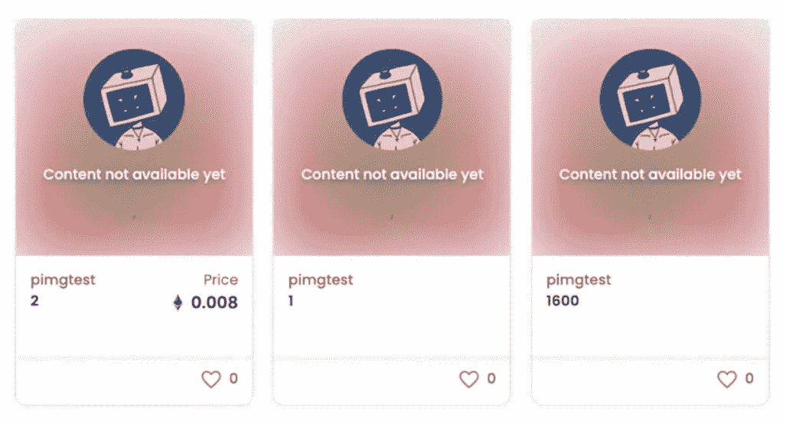
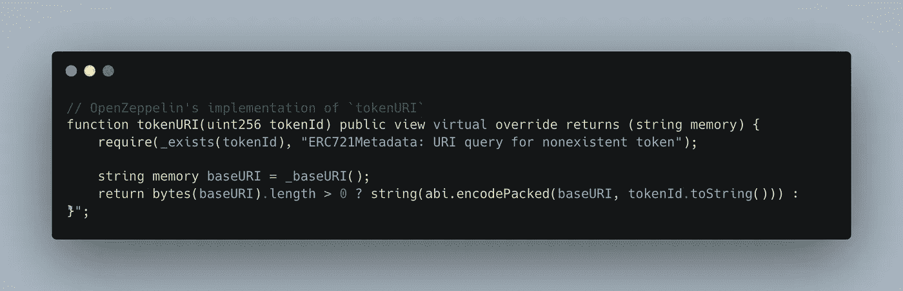
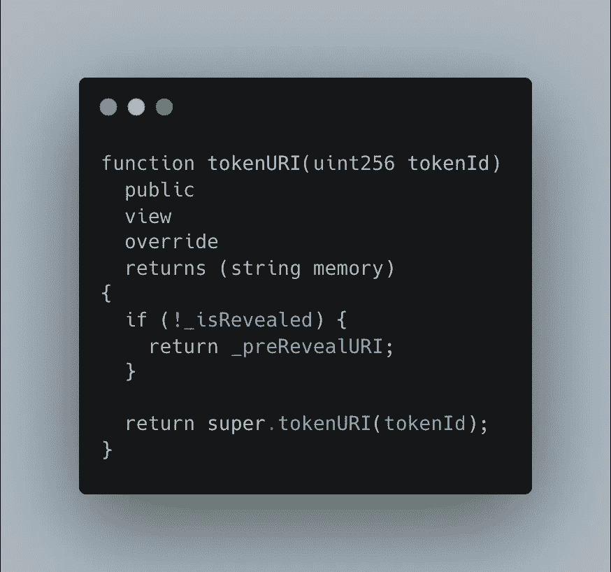
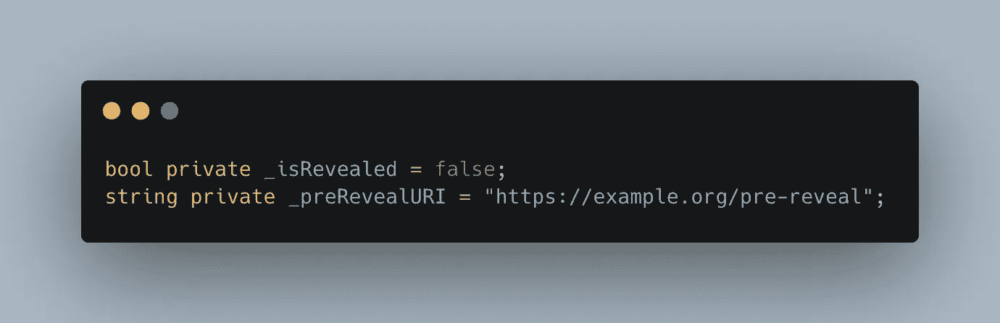
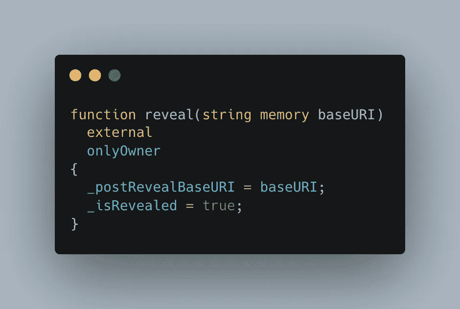
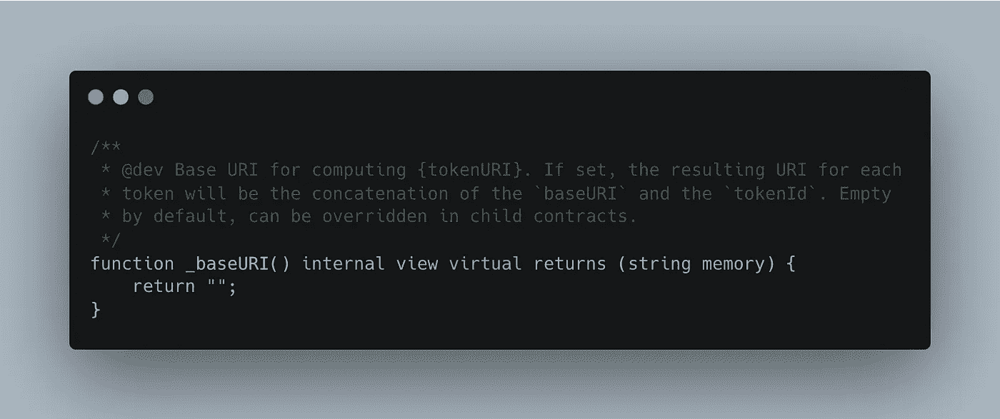
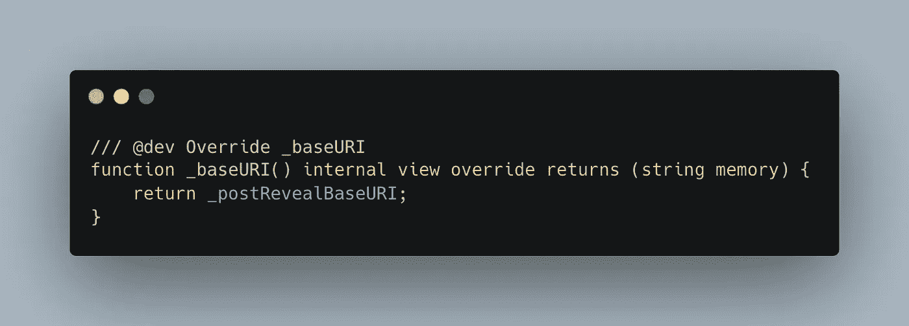

# 我是如何为拉撒路·NFT 系列设计预展的

> 原文：<https://betterprogramming.pub/create-a-pre-reveal-mechanism-for-your-nft-collection-b2ff372a2b36>

## 一种简单、安全且有效的方法



带有预显示占位符图像的 NFTs

在推出新的亲民党风格的 NFT 系列(一个 la Bored Ape 游艇俱乐部)时，为每一个铸造的 NFT 使用占位符图像已经成为一种常见的做法，只有在所有的 NFT 都铸造完成后，才显示最终的 NFT。

这是一个重要的实践，因为如果没有它，狙击手可以根据通过元数据暴露的特性的稀有性来选择铸造哪些 NFT。

我最近为 LazarusNFT 系列开发了智能合约，并使用了这种预披露技术。

在开始构建这个特性之前，让我们扩展一下我们的业务需求:

*   隐藏令牌和元数据，直到生成所有令牌
*   一旦用户铸造了令牌，就向他们发送令牌的“预揭示”版本
*   允许合同所有者“显示”集合中的所有令牌

我们的智能契约负责返回每个令牌的`metadata.json`文件所在的 URL。

我们可以解决上述问题的方法是创建一个“预揭示”元数据文件，并将其上传到某个地方(例如:[https://example.org/pre-reveal.json](https://example.org/pre-reveal.json))。这个“揭示前的 URI”是我们希望在揭示发生之前为每个令牌返回的内容。

揭示之后，我们希望能够用一个新的 URL 来更新智能合约，该 URL 可用于生成正确的令牌 URIs。

例如，如果我们已经将所有的令牌上传到一个响应`https://exmaple.org/tokens/:tokenId`的 web 服务器，那么我们将希望用我们的`baseURI` ( `https://example.org/tokens/`)来更新智能合约，这样它可以通过简单地将令牌 ID 附加到`baseURI`来轻松地生成正确的`tokenURI`。

有了这些知识，我们可以将问题重新定义为智能合同的更具体的要求:

*   当集合尚未显示时，它应该返回通用元数据
*   它应该允许契约所有者更新 baseURI
*   当令牌暴露时，它应该返回正确的元数据

# 我们如何实现它？

让我们假设我们正在为 NFT 集合开发一个智能契约，它扩展了通常的 OpenZeppelin `ERC721`实现。

如果您检查`ERC721.sol`契约，您会发现其中实现了一个`tokenURI`函数。

这就是，供你参考:



OpenZeppelin 对 tokenURI 的实现

它们的实现(如上)将自动连接基本 URI(从`_baseURI()`返回—我们需要记住它以便以后使用)和被检索的令牌 ID。

这对于揭示之后非常有用——但是对于揭示之前，我们需要覆盖这个函数来返回揭示之前的 URI:



tokenURI 函数

你会注意到我们引用了几个全局变量:`_isRevealed`和`_preRevealURI`。您可以按照自己喜欢的方式实现它们，但最简单的方法是，您可以在合同的顶部简单地定义它们:



接下来，我们需要创建一个函数来“揭示”令牌。



上面的 reveal 函数会将传递的 baseURI 保存到一个名为`_postRevealBaseURI`的全局变量中，并将`_isRevealed`布尔值设置为`true`。

我们差不多完成了，将`_isRevealed`布尔值设置为`true`，然后我们之前编写的`tokenURI`函数将遵从父类的实现。

如果您还记得，这个实现调用了一个`_baseURI`函数来检索基 URI。

如果我们检查该实现，我们可以看到它实际上是要被覆盖的:



让我们强制 OpenZeppelin 并覆盖`_baseURI`函数来返回正确的基本 URI！



# 结论

您已经学习了一种简单、安全、有效的方法来实现 NFT 预揭露机制。

这篇文章是从我即将发行的新书《NFT 作品集开发者指南》中特别改写的摘录。

```
If you'd like to get a head-start on learning to code an NFT Collection from scratch, check out my book: "[A developer's guide to launching an NFT Collection](https://book.michaelstivala.com/)" - use this link for 10% off for more blockchain-related tips and tricks, and to follow along as I use my software development skills to build $10k/month in passive income.
```