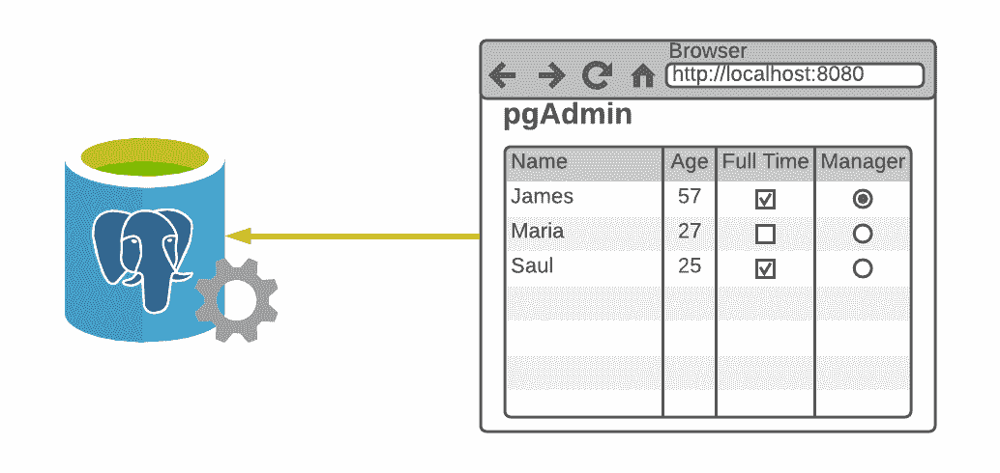
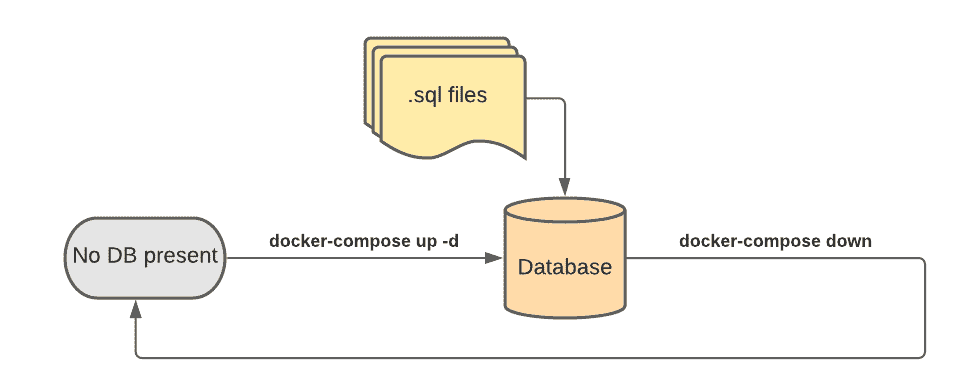
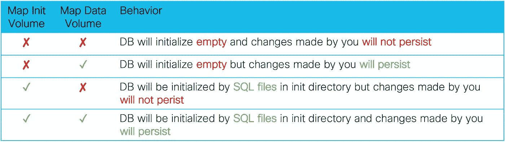
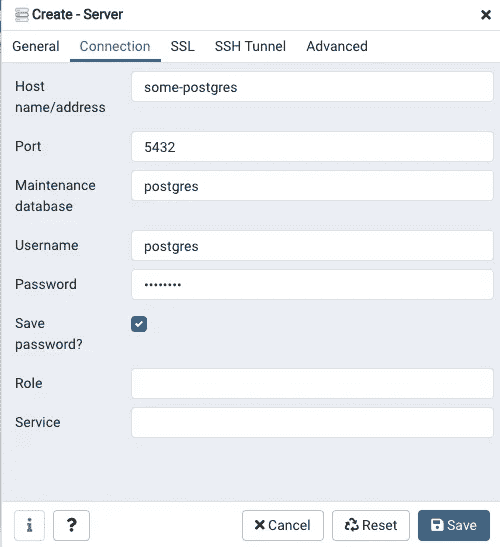
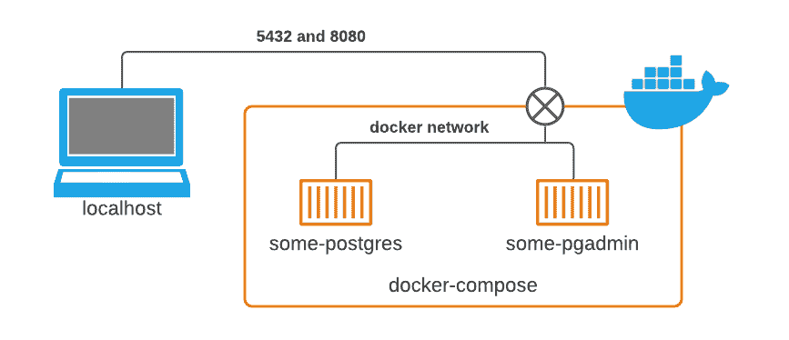
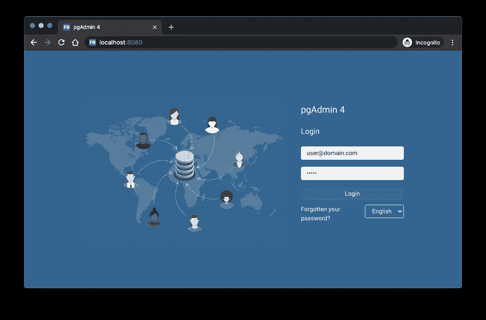
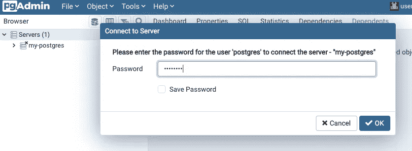
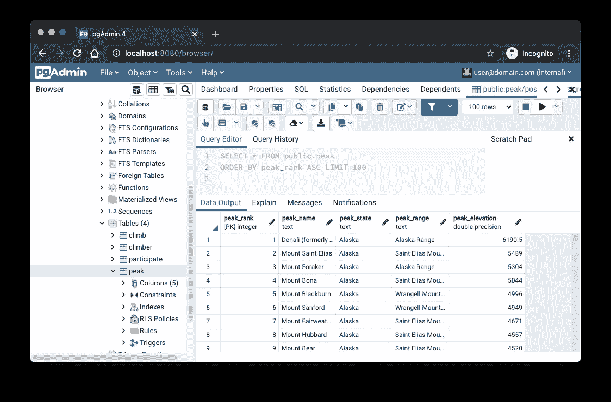
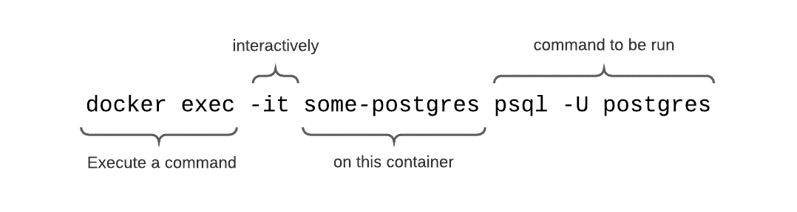
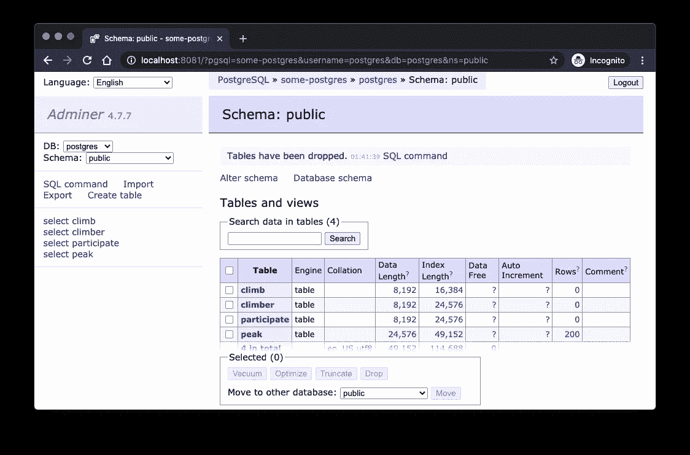

# 在几秒钟内为您的开发环境创建一个私有 PostgreSQL 数据库

> 原文：<https://betterprogramming.pub/create-a-private-postgresql-database-for-your-development-environment-in-seconds-b781640ed01b>

## 定义一个 PostgreSQL 数据库*和监控工具*，您可以使用 Docker Compose 快速创建和销毁它


照片由 [Roi Dimor](https://unsplash.com/@roi_dimor?utm_source=medium&utm_medium=referral) 在 [Unsplash](https://unsplash.com?utm_source=medium&utm_medium=referral) 上拍摄

当开始一个新项目时，许多开发人员使用 JSON、CSV 或其他平面文件来模拟可能存在于数据库中的数据。开发人员在创建自己的数据库的麻烦和没有真正的数据库的限制之间左右为难。为什么不定义一个 PostgreSQL 数据库*和监控工具*，您可以使用 Docker Compose 在几秒钟内创建、销毁和重新创建它？



图片来源:作者

用正确的设置创建两个容器的 Docker 命令很长。有了 Docker Compose，你只需要记住命令`up`和`down`！

`Up`将创建指定版本的 PostgreSQL 数据库和基于 GUI 的管理工具。`Down`将关闭并清除它们。

# 基于私有容器的数据库的好处

*   PostgreSQL 的不同版本在行为和特性上存在差异，因此开发人员应该针对他们将长期支持的数据库版本进行开发。一个项目可能是 9.6.12，另一个项目可能是 12.4。
*   大多数应用程序开发人员不是数据库管理员或 SQL 专家。一个图形工具可以直观地验证他们代码的效果，并手动修改数据。
*   项目的不同阶段需要不同类型的存储。在项目的早期阶段，非持久性数据库最大限度地减少了麻烦。在项目的后期阶段，持久数据库提供了更真实的场景。



用简单的命令创建和重新创建数据库

# 构建开发堆栈

下面的`docker-compose.yml`文件定义了一个 PostgreSQL 容器，该容器运行特定版本的 PostgreSQL 和 pg admin 4(Postgres 最常用的管理工具)。这个文件的内容需要更深入的解释。

## Docker 编写文件结构

这个文件定义了要创建的两个“服务”:Postgres 和 pgAdmin。每项服务都包含一个从 Docker Hub 为您提取的容器。Postgres 和 pgAdmin 将分别在端口 5432 和端口 8080 可用。将您编写的任何程序指向主机名`localhost`并浏览到 [http://localhost:8080](http://localhost:8080) 来访问 pgAdmin。

请继续阅读如何将 pgAdmin 指向 Postgres 的说明。

## PostgreSQL 版本

在定义 Postgres 容器的行中，您需要指定您需要的 Postgres 的确切版本。版本被表示为一个标签，其中`9.6.12-alpine`是我们示例中的版本。检查此处的[以查看还有哪些版本可用](https://hub.docker.com/_/postgres?tab=tags)。

## Postgres 的存储

上面的`docker-compose.yml`文件为 Postgres 指定了两个卷映射。这两个映射将使 Postgres 可以访问您计算机上的目录。

1.  映射到`/docker-entrypoint-initdb.d`的文件夹包含 Postgres 将用来初始化数据库的 SQL 文件。将您需要的 SQL 文件和 shell 脚本放在该目录中，它们将按字母顺序自动执行。
2.  映射到`/var/lib/postgresql/data`的文件夹包含实际数据库的持久存储。

当 Postgres 启动时，它遵循下面的简单流程图。如果数据库中没有数据，那么它会执行您计算机上映射到`/docker-entrypoint-initdb.d`目录的文件夹中的每个 SQL 文件和 shell 脚本(按字母顺序)。如果您计算机上的文件夹中有映射到`/var/lib/postgresql/data`的数据，那么它会忽略这些文件。


您应该挂载这两个目录吗？看情况。下表描述了通过映射 Postgres 的两个卷中的每一个卷，您应该预期的行为。



我的建议是映射两个目录。如果不想再初始化 DB，可以从 init 目录中删除文件。您还可以从您的计算机中删除数据目录，以删除任何可能存在的数据(Docker 将在您下次运行`docker-compose up`时在其位置重新创建一个空文件夹)。

**专业提示**:您可以在计算机的 init 文件夹中包含 CSV 文件，然后通过向 init 目录中的 SQL 文件添加适当的命令，用这些 CSV 文件中的数据填充表格。

```
CREATE TABLE Employee(id, first_name, last_name, salary);
COPY Employee FROM '/docker-entrypoint-initdb.d/emp.csv'
    WITH (FORMAT CSV, HEADER);
```

## pgAdmin 的存储



尽管 pgAdmin 只是一个用于查看和配置数据库的工具，但是必须配置它与数据库的连接。这可以通过 GUI 中的“添加服务器”命令来完成。注意，主机名是来自我们的 YML 文件`some-postgres`的`container_name`参数。YML 文件中也指定了密码:`mysecret`。

另一种方法是通过在 JSON 文件中指定这些设置(除了密码之外的所有设置)来节省大量的点击和输入。将 JSON 文件映射到容器上`/pgadmin4/servers.json`(我们示例 YML 文件中的第 22 行),以避免手动配置 pgAdmin 到 Postgres 的连接。

设置文件可以在 pgAdmin 和 Postgres 之间指定多个连接(以不同的用户身份连接或连接到不同的数据库)。以下示例只有一个连接。

## 建立工作关系网

`container_name`参数只是一个名称，但是 pgAdmin 将使用这个名称来访问端口 5432 上的数据库。这个图说明了原因。这两个容器通过专用网络相互连接，因此可以通过它们的主机名(容器名)`some-postgres`和`some-pgadmin`相互访问。然而，主机(您的计算机和网络浏览器)只看到暴露的端口 5432 和 8080，因此在`localhost:5432`和`localhost:8080`访问它们。



内部网络名称可以在 compose 文件中指定，但是命名一个代码从不引用其名称的网络是没有意义的。让码头工人来处理！如果你好奇，你可以随时查看你的私人和临时网络的名称。在下面的代码片段中，我从桌面运行 Docker Compose，因此它将网络命名为`desktop_default`。

```
$ docker network ls
NETWORK ID          NAME                DRIVER              SCOPE
23a6be9b8021        bridge              bridge              local
49a120440f88        desktop_default     bridge              local
44a949b56fa7        host                host                local
3892b16dca2d        none                null                local
```

# Docker 和 docker-compose 命令

在这里，我不得不承认我在介绍中过分简化了命令，但仅仅是一点点。

**要启动容器**，使用`docker-compose up -d`。`-d`选项指定了“分离”模式，在这种模式下，容器在后台运行，您可以在命令提示符下执行其他命令。

```
$ docker-compose up -d        
Creating network "desktop_default" with the default driver
Creating some-postgres ... done
Creating some-pgadmin  ... done
$
```

**要停止并移除容器**，使用`docker-compose down -v`。`-v`选项删除容器运行时使用的卷。这个*不会*删除你计算机上映射到容器的目录。

```
$ docker-compose down -v
Stopping some-pgadmin  ... done
Stopping some-postgres ... done
Removing some-pgadmin  ... done
Removing some-postgres ... done
Removing network desktop_default
```

如果不使用`-v`标志，随着时间的推移，您将积累不必要的卷。你可以用`docker volume ls`来验证这一点。

**要对不能正常启动的容器**进行故障排除，使用`docker logs [container_name]`。例如，由于 init 目录中的某个 SQL 文件出错，您的数据库可能无法正确初始化。在运行`docker logs some-postgres`之后，我浏览了日志，在一个适当命名的 SQL 文件中发现了一个错误:

```
/usr/local/bin/docker-entrypoint.sh: running /docker-entrypoint-initdb.d/broken.sql
ERROR:  syntax error at end of input at character 34
STATEMENT:  CREATE TABLE Songs(id, name, year
psql:/docker-entrypoint-initdb.d/broken.sql:1: ERROR:  syntax error at end of input
LINE 1: CREATE TABLE Song(id, name, year
```

日志告诉我在文件`broken.sql`的第一行有一个错误。该命令缺少右括号和分号。我可以修复这个错误，并使用`down`和`up`来验证。

# 使用 Python

使用 localhost 作为主机名和 YML 文件中指定的密码，连接到数据库很容易。

# 使用 pgAdmin

只需连接到 [http://localhost:8080](http://localhost:8080) 来访问登录页面，并使用在`docker-compose.yml`中指定的用户名和密码(在我们的例子中是`user@domain.com`和`admin`)。



如果您在本文前面讨论的`servers.json`文件中指定了连接细节，那么当您尝试展开用户界面左侧的导航树时，将会提示您输入 Postgres 数据库的密码。那个密码是我们`docker-compose.yml`里的`mysecret`。如果您没有包含`servers.json`文件或文件中有错误，您将不得不手动添加服务器。



现在，您应该能够查看和操作数据库了。



# 进入 PSQL

有时候开发人员需要熟悉的命令行。Docker 使得像超级用户一样访问 PSQL 和执行命令变得很容易。使用此处显示的命令输入 PSQL 命令行。



一旦连接上，您就可以访问所有的 PSQL 命令，比如`\i`用于包含，或者`\dt`和`\df`用于描述表和函数。要退出，使用`\q`命令。

```
$ docker exec -it some-postgres psql -U postgrespsql (9.6.12)
Type "help" for help.postgres=# \dt
List of relations
Schema |     Name     | Type  |  Owner
--------+--------------+-------+----------
public | peak         | table | postgres
public | climb        | table | postgres
public | climber      | table | postgres
```

# pgAdmin 的替代方案



Adminer 是一个简单得多的界面

pgAdmin 是 PostgreSQL 最常见的管理 GUI，但还有其他 GUI。Adminer 使用起来要简单得多，您可能已经有了使用它的经验，因为它支持多种 SQL 风格。如果您刚刚开始使用 PostgreSQL 或者有非常简单的需求，这可能是一个更合适的工具。

在登录界面，使用`some-postgres`作为主机，使用`mysecret`作为密码。


要在您的环境中用 Adminer 替换 pgAdmin，请用下面几行替换`docker-compose.yml`中的 pgAdmin 容器定义。

# 参考

所有优秀的开发人员都依赖产品文档和其他人的经验。以下是我在创建工作流程和这篇文章时使用的资源。

*   [https://hub.docker.com/_/postgres](https://hub.docker.com/_/postgres)
*   [https://hub.docker.com/_/adminer](https://hub.docker.com/_/adminer)
*   [https://docs.docker.com/compose/compose-file/](https://docs.docker.com/compose/compose-file/)
*   [https://www . pgadmin . org/docs/pgadmin 4/latest/container _ deployment . html](https://www.pgadmin.org/docs/pgadmin4/latest/container_deployment.html)
*   [https://technology . amis . nl/2020/01/02/pgadmin-in-docker-provision-connections-and-passwords/](https://technology.amis.nl/2020/01/02/pgadmin-in-docker-provision-connections-and-passwords/)
*   [https://stack overflow . com/questions/42248198/how-to-mount-a-single-file-in-a-volume](https://stackoverflow.com/questions/42248198/how-to-mount-a-single-file-in-a-volume)