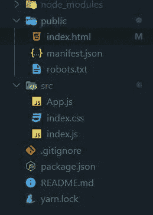
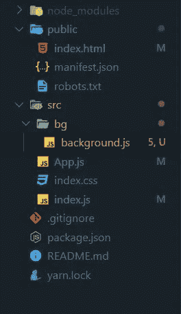
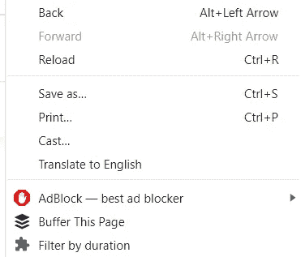
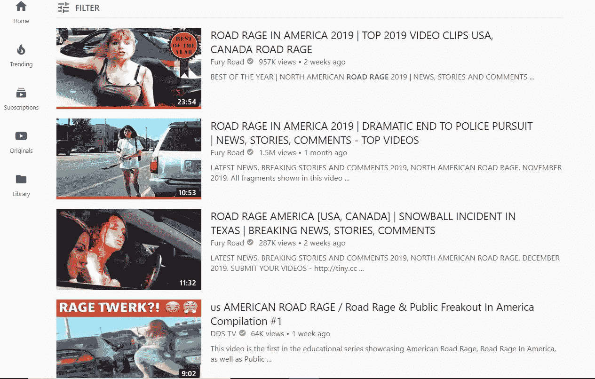
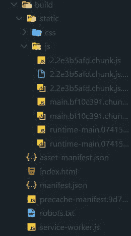
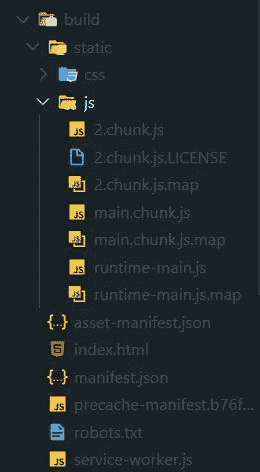
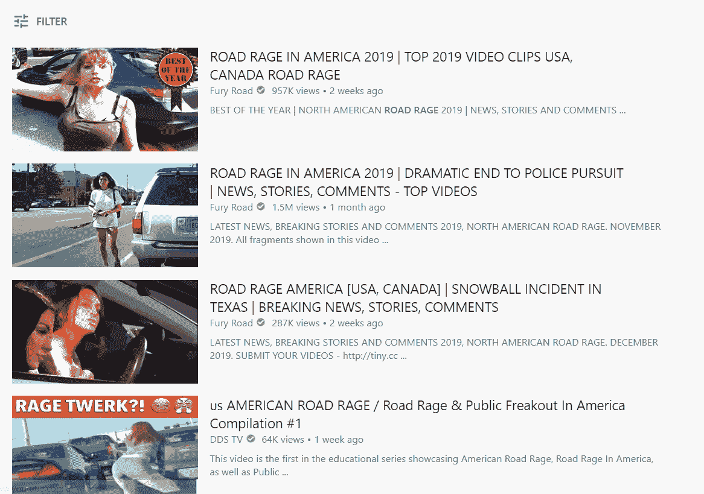
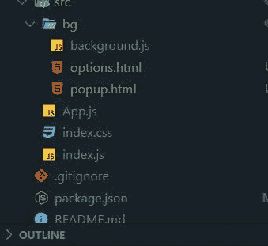

# 创建一个 React Chrome 扩展，使用更短的持续时间过滤 YouTube 视频

> 原文：<https://betterprogramming.pub/create-a-react-chrome-extension-to-filter-youtube-videos-using-narrower-durations-ce847cf64f49>

## 构建使用 React 的强大 Chrome 扩展


由[诺德伍德主题](https://unsplash.com/@nordwood?utm_source=unsplash&utm_medium=referral&utm_content=creditCopyText)在 [Unsplash](https://unsplash.com/s/photos/youtube?utm_source=unsplash&utm_medium=referral&utm_content=creditCopyText) 上拍摄的照片

在本文中，我们将讨论如何使用脸书的 [Create react App](https://create-react-app.dev/) 工具在 React 中创建一个 chrome 扩展，该工具将为我们提供捆绑功能。这意味着你将能够`npm install`你最喜欢的节点模块，并使用它们来开发你的 chrome 扩展。我们将把我们的代码直接注入到页面中，并访问它的`document`。

我们将让我们的扩展提供一个定制的菜单项，当我们右击一个网页时，这个菜单项就会出现。我们将通过搜索结果关注 YouTube 的视频页面。当我们通过搜索结果查看视频时，我们的扩展会不断地从结果中删除视频持续时间小于给定的最小持续时间或大于给定的最大持续时间的视频。因此，当我们不断向下滚动，YouTube 不断向我们提供新视频时，我们的扩展会不断删除我们不想看到的视频。:)

你可能会问，当 YouTube 已经给了我们一个持续时间的过滤器时，还有什么意义呢？这是真的，但是他们只允许用户过滤少于 4 分钟或多于 20 分钟的持续时间。我不知道你怎么想，但我认为它非常强大，可以过滤更窄的内容，例如持续时间在 8 到 15 分钟之间的视频，反之亦然。

如果我们只想看来自[真实犯罪](https://www.youtube.com/channel/UC69uYUqvx-vw4luuX7aHNLQ)频道的时长在 5 到 10 分钟的视频呢？过滤短于四分钟或长于 20 分钟的视频完全没用。当我们寻找分成几部分的剧集时，我们希望看到 5 到 10 分钟的视频，如第 1 部分(共 4 部分)、第 2 部分、第 3 部分等。，因为这些视频通常平均时长 6 分钟。当我们浏览搜索结果时，我们不想被 40 分钟的播客视频轰炸。

我们还将创建一个选项页面以及一个弹出窗口，当单击工具栏中的图标时，只是为了看看它有多简单。

(如果你想要 GitHub 回购的链接，你可以点击[这里](https://github.com/jsmanifest/react-chrome-ext))

这篇文章不会详细介绍 chrome 扩展是如何工作的，所以在进一步阅读之前，我建议仔细阅读[概述](https://developer.chrome.com/extensions/overview)以获得本教程剩余部分所需的基本理解。

最后但同样重要的是，在本教程结束时，你可能会注意到我们在这篇文章中将要构建的东西甚至不需要 React。但是主要的一点是展示 React 是如何实现的，以帮助您自己开始。

事不宜迟，我们开始吧！

# 我们的代码结构

总的来说，当我们创建 chrome 扩展时，我们将内容脚本代码从后台脚本代码中分离出来。正因为如此，如果我们想保留代码捆绑的好处以及在使用捆绑器的现代项目中发现的其他好处，就需要两个额外的步骤来在两个独立的代码库中开发我们的代码。

我们还将把我们的 React 组件直接注入到一个网页中，这样我们就可以访问它的`document` body 对象，这样我们就可以操作 DOM。

# 创建项目

我们要做的第一件事是创建一个 [Create React App](https://create-react-app.dev/) 项目。我们需要给我们的新项目起一个名字，在本教程中，我们将把我们的项目命名为`react-chrome-ext`。

让我们在终端中输入:

```
npx create-react-app react-chrome-ext
```

完成后，现在进入目录:

```
cd react-chrome-ext
```

我们要做的第一件事是去掉本教程不需要的东西。这是我们清理后的项目目录:



当我们的扩展被使用时，我们需要为我们的扩展提供一种方法来访问当前标签的`document`。我们的 React 组件很可能还没有这种访问权限，因为它被注入到 id 为`root`的元素中，正如我们打开`index.js`时看到的:

```
import React from 'react'
import ReactDOM from 'react-dom'
import './index.css'
import App from './App'ReactDOM.render(<App />, document.getElementById('root'))
```

如果我们让它保持原样，那么我们的扩展将只能在网页有一个 id 为`'root'`的实际 DOM 元素时工作。我们将在执行`*ReactDOM.render*`之前，通过将我们自己的元素注入到`document.body`中来稍微扭转一下。

为此，我们将创建一个元素并将其附加到`document.body`:

```
import React from 'react'
import ReactDOM from 'react-dom'
import './index.css'
import App from './App'const rootEl = document.createElement('div')
rootEl.id = 'react-chrome-ext'
document.body.appendChild(rootEl)ReactDOM.render(<App />, rootEl)
```

现在我们将进入`App`组件内部，这是我们开始实现扩展的定制代码逻辑的地方(注意:这基本上是我们的内容脚本)。

请记住，我们是通过使用搜索功能来扩展 YouTube 视频列表的。因此，当我们在页面上时，我们希望能够右键单击页面来弹出打开上下文菜单，里面将是我们的自定义菜单项，我们可以单击它来调用过滤器。我们希望我们的内容脚本监听点击事件，以便我们可以调用过滤器。为此，我们需要通过后台脚本注册上下文菜单，并在那里附加 click 事件监听器。当回调调用时，我们将使用 Chrome [message](https://developer.chrome.com/extensions/messaging) API 向内容脚本发送信号。因为我们在消息的内容端添加了一个监听器，这就是它检测点击动作的方式。

在`App.js`中，我们将把听众放在一个`React.useEffect`上，就像这样:

`chrome.runtime.onMessage`监听来自我们后台脚本的任何消息。

接下来，我们将在`src`目录中创建一个名为`bg`的目录，并在其中创建一个`background.js`文件，如下所示:



在这里，我们必须实现扩展的代码，以便在安装时将菜单项注册到上下文菜单，以及当它被单击时会发生什么:

`chrome.runtime.onInstalled.addListener((message) => {`行注册我们的回调，以便在安装扩展时调用。这是我们创建上下文菜单的地方，正如我们在这里看到的:

```
*// Clicking this item will send an event to the content script listening to messages*
chrome.contextMenus.create({
  title: 'Filter by duration',
  id: 'filter-by-duration',
  contexts: [...contexts, 'browser_action'],
})
```

这段代码稍后将创建这个菜单项(在底部):



我们创建了一个`getActiveTab`助手函数，这样我们就可以在将来的其他操作中重用它。它只是调用你传递给它的回调，并给你一个对象，代表你当前所在的选项卡。

最后，我们添加了处理程序，用于在菜单项被单击时处理 click 事件，如下所示:

```
*// When a context menu item is clicked*
chrome.contextMenus.onClicked.addListener((info) => {
  console.log(info)
  if (info.menuItemId === 'filter-by-duration') {
    getActiveTab((tab) => {
      if (info.menuItemId === 'filter-by-duration') {
        chrome.tabs.sendMessage(tab.id, {
          type: 'filter-by-duration',
          ...info,
        })
      }
    })
  }
})
```

需要注意的重要部分是:

```
chrome.tabs.sendMessage(tab.id, {
  type: 'filter-by-duration',
  ...info,
})
```

这将事件发送到内容脚本，然后我们的`App`组件将接收它。

这解释了为什么我们在`App`组件中有`chrome.runtime.onMessage.addListener`行:

现在，我们将在 switch 语句中添加根据持续时间过滤视频的逻辑。我们不会编写您最终想要实现的额外内容，比如提供一种在按需查看选项卡时更改过滤器持续时间值的方法，因为这是您自己的事情。因此，出于本教程的考虑，我们将只对持续时间进行硬编码。

在我们继续之前，去 [YouTube](https://youtube.com) 搜索一些东西。在本教程中，我们将只搜索*道路愤怒*。以下是我们得到的结果:



我们将在过滤器中硬编码最短 10 分钟、最长 15 分钟的持续时间。所以通过查看截图，当我们使用过滤器时，我们应该看不到第一个视频( *23:42* )和第四个视频( *9:02* )。

为此，我们必须查询并遍历页面的`document`对象。如果您右键单击页面并转到 Inspect Element，您可以通过使用类似于 [document.querySelector](https://www.w3schools.com/jsref/met_document_queryselector.asp) 的选择器(或者您可以复制下面我的片段)来找出如何定位您需要的元素。我们需要将显示视频持续时间的元素作为目标，并将其转换为一个数字(因为它们是字符串)，以便我们可以应用数学运算来实现我们的目标。

现在让我们来实现过滤器:

对于我们的扩展来说，这些代码应该足够了，但是在 chrome 上加载我们的扩展之前，我们还需要做一些事情。

我们想要做的一件事是消除当`chrome is not defined`时报错的`eslint`错误。我们可以通过将`webextensions: true`添加到`package.json`中的`eslintConfig`属性来解决这个问题:

```
"eslintConfig": {
    "extends": "react-app",
    "env": {
      "webextensions": true
    }
  }
```

接下来，我们必须编辑`public`目录中的`manifest.json`文件。当我们构建我们的项目时，这个`manifest.json`文件被复制到`build`目录，这是您将要加载到 chrome 的目录。让我们稍微清理一下[以便 chrome 可以理解我们的扩展](https://developer.chrome.com/extensions/manifest):

```
{
  "manifest_version": 2,
  "version": "1.0.1",
  "name": "React Chrome Extension",
  "content_security_policy": "script-src 'self' 'sha256-xr+HqUtnq8KF3IBn+TQ37Vz0elxg11bPYmNJy5M/p38='; object-src 'self'",
  "background": {
    "scripts": ["background.js"],
    "persistent": false
  },
  "permissions": ["activeTab", "tabs", "contextMenus"]
}
```

如果我们想让 chrome 获取它们，我们还需要在清单中指定一个`content_scripts`属性。通常这是我们输入内容脚本的地方，比如我们的`App.js`文件，但是这里的问题是 Chrome 不能理解未移植的 react 代码。所以我们需要插入 transpiled 输出文件，当我们运行`npm run build`时，这些文件被发送到`build`文件夹。

让我们继续跑`npm run build`。我们的构建文件夹最终看起来会像这样:



我们希望包含在清单中的 JavaScript 文件是这三个文件:

1.  `static/js/2.2e3b5afd.chunk.js`
2.  `static/js/main.bf10c391.chunk.js`
3.  `static/js/runtime-main.0741577f.js`

…最终看起来像这样:

这很好，但现在我们的问题是，每次我们运行`npm run build`时，这些 JavaScript 文件的文件名都会改变，这意味着我们必须手动改变这些行，以便与文件名的动态更新保持同步。这是一种糟糕的开发体验，所以我们将不得不通过退出我们的项目来获得对如何生成输出的控制，从而解决这个问题。

继续运行`npm run eject`

完成后，进入你的`config`文件夹，打开`webpack.config.js`

搜索`.[hash:8]`并删除两个事件。

第一个是`name: 'static/media/[name].[hash:8].[ext]',`，因此将其更改为`name: 'static/media/[name].[ext]',`，并对另一个进行同样的操作。

现在进行另一次搜索，寻找`.[contenthash:8]`，并删除所有出现的内容。无论何时运行`build`命令，您的`js`文件都将具有相同的文件名。

所以现在当你运行`npm run build`时，那些输出文件每次都保持不变:



您现在可以安全地将这些输入到您的`manifest.json`中:

太好了！现在运行`npm run build`，让我们把它加载到 Chrome 中。在你的地址栏中输入`chrome:extensions`，然后点击 load unpacked 按钮，选择你的`build`目录。

您的扩展现在应该被加载了！

我们去 [YouTube](http://www.youtube.com) 搜索*路怒*。右键单击页面，然后单击按持续时间过滤。点击之后，扩展应该会根据你的持续时间过滤器从屏幕上删除元素。万岁！

记得在我们之前的一个截图中，我们有几个视频结果，我们提到当我们应用过滤器时，23:54 和 9:42 的视频持续时间不应该显示出来？

让我们看看这是不是真的:



万岁！

在我们结束本教程之前，让我们继续实现一个[选项](https://developer.chrome.com/extensions/options)页面以及一个[弹出菜单](https://developer.chrome.com/extensions/user_interface#popup)。

当右键单击工具栏中的扩展图标并单击选项项目时，将使用选项页面。

当您在工具栏中左键单击您的扩展图标时，弹出窗口的使用类似。

我们可以在`src/bg/`中创建一个`options.html`和`popup.html`，如下所示:



然后我们可以输入一个`postbuild`脚本到我们的`package.json`中，它会在建筑完成后自动运行:

```
"scripts": {
    "start": "node scripts/start.js",
    "prebuild": "rm -rf build",
    "build": "node scripts/build.js",
    "postbuild": "cp src/bg/* build"
}
```

# 结论

本帖到此结束！我希望你发现这是有价值的，并期待在未来更多！