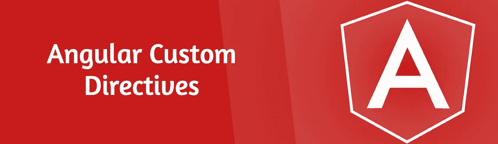

# 在 Angular 中创建基于角色的显示/隐藏指令

> 原文：<https://betterprogramming.pub/create-a-role-based-show-hide-directive-in-angular-8d83fca2eb69>

## Angular 中的自定义指令是你不用的最好的东西



图片由作者提供。

如果你在 Angular 领域呆了很长时间，你必须熟悉指令的概念。指令是 Angular 的基本构件之一。到处都是。甚至 Angular 中的组件也在带有模板的指令中。

指令基本上是带有`@Directive`装饰器的类型脚本类。从[角度文档](https://angular.io/guide/attribute-directives)中，您可以看到有三种类型的指令

1.  组件:带有模板的指令。
2.  结构化指令:通过添加和删除 DOM 元素来改变 DOM 布局。
3.  属性指令:更改元素、组件或其他指令的外观或行为。

一些你必须熟悉的常用指令有:`*ngFor(structural)`、`*ngIf(structural)`、`hidden(attribute)`、`NgStyle(attribute)`等。本文的范围将集中在最后一种类型:属性指令。

最近在我的一个项目中，我需要一个简单的基于角色的访问系统。在我的一个模块中，添加、编辑、删除或更新操作是基于用户角色的，用户角色是在管理员级别确定的，并且是可配置的。用户登录时可获得访问信息。

您将如何实现这一点？

# 最初的想法

最初的想法是在所有组件中使用`*ngIf`或`[hidden]`指令，在组件的控制器中使用定制逻辑。这看起来很容易实现。但是它能重复使用吗？如果您想在多个模块、组件中使用它，该怎么办？是的，是时候引入一个指令了！

# 创建自定义角度方向

像我上面所说的，指令是类型脚本类。您可以创建一个文件，方便地将其命名为`access-control.directive.ts`并手动创建您的类。但是我将从 Angular CLI 获得帮助来完成这项工作。

```
ng generate directive access-control
```

您现在有了有史以来最简单的指令，它还没有做任何事情。

在我们开始编辑我们的指令之前，让我们看一下从 REST API 接收到的访问控制数据。

从上面的数据可以明显看出，我们的指令至少需要从主机(使用指令的组件)获得两条信息:

1.  模块类型(用户或文章)
2.  访问类型(创建、编辑、删除或读取)

让我们后退一步，回忆一下组件实际上是指令，因此您可以像传递组件一样将数据传递给指令。我们可以用一个室内装潢师。我们还需要在我们的指令中实现`NgOnInit`,以便能够检查组件初始化时的访问控制。

太好了！让我们实现我们的逻辑来有条件地显示/隐藏 host 元素(我们的指令所在的组件)。

我们从`@angular/core`中导入了`ElementRef`，我们可以用它来访问和操作 DOM 元素。使用`ElementRef`时要小心，因为你是直接访问 DOM 元素，这可能会吸引 XSS 攻击。在组件初始化时，我们获取角色数据，交叉检查我们的模块和访问类型组合，并使元素显示/隐藏。

注意:我从我创建的 Angular 服务`AuthService`类中获取访问数据。您可以让您的自定义登录来做同样的事情。

现在让我们看看如何在我们的一个组件中使用它。

就这么简单！上面的按钮现在将根据用户访问控制显示/隐藏。您可以在任何创建、编辑、删除、读取导航按钮/组件中使用我们的`accessControl`指令。它是高度可重复使用的。

指令还有很多其他的用例。您可以做一些事情，如侦听主机上的事件并对其做出反应，将样式应用于主机，等等。我希望你能用它创造出美好的东西。

更多类似的文章👇

[](https://bharathravi.com/) [## Bharath Ravi | javaScript 文章

### 有能力的文章来提升你的网络技能。javaScript 全栈开发者 Bharath Ravi 的个人博客

bharathravi.com](https://bharathravi.com/) 

黑客快乐！