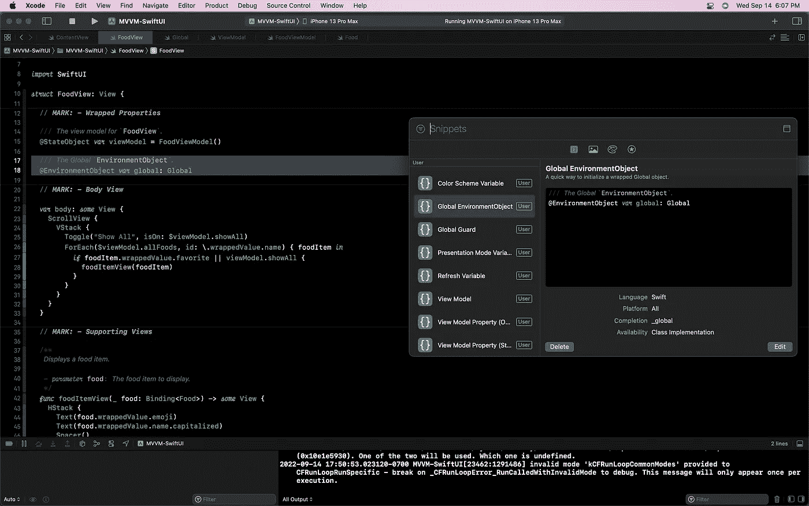
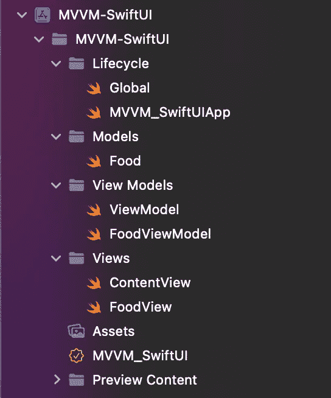
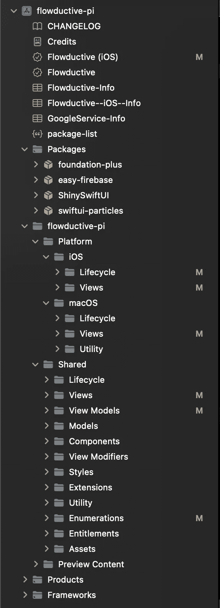

# 创建一个可扩展的 SwiftUI MVVM 项目

> 原文：<https://betterprogramming.pub/create-a-scalable-swiftui-mvvm-project-f9afe3c2fcbf>

## 使用 MVVM 架构制作一个文档完整、组织有序、可扩展的 SwiftUI 项目，让您的代码审查人员惊叹不已。


马丁·桑切斯在 [Unsplash](https://unsplash.com?utm_source=medium&utm_medium=referral) 上的照片

SwiftUI 是苹果公司构建的蓬勃发展的新框架，它建立在他们的开源编码语言 Swift 之上。尽管 SwiftUI 在功能上仍需与 UIKit 保持一定的距离，但它为开发人员提供了创建视图的声明性语法。因此，它可以有漂亮的、可伸缩的代码来创建漂亮的 UI。

让我们开始构建一个优化的项目。

MVVM(模型、视图、视图-模型)架构有三种主要的数据结构:

*   **视图**是显示视图模型属性的 UI。用户与视图交互，视图通过调用视图模型来处理用户的交互。
*   **视图模型**封装了视图的逻辑，包括进行 API 调用，处理事件或数据，存储重要的属性。
*   **模型**代表数据。它们是从 API 结果创建的对象，用于保存用户信息，或者是应用程序中的抽象对象。

让我们通过创建一个示例视图、视图模型和模型系统来开始我们的优化项目。在这个过程中，我将分享一些技巧来帮助您保持它的可伸缩性和文档化。

# 构建完美的模型

我们从模型开始。因为你是用 Swift 写的，所以你需要决定是使用类还是结构。

**类**是按引用传递的；而**结构**是按值传递的。

Apple 建议您使用 structs 有几个原因，包括内存安全和降低复杂性。然而，[的选择取决于你](https://medium.com/@paulwall_21/why-does-apple-push-for-structs-e511e8c8124e)。

在我的例子中，我已经创建了一个`Food`模型，它有一个名字，以及它是否是我的最爱。我准备用它做一个 app，展示我所有喜欢的食物。

这里发生了很多事。但是让我们注意一下事情是如何设置的:

*   这个`Food`结构有一个包含`/** */`的多行文档。在文档的扩展讨论中，使用双反勾符号提供了到`FoodView`的链接。
*   每个物业都有单行的`///`文档。每个方法都有多行文档。
*   一个`// MARK: —` 语句描述了属性和方法。我们将用它来区分属性、方法、初始化器、嵌套类/结构/枚举以及其他类型的实现。
*   一个计算属性`emoji`返回一个基于食物名称的表情符号。如果您想要显示仅与模型相关的内容，那么将计算的属性或函数封装在模型的逻辑中是一个很好的实践。当我们写`FoodView`的时候，你会看到它的好处。
*   这个模型也有有用的方法，比如`eat()`。

就是这样！模型非常简单。如果您正在使用`Codable`，您可能还想在您的模型中手动实现`CodingKeys`、`encode(to:)`和`init(from:)`。

# 在视图模型中准备逻辑

现在，我们的视图模型将采用一组`Food`模型，它将允许我们显示和更改它们:

这里需要注意的是:

*   `FoodViewModel`符合`ObservableObject`，为我们提供了`@Published`包装器，使我们能够保持应用程序的最新状态。
*   出于个人偏好，我使用了`// MARK: —` 来划分包装和非包装属性。
*   已发布的属性`allFoods`提供对我所有食物的访问。像这样加载/保存数据的一个好地方是在视图模型中。
*   `toggleFavorite(food:)`接受一个`Binding<Food>`对象，所以我可以通过引用更新食物的喜爱状态(因为结构是按值传递的)。

# 打造伟大的观点

`FoodView`会显示用户喜欢的食物。我们将从一个滚动视图开始，它列出了一堆项目，显示食物对象。

由于食物对象是独立的，我将创建一个*支持视图*来显示那个对象。我使用支持视图，以便我的`body`属性美观、整洁、易读。

看一看:

它显示:


我们的 FoodView，显示一个显示所有食物的开关，以及项目列表。

关于上述观点的几点提示:

*   分隔符`// MARK: —`分隔包装属性、主体视图和支持视图。
*   我将单个项目提取到一个支持视图中，以帮助提高`body`的可读性和速度。将视图提取到变量/方法也使得调试更加容易，因为 SwiftUI 编译器通常很难编译大型的嵌套视图。
*   最后的润色，比如将食物的名字大写，在视图中用来改善外观。在模型或视图模型中使用计算属性来提高代码可读性是一个很好的实践。

我们结束了。我们已经设置了基本的 MVVM 项目，并进行了一些优化。让我们在此基础上，添加一些额外的细节。

# 全球单身族

现在，我们需要一个对象来传递全局信息。我使用一个`Global` `@EnvironmentObject` singleton 来处理这个问题。

通常情况下，你会希望在`Global`中存储应用程序使用的信息。在我的大多数应用中，我将用户数据存储在一个`activeUser`属性中。下面是一个简单的`Global`类的例子:

在我的视图中，我使用以下代码来定义环境对象，并将其传递给我的根视图:

```
let global = Global()
...
MyMainRootView().environmentObject(global)
```

然后，要在“我的所有子视图”中访问我的全局对象:

```
/// *The Global* `EnvironmentObject`*.* @EnvironmentObject ***var*** global: Global
```

有关如何在您的视图中实现`EnvironmentObject`的更多信息，请查看[这篇关于 Swift 的文章](https://www.hackingwithswift.com/quick-start/swiftui/how-to-use-environmentobject-to-share-data-between-views)。

因为我经常在我的项目中使用`Global`,所以我创建了一个代码片段来帮助提高速度。

代码片段非常适合输入带有可选占位符的预写代码。查看 Sarunw 的这篇文章，了解更多关于在 Xcode 中创建自己的代码片段的信息。



我使用代码片段来快速添加全局、视图模型或其他属性。

# 视图模型协议和依赖注入

到目前为止，我们已经定义了一个视图模型来帮助管理与`FoodView`相关的各种逻辑。但是许多项目将使用多视图模型。因此，我们需要一种方法来抽象我们的视图模型，以遵守单一的`ViewModel`协议。

在构建我们的`ViewModel`协议时，我们要记住的一件事是我们偶尔需要访问我们的`Global`对象。理想情况下，我们会将一个`global`实例传递给视图模型的初始化器。

然而，如果你试图这样做，你会遇到一些问题。您不能将`global`传递给视图模型的初始化器，因为`global`只有在视图的属性(包括视图模型)被初始化之后*才可用。*

这意味着我们必须*注入*对象作为视图模型的依赖。由于我们正在研究一个通用的视图模型协议，我们可以对这个依赖注入进行编码，这样我们创建的每个视图模型都会自动支持`global`注入:

```
protocol ViewModel: ObservableObject { // MARK: - Properties /// The global instance.
  var global: Global? { get set }
}extension ViewModel { // MARK: - Methods /**
   Prepares the view model with the global instance. - parameter global: The global instance, taken from a `View`
   */
  func prepare(with global: Global) {
    self.global = global
  }
}
```

这是我在所有项目中用来定义`ViewModel`协议的代码(有额外的文档)。

这个视图模型协议配备了一个新方法`prepare(with:)`，它允许您为视图模型提供一个`Global`实例。在`onAppear(perform:)`中调用它，您将能够在您的视图模型中访问您的`global`对象！

# 构建您的项目

您可以按照自己喜欢的方式组织和构建项目。由于我们的项目是基于 MVVM 体系结构构建的，因此我们可以将其内容组织到模型、视图模型和视图文件夹中。剩余的内容可以放在其他文件夹中:

*   `Lifecycle`文件夹，存放`AppDelegate`、`yourApp`或`Global`等全 app 相关文件。
*   `Utilities`文件夹，用于帮助方法、额外协议等。
*   `Extensions`，用于 Swift 和模块扩展。
*   `Components`，用于小型、高度可重用(不依赖视图模型)的 SwiftUI 视图。
*   `View Modifiers`，用于自定义视图修改器。
*   `Styles`，为`ButtonStyles`、`MenuStyles`、`PickerStyles`、`TextFieldStyles`等。
*   `Enumerations`，用于项目范围的枚举。
*   `Assets`，如果您希望对与您项目的资产目录不兼容的任何资产进行分组。

以下是我在本文中构建的项目的结构:



我们的项目结构。模型、视图和视图模型放置在各自的文件夹中。

如果你想回顾构建了什么，或者你想用它作为模板，你可以在 GitHub 上查看整个项目[。](https://github.com/benlmyers/MVVM-SwiftUI)

作为一个额外的、更大规模的例子，下面是我的个人项目`Flowductive`的结构:



这个项目使用相同的 MVVM 架构，但是跨平台代码被分成基于需求的`**Platform**`和`**Shared**`目录。如果您对编写多平台代码感兴趣，我将在不久的将来撰写关于多平台开发的文章。

感谢阅读。