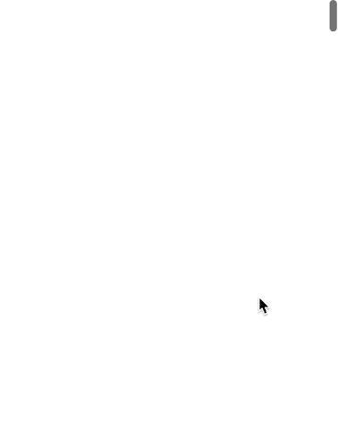

# 使用 React 挂钩创建向上滚动箭头

> 原文：<https://betterprogramming.pub/create-a-scroll-to-top-arrow-using-react-hooks-18586890fedc>

## 跳到页面顶部从未如此简单


照片由 [Ojo Toluwashe](https://unsplash.com/@sickcity?utm_source=unsplash&utm_medium=referral&utm_content=creditCopyText) 在 [Unsplash](https://unsplash.com/s/photos/bow-arrow?utm_source=unsplash&utm_medium=referral&utm_content=creditCopyText) 上拍摄。

之前，我写过一篇关于使用 JavaScript 实现自定义滚动顶部箭头的文章。最近，我需要在 React 应用程序中实现一个，我首先想到的是在父组件的状态中管理箭头的可见性。

虽然这样做是可行的，但它造成了不必要的状态变化，并重新呈现了整个父组件，而我想做的只是更新箭头是否可见。

您可以赋予箭头组件自己的状态值并切换其可见性，但是通过使用 [React Hooks](https://reactjs.org/docs/hooks-intro.html) ，我们可以用最少的代码和不引人注目的状态依赖和效果创建一个功能性的`ScrollTopArrow`组件。可见性可以通过添加滚动事件监听器和实现`useState`来管理。见下文:

虽然在 React 中使用传统的 DOM 操作被认为是一种反模式，但我在这种情况下使用它的理由是因为我们没有使用传统的 DOM 操作来显著改变数据或状态。我们所做的就是添加一个监听器来决定是否显示一个元素。我们也没有使用 DOM 操作来改变元素类或样式。

现在我们已经有了可见性切换逻辑，我们可以开始实际构建我们的组件并应用样式。如果您想使用 HTML 和 CSS 创建自己的 arrow 元素，这完全没问题。但是有点懒，我决定从 [react-icons](https://react-icons.netlify.com/#/) 导入一个图标:

```
import {FaArrowCircleUp} from 'react-icons/fa';
```

除了显示之外，所有图标的样式都保留在`App.css`中，显示将由`showScroll`钩子状态属性驱动。如果`showScroll`是`true`，显示箭头。如果是`false`，隐藏箭头。

```
<FaArrowCircleUp 
   className="scrollTop" 
   onClick={scrollTop} 
   style={{height: 40, display: showScroll ? 'flex' : 'none'}}
/>
```

最后，这里是`scrollTop`函数的代码:

```
const scrollTop = () =>{
   window.scrollTo({top: 0, behavior: 'smooth'});
};
```

我们可以使用`window`接口自带的 [](https://developer.mozilla.org/en-US/docs/Web/API/Window/scrollTo) `[scrollTo](https://developer.mozilla.org/en-US/docs/Web/API/Window/scrollTo)`函数，为`top`和`behavior`传递参数。我们的`top`值是 0，因为我们想要这个箭头做的就是将窗口滚动回页面顶部。很简单。对于`behavior`，我个人更喜欢`smooth`，因为它给了滚动效果一个不那么刺耳的过渡。

下面是`ScrollTopArrow`组件和`App.css`的完整代码:

现在你所要做的就是在你选择的组件中导入`ScrollTopArrow`,一切都准备好了。为了测试它，我将`ScrollTopArrow`导入到我的`App`组件中，并赋予`App`5000 px 的高度。下面是最终产品应该产生的结果:



完整 React 应用程序的源代码可以在 [GitHub](https://github.com/macro6461/react-scroll-arrow) 上找到。

[*在此将你的免费媒体会员升级为付费会员*](https://matt-croak.medium.com/membership) *每月只需 5 美元，你就能收到来自各种出版物上数千名作家的无限量无广告故事。这是一个附属链接，你的会员资格的一部分帮助我为我创造的内容获得奖励。谢谢大家！*

# 参考

[](https://medium.com/@mattcroak718/custom-scroll-back-to-top-arrow-with-color-detection-cae51f8592a5) [## 带有颜色检测的自定义滚动回顶部箭头

### 我想在我的个人网站中加入一个返回顶部的滚动按钮，以改善我的网站的用户体验…

medium.com](https://medium.com/@mattcroak718/custom-scroll-back-to-top-arrow-with-color-detection-cae51f8592a5) [](https://reactjs.org/docs/hooks-intro.html) [## 介绍钩子-反应

### 钩子是 React 16.8 中的新增功能。它们允许您使用状态和其他 React 特性，而无需编写类。这个…

reactjs.org](https://reactjs.org/docs/hooks-intro.html)  [## 反应图标

### 编辑描述

react-icons.netlify.com](https://react-icons.netlify.com/#/) [](https://developer.mozilla.org/en-US/docs/Web/API/Window/scrollTo) [## Window.scrollTo()

### Window.scrollTo()滚动到文档中的一组特定坐标。window.scrollTo(x 坐标，y 坐标)…

developer.mozilla.org](https://developer.mozilla.org/en-US/docs/Web/API/Window/scrollTo) [](https://github.com/macro6461/react-scroll-arrow) [## macro 6461/反应-滚动-箭头

### 在 GitHub 上创建一个帐户，为 macro6461/react-scroll-arrow 开发做出贡献。

github.com](https://github.com/macro6461/react-scroll-arrow)