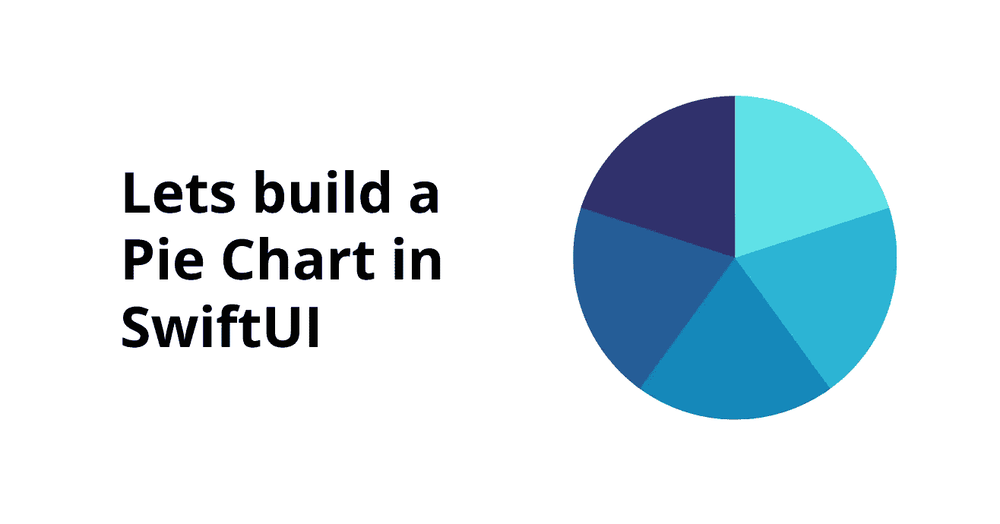
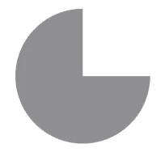
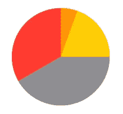
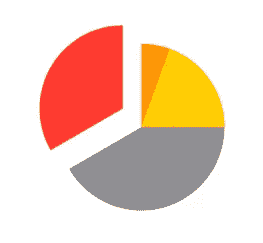
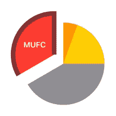
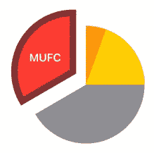

# 使用 SwiftUI 创建分段饼图

> 原文：<https://betterprogramming.pub/create-a-segmented-pie-chart-using-swiftui-7b0adbbc4ef6>

## 最大限度地利用路径

在本文结束时，您将了解到:

*   如何使用`Path`
*   如何添加一个`Arc`
*   关于`Arc`的参数
*   如何创建饼图
*   如何在饼图中拆分线段

# 让我们开始吧

我们将首先抽出我们的 Pacman。开玩笑，我们先试着给我们的`PieChart`画一个简单的弧线。

为了画一个简单的弧线，我们将利用`Path`并编写以下代码:

要画一个`Arc`，首先要为我们的绘制路径设置一个起点。
我们通过使用`move`来设置绘制路径的起点。

接下来，我们将从起点画一个圆弧。为此，我们将利用`addArc`,这里你可以看到`addArc`接受了几个参数

*   `**center**`-**-**指定圆的中心点(在当前坐标系中)用来定义圆弧
*   `**radius**` **-** 指定用于定义圆弧的圆的半径
*   `**startAngle**` **-** 指定圆弧的起始角度(以弧度为单位)
*   `**endAngle**` **-** 指定圆弧的结束角度(以弧度为单位)
*   `**clockwise**` **-** 画圆弧的方向

输入上面的代码后，我们可以看到类似下面的内容。

初始电弧

## 填充其他段

现在，您已经了解了如何使用`addArc`，您可以轻松创建包含不同部分的饼图。

要实现一个包含不同线段的饼图，我们需要做的就是覆盖每个新的弧线，或者将每个线段放在另一个的上面。这可以使用`ZStack`轻松完成。

我们只需要创建一些具有不同开始和结束角度的圆弧。为了适应这种变化，我们将添加几个圆弧，并稍微修改初始圆弧的起始角度为 150 度，而不是 270 度。

添加了 3 个新路径并修改了初始路径后，我们的代码看起来如下。

分段分离

# 突出显示某个片段

为了从饼图中突出显示某个特定部分或移动/隔离某个特定部分，我们需要对该特定部分应用`offset`修改器。

作为一个曼联球迷，我会把红色段从饼状图中隔离出来。为此，我将为红色的路径设置一个负的偏移值。

现在我们的饼状图看起来像下面这样。

添加了偏移量

## 细分市场

我们可以在这个饼图上做很多细节。为了让它看起来更吸引人，我会给它一个`Title`和一个偏移边框，这样分割的部分看起来会更突出。

为了添加一个边界，我们将简单地做一个`stroke`，为了给出一个`Title`，我们将为路径创建一个`Overlay`，并添加`Text`，与下面的代码相同。

但这不应该在现有的部分，我们将复制我们需要用边界颜色分割的部分。所以代码看起来会像这样。

添加了边框

检查代码，你可以看到我已经复制了红色的路径。但是在我使用的第一个例子中，`fill`我给了`overlay`和`Text`，在我使用`stroke`的第二个例子中，我没有给覆盖图，而是按照相同的偏移量。

正如你所看到的，这里有一些问题，我们要给出的笔画没有覆盖底部。那我们怎么解决呢？
我们只需要告诉`Path`关闭它的`Subpath`。

通过编写:`path.closeSubpath()`，代码现在将如下所示:

最终输出

最终的代码可以从我的 GitHub 库获得:

 [## GitHub - Nikilicious09/PieChart

### 此时您不能执行该操作。您已使用另一个标签页或窗口登录。您已在另一个选项卡中注销，或者…

github.com](https://github.com/Nikilicious09/PieChart) 

我希望您理解了如何使用 SwiftUI 创建分段饼图。如果你有任何疑问或建议，请告诉我。