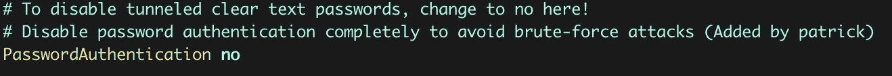
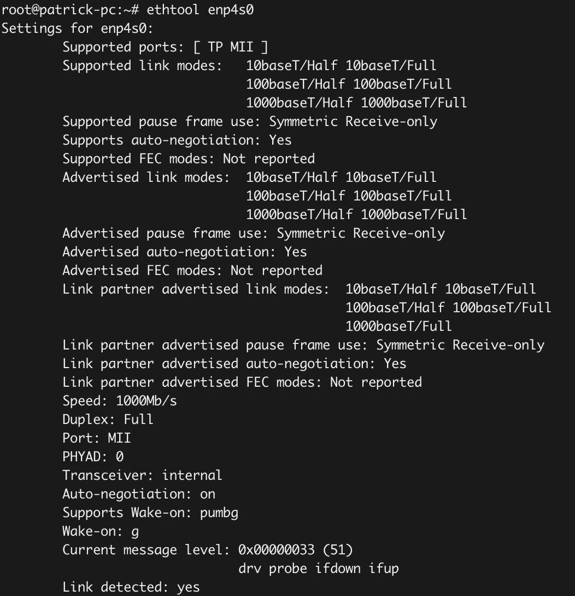

# 从您的 Linux PC 创建一个自托管的 GitLab 服务器

> 原文：<https://betterprogramming.pub/create-a-self-hosted-gitlab-server-from-your-linux-pc-2738bc6538d2>

## 因为你还能用旧硬件做什么？


图片来自 [GitLab 新闻包](https://about.gitlab.com/press/press-kit/)。

你有一台积满灰尘的旧电脑站在角落里，等着有人来启动它，用它做一些很酷的事情吗？

好吧，那么让我们通过构建我们自己的完全自托管的 GitLab 实例，并使它可以从任何地方远程控制，来很好地利用这个旧硬件！

# 内容

您将在本文中发现:

*   在 Linux PC 上安装 GitLab Omnibus。
*   在你自己的网站上托管 GitLab 服务器。
*   通过 SSH 从任何地方访问 Linux PC。
*   需要时远程启动您的电脑。

请记住，这是*而不是*生产就绪设置指南！这只是一个小项目，你可以在上面测试一些服务(例如 GitLab CI/CD，GitLab Pages 等)。)或者只是使用它们来改善您的个人编程环境。

如果你有任何补充或者想指出安装过程中的任何问题，请在评论中告诉我！

# 1.GitLab 综合安装

根据您的操作系统，安装过程可能会有所不同。 [GitLab 有](https://about.gitlab.com/install/)一份支持系统及其各自安装流程的列表。

以下说明适用于 Ubuntu 用户。它们与 GitLab 文档中的基本相同，但是我决定也把它们放在这里，这样我们就可以在一个地方记录整个过程。

首先，我们需要安装必要的依赖项:

```
$ sudo apt-get update
$ sudo apt-get install -y curl openssh-server ca-certificates tzdata perl
```

如果您配置了邮件服务器，GitLab 将能够向您发送电子邮件通知。为此，您可以使用 Postfix 或[配置一个外部 SMTP 服务器](https://docs.gitlab.com/omnibus/settings/smtp.html)。

在我们的例子中，我们希望保持简单并安装 Postfix:

```
$ sudo apt-get install -y postfix
```

在 Postfix 安装过程中，会出现一个配置页面。选择互联网站点并使用您的域名作为邮件名称。在下一步中，您将为 GitLab 服务器定义一个子域。使用该子域作为邮件名(如`gitlab.mysite.com`)。

这是您从 GitLab 服务器接收邮件时显示的名称(例如`gitlab.mysite.com`)。

现在我们已经准备好添加 GitLab 包存储库了:

```
$ curl https://packages.gitlab.com/install/repositories/gitlab/gitlab-ee/script.deb.sh | sudo bash
```

## DNS 配置

在我们继续安装软件包之前，我们需要正确地设置我们的 DNS，以便可以从公共互联网访问 GitLab 实例。为此，我们必须在我们的主机提供商创建一个子域。

根据您使用的提供商，此步骤可能会有所不同。你可以在文档中找到关于最常见的 DNS 注册商的[教程。](https://docs.gitlab.com/omnibus/settings/dns.html)

在我们的例子中，我们需要添加一个 DNS A-record，这意味着我们定义一个指向 IP 地址(使用[您网络的公共 IP](https://www.whatismyip.com/what-is-my-public-ip-address/))的子域(最好与您之前配置的邮件名称相同，例如`gitlab.mysite.com`)。我们将在下一步处理端口转发。

## 让我们加密证书和端口转发

当使用一个`https://`地址作为 GitLab 外部 URL 时，Let's Encrypt 会自动请求一个 SSL 证书。要实现这一点，我们必须确保端口 80 和 443 是可访问的！

由于我们的 GitLab 服务器位于我们的私有网络中，我们必须将两个端口都直接转发到运行服务器的 Linux PC 上。根据路由器软件的不同，打开端口的方法可能会有所不同。你可以在谷歌上快速搜索，了解这个过程如何适用于你的特定路由器，或者[查看这个指南](https://www.noip.com/support/knowledgebase/general-port-forwarding-guide/)，它应该适用于最常用的路由器。

在将端口转发到您的计算机的 IP 地址之前，请确保您为该设备分配了一个静态 IP。如果您的 IP 地址发生变化，路由器将两个端口都转发到旧的 IP 地址，您将会遇到问题。您可以使用 DHCP 预留(通过您的路由器分配静态 IP)或[在设备本身](https://danielmiessler.com/study/manually-set-ip-linux/)上配置它。

我建议在您的路由器上使用 DHCP reservation 进行配置，因为这样可以更容易地在一个地方配置所有与 IP 和端口相关的内容，并且您的计算机将简单地保持其默认设置。

此外，我们必须确保您的防火墙允许两个端口上的流量。如果你使用的是 Ubuntu，你将使用的默认防火墙是 [UFW](https://help.ubuntu.com/community/UFW) 。

首先，我们必须确保 UFW 在运行:

```
$ sudo ufw enable
```

检查是否有效:

```
$ sudo ufw status verbose
```

要告诉您的 UFW 允许 HTTP 和 HTTPS 协议，您必须执行以下命令:

```
$ sudo ufw allow 80,443
```

或者您可以使用:

```
$ sudo ufw allow http,https
```

这两个命令实现了相同的结果。现在，您已经准备好最终安装 GitLab 包了。

确保将`https://gitlab.example.com` 替换为您之前配置的子域，您就可以开始了:

```
$ sudo EXTERNAL_URL="https://gitlab.example.com" apt-get install gitlab-ee
```

最后但同样重要的是，启动 GitLab 服务器:

```
$ sudo gitlab-ctl start
```

通常，在您第一次访问 GitLab 服务器时，会要求您提供 root 密码。如果不是这种情况(我遇到过这个问题)，看看这个关于如何通过控制台更改用户密码的指南[。请记住，root 用户的 ID 是`1`而不是`7`，因此访问 root 用户的命令如下所示:](https://docs.gitlab.com/ce/security/reset_user_password.html)

```
user = User.where(id: 1).first
```

## 解决纷争

如果您在此过程中遇到任何问题，我建议使用官方的 [GitLab Omnibus 文档](https://docs.gitlab.com/omnibus/README.html)，它实际上非常好，还包含大量针对各种不同问题的故障排除选项。

如果您正在处理与网络相关的问题，工具`telnet`和`tcpdump`是您最好的朋友！只是一个对我帮助很大的小例子:

```
$ tcpdump -i <interface name> port <port> -n -Q inout
```

该命令将显示计算机特定接口和端口上的所有传入和传出流量(`-n`表示没有名称解析，`-Q`用于指定是只捕获传入流量、只捕获传出流量，还是两者都捕获)。

例如，如果您在通过 SSH 连接到您的设备时遇到问题(我们将在下一步中进行设置)，您可以使用`tcpdump`命令来确定问题的根源:

*   如果只接收到传入流量，您知道设备本身有问题(可能是防火墙规则)。
*   如果您看到传入和传出流量，但远程机器没有接收传出流量，则问题可能与路由有关。
*   完全没有流量也可能是路由问题。

# 2.使用 SSH 连接到您的服务器

既然我们的 GitLab 实例已经启动并运行，我们还希望能够从任何地方管理服务器。为此，我们将建立一个 SSH 连接。

如果您还没有安装 OpenSSH 服务器，那么可以从这一步开始:

```
$ sudo apt update
$ sudo apt install openssh-server
```

检查服务器是否正在运行:

```
$ sudo systemctl status ssh
```

在我们能够通过 SSH 连接到我们的服务器之前，我们必须确保这一步的最大安全性。为此，我们将配置以下内容。

首先，我们将改变我们的 SSH 服务器，只接受`Protocol 2`连接。在`/etc/ssh/sshd_config`下打开您的 SSH 配置文件并添加`Protocol 2`:


*在“/etc/ssh/sshd_config”中配置 SSH 协议 2*

此外，我们希望避免端口 22，这是默认的 SSH 端口，因此将是潜在攻击者的首要目标之一。当然，通过模糊实现安全性并不是一个很好的方法，但是它仍然使得人们很难随意尝试端口 22。

为此，将上述配置文件中的 SSH 端口更改为您喜欢的任何端口，该端口不是众所周知的或者在注册端口范围内(使用 49152-65535 之间的端口)。

此外，我们必须打开您选择的端口。在路由器上重复端口转发步骤，并在防火墙上打开端口。同样，对于 UFW 用户，一个简单的`allow`命令就可以了:

```
$ sudo ufw allow <port>
```

提供最高安全性的最后一步是完全禁用密码验证。在您的 SSH 配置文件中搜索一个名为`PasswordAuthentication`的选项，并将其值更改为`no` *:*



*禁用“/etc/ssh/sshd_config”中的密码验证*

然后，我们将创建一个私钥/公钥对。您可以按照本指南[进行调整，以满足您的需求。或者，如果您想要一种简单的方法，只需使用以下命令:](https://www.ssh.com/ssh/keygen/)

```
$ ssh-keygen -f ~/.ssh/<filename>
```

系统会询问您是否要提供密码。我建议这样做。如果有人获得了您的私钥文件，没有密码就没有用了。

现在，我们在服务器上复制密钥对:

```
$ ssh-copy-id -i <filename> <username>@<server-IP> -p <port>
```

`<username>`是稍后您想用来登录服务器的用户名。完成后，我们现在可以不使用密码连接到服务器:

```
$ ssh <username>@<server-IP> -p <port> -i <filename>
```

现在，我们能够从任何地方连接到我们的 Linux PC。这很酷，因为我们可以随时启动和停止我们的 GitLab 服务器，但它仍然不是虚拟机。它仍然是你房子里的一台真正的电脑。

那么，如果计算机没有运行，但您希望访问它来启动 GitLab 服务器，该怎么办呢？为此，我们需要远程启动计算机的能力。

# 3.远程唤醒您的电脑

到了我们项目的最后一步，这一步有点棘手。我们正在使用 WOL (Wake-on-LAN)技术从另一台设备唤醒我们的电脑，我们将进一步扩展这一技术，以便即使我们不在同一个网络中，也可以唤醒电脑。

我们要做的第一件事是在 BIOS 设置中启用 WOL。如果你的 BIOS 有点旧，这可能会很令人沮丧。较新的主板通常在电源管理设置下支持此选项。

我建议做一些关于如何为您的特定主板启用 WOL 的研究。我的大约有十年了，这让我很难找到合适的设置。我花了一个多小时才发现，我必须在 BIOS 中禁用 ErP 选项。

ErP 决定了电脑在关机状态下的耗电量。启用时，ErP 将最大功耗限制为 1W。禁用此选项将启用 WOL、PME 唤醒事件等功能。

在您为自己的设备找到正确的设置后，您现在可以在 NIC(网络接口卡)上启用 WOL。使用`ethtool`，您可以发现 WOL 是否启用:

```
$ ethtool <interface-name>
```

输出将如下所示:



“ethtool”输出

在`supports Wake-on`下，你可以找到你的网卡是否支持 WOL。我们在找`g`这封信。这意味着您的网卡支持使用[魔术包](https://en.wikipedia.org/wiki/Wake-on-LAN#Magic_packet)唤醒。

如你所见，我的`Wake-on`选项已经设置为`g`。你的可能会设置为`d`，代表“禁用”。如果是这样的话，我们必须使 WOL 成为可能。通常，这是通过一个简单的`ethtool`命令完成的，但问题是该选项会在重启后重置。

为了避免这种情况，我们必须编写一个`systemd`文件。创建一个名为`wol.service`的文件，存储在`/etc/systemd/system`中，复制粘贴以下代码。不要忘记用合适的名称替换接口名称！

[Systemd 单位和单位档案](https://www.digitalocean.com/community/tutorials/understanding-systemd-units-and-unit-files)

现在，我们让`systemd`知道新的脚本:

```
$ systemctl daemon-reload
```

启用服务:

```
$ systemctl enable wol.service
```

并启动它:

```
$ systemctl start wol.service
```

现在我们已经使更改持久化，并且在系统重新启动后，网卡将被正确配置！

完成后，您需要一个工具来发送魔术包到目标 PC。因为我用的是 macOS，所以一个简单的`brew install wakeonlan`就帮我做到了。现在我们可以唤醒 GitLab 服务器(只能从私有网络内部唤醒！)与:

```
$ wakeonlan -i <broadcast ip of your network> <mac-address>
```

请注意，`wakeonlan`工具需要您想要启动的设备的 MAC 地址。此外，默认情况下，该工具需要广播地址才能正常工作。

但是我们仍然有两个问题:

1.  我们想在私有网络之外做这件事。
2.  我们不想使用广播地址。

## 从任何地方醒来

首先，我们应该知道魔术包是通过 UDP 协议发送的，所以我们必须确保我们在路由器上配置了端口转发，以允许 UDP 流量。因为我们已经在路由器上为 SSH 连接打开了一个端口，所以我们可以使用同一个端口进行唤醒。

您也可以为唤醒配置不同的端口。只要确保该端口允许 UDP 协议即可。

## 避开广播

为此，我们必须在路由器上创建一个静态 ARP 条目。ARP 表示地址解析协议，用于将 IP 地址与网络设备的 MAC 地址相关联。

静态 ARP 条目是您的 ARP 缓存中的永久条目，这意味着我们将 IP 地址(您之前为您的设备选择的静态 IP)永久绑定到我们的 Linux PC 的 MAC 地址。

同样，这一步取决于你的路由器类型。在我的 TP-Link 路由器上，我必须选择 IP & MAC 绑定> ARP 列表。一个快速的谷歌搜索将足以找出如何添加一个 ARP 条目到您的路由器。

就是这样！现在，您可以使用以下命令从另一个网络启动您的计算机:

```
$ wakeonlan -i <public ip of your network> -p <port> <mac-address>
```

## 解决纷争

同样，如果您在 WOL 配置期间遇到问题，像`tcpdump`(如前所示)这样的工具可以很好地发现魔术包是否到达了目标 PC。

# 4.结合一切

这里有一个小脚本，可以从你想要的任何地方启动你的计算机，并通过 SSH 连接到它。只需替换这些值，就可以了:

# 就是这样！

我希望你在这个小项目中学到了一些新东西。你将在未来享受你的个人 GitLab 服务器！

感谢您的阅读！

# 参考

*   [https://about.gitlab.com/install/](https://about.gitlab.com/install/)
*   [https://docs.gitlab.com/omnibus/settings/smtp.html](https://docs.gitlab.com/omnibus/settings/smtp.html)
*   [https://docs.gitlab.com/omnibus/settings/dns.html](https://docs.gitlab.com/omnibus/settings/dns.html)
*   [https://www.whatismyip.com/what-is-my-public-ip-address/](https://www.whatismyip.com/what-is-my-public-ip-address/)
*   [https://www . noip . com/support/knowledge base/general-port-forwarding-guide/](https://www.noip.com/support/knowledgebase/general-port-forwarding-guide/)
*   [https://danielmiessler.com/study/manually-set-ip-linux/](https://danielmiessler.com/study/manually-set-ip-linux/)
*   [https://docs . git lab . com/ce/security/reset _ user _ password . html](https://docs.gitlab.com/ce/security/reset_user_password.html)
*   [https://docs.gitlab.com/omnibus/README.html](https://docs.gitlab.com/omnibus/README.html)
*   [https://www.ssh.com/ssh/keygen/](https://www.ssh.com/ssh/keygen/)
*   [https://en.wikipedia.org/wiki/Wake-on-LAN#Magic_packet](https://en.wikipedia.org/wiki/Wake-on-LAN#Magic_packet)