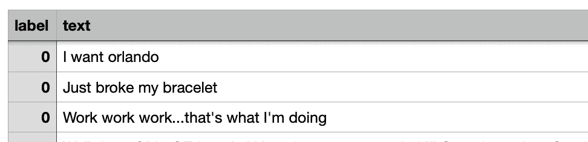
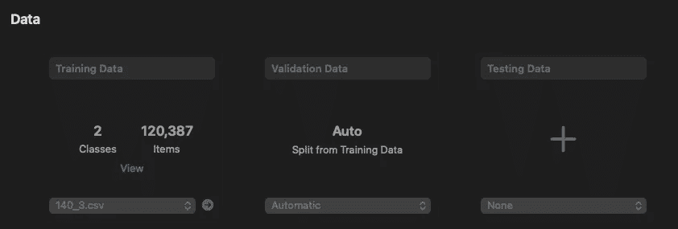
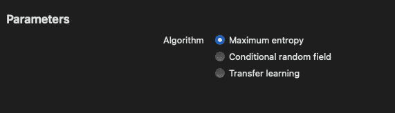
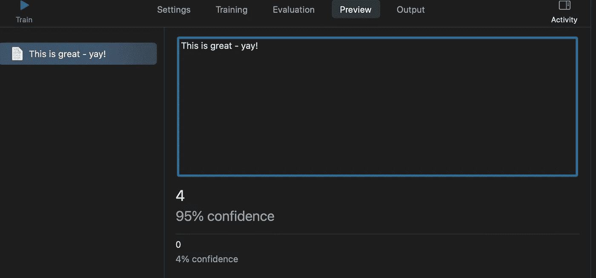

# 用 CreateML 和 SwiftUI 构建情感分类器应用

> 原文：<https://betterprogramming.pub/create-a-sentiment-analyser-app-with-createml-and-swiftui-1a24071b6894>

## 将 NLP 模型整合到 iOS 开发中非常简单，是探索机器学习的好方法

[腾雅特](https://unsplash.com/@tengyart?utm_source=unsplash&utm_medium=referral&utm_content=creditCopyText)在 [Unsplash](https://unsplash.com/s/photos/emotion?utm_source=unsplash&utm_medium=referral&utm_content=creditCopyText) 上拍照

今天，我们将制作一个基本的应用程序，它将能够使用自然语言处理(NLP)来预测一个陈述是积极的还是消极的。

这听起来令人印象深刻，但使用苹果的 CreateML 框架创建机器学习模型并将其集成到应用程序中是非常简单的。下面的应用程序非常简单，但是这种训练和创建机器学习模型的工作流程可以用来创建更加复杂和有趣的机器学习项目

## 完成的应用程序预览

该应用程序将能够预测简短的陈述是积极的还是消极的

# 收集数据

有许多数据集是为训练情感分析模型而设计的。我使用了[sensition 140](http://help.sentiment140.com/)，这是一个标记为积极、消极或中立的推文的大集合。你可以在这里下载[。](http://help.sentiment140.com/for-students/)

我们需要做一些数据清理，为 CreateML 准备好数据集。出于这个非常简单的应用程序的目的，我们将只有正面(`4`)和负面(`0`)推文，并且我们将把每个推文的示例限制在 100，000 个以下(这将足以训练一个简单的模型，而不会让我的笔记本电脑着火)。

我们可以将标签改为数据中的`negative`和`positive`，而不是`4`和`0`，但我们将在应用程序中解释这些标签(我的问题内存将很难更新 CSV 文件中的 100k+行)。

CreateML 可以将 JSON、CSV 和文本文件作为训练数据，但关键的是我们需要使用列标题`label`(例如`0` / `4` — `negative` / `positive`)和`text`(即 tweet)来指导 CreateML 如何划分我们对每条 tweet 的分类。准备好的表格如下所示:

我们的 CSV 文件，显示一些“负面”(“0”)推文

# 训练我们的模型

接下来，我们可以创建我们的 CreateML 项目。您可以通过 Playground 在代码中实现这一点，但最简单的方法是使用 CreateML 应用程序(Xcode 11 及更高版本附带了该应用程序)。您可以获得各种各样的项目类型(图像分类器、文本分类器，甚至声音分类器)。这将是一个文本分类器项目。

为训练数据选择 CSV 文件，并将验证数据保留为自动。您还可以使用在训练数据中没有使用的 tweets 创建一个较小的 CSV 文件，作为测试数据。

CreateML 应该正确地识别我们有两个类的事实:`0`和`4`。接下来，我们可以选择要使用哪种算法来训练我们的模型。我们有三种选择:最大熵、条件随机场和迁移学习。不同的算法最适合不同的用途，但是对于这个非常简单的分类器，我们将坚持使用最大熵。

您可以选择模型应该使用的算法

接下来，我们只需点击右上角的“火车”按钮。这将使用我们的数据和我们选择的算法来训练模型。这可能需要一段时间，但是您可以看到它的准确性随着数据的多次迭代而提高:

CreateML 显示了被训练的模型

一旦完成，我们可以在预览选项卡中旋转模型。输入一些消极或积极的东西，看看模型是怎么想的，有多自信:

您可以在 CreateML 中测试您的训练模型。在这个模型中，4 =正，所以我们看起来不错！

用 CreateML 训练文本分类器模型就是这么简单。

# 构建应用程序

当我们使用 CreateML 创建一个模型时，输出的`.mlmodel`文件包含了一个表示我们模型的类。这是我们在应用程序中与模型互动的方式。在 output 选项卡上，点击“Xcode”按钮，您将看到一个新的 Xcode 画布，详细描述您的新`CoreML`类。要将您的模型类添加到您的应用程序中，您只需将它拖到项目文件中。

首先，我们可以创建一个类来处理我们的模型(`SentimentIdentifier`)——您还必须导入`CoreML`和`NaturalLanguage` 模块。这个类将管理我们的应用程序的机器学习方面。这个类应该符合`ObservableObject`协议，因为我们将发布我们的预测结果，供视图更新。

这个类相当简单。对于我们的视图感兴趣的数据，它有两个已发布的属性—预测[正(`4`)或负(`0` )]和预测的置信度，如果它是两种可能性中最有可能的，则它将在 0.5 和 0.999 之间，等等。

在我们的类初始化器中，我们从导入的`SentimentModel`类初始化我们的模型，然后使用我们的模型创建一个`NLModel` ( `SentimentPredictor`)。`NLModel`是我们实际上用来做预测的，使用它的内置方法。

然后，我们创建预测函数。这需要一个字符串(即我们想要分类的内容)，并使用我们的`NLModel`来进行预测。我们也可以用`predictedLayoutHypothesis`来看预测的置信度。该函数返回一个`[String : Double]`字典，其中包含分类以及模型在每个分类中的可信度。

我们可以通过使用它作为访问相关置信度值的键来访问预测的置信度。更有效的方法是调用`predictedLayoutHypothesis()`并通过使用排序字典来提取置信度最高的预测(以避免两次预测)，但是我们现在所做的更具可读性。

# 将它链接到视图

我们希望我们的视图允许用户在一个`TextField`中键入一些文本，然后调用我们的模型来预测它是积极的还是消极的。我们所需要做的就是创建一个`SentimentIdentifer`类的`ObservedObject` 实例，允许我们做出预测并监听结果。

我们将变得时髦，使用表情符号来代表积极或消极的情绪，我们将缩放表情符号，并增加相对于预测置信度得分的不透明度。

如果我们的应用程序可以预测情绪，并在用户键入时动画显示表情符号的变化，而不是用户在完成键入后按下按钮，那将非常酷。为此，我们需要调用我们的预测模型来响应用户编辑`TextField`的输入。我们可以在我们的`TextField`上使用`.onChange()`修改器来做到这一点。

但是，我们不希望用户每增加一个字符就做一个新的预测，只是每一个单词。当输入的最后一个字符是一个空格时，我们可以通过调用`predict()`方法来实现这一点，这表明用户刚刚完成了一个单词的编写。

# 结论

这显然是机器学习和 NLP 的一个非常基本的用途。但我希望它显示了机器学习工具是多么容易获得——即使对于没有经验的 iOS 程序员和刚刚掌握机器学习的人来说也是如此。