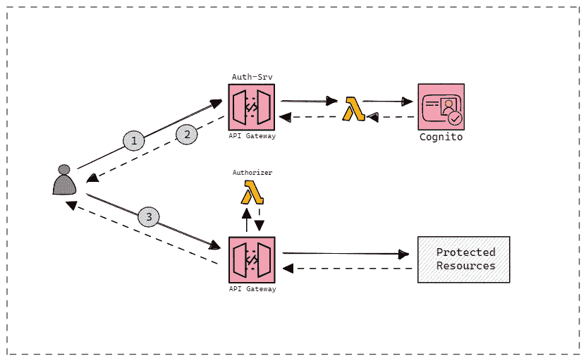
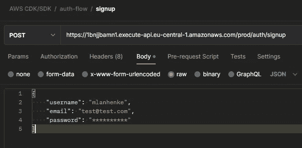
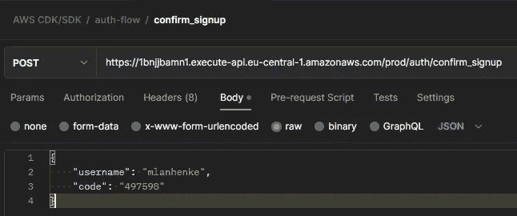
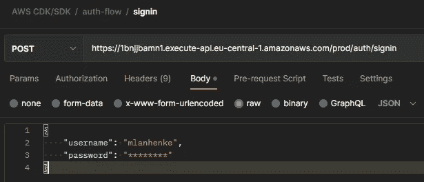
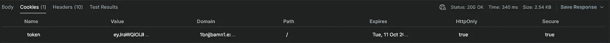
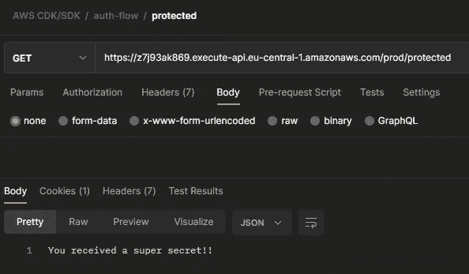

# 如何使用 AWS CDK、Cognito 和 API 网关创建无服务器认证服务

> 原文：<https://betterprogramming.pub/create-a-serverless-authentication-service-with-aws-cdk-cognito-and-api-gateway-ffbd8da6a659>

## AWS 解决方案

## 使用 TypeScript、JWT 和 HttpOnly cookies 的后端服务


照片由[飞:D](https://unsplash.com/@flyd2069?utm_source=medium&utm_medium=referral) 在 [Unsplash](https://unsplash.com?utm_source=medium&utm_medium=referral)

我用过了。你也是。

它无处不在。到处都是。必不可少。

你知道我在说什么:认证。

> 认证描述了证明断言的行为，例如向计算机系统证明你的身份[1]。

或者简单地说——你告诉系统你是谁。

由于我们使用的几乎每个现代应用程序都需要身份验证，因此构建一个身份验证服务并一劳永逸地解决这一需求可能是一个好主意。

在接下来的部分中，您将使用 [Amazon Cognito](https://docs.aws.amazon.com/cognito/index.html) 、 [API Gateway](https://docs.aws.amazon.com/apigateway/) 和 [AWS Lambda](https://docs.aws.amazon.com/lambda/) 创建一个无服务器的后端服务。

通过使用 AWS 云开发工具包(CDK)，您将能够提供代码形式的基础设施(IaC)——只需一个简单的命令行语句就可以轻松启动或关闭后端服务。

然而，在深入研究实现细节之前，让我们后退一步，简单地讨论一下高层设计。

# 高级概述

在编写任何代码之前，先设想一下完整的图景总是有用的。确保我们确切地知道我们想要达到的目标。



AWS 无服务器认证流程[图片由作者提供]

因此，我们的总体目标是创建一个无服务器的后端系统，为我们处理认证。但这实际上意味着什么呢？

让我们快速浏览一下上面的流程:

1.  用户要么尝试创建新帐户，要么通过提供某种形式的凭证(例如，用户名和密码)来登录
2.  用户收到一个响应。如果登录成功，它将是一个 [HttpOnly Cookie](https://developer.mozilla.org/en-US/docs/Web/HTTP/Cookies#restrict_access_to_cookies) ，里面有一个 [JSON Web 令牌](https://jwt.io/introduction)。
3.  有了 cookie，用户试图通过另一个 API 网关访问受保护的资源。Lambda 授权器将解析包含在请求报头中的 cookie，并验证 JWT。如果验证成功，授权者向用户返回一个策略文档，使得访问受保护的资源成为可能。

这已经是了。

现在，让我们从启动我们最喜欢的 IDE 并创建一个新项目开始。

> **注意**:所有使用的服务都符合免费等级，因此不会产生额外费用。然而，检查你的 AWS 帐户并关闭任何未使用的服务仍然是明智的。

# 实现无服务器认证服务

首先，确保你已经安装了 [AWS CDK 并引导了](https://docs.aws.amazon.com/cdk/v2/guide/getting_started.html)。以下代码会有所帮助:

```
// Install AWS CDK
npm install -g aws-cdk// Bootstrap AWS CDK
cdk bootstrap aws://ACCOUNT-NUMBER/REGION
```

现在我们已经配备了合适的工具，我们可以通过命令行界面创建一个新文件夹并初始化 CDK 来开始我们的项目。

```
// Create a new folder
mkdir aws-serverless-auth
cd aws-serverless-auth// Init CDK
cdk init --language typescript
```

一旦安装过程完成，我们就可以打开代码编辑器开始工作了。

## 创建 Amazon Cognito 用户池

重要的事情先来。

为了构建合适的认证服务，我们必须首先创建某种形式的用户数据库。为此，我们使用 Amazon Cognito，幸运的是它为我们提供了所有需要的特性。

在`lib`文件夹中，创建一个名为`user-pool.ts`的新文件。

在上面的代码中，我们导出了一个名为`CognitoUserPool`的类。

在类构造函数中，我们基本上创建了一个新的用户池，并为它附加了一个应用程序客户端。在实例化一个新的用户池时，我们还确保传递所需的配置参数。

注意，我们公开了两个只读类字段以供进一步参考，即`userPoolId`和`userPoolClientId`。

## 构建身份验证 API

现在，让我们继续讨论具体细节——身份验证 API。

再次，在`lib`文件夹中创建一个名为`auth-api.ts`的新文件。

让我们简单明了地开始，首先构造一个 RestAPI，并确保我们的类构造函数接收正确的属性。

接下来，我们添加一个新资源，并为其附加几个 lambda 函数。为了让我们的生活更容易，我们将使用一个名为`addRoute()`的私有助手方法。

> **注意**:我们将在下一节创建所有必要的 Lambda 函数。

每个 Lambda 函数对应一条单独的路线和一个特定的用户操作。

通过使用 helper 方法，我们不仅可以减少代码重复，还可以为每个功能提供强制的环境变量以及正确的策略(例如，允许访问 Cognito 用户池)。

## 实现 auth Lambda 函数

到目前为止，一切顺利。

我们已经创建了一个 Cognito 用户池和一个 RestAPI，允许我们向外界公开我们的认证逻辑。

然而，我们还没有实现这样的逻辑。

在根项目文件夹中，我们创建一个名为`lambda`的新目录。我们打开新目录并创建一个名为`auth`的子文件夹。

> **注意**:为了安装 AWS Lambda 的类型定义，在您的终端中输入`*npm install @types/aws-lambda*`。

## 注册

让我们从注册功能开始，创建一个新文件`signup.ts`。

一旦我们确保收到了正确的事件体(用户的凭证)，我们只需在`CognitoIdentityServiceProvider`的实例上调用`signUp()`方法，并向用户返回一个响应。

如果注册成功，用户将需要验证所提供的电子邮件地址，并通过输入验证码来确认注册。

## 确认注册

你知道规矩的。

创建一个名为`confirm-signup.ts`的新文件。

这里没什么特别的。

我们只需接收用户名和确认码，并将其传递给`CognitoIdentityServiceProvider`的`confirmSignup()`方法。最后，我们向用户返回一个适当的响应。

## 签到

现在，我们能够创建一个新用户，我们可以开始工作在登录功能。仍然在`auth`文件夹中，创建一个名为`signin.ts`的新文件。

在登录函数中，我们收集用户名和密码，以便调用`initiateAuth()`方法。如果给定的凭证是正确的，我们从`AuthenticationResult`中提取`IdToken`，并在响应头中设置一个`Secure` 和`HttpOnly` cookie，并将令牌作为有效负载。

## 签名登记离开

注销功能超级基础。

我们只需创建一个新文件`signout.ts`，并通过将 cookie 的到期日期设置为过去来“删除”cookie。

# 创建受保护的 API 和 Lamba 授权器

我们快到终点线了。

现在，我们已经实现了身份验证 API 和所有必要的 Lambda 函数，我们可以开始处理最后缺失的部分了:受保护的 RestAPI 和 Lambda 授权器。

## 构建受保护的 API

让我们从最简单的部分开始。

在文件夹`lib`中，我们创建一个名为`protected-api.ts`的新文件。

在上面的代码中，我们定义了一个简单的 RestAPI、两个 lambda 函数以及它们的集成。

`protectedFn`只返回一条消息，允许我们模拟一些受保护的资源。我们在`lambda`文件夹中创建一个名为`protected.ts`的新文件。

通过提供一个`RequestAuthorizer`并将我们的 Lambda 授权器设置为处理程序，我们确保了路由受到保护。

## 实现 Lambda 授权器

Lambda 授权器做两件事:

1.  它解析请求头中提供的 cookie，并验证 JWT。
2.  它返回一个策略文档，拒绝或允许对资源的访问。

很简单，对吧？

让我们继续在`lambda/auth`文件夹中创建一个新文件`authorizer.ts`。

在授权器内部，我们使用了三个助手函数:`parseCookies(), verifyToken()`和`createPolicy()`。

让我们接下来讨论这些。

但是首先，在文件夹`lambda`中创建一个新文件`utils.ts`，它将包含所有这三个助手函数。它看起来是这样的:

我们的第一个助手函数顾名思义就是解析请求头中的 cookies。基本上是遍历`headers.Cookie`对象，并用 cookie 名和值创建一个`cookieMap`。

一旦我们用令牌检索到 cookie，我们需要验证它。

下一个助手函数`verifyToken`依赖于三个外部库，所以确保`npm install axios jsonwebtoken jwk-to-pem`。

我们通过请求提供的 URL 来检索 Cognito 用户池的 JSON web key。接下来，我们在外部库`jwk-to-pem`的帮助下转换密钥。一旦我们转换了密钥，我们就可以验证令牌并返回结果。

基于这个结果，我们创建一个策略文档，允许或拒绝对受保护资源的访问。为此，我们创建了最后一个助手函数`createPolicy()`。

# 把所有的放在一起

唷——那工作量很大。

现在，只剩下一件事要做了。我们必须把它们放在最后的堆栈中。

在文件夹`lib`中，打开名为`aws-serverless-auth-stack.ts`的文件。

这里，我们简单地实例化了之前创建的所有其他类。我们的认知用户群和两个 RestAPIs。注意，我们将`userPoolId`和`userPoolClientId`作为属性传递给两个 API。

我们把所有的零件都组装好了。干得好。

现在，是时候通过在终端中键入`cdk deploy`来部署堆栈了。

# 用 Postman 测试流

一旦我们的栈被完全部署，我们就可以通过使用[邮递员](https://www.postman.com/)来最终测试整个通信流。

然而，在开始测试之前，我们需要获得我们的身份验证的 URL 和受保护的 API。因此，转到 AWS 控制台，导航到 API Gateway，选择每个 API，选择 stages，然后复制 URL。

让我们开始创建一个新用户并注册吧。

在 Postman 内部，我们用之前复制的身份验证 API 的 URL 创建了一个新的 POST 请求。我们的 JSON 请求体只包含用户名、电子邮件和密码。



认证测试注册[作者截图]

> **注意**:请确保输入有效的电子邮件地址，因为我们将收到确认码以确认我们的注册请求。

接下来，我们必须通过输入我们应该通过邮件收到的验证码来确认我们的注册请求。在 Postman 内部创建一个新的`POST`请求，请求体中包含用户名和代码。



认证测试确认[作者截图]

收到的响应应该表明我们已经成功地确认了用户注册。

现在，我们可以测试登录功能。

我们创建了另一个 POST 请求，在主体中提供了用户名和密码。



认证测试签到[作者截图]

在响应中，我们应该会收到一个内部带有 JSON web 令牌的 cookie。我们可以通过检查 Postman 内部的 cookies 来验证这一点。



AWS Lambda 设置的 HttpOnly cookie 作者截图]

我们已成功登录。太好了。

现在，让我们尝试访问我们的受保护资源。

在 Postman 内部创建一个 GET 请求，并点击受保护的路由。此外，确保在你的请求中包含一块饼干 `token=<replace-with-jwt>`。



访问受保护的路线[作者截图]

正如我们可以从响应主体中了解到的那样——它起作用了。我们收到了一个超级秘密。

这是最后一次了。

我们完成了无服务器认证服务。

> **注意**:在我们完成测试后，我们可以通过在终端中键入`*cdk destroy*`来拆除基础设施。

# 结论

在本文中，我们利用 Amazon Cognito 和 API Gateway 创建了一个无服务器认证服务。我们还利用了 CDK，将我们的基础设施创建为代码，这允许我们轻松地启动和拆除整个堆栈。

由于几乎每个应用程序中都要使用身份验证，因此在我们的指尖拥有一个后端服务在未来可能会很有用。

然而，仍有一些改进的余地。我们只能用用户名和密码注册。这可以通过集成联合身份提供商(如 Google、LinkedIn 等)来进一步增强。

感谢阅读。

你可以在我的 [GitHub](https://github.com/marvinlanhenke/aws-serverless-auth) 上找到完整的代码。

# 参考

*   [1]https://en.wikipedia.org/wiki/Authentication
*   [https://dev . to/gkoniaris/how-to-secure-store-jwt-tokens-51cf](https://dev.to/gkoniaris/how-to-securely-store-jwt-tokens-51cf)
*   [https://stack overflow . com/questions/27067251/where-to-store-jwt-in-browser-how-to-protect-against-csrf](https://stackoverflow.com/questions/27067251/where-to-store-jwt-in-browser-how-to-protect-against-csrf)
*   [https://docs.aws.amazon.com/cdk/v2/guide/home.html](https://docs.aws.amazon.com/cdk/v2/guide/home.html)