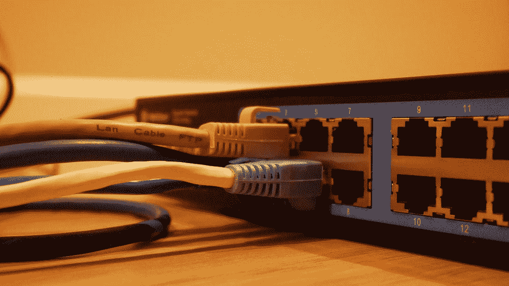

# 为无服务器网站创建无服务器表单

> 原文：<https://betterprogramming.pub/create-a-serverless-form-for-a-serverless-website-69b1a62c4eeb>

## 如何创建一个无服务器的后端来接受输入的表单数据(或来自 API 请求的其他数据)并发送包含这些数据的电子邮件



乔纳森拍摄于 [Unsplash](https://unsplash.com/photos/SwVkmowt7qA)

[S3](https://aws.amazon.com/s3/) + [CloudFront](https://aws.amazon.com/cloudfront/) 为托管一个静态网站提供了一个简单且低成本的解决方案。但是，当您需要一个 HTML 表单时会发生什么呢？为此，我们将介绍如何实现一个简单的无服务器后端！

# 介绍

[AWS S3](https://aws.amazon.com/s3/) + [Cloudfront](https://aws.amazon.com/cloudfront/) 为托管静态网站提供了一个低成本、可扩展的选择，比如初创公司的[登录页面](https://avantsoft.com.br/)，或者时事通讯的注册页面。但是，如果没有服务器，如何实现表单呢？

在本文中，我们将使用 AWS 的 [Lambda](https://aws.amazon.com/lambda/) 和 [API 网关](https://aws.amazon.com/api-gateway/)来检查一个表单的无服务器后端，以触发使用 [AWS SES](https://aws.amazon.com/ses/) 将表单中已填写的信息发送到预定的电子邮件。

# 先决条件

在我们深入 Lambda 的代码之前，我们需要设置开发环境和我们的 AWS 帐户，包括以下几点:

1.  AWS 无服务器应用模型(SAM)本地开发工具按照此处的说明进行安装。
2.  AWS SES 是在生产模式(非沙箱)下配置的，并且域已经按照这里的说明[进行了验证。](https://docs.aws.amazon.com/ses/latest/dg/request-production-access.html)
3.  拥有一个带有 HTML 表单的网站，该表单可以被配置为向 API 网关的端点提交数据，API 网关将在本文稍后创建。

# 履行

我们将使用 [SAM](https://aws.amazon.com/serverless/sam/) 来部署 Lambda 及其依赖资源。关于山姆的更深入的介绍，请看下面的文章。

[](/private-serverless-rest-api-with-lambda-using-sam-2eb31864b243) [## 使用 SAM 的 AWS Lambda 私有无服务器 REST APIs

### 使用 Lambdas 快速创建无服务器微服务

better 编程. pub](/private-serverless-rest-api-with-lambda-using-sam-2eb31864b243) 

先说文件夹结构。我们将有一个应用程序源文件目录，一个可用于部署应用程序的脚本目录，以及 SAM 使用的顶层文件，如`template.yaml`。

```
my-serverless-form/
├── cmd/
│   └── deploy.sh
├── src/
|   ├── package.json
│   └── index.js
├── .gitignore 
└── template.yaml
```

`template.yaml`将如下图所示:

上面的模板定义了两个资源:

1.  `FormSubmissionFunction`:当被触发时会发送电子邮件的 Lambda。
2.  `FormSubmissionApi`:API 网关，接收来自互联网的公共请求，触发 Lambda。

λ代码将在如下所示的`index.js`文件中指定:

在其中，我们使用 [SES](https://aws.amazon.com/ses/) 发送一封电子邮件，其中包含来自`eventObject`的数据，该数据将包含用于触发 Lambda 的请求的主体和标头。您可以根据需要设置电子邮件正文的格式。

为了解析 Lambda 中的表单数据，我推荐使用下面的库:

[](https://github.com/francismeynard/lambda-multipart-parser) [## GitHub-Francis meynard/lambda-multipart-parser:这个 nodejs 模块将解析 multipart-form…

### 这个 nodejs 模块将解析包含来自 AWS lambda 事件对象的文件和字段的多部分表单。它有效…

github.com](https://github.com/francismeynard/lambda-multipart-parser) 

要部署 Lambda，您可以运行`script.sh`文件(如下所示),并按照屏幕指示进行操作:

# 结论

我们已经讨论了如何创建一个无服务器的后端，它可以用来接受输入的表单数据(或来自 API 请求的其他数据)并发送包含这些数据的电子邮件。

然而，在将这样的东西部署到生产之前，实现 [reCaptcha](https://www.google.com/recaptcha/about/) (或类似的)可能是明智的，以避免机器人发现您的端点并提交错误的数据(您不想因为从机器人发送电子邮件而被收取 Lambda 执行时间的费用)。

希望这对你有帮助！

*如果你有任何问题或只是想聊聊创业、创业、承包或工程，请发邮件给我，地址是 Paulo @*[*avantsoft.com.br*](https://avantsoft.com.br/)*。*