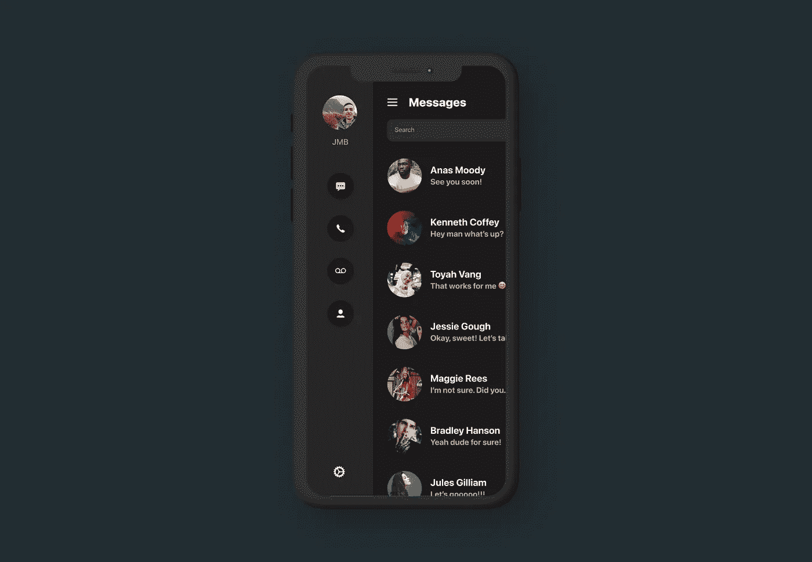

# 在 SwiftUI 中创建侧边栏菜单

> 原文：<https://betterprogramming.pub/create-a-sidebar-menu-180ca218eaf2>

## 为你的用户建立一个有用的侧边栏

SwiftUI 中的弹出侧边栏菜单。作者照片。

今天，我决定尝试一个 SwiftUI 视图，它允许我轻松地为我的应用程序中的内容创建一个侧边栏菜单。在设计了一些原型之后，我将其归纳为一个名为`SideBarStack`的自定义视图类，如下所示:

如您所见，定制视图使用了两次`@ViewBuilder`属性包装器，允许您为侧边栏和实际视图内容传递定制内容。

自定义`SideBarStack`也接受两个参数:`sidebarWidth`和`showSidebar`。第一个允许视图在侧边栏打开和关闭时正确翻译侧边栏和主要内容。就像根据传入的宽度设置两个视图的偏移量一样简单。

其次，`showSidebar` bool 控制侧边栏是否打开。它作为一个`@Binding`被传入，以允许一个`TapGesture`被放置在主内容上。这允许用户点击主要内容来关闭侧边栏，而不仅仅是菜单按钮。在代码中，这是通过应用几乎完全透明的覆盖来实现的。SwiftUI 不会在`Color.clear`视图或不透明度为`0`的视图上触发点击手势。

示例用途:

感谢阅读！