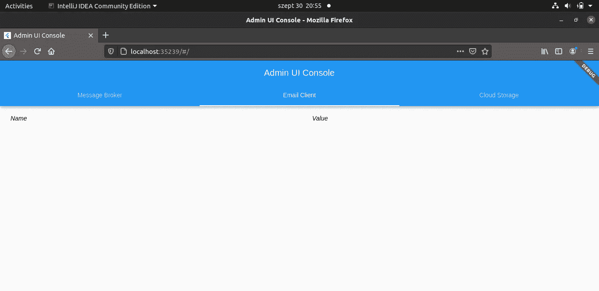
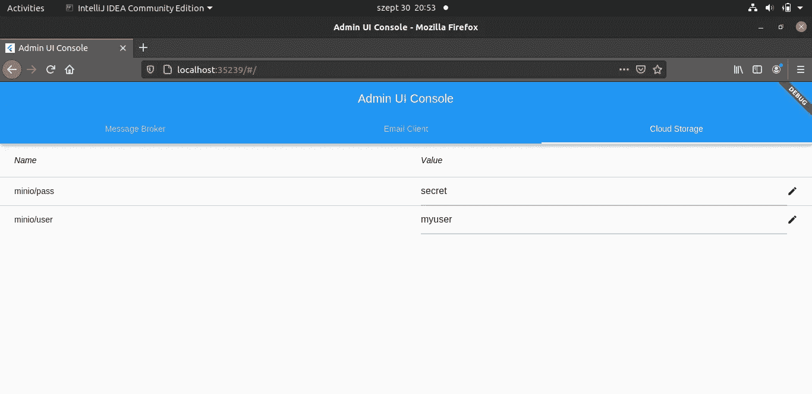
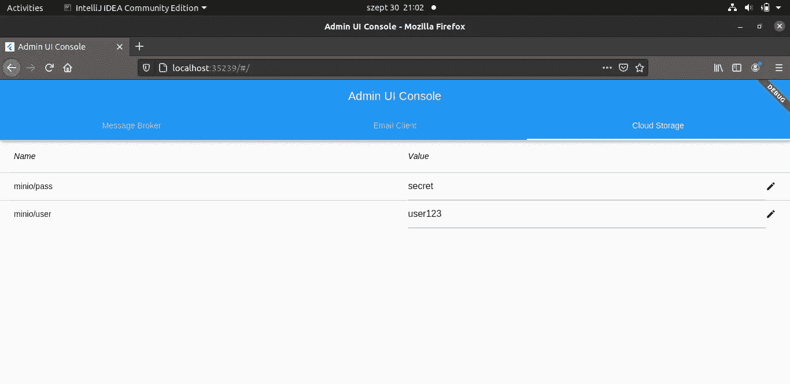

# 用 Flutter 和 etcd 创建一个简单的管理用户界面

> 原文：<https://betterprogramming.pub/create-a-simple-admin-ui-with-flutter-and-etcd-1d00c788014d>

## 处理来自 etcd 后端的数据，并在 Flutter 中显示数据


克里斯托弗·伯恩斯在 [Unsplash](https://unsplash.com?utm_source=medium&utm_medium=referral) 上拍摄的照片

在本教程中，我们将使用 etcd 作为后端，Flutter 作为前端，构建一个管理 UI 应用程序。

etcd 是保持您的应用程序配置有序的好方法。它将关键配置数据存储为键值对。我已经发表了一篇[文章](https://medium.com/better-programming/organize-your-application-configuration-efficiently-with-etcd-89dad3fa3dcf)关于 etcd 最强大的特性，如果你想阅读一些更详细的信息，可以去看看。

我们还将学习如何在 Flutter 的动态`TabBar`视图中创建一个`DataTable`，以及如何用来自 etcd 后端的数据填充它。

开始编码吧！

# 准备后端

## 1.安装 etcd

为了简单起见，我们将使用一个 Docker 图像。

用以下内容创建一个`docker-compose.yml`文件:

## 2.启动 Docker 容器

在您的终端中执行以下命令:

`docker-compose up -d`

## 3.放置和获取键值对

首先，简单介绍一下获取和写入 etcd 值。键值对必须用 Base64 算法编码。

假设对于我们的管理应用程序，我们想要存储电子邮件客户端、云存储和消息代理的配置数据。这些数据可以是用户名、密码、主机和端口号，例如，`rabbitmq/user=user123`、`rabbitmq/password=secret`等等。

为了能够为同一个配置项配置所有的键-值对，我们将为我们的键赋予一个前缀。etcd 的伟大之处在于它会根据前缀检索属于给定键的所有值。所以我们可以配置任意多的值。

*   放置一个键值对:

在这个例子中，键值对是`foo-bar`。

```
curl -L [http://localhost:2379/v3/kv/put](http://localhost:2379/v3/kv/put) \
  -X POST -d '{"key": "Zm9v", "value": "YmFy"}'
```

*   按给定前缀检索关键字:

```
curl -L http:*//localhost:2379/v3/kv/range \
*  -X POST -d '{"key": "Zm9v"}', "range_end": "Zm9w"}'
```

我们将很快使用 Dart 实现这些功能。

# 准备前端

## 1.安装颤振

您需要安装 Flutter SDK 才能继续学习本教程。如果您需要帮助，请查阅官方的[安装指南](https://flutter.dev/docs/get-started/install)。

## 2.获取必要的依赖关系

您需要获得`http`依赖项，因为我们将调用 post 请求。

*   要更新依赖关系，请打开`pubspec.yaml`文件，并在依赖关系部分键入以下内容:

```
http: any
```

## 3.创建配置数据对象

*   用下面的代码创建一个名为`configdata.dart`的新文件:

它将解析和解码来自 etcd post 请求的键值数据。

## 4.创建 etcd 服务

*   创建一个名为`etcdservice.dart`的文件
*   编写一个方法来获取键值对

*   要更新和编码键值对，请添加以下方法:

## 5.创建主应用程序

*   创建一个名为`main.dart`的文件
*   创建主应用程序`MyApp`
*   导入必要的库

*   在`MyApp`类中创建`TabBarView` 。为此，我们使用了`DefaultTabController`。显示的选项卡数量是动态的。

*   创建选项卡，并生成选项卡列:

请注意，`generateTabColumns()`方法将从 etcd 收集数据，并填充`DataTable`中的相应列。

*   通过创建`getConfigData(String prefix)`方法调用 etcd 服务:

*   为`DataTable`创建小部件

我们需要一个`StatefulWidget`。让我们也创建一个接受一个键和一列作为参数的构造函数。

*   然后让我们在`DataTableWidget`之后创建`_DataTableWidgetState`类:

*   在同一个类中创建`DataTable`:

这就是如何创建`generateDataColumns()`和`generateDataRows()`方法:

*   创建一个方法`setConfigValue(ConfigData config)`，用于更新 etcd 键值对:

当用户修改 UI 上的值后按下`Enter`时，将调用该方法。

# 测试应用程序

编码部分到此为止。现在，让我们看看应用程序是什么样子的，并执行一些功能测试。

## 1.启动颤振应用程序

*   在您的终端中执行以下命令，以启用 web 支持并在浏览器中启动应用程序:
*   `flutter channel beta`
*   `flutter config -enable-web`
*   `flutter create web`
*   `flutter run -d web`

执行命令后，主机和端口将显示在终端窗口中。点击网址或粘贴到浏览器进入 UI。

您的管理控制台应该如下所示:



我的电脑截图，显示了 Flutter 中的空管理控制台

## 2.使用 etcd 中的数据填充表格

现在，让我们使用 etcd 添加一些配置。我将为云存储选项卡添加用户名和密码。我就以 MinIO 为例系统。按键将会是`minio/user`和`minio/pass`。这些值将分别为`myuser`和`secret`。我已经在一个在线 Base64 编码器工具的帮助下对这些键值进行了编码。

让我们使用 curl 发布数据:

```
curl -L http:*//localhost:2379/v3/kv/put \* >   -X POST -d '{"key": "bWluaW8vdXNlcg==", "value": "bXl1c2Vy"}'curl -L http:*//localhost:2379/v3/kv/put \* >   -X POST -d '{"key": "bWluaW8vcGFzcw==", "value": "c2VjcmV0"}'
```

刷新 UI，您应该会看到云存储选项卡下填充的数据:



显示更新的 Flutter UI 的我的电脑的屏幕截图

## 3.通过用户界面修改值

要修改某个值，请双击该值，然后键入新值。按下`Enter`，数据被发送到 etcd，etcd 会立即更新该键的值。如果您刷新页面，您的新值应该被保存。我把我的改成了`user123`:



来自我的电脑的屏幕截图，显示了 minio/user 密钥的持久值

# 结论

在本教程中，我们探索了一些基本的 etcd 特性，比如检索和修改键值对。我们还学习了如何使用 Flutter 框架动态地创建一个带有`TabBarView`的`DataTable`。

这个项目的完整源代码可以在我的 GitHub 资源库中找到，链接如下。

感谢您的阅读，祝您编码愉快！

# 参考

*   [GitHub 库](https://github.com/kirshiyin89/flutter_etcd)
*   [“用 Flutter 构建 web 应用”](https://flutter.dev/docs/get-started/web)
*   [“数据表类”](https://api.flutter.dev/flutter/material/DataTable-class.html)
*   [“使用标签”](https://flutter.dev/docs/cookbook/design/tabs)
*   [“为什么选择 gRPC 网关”](https://etcd.io/docs/v3.3.12/dev-guide/api_grpc_gateway/)