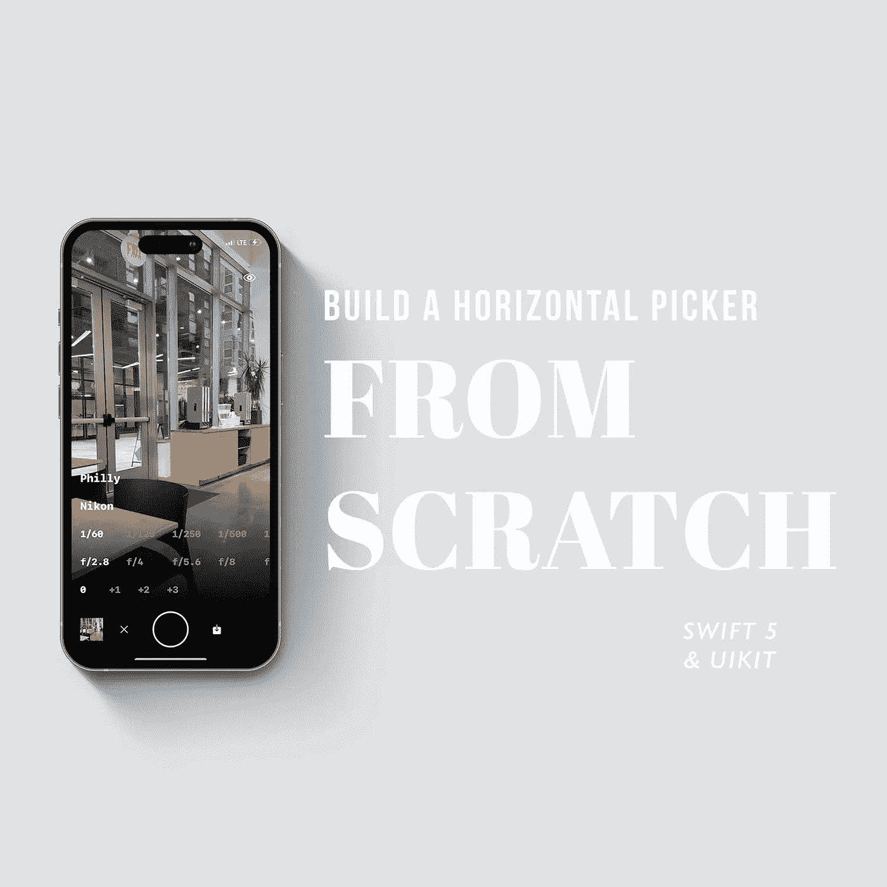

# 使用 iOS 中的 UICollectionView 创建水平选取器视图

> 原文：<https://betterprogramming.pub/create-a-simple-horizontal-picker-view-from-scratch-using-swift-5-on-ios-16-a25b1f194426>

## 使用 Swift 5



作者图片

由于生活、自由职业、做副业项目 [NOSSAFLEX](https://apps.apple.com/us/app/nossaflex/id1523558285) ，已经很久没有写过教程了。

尽管如此，在我们的应用程序上工作需要我们的测光表有一个水平的选择器视图。

我花了很长时间寻找创建水平拾取器的解决方案。我试着旋转 UIPicker，但这非常不切实际，定制也受到限制。我试图寻找在线解决方案，但找不到任何有益的东西。我找到的最好答案是来自 [iOS Academy](https://iosacademy.io/) 的 [AfrazCodes](https://github.com/AfrazCodes/Swift-HorizontalPickerView) 。这个解决方案工作得很好，但是我需要一些更适合的东西，并且不使用滚动单元格分页。

这是我用简单的水平选择器视图创建的解决方案的演示。

我必须感谢我对 AfrazCodes 的解决方案。他的解决方案帮助我实现了我所需要的。

这个解决方案很简单。它使用 UICollectionView，不需要添加任何不明确的代码。

## **主要功能包括**

*   单元格突出显示/选择
*   使用函数调用滚动到一个单元格
*   带/不带集合减速的自动滚动视图
*   每个单元的完全定制

NOSSAFLEX 设计要求选定的单元格左对齐，但我将在本教程中使选定的单元格居中。对于感兴趣的人，我将在本文末尾添加我在 NOSSAFLEX 中使用的代码，该代码允许我将选定的单元格靠左对齐。

如果你想下载这个项目，这里有一个到 GitHub Repo 的链接。

让我们开始吧。

# 先决条件

本教程的一些先决条件是将`UICollectionViewFlowLayout`滚动方向设置为. horizontal。

在`UICollectionViewCell`中，我有一个名为`configure()`的公共函数。此功能将设置选定的单元格。

```
public func configure(with title: String, isSelected: Bool = false) {
    titleLabel.text = title
    backgroundColor = isSelected ? .green : .darkGray
}
```

如果单元格被选中，我们将改变背景为`.green`，否则，我们将设置为`.darkGray`。

如果你正在跟踪我的回购，这是它目前的样子。只是一个简单的横`collectionview`。

# 选择功能

让我们首先创建`select()`函数。

首先，我们需要一个变量来跟踪选中的`IndexPath`。

```
var selectedCellIndexPath: IndexPath?
```

接下来，我们将实现`select()`功能。以下是完整的解决方案:

```
/// Scrolls to selected cell
/// - Parameters:
///   - row: row index
///   - section: Section index
///   - animated: Animated boolean
public func select(
    row: Int,
    in section: Int = 0,
    animated: Bool = true
) {
    // Ensures selected row isnt more then data count
    guard row < data.count else { return }

    // removes any selected item
    cleanupSelection()

    // set new selected item
    let indexPath = IndexPath(row: row, section: section)
    selectedCellIndexPath = indexPath

    // Update selected cell
    let cell = collectionView.cellForItem(at: indexPath) as? HorizontalPickerViewCell
    cell?.configure(
        with: data[indexPath.row],
        isSelected: true
    )

    collectionView.selectItem(
        at: indexPath,
        animated: animated,
        scrollPosition: .centeredHorizontally)
}
```

下面是该函数的分解。

我们检查选择的`row`是否小于数组中的`data`的数量。

```
// Ensures selected row isnt more then data count
guard row < data.count else { return }
```

我们将删除任何现有的选定行。

接下来我们将讨论`cleanUpSection()`函数。

```
// removes any selected item
cleanupSelection()
```

我们更新`selectedCellIndexPath`变量并更新`UICollectionView`中的单元格。

```
// set new selected item
let indexPath = IndexPath(row: row, section: section)
selectedCellIndexPath = indexPath

// Update selected cell
let cell = collectionView.cellForItem(at: indexPath) as? HorizontalPickerViewCell
cell?.configure(
    with: data[indexPath.row],
    isSelected: true
)
```

然后我们滚动到该项目。

```
// Use this for horizontal centering
collectionView.selectItem(
        at: indexPath,
        animated: animated,
        scrollPosition: .centeredHorizontally)
```

以下是`cleanupSelection()`功能的解决方案。

```
/// Cleans up prior highlighted selection
private func cleanupSelection() {
    guard let indexPath = selectedCellIndexPath else { return }
    let cell = collectionView.cellForItem(at: indexPath) as? HorizontalPickerViewCell
    cell?.configure(with: data[indexPath.row])
    selectedCellIndexPath = nil
}
```

该函数获取`selectedCellIndexPath`变量，并将`UICollectionView`中的单元格设置为 false。

现在让我们调用`didSelect`委托函数中的`select()`函数。

```
func collectionView(_ collectionView: UICollectionView, didSelectItemAt indexPath: IndexPath) {
    select(row: indexPath.row)
}
```

运行应用程序并查看其运行情况。

目前，第一个和最后两个单元格不居中对齐。为了解决这个问题，我们需要添加 insets。

```
func collectionView(_ collectionView: UICollectionView, layout collectionViewLayout: UICollectionViewLayout, insetForSectionAt section: Int) -> UIEdgeInsets {
    let inset = view.frame.width/2 - (cellWidth/2)
    return UIEdgeInsets(
        top: 0,
        left: inset,
        bottom: 0,
        right: inset
    )
}
```

为了使单元格的边缘居中，我们需要得到视图宽度的一半，然后减去单元格宽度的一半。现在，当我们运行应用程序时，所有单元格都可以滚动到中心。

# 减速和滚动选择

接下来，我们希望用户能够通过滚动来选择单元格。

我们要调用`scrollViewDidEndDragging`和`scrollViewDidEndDecelerating`。

根据苹果文件:

`[scrollViewDidEndDragging](https://developer.apple.com/documentation/uikit/uiscrollviewdelegate/1619436-scrollviewdidenddragging)` —在滚动视图中告诉代理拖动何时结束。

`[scrollViewDidEndDecelerating](https://developer.apple.com/documentation/uikit/uiscrollviewdelegate/1619417-scrollviewdidenddecelerating)` —告诉代表滚动视图结束，使滚动运动减速。

```
func scrollViewDidEndDragging(_ scrollView: UIScrollView, willDecelerate decelerate: Bool) {
    // if decelerate doesnt occur, scrollToCell
    if !decelerate {
        scrollToCell()
    } // else wait until decleration ends to scrollToCell
}

func scrollViewDidEndDecelerating(_ scrollView: UIScrollView) {
    // scroll to cell
    scrollToCell()
}
```

这两个委托函数可以处理调用`scrollToCell()`的用户交互。

以下是`scrollToCell().`的完整解决方案

```
/// Scrolls to visible cell based on `scrollViewDidEndDragging` or `scrollViewDidEndDecelerating` delegate functions
private func scrollToCell() {
    var indexPath = IndexPath()
    var visibleCells = collectionView.visibleCells

    /// Gets visible cells
    visibleCells = visibleCells.filter({ cell -> Bool in

        let cellRect = collectionView.convert(
            cell.frame,
            to: collectionView.superview
        )
        /// Calculate if at least 50% of the cell is in the boundaries we created
        let viewMidX = view.frame.midX
        let cellMidX = cellRect.midX
        let topBoundary = viewMidX + cellRect.width/2
        let bottomBoundary = viewMidX - cellRect.width/2

        /// A print state representating what the return is calculating
        print("topboundary: \(topBoundary) > cellMidX: \(cellMidX) > Bottom Boundary: \(bottomBoundary)")
        return topBoundary > cellMidX  && cellMidX > bottomBoundary
    })

    /// Appends visible cell index to `cellIndexPath`
    visibleCells.forEach({
        if let selectedIndexPath = collectionView.indexPath(for: $0) {
            indexPath = selectedIndexPath
        }
    })

    let row = indexPath.row
    // Disables animation on the first and last cell
    if row == 0 || row == data.count - 1 {
        self.select(row: row, animated: false)
        return
    }

    self.select(row: row)
} 
```

我们正在抓取`UICollectionView`上所有当前可见的单元格。

我们通过抓取上下边界之间的单元格来过滤它们。

```
/// Gets visible cells
visibleCells = visibleCells.filter({ cell -> Bool in

    let cellRect = collectionView.convert(
        cell.frame,
        to: collectionView.superview
    )
    /// Calculate if at least 50% of the cell is in the boundaries we created
    let viewMidX = view.frame.midX
    let cellMidX = cellRect.midX
    let topBoundary = viewMidX + cellRect.width/2
    let bottomBoundary = viewMidX - cellRect.width/2

    /// A print state representating what the return is calculating
    print("topboundary: \(topBoundary) > cellMidX: \(cellMidX) > Bottom Boundary: \(bottomBoundary)")
    return topBoundary > cellMidX  && cellMidX > bottomBoundary
})
```

之后，我们将该单元格的`indexPath` 设置为我们在函数中创建的 indexPath。

禁用第一个和最后一个单元格的动画滚动可以防止动画失真。这是因为它试图同时做两个动画。单元格滚动的去抖和滚动动画。

调用`select()`函数，并滚动到该行。

```
/// Appends visible cell index to `cellIndexPath`
visibleCells.forEach({
    if let selectedIndexPath = collectionView.indexPath(for: $0) {
        indexPath = selectedIndexPath
    }
})
let row = indexPath.row
// Disables animation on the first and last cell
if row == 0 || row == data.count - 1 {
    self.select(row: row, animated: false)
    return
}

self.select(row: row)
```

当您运行应用程序时，您现在应该拥有新的功能。

就是这样！如果你想下载这个项目，这里有一个 GitHub 回购的链接。

# 左对齐解决方案

如果您有兴趣像我在 NOSSALFEX 中所做的那样，将水平选取器配置为左对齐，这里是您需要实现的解决方案差异。当您运行应用程序时，您现在应该拥有新的功能。

更新边缘插图。

```
func collectionView(_ collectionView: UICollectionView, layout collectionViewLayout: UICollectionViewLayout, insetForSectionAt section: Int) -> UIEdgeInsets {
    return UIEdgeInsets(
        top: 0,
        left: 0,
        bottom: 0,
        right: view.frame.width - cellWidth
    )
}
```

更新滚动方向。

```
collectionView.selectItem(
        at: indexPath,
     the scrollToCell() function.
```

```
 /// Scrolls to visible cell based on `scrollViewDidEndDragging` or `scrollViewDidEndDecelerating` delegate functions
private func scrollToCell() {
    var cellIndexPath = [IndexPath]()
    var visibleCells = collectionView.visibleCells

    /// Gets visible cells
    visibleCells = visibleCells.filter({ cell -> Bool in
        let cellRect = collectionView.convert(
            cell.frame,
            to: collectionView.superview
        )
        /// Checks if at least 50% of the cell is visible on the `collectionView`
        return cellRect.minX > -((cellWidth)/2)
    })

    /// Appends visible cell index to `cellIndexPath`
    visibleCells.forEach({
        if let indexPath = collectionView.indexPath(for: $0) {
            cellIndexPath.append(indexPath)
        }
    })

    /// Sorts cell IndexPaths by row
    let sortedIndexPath = cellIndexPath.sorted()

    /// Gets first index of cell
    let row = sortedIndexPath[0].row
    // Disables animation on the first and last cell
    if row == 0 || row == data.count - 1 {
        self.select(row: row, animated: false)
        return
    }
    self.select(row: row)
}
```

干杯🍻。