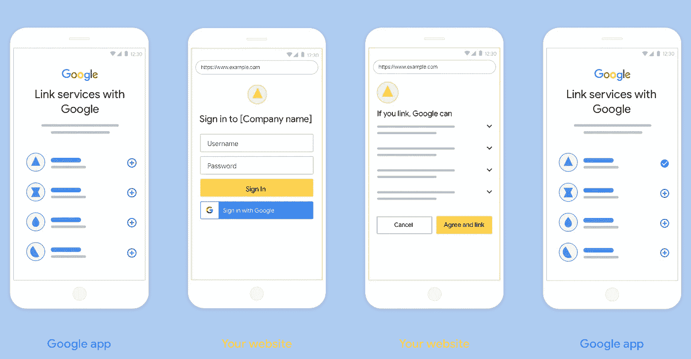
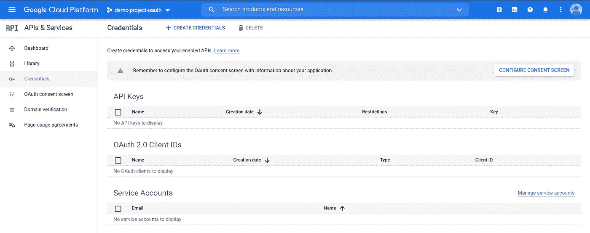
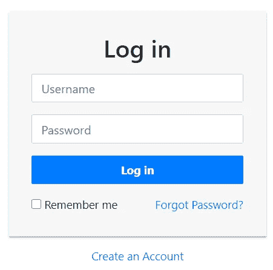
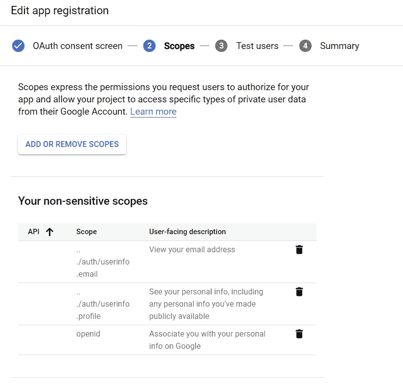
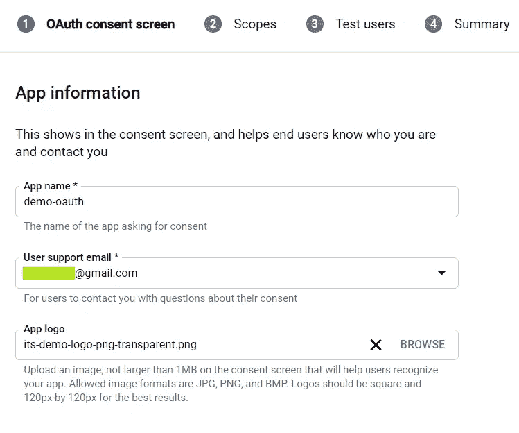
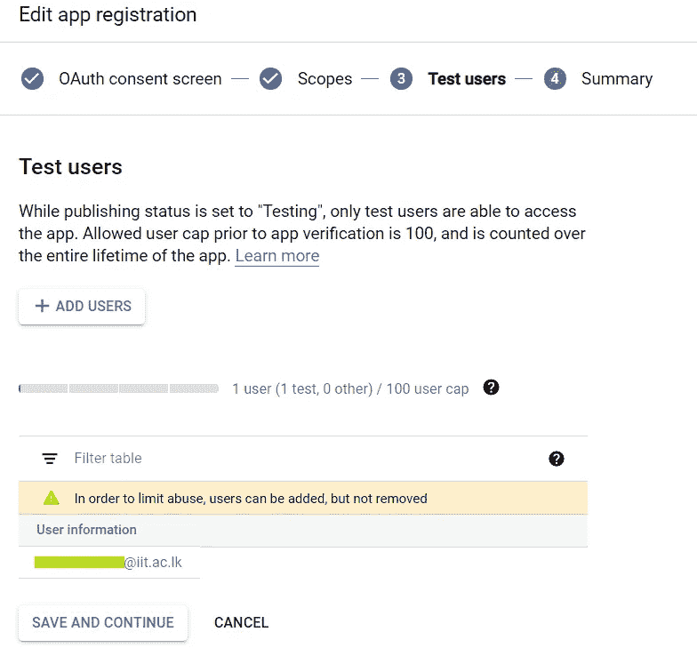
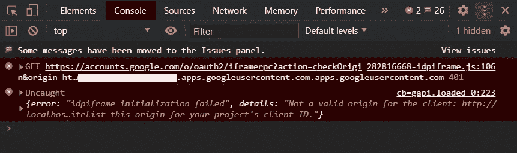
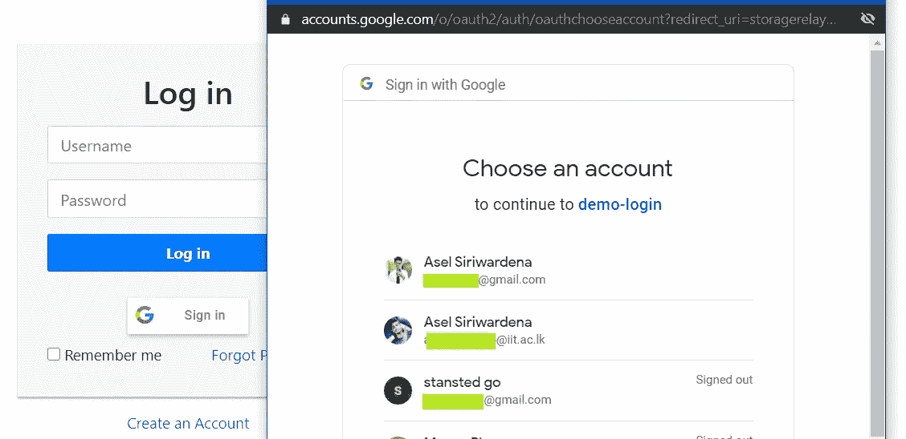
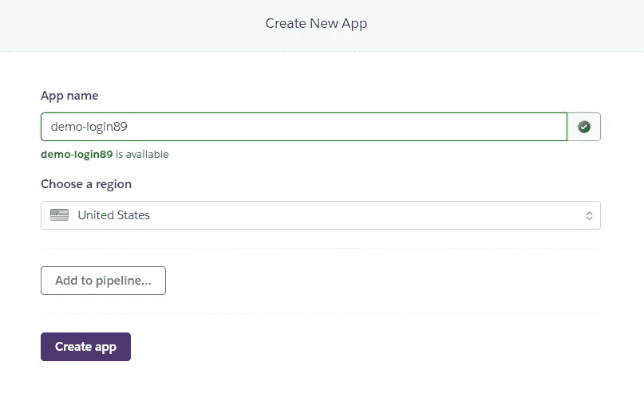
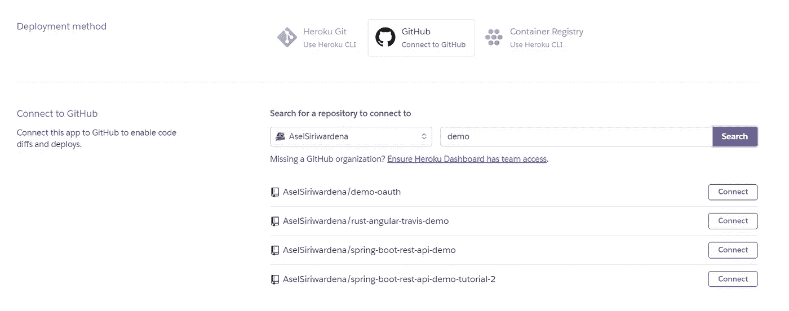

# 使用 Google OAuth 2.0、JavaScript 和 Heroku 创建一个简单的登录应用程序

> 原文：<https://betterprogramming.pub/create-a-simple-login-application-using-google-oauth-2-0-javascript-and-heroku-b1e56ad4604>

## 让我们将应用程序托管在 Heroku 服务器上



图片来自[谷歌开发者](https://developers.google.cn/identity/account-linking/oauth-with-sign-in-linking?hl=zh-cn)。

在本文中，我将向您展示如何将 Google sign-in 添加到您的 JavaScript web 应用程序中。这些代码片段将对您的纯 JavaScript/jQuery/Node.js 应用程序有效。

首先，您需要创建一个简单的登录，它将提供使用用户名和密码手动登录的功能。然后你需要建立一个谷歌开发者账户，并使用[凭证](https://console.developers.google.com/apis/credentials)页面创建应用 OAuth 密钥。

1.  进入[证件页面](https://console.developers.google.com/apis/credentials?authuser=9)。
2.  如果您还没有任何项目，请创建一个新项目。之后，你需要给出一些关于你的项目的细节。如果您使用的是组织开发人员帐户，请始终选择“内部”作为用户类型。那对你来说会容易些。



谷歌开发者控制台

您必须在整合了 Google 登录的网页上包含 Google 平台库。

为了演示，我将使用[教程 Republic](https://www.tutorialrepublic.com/codelab.php?topic=bootstrap&file=simple-login-form) 上的一个示例登录页面:



登录页面来自[教程共和国](https://www.tutorialrepublic.com/codelab.php?topic=bootstrap&file=simple-login-form)。

现在，我将在经典登录按钮下添加一个 Google OAuth 登录按钮。

# 1.创建 OAuth 客户端 ID

在我们开始之前，从开发人员控制台启用分析 API 。否则，它将抛出一个关于 JavaScript 起源的错误。



应用程序注册

现在，我将添加一些非敏感范围。稍后将在注册和登录过程中使用它们。可以使用电子邮件、个人资料图片或加密的个人资料 ID 作为密码(这可能不是最好的处理方式)。



应用程序信息页面

在应用程序信息配置中，您需要给出应用程序徽标的良好形象。它将在登录表单中使用。

在最后一步中，您需要添加用于测试的帐户。如果您使用的是组织帐户(大学帐户、公司帐户)，您可以选择组织。



添加测试用户

要将 Google OAuth 登录按钮添加到您的应用程序，您需要首先获得一个 OAuth 登录 ID。稍后将在您的代码中使用它。对于测试，您需要添加 [http://localhost](http://localhost) 作为授权源之一。对于 Heroku，您需要添加一个已部署的 Heroku URL。

# 2.添加 Google 登录按钮

在您的代码中，您需要添加 Google 平台库来使用 Google OAuth 函数，并用来自[凭证](https://console.developers.google.com/apis/credentials)页面的客户端 ID 替换`YOUR_CLIENT_ID`:

然后，您需要将 Google 按钮添加到应用程序的登录页面:

如果你得到一个类似下面的错误，检查你是否已经启用了分析 API。这不是因为 JavaScript 起源中的错误配置。

```
details: “Not a valid origin for the client: [http://localhost](http://localhost) has not been whitelisted for client ID YOUR_CLIENT_ID.apps.googleusercontent.com. Please go to [https://console.developers.google.com/](https://console.developers.google.com/) and whitelist this origin for your project’s client ID.” 
error: “idpiframe_initialization_failed”
```



Chrome 开发工具控制台

如果你已经到了这个阶段，那就说明你已经成功添加了一个登录按钮。然后我们需要处理登录。



应用程序登录

# 3.处理登录

对于登录，我将获取用户的电子邮件并在会话中设置它:

# 4.处理注册

您也可以使用 Google 登录来创建用户帐户。下面这个简单的 PHP 脚本是为了在注册过程中为每个新用户创建一个新的 JSON 文件而编写的:

下面的 PHP 函数将用于创建存储用户相关数据的 JSON 文件:

# 5.在 Heroku 中部署您的应用

Heroku 只托管和支持应用程序，而不是静态页面。因此，为了将我们的静态 HTML 页面部署到 Heroku，我们需要欺骗 Heroku，使其认为我们的网站是一个 PHP 应用程序。

我们将添加一个动态 PHP 文件，从这个 PHP 文件中，我们将调用其他静态 HTML 文件。我们必须创建一个`composer.json`,因为 Heroku 需要它来托管 PHP 应用程序。下面的命令将为您创建`composer.js`和`index.php`文件。我们将使用一个名为`include_once`的简单 PHP 命令从`index.php`重定向到我们的 HTML 文件。

*注意:如果使用的是 Windows，* `*cmd*` *将无法执行这些命令，但是 Powershell 可以。*

```
echo {} > composer.json
echo '<?php include_once("login.html"); ?>' > index.php
```

接下来，我们需要将您的页面推送到 Git 远程服务器，以便 Heroku 可以从 Git 更改中进行部署:

```
git init
git add *
git commit -m "my google Login page"
git branch -M main
git remote add origin <YOUR_REPO>.git
git push -u origin main
```

现在，您需要在 Heroku 中创建一个新的应用程序:



在 Heroku 中创建新的应用程序页面

然后，您可以在部署页面上选择要部署的存储库:



连接到 GitHub repo

将 GitHub repo 连接到 Heroku 应用程序后，您可以启用自动部署来为您的每次推送部署该应用程序的新版本。或者，您也可以手动部署。

感谢阅读。相信这个简短的教程会有所帮助。工作代码示例可以在 [GitHub](https://github.com/AselSiriwardena/demo-oauth) 上找到。