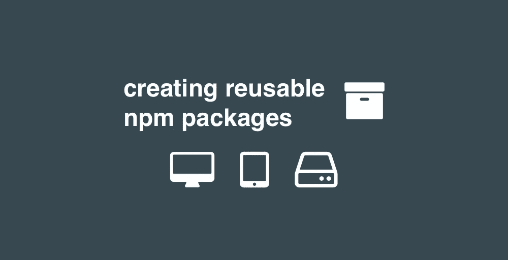

# 创建一个简单的 npm 库，以便在浏览器内外使用

> 原文：<https://betterprogramming.pub/create-a-simple-npm-library-to-use-in-and-out-of-the-browser-700f207eb73>

## 共享一些可重用的 JavaScript 很难——如果您试图在 node 和浏览器之间共享它，就更难了



共享一些可重用的 JavaScript 很难——如果试图在 node 和浏览器之间共享，就更难了。我想做的只是分享 10 行代码——为什么要花一天多的时间来弄清楚呢？在这种时候，我不得不说服自己不要复制/粘贴。我知道这是错误的，可重复使用的包装更好，但以什么为代价？

*   有些 JavaScript 代码可以在浏览器中运行，有些只能在服务器端运行。
*   es6！= es2016，es5！= 2015，esNext/es8，(*这个多久换一次？！我发现这个解释很有帮助。*
*   Webpack？巴贝尔？我没想到我会为了分享一些代码而不得不处理这些！

*为什么我需要 147 MB 的 node_modules 来共享 10 行代码？*

在最近的工作中，我试图将 20 多行 javascript 代码提取到一个可重用的 npm 库中，以便在几个项目之间共享。我以为这很简单明了。当我发现事实并非如此时，我开始整理这篇文章来帮助指导人们如何构建一个可重用的 npm 包。

在本指南中，我将创建一个 react 应用程序，加载狗、猫和山羊的随机图像——这只是我在[public-API](https://github.com/public-apis/public-apis)上找到的三个随机图像。然后我会将这些代码转换成一个可重用的 npm 包，它可以在浏览器和节点中与 webpack、Babel 和 TypeScript 一起使用。

我还在这里加入了[intrinciate cloud/reusable-js-demo repo](https://github.com/intricatecloud/reusable-js-demo)，这样你就可以看看这个项目了。最好的跟进方式是[查看每个提交](https://github.com/intricatecloud/reusable-js-demo/commits/master)以查看我所做的每个更改(它们也在每个部分之后被链接)。为了简洁起见，我编辑了其中的一些内容。

# 构建随机动物演示

## 第一步。创建应用程序并运行它

```
$ npx create-react-app random-animal-demo
$ cd random-animal-demo
$ npm start
```

查看[完全提交 582d2b](https://github.com/intricatecloud/reusable-js-demo/commit/582d2b1c7a3aafdc678f91a70e9f4de025765c84) 。

## 步骤 2:将它连接到一些 API

在应用程序中，我将显示一只狗、一只猫和一只山羊的图片。我将调整 React 演示应用程序中的一些样板文件。我采用了默认的 React 内容，并对其进行了重构，以显示一个图像和一些文本。现在我将集成这些免费的 API，使用`axios`来发出请求(它在浏览器和 node 中都有效)。

我们将使用以下 API，这些 API 允许我们从浏览器中调用它们:

*   [https://aws.random.cat/meow](https://aws.random.cat/meow)
*   [https://random.dog/woof.json](https://random.dog/woof.json)
*   [http://placegoat.com/200](http://placegoat.com/200)

您会注意到每个 API 的工作方式略有不同。cat API 返回一个带有 file 属性的 JSON 对象，dog API 返回一个带有 URL 属性的 JSON 对象，goat API 返回图像本身。我给`componentDidMount()`添加了一些逻辑，让它在计时器上运行，这样它每隔几秒就循环一次

查看[完全提交 3dd98c5](https://github.com/intricatecloud/reusable-js-demo/commit/3dd98c59542c0cb083802db871fdf66a1d8c10e0) 。

## 步骤 3:选择导入文件的方式

一旦您想要将逻辑提取到另一个文件中，您必须决定如何导入它。有几个选项:

**ES6 导入—如果你想使用**

`animal-api.js`

```
export default {
  getDog: () => ...
  getCat: () => ...
  getGoat: () => ....
}
```

**ES6 析构导入——如果你想使用**

`animal-api.js`

```
export const getCat = () => ...
export const getDog = () => ...
export const getGoat = () => ...
```

**CommonJS——如果要用**

`animal-api.js`

```
module.exports = {
  getDog, getCat, getGoat
}
```

你什么时候会选择一个而不是另一个？

如果你的应用只需要在浏览器中工作，并且只在 React(或 Angular2+或使用 ES6 模块的环境)的上下文中工作，那么 ES6 导入就可以了。

如果你的库是要在浏览器中使用的，你需要把它包含在一个普通的 JS HTML 应用程序中，你需要使用一个捆绑器，比如 webpack，把你的应用程序捆绑成一个库。

如果您使用 webpack 并利用代码分割和树抖动，您可以使用 ES6 析构导入。这意味着，你可以只包含你想要的功能，而不是在你的应用中包含所有的 lodash，这样你就会有一个更小的内置应用。

如果您正在编写一个需要在浏览器*和节点*中运行的应用程序或库，那么您将需要生成几个不同版本的库——一个用于浏览器(作为脚本标签)，一个作为 es6 模块，一个用于节点。

对于本指南，我们将编写一个 ES6 模块，因此我们可以使用`import AnimalApi from 'animal-api'`作为目标。

你真的会把这些拿出来放入 lib 吗？大概不会。但这是一个例子，说明看起来如此简单的事情可以变得多么复杂。所以请容忍我。

我可以修改我的`App.js`文件来使用这个新文件:

`src/animal-api.js`

查看[完全提交 37c3a3a](https://github.com/intricatecloud/reusable-js-demo/commit/37c3a3ab56c7f23db43d0b34bffdfc1b911b9f44)

接下来，我们将把这个逻辑移到它自己的 npm 包中。

# 如何打包您的库以供使用

## 在本地创建新的 npm 库

在 React 项目之外为我们正在创建的 npm 包创建一个新文件夹:

```
$ mkdir animal-api
$ cd animal-api
$ npm init
```

您可以使用 npm `init`命令的所有默认设置，它会创建一个`package.json`文件，如下所示:

然后我们将`random-animal-demo`中的所有代码复制粘贴到`animal-api/index.js`中，准备与`import AnimalApi from 'animal-api'`一起使用。

因为这是一个库，我们想添加一些测试来使它工作。我喜欢用 jest，所以我们把它拉进来:`npm install --save-dev jest`

然后我们创建`animal-api/spec/index.spec.js`:

查看[完全提交 6d797c](https://github.com/intricatecloud/reusable-js-demo/commit/6d797c27855dde59161c699b0a3c24885dd53a43)

现在运行`jest`:

我认为这是最简单的部分，但是显然`jest`不喜欢使用`import`语句。

目前，只有一个`index.js`文件和 jest，它将运行在一个`node.js`环境中，在那里`import`还不被支持。(本演练使用节点 10)。

这就是`babel`发挥作用的地方。`babel`将从`node.js`支持的 ES6(你可以使用`import`)和 ES5 中转换(“翻译/编译”)你的 js 文件。Jest 在这里有一个关于启用[巴别塔支持的章节](https://jestjs.io/docs/en/getting-started#using-babel)。我们将不得不安装更多的软件包和一些配置。

运行`npm install --save-dev babel-jest @babel/core @babel/preset-env`然后添加`babel.config.js`。

`babel.config.js`:

然后，当您运行`jest`时，您会看到下一个错误:

进步！它知道如何读取`import`语句并运行测试。现在我少了一个依赖:`axios`。运行`npm install --save axios`并重新运行`jest`——一切都是绿色的！

查看[完全提交 fafc23a](https://github.com/intricatecloud/reusable-js-demo/commit/fafc23a29290be2a13e9fae71810d6178cf9d451) 。

接下来，我们将经历一些将这个包包含在另一个项目中的场景

## 场景 1:一个只需要在浏览器中工作的库，并且你正在使用 React/Angular2+ (ES6 模块)

我现在处于一个很好的位置，可以尝试在我的 React 应用程序中包含这个库。我不会公开发布 npm 包，而是从我机器上的文件夹中“安装”它。我将切换回我的 react 应用程序并运行`npm install ../animal-api`。

`package.json`现在看起来是这样的:

我可以尝试从 React 应用程序中使用它。第回`App.js`:

查看[完全提交 a802898](https://github.com/intricatecloud/reusable-js-demo/commit/a80289849ed9845286372e72db87192cb4aa2a44) 。

一切正常！太棒了，我现在有了一个可发布的包。巧合的是，已经有一个`animal-api`发布到 npm，所以我不会再添加一个了。如果你需要做的只是分享一些将要在 React/Angular 框架中使用的代码(在这里你可以使用`import`)，那么你可以就此打住。继续你的生活，感激你不需要阅读场景 2…

## 场景 2:在带有脚本标签的浏览器中使用库

这是我们想要创建一个文件作为脚本标签的地方。

在您的`animal-api`目录中，创建`index.html`，使用`npx http-server`运行本地 web 服务器，并访问`[http://localhost:8080](http://localhost:8080:)` [:](http://localhost:8080:)

`index.html`:

查看[完全提交 df79f05](https://github.com/intricatecloud/reusable-js-demo/commit/df79f052f82ecfacb266824d61eabdd570c790f9) 。

这是我遇到的第一个错误:

这意味着浏览器不能运行你的文件，因为它包含了导入语句。之前，我们使用了`babel`，所以`jest`可以使用`import`关键字。我们必须在这里做一些类似的事情。唯一的区别是我们需要保存 transpiled 输出，这样我们就可以将它包含在浏览器中。因为我们在`animal-api`中已经有了`babel`作为依赖项，我们可以用它来转换成 UMD 模块:

`npm install --save-dev @babel/plugin-transform-modules-umd @babel/core @babel/cli`

然后我们运行`babel index.js -d lib`，这将创建一个`lib/index.js`文件，可以在您的浏览器中作为脚本标签使用。现在，我可以更新我的脚本标记，以指向另一个文件。

当我刷新页面时，一个错误消失了，另一个留下了。

```
index.html:11 Uncaught ReferenceError: AnimalApi is not defined
    at index.html:11
```

我们还没有配置创建 UMD 模块的巴别塔插件来使用我们想要的名字。因为我们的文件被命名为`index.js`，我们将把`babel.config.js`更新为:

重新运行`babel index.js -d lib`并刷新页面。

现在我得到一个新的错误！进步！

```
TypeError: AnimalApi.getDog is not a function
    at index.html:8
```

这个让人挠头。不管 Babel 对这个文件做了什么，我都无法访问我的函数了。让我们看看 transpiled 文件— `lib/index.js` —是什么样子的。在这个文件中，我注意到两件事:

这表明在我的`AnimalApi`全局对象上有一个`.default`属性。这是一个小细节，当你使用`import axios from 'axios'`语法时通常是看不见的。ES6 包将提供默认导出，当您使用`import`语句时，它知道为您查看`.default`属性，因此您不需要编写它。

让我们更新我们的代码来匹配它:

现在，当我们刷新浏览器时，我们得到下一个错误:

```
index.js:36 Uncaught TypeError: Cannot read property 'get' of undefined
    at Object.getDog (index.js:36)
    at index.html:8
```

查看[完全提交 5da97d8](https://github.com/intricatecloud/reusable-js-demo/commit/5da97d81bda90d5e8d2e16415bfc7c5bf12b28f3) 。

这是调用`axios.get`失败，因为`axios`未定义。我们所做的只是传输了`index.js`文件。这里没有`axios`的代码，浏览器不知道它应该在你的`node_modules`目录中搜索它(也不能)。

我们需要做的是创建一个 JavaScript 文件，其中内置了该库的所有依赖项，这样您只需要向您的站点添加一个脚本标签。巴别塔处理不了你的依赖，它只会翻译。

我们现在需要介绍我们的第二个工具:webpack！

我们将使用 webpack 来查看我们的文件，所有导入和需要的内容都将打包到一个文件中:`npm install --save-dev webpack webpack-cli`

将以下内容添加到`webpack.config.js`:

这个配置将查看`./index.js`并创建`./lib/animal-api.js`，这将使用`var`目标使变量`AnimalApi`在 JavaScript 中可用。

现在运行`webpack`,你会注意到`lib/animal-api.js`变大了很多，有更多的胡言乱语。

回到您的`index.html`并更新脚本标签:

查看[完全提交 8f865c5](https://github.com/intricatecloud/reusable-js-demo/commit/8f865c50ee9184e6fdd316076d41f1450cecd3b0) 。

刷新页面。成功！数据显示出来了！如果这就是你所需要的，那么很好——你可以就此打住。否则，请继续阅读。

## 场景 3:在浏览器和节点中使用库

我将创建一个普通的 JavaScript 文件，用 node: `node node-test.js`运行

`node-test.js`:

我得到这个错误:

```
/Users/dperez/workspace/animal-api/index.js:1
(function (exports, require, module, __filename, __dirname) { import axios from 'axios';                                                                     ^^^^^ SyntaxError: Unexpected identifier
```

在使用 Babel 之前，当我们试图用`jest`运行我们的`index.spec.js`文件时，我们看到了这一点。我们试图导入一个带有`require`的 ES6 模块，但这不会起作用，因为`import`是 ES6 的一部分，而节点运行在 ES5 上(至少对于节点 10 是这样)。我们在场景 1 中使用 Babel 构建了一个`lib/index.js`，它包含一个 ES5 模块(从 ES6 转换而来)。让我们用那个来代替。

我现在得到这个错误:

我们之前在浏览器中看到了这一点，并看到我们需要添加`AnimalApi.default.getCat()`，因为 babel 将你的 ES6 模块转换成 UMD 模块的方式。一旦我们更新它:

```
☁  animal-api [master] ⚡ node node-test.js
{ logo: 'https://purr.objects-us-east-1.dream.io/i/v0SoPzk.jpg',  text: 'CAT' }
```

查看一下[完全提交 3cdea87](https://github.com/intricatecloud/reusable-js-demo/commit/3cdea8737f6db1593e48678f2f0e5e61a1198aa2) 。

成功！为了使用`node.js`中的库，我们可以使用由 Babel 创建的 ES5 模块`lib/index.js`。

## 场景 4:您希望在您的库中使用 Typescript，但是仍然像平常一样将其包含在 React/node 项目中

如果您喜欢使用 TypeScript 并且更愿意使用 TypeScript 创建您的库，但是仍然在其他非 TypeScript 项目中使用它，该怎么办？别担心，有一个简单的解决办法。

我将添加一个包含库的`index.ts`文件，只使用 TypeScript。这是它与我们的`index.js`文件相比的样子。我们加了一个`interface`，加了一个函数签名:

如果我们尝试通过添加以下内容直接从 react 运行这个`.ts`文件:

`App.js`

当我们刷新应用程序时，我们看到以下错误:

问题是 React 不知道怎么处理你的`.ts`文件。现在您需要将您的`index.ts`文件转换成 React 可以读取的东西 ES6 模块或 ES5 模块。

TypeScript 能够在没有 Babel 帮助的情况下做到这一点。我们可以将我们的文件编译成 ES5 模块，然后我们可以`import`或`require`。首先安装 typescript: `npm install --save-dev typescript`。

添加一个`tsconfig.js`来配置您的 TypeScript 编译器。

当我们运行`tsc`时，我们得到`dist/index.js`和我们可以从 React 项目或`node-test.js`文件中包含的文件。

`index.html`:

查看[完全提交 2625124](https://github.com/intricatecloud/reusable-js-demo/commit/26251248f2e6a4de43eb853db7ddb10203153dbb) 。

现在，当你刷新你的页面时，成功了！

## 场景 5:您希望使用 Typescript 构建一个作为脚本标记包含的库

当我们想要使用脚本标签包含一个库或项目时，我们需要使用捆绑器来确保我们的项目的依赖项包含在我们的库中。早些时候，我们使用 webpack 来做到这一点。没有太多的麻烦，我们能够产生一个可以作为`<script src="./lib/animal-api.js">`包含的 JavaScript 包。

我们将更新`webpack.config.js`来添加一个可以读取你的脚本文件并对其进行处理的脚本加载器。我们还是会用 webpack 来捆绑它。

运行`npm install --save-dev ts-loader`安装加载程序，然后更新 webpack 配置。

`webpack.config.js`:

这就是我们要添加到我们的 webpack 配置中以构建和捆绑这个项目所要做的一切。一旦你运行了`webpack`，你将得到一个新的文件`./lib/animal-api.js`。回到你的测试`index.html`文件来测试它。就是这样！

检查最后一次[完全提交 cc18f80](https://github.com/intricatecloud/reusable-js-demo/commit/cc18f80383093e00451b990bebd9dfdcce1e08b8) 。

有几件事需要注意。我们简单的库有多个需要维护的入口点。

*   如果你可以使用`import AnimalApi from 'animal-api'`消费 ES6 模块，那么这将依赖于你的`./index.js`文件。
*   如果你想在浏览器中使用你的 ES6 模块，你需要使用`./lib/animal-api.js`文件，这将使`AnimalApi`通过 Babel 插件全球可用，并通过 webpack 捆绑所有的依赖项。
*   如果你想在 node 中使用你的 ES6 模块，那么你需要使用`./lib/index.js`，我们用 babel 构建的 UMD 模块。
*   如果你想从另一个 TypeScript 项目中使用你的 TypeScript 文件，你需要使用`./lib/index.ts`。
*   如果您想在 node.js 环境中使用您的 TypeScript 文件，您必须使用`tsc`将其编译成一个 ES5 模块，然后您可以重用它。
*   如果您想在`<script src="mylib.js">`中使用您的类型脚本文件，您需要使用`webpack`和`ts-loader`来编译您的类型脚本，捆绑所有的依赖项，并生成一个 UMD 包。

您的源文件和构建文件都可以随您的 npm 包一起分发，让用户选择他们需要的文件。但是它确实需要您在适当的位置放置大量的工具来创造这种便利。

# 包扎

请记住，您可以通过查看这里的 repo 来逐个提交。

感谢您的阅读。我希望这有助于您理解不同模块类型之间的区别，以及如何从我们的应用程序中提取一个我们可以在浏览器内外使用的库。

如果你对 react 的更多内容感兴趣，请查看我的深入指南[将谷歌登录添加到 React 应用](https://www.intricatecloud.io/2019/08/adding-google-sign-in-to-your-webapp-a-react-example/)，或者我的指南[使用 S3 + Cloudfront 和 terraform 部署静态网站](https://www.intricatecloud.io/2018/04/creating-your-serverless-website-in-terraform-part-2/)。