# 使用 GCP 云功能创建一个用于比特币价格更新的 Slack Bot

> 原文：<https://betterprogramming.pub/create-a-slack-bot-for-bitcoin-price-updates-using-gcp-cloud-functions-a672fc34287c>

## 在不到 15 分钟的时间内构建您自己的机器人


由 [Austin Distel](https://unsplash.com/@austindistel?utm_source=medium&utm_medium=referral) 在 [Unsplash](https://unsplash.com?utm_source=medium&utm_medium=referral) 拍摄

让我们创建一个 Slack bot，它将使用云函数告诉您当前的加密值，这是一种在云上部署您的函数和运行代码的无服务器方式。

# A.在新的松弛工作区中创建机器人

## 步骤 1:创建或登录时差

[创建/登录到不同的 slack 工作区](https://slack.com/signin#/signin)，在这里我们将创建我们的 bot 并为它选择一个工作区名称。

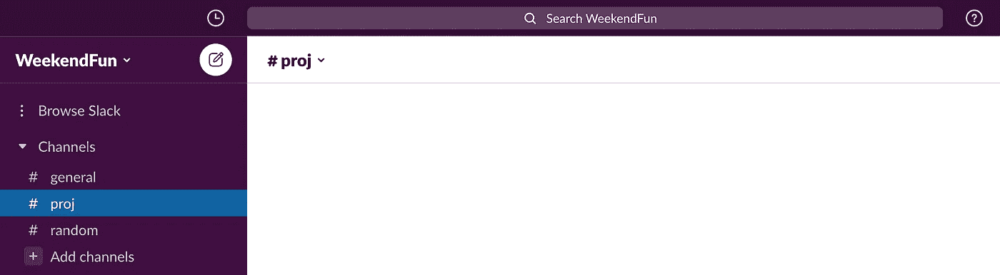

您现在已登录到新的工作区！

## 第二步:创建一个 Slack 应用程序

让我们来看看松弛的 API[https://api.slack.com/apps](https://api.slack.com/apps?new_app=1)

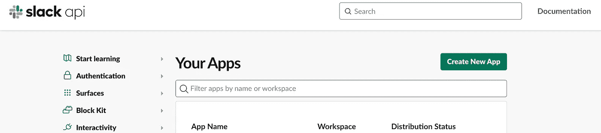

作者截图

转到*创建新应用，*选择*从头创建*并给它命名。

## 步骤 3:添加 Bot 权限

转到 OAuth & Permissions 选项卡，向下滚动到 Scopes。

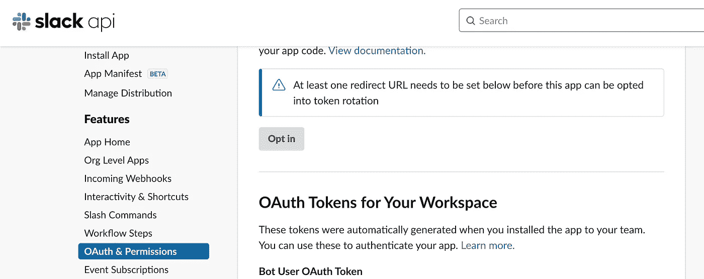

作者截图

现在添加你的机器人需要访问的所有权限。仔细阅读你提供给机器人访问的所有作用域的描述。

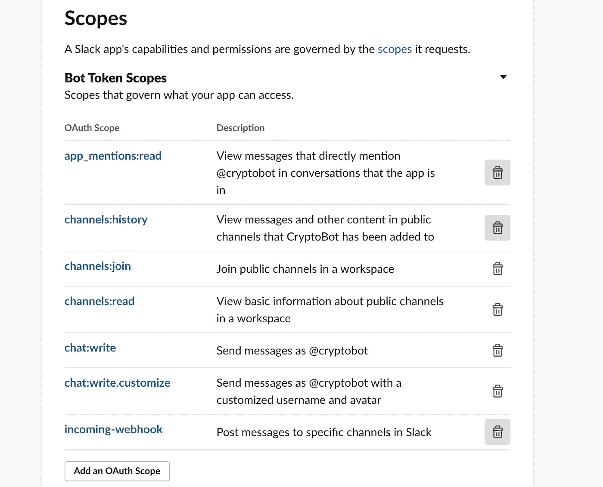

作者截图

## 步骤 4:启用事件订阅

在左侧，转到事件订阅并启用事件。

现在，从 Subscribe to Bot Events 中选择我们想要订阅的所有事件。事件订阅将确保 slack 在事件发生时向提供的链接发送事件。

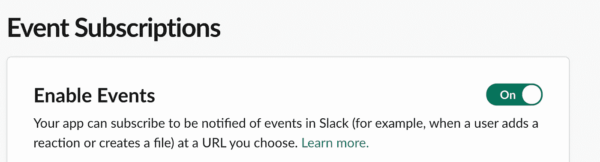

作者截图

现在停在这里。我们现在需要保持链接为空。

Slack 通过发送带有挑战参数的请求来授权我们提供的链接，应用程序必须用挑战参数来响应。

# B.利用 GCP 云功能

如果您已经习惯使用 gcloud CLI，您可以在本地 IDE 中编写代码，并从`gcloud functions deploy`命令部署它。

或者，您可以转到云控制台，创建一个内嵌的模板化云函数。无论哪种方式，代码的结构都是一样的。现在让我们使用内联模板化的方法。

## 第一步:登录或注册 GCP

[使用信用卡或借记卡登录或注册](https://console.cloud.google.com/)Google cloud console 进行免费试用。创建一个项目，并为该项目启用开单。转到云功能并启用 API，同时启用云构建和部署。

## 步骤 2:创建一个云函数

现在，只需点击谷歌云功能控制台上的创建云功能。

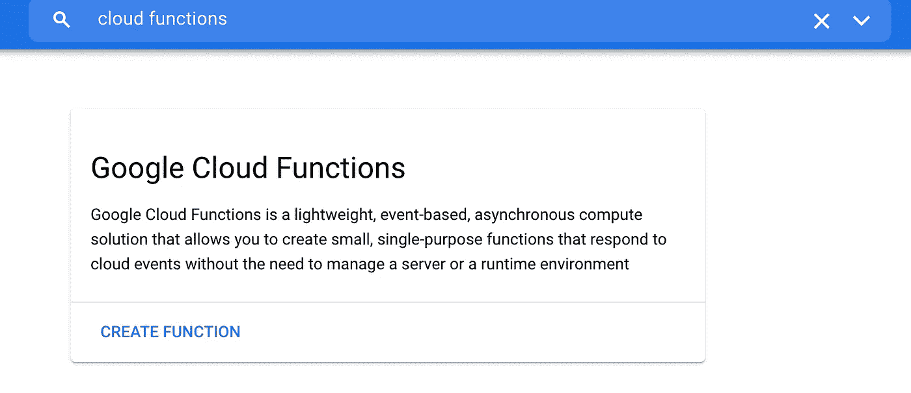

作者截图

在 trigger 中，选择 allow un authenticated invocations 并点击 save 和 next。

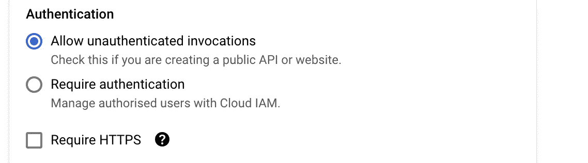

作者截图

## 步骤 3:从行内编辑器中修改源代码

选择你觉得合适的运行时，我们将暂时使用 Go 1.13 运行时。

因为 Slack 将使用一个带有挑战参数的请求来调用触发器 URL，所以我们将首先获取请求，将请求体解码成一个 map，并写回挑战参数。

在内联代码模板中，用下面的实现替换现有的 HelloWorld 实现。

现在只需部署该功能。转到函数名，函数的触发器 URL 是您需要添加到 slack 的事件和订阅中的请求 URL。

*Edit:在部署之前，一定要从代码中删除“io”和“html”导入，否则 Go 可能会抛出未使用的导入错误。

如果应用程序能够成功地使用质询参数进行响应，请求 URL 应该会获得批准。这基本上意味着 slack 向您的 URL 发送了一些请求，您需要用 challenge 参数进行响应，而您做到了！

确保您需要订阅的 bot 事件都被选中。如果没有，则添加并保存它们。

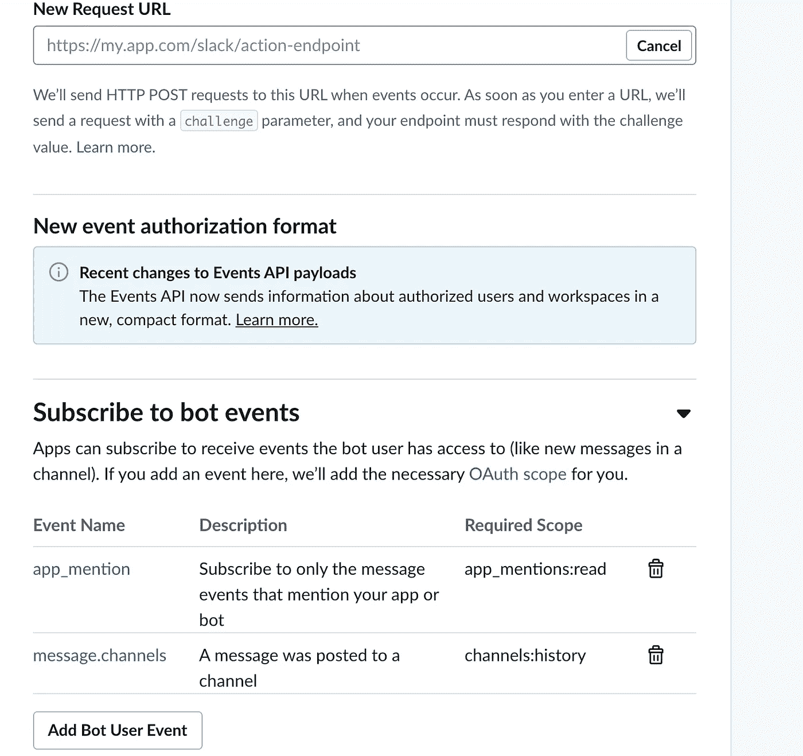

作者截图

# C.将 Slack bot 安装到工作区，并将 bot 添加到 Slack 通道

在 Slack API 中，转到应用程序的基本信息，并将应用程序安装到新创建的工作区。

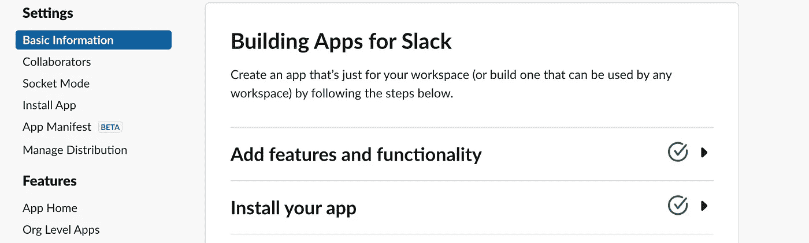

作者截图

在将应用程序安装到工作空间时，您应该能够在 OAuth & Permissions 中看到一个令牌。


作者截图

在 slack 上，转到您希望 slack 机器人能够访问的通道，并邀请机器人进入该通道。参考下图添加机器人到一个频道。或者，你可以在频道上输入/邀请，它会给你以下选项。

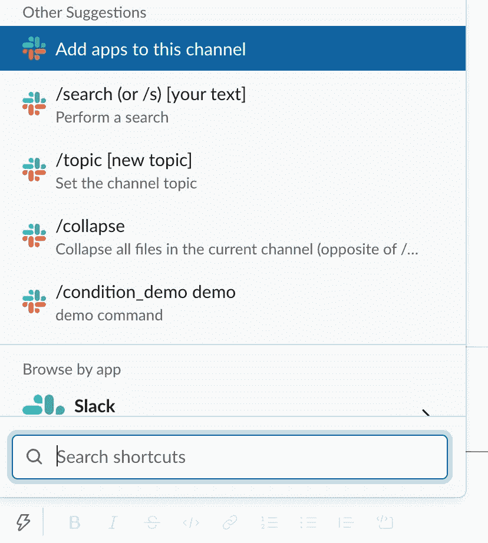

作者截图

# D.向 Slack 发布消息

现在，应用程序已经添加到一个频道，您可以尝试从终端发出 curl 请求，以检查机器人是否已添加。

## 步骤 1:检查松弛的现有通道

使用 slack 令牌(在 OAuth & Permissions 选项卡中)向 slack 发出 curl 请求，作为 slack bot 的载体授权。

*编辑:试试下面的卷发

```
curl --location --request GET ‘[https://slack.com/api/conversations.list'](https://slack.com/api/conversations.list') \
 --header ‘Authorization: Bearer <token>’ \
 --data-raw ‘’
```

## 步骤 2:向 Slack 发出一个 curl 请求，发布一条定制消息

用 slack 令牌向 slack[https://slack.com/api/chat.postMessag](https://slack.com/api/chat.postMessag)e 发出 curl 请求，向 slack[发布消息](https://api.slack.com/messaging/sending#publishing)。从上面的响应中获取通道名称。

*编辑:试试下面的卷发

```
curl --location --request POST ‘[https://slack.com/api/chat.postMessage'](https://slack.com/api/chat.postMessage') \
 --header ‘Authorization: Bearer <token>’ \
 --header ‘Content-Type: application/json’ \
 --data-raw ‘{
“channel”: “<channel-name>”,
“text”: “Hello World :tada:”
}’
```

您应该能够看到 slack bot 发布到频道。


# E.将消息发布到时差，作为对消息事件的回复

既然您已经确保了 bot 令牌工作正常，并且您能够使用 curl 在频道上发布消息，那么是时候从我们创建的云功能应用程序中发布消息了。

## 步骤 1:分析事件回调请求

在添加了松弛 bot 的松弛通道上键入任何文本，然后按 enter 键。让我们检查云函数日志选项卡上的最后请求日志，并分析触发我们函数的 slack [事件](https://api.slack.com/events/message.channels)。

现在我们知道类型将是 event_callback，在事件内部，我们不应该有 bot_id，因为我们将由用户而不是 bot 来回复消息。ts 值本质上是消息的 ID，保证在通道或会话的上下文中是唯一的。

## 步骤 2:在响应编写器中不添加重试标头

Slack 重试发送到触发器 url 的事件回调，以防它没有立即获得 200 响应。为了防止这种情况，我们需要在我们的响应中设置 **X-Slack-No-Retry** 报头。

## 步骤 3:发送对时差消息的答复

我们需要编辑之前创建的云函数，并稍微调整一下源代码，以符合我们对用户消息事件触发器的条件检查。

1.  要检查事件回调是否来自用户:

2.现在让我们从发送给我们函数的事件中获取所有需要的值。

3.随后，让我们再次检查在 slack 上发布消息的 curl 请求。

正如我们前面所讨论的，ts 值本质上是消息的 ID，保证在通道或会话的上下文中是唯一的。我们将使用 ts 值来回复与触发我们应用程序的事件相同的消息。

4.不要忘记添加标题！

现在让我们把它们放在一起。

接收 slack 发送的回调事件并发送消息作为回复的云函数

在通道上发送任何消息后，您应该能够看到 slack bot 回复。

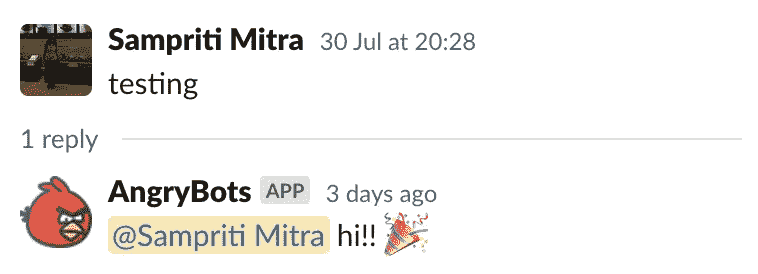

输出

酷，你创建了一个 slack 机器人来自动回复你在 slack 上的对话！有点孤独，但是很酷！

# f:集成 CoinGecko API

现在，我们需要将我们的云功能与来自 CoinGecko 或其他加密 API 的响应集成在一起。CoinGecko 是免费且易于使用的，所以我们就用它吧。

让我们看看我们将使用的 CoinGecko API

因此，我们看到这是一个简单的 GET 调用，我们可以用它来获取比特币的美元值。

coin gecko api 调用

我们可以通过将`respString`添加到我们的 slack 请求正文(`reqBody`)来发布`respString`，现在发布我们的 slack 线程。

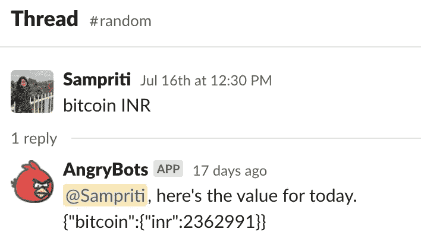

输出

酷！现在我们有了一个机器人，可以用当前的比特币价值来回复我们在 slack 上发布的任何消息。

我们可以对其进行定制，使其只响应调用机器人并在其中提到加密货币的消息。

尝试使用 CoinGecko API。它支持许多加密货币和转换货币。

你可以参考这个 GitHub [链接](https://github.com/Sampriti-Mitra/cloud-functions/blob/master/cloud_functions/slack_app.go)来获得完整的代码。

感谢阅读。下次见！