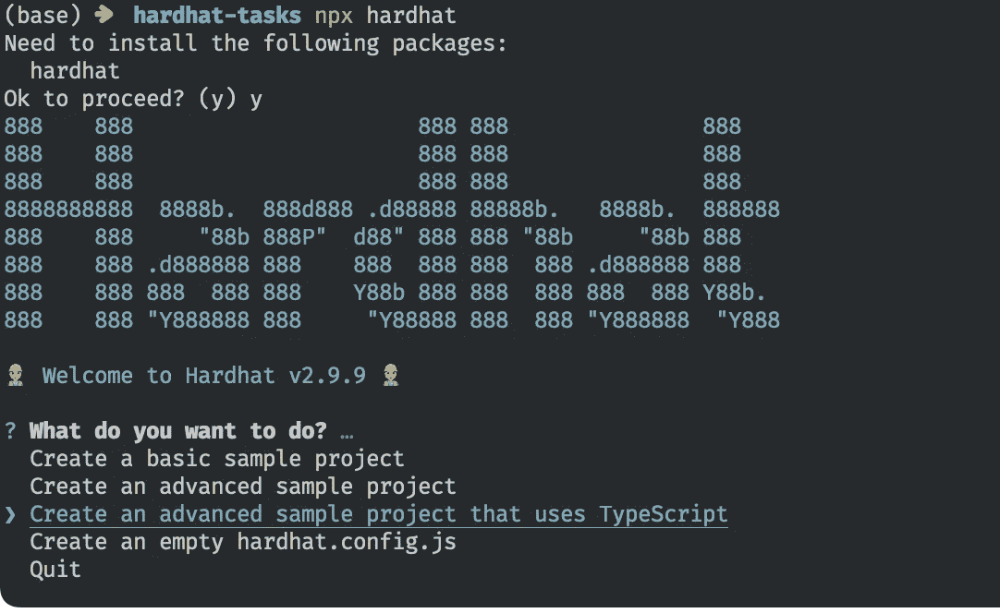
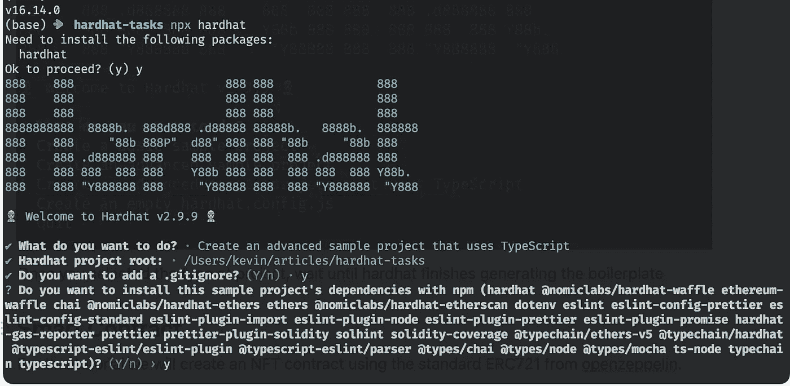
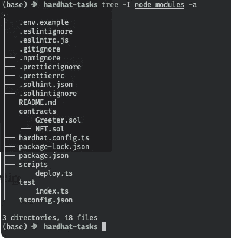
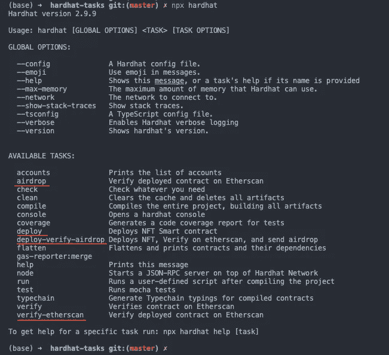
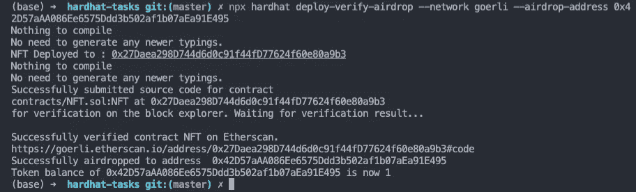

# 使用 Hardhat 任务创建智能合同开发工作流

> 原文：<https://betterprogramming.pub/create-a-smart-contract-developmentworkflow-using-hardhat-tasks-e5d80d819cea>

## 如何自动化智能合约部署脚本

照片由 [Ricardo Gomez Angel](https://unsplash.com/es/@rgaleriacom?utm_source=unsplash&utm_medium=referral&utm_content=creditCopyText) 在 [Unsplash](https://unsplash.com/s/photos/hardhat?utm_source=unsplash&utm_medium=referral&utm_content=creditCopyText) 拍摄

除了测试和部署之外，智能合约开发还可能涉及其他任务。也许您想在部署后立即与契约进行交互，或者更新文件中已部署契约地址的列表。

通常，您为每个任务编写脚本并单独运行它们，这很好，但是当您每次都必须运行多个脚本时，这就变得很乏味了。

安全帽任务是将自动化添加到智能合同开发工作流的一种方式。它提供了一种更加结构化的方式来创建脚本。它还允许将多个脚本合并成一个。Hardhat 任务还使解析参数变得更容易，因为它提供了参数类型验证。

在本文中，您将使用 hardhat 任务创建一个工作流。您将创建一个 NFT 智能合同并将其部署到 Goerli 测试网，在 Etherscan 上验证地址，并空投一些令牌。

# 设置安全帽项目

本教程将使用节点 js 版本 16。如果你还没有 NodeJS，我推荐[安装节点版本管理器](https://github.com/nvm-sh/nvm) (nvm)。拥有 nvm 后，运行以下命令:

安装完节点后，创建项目目录。移动到该目录并运行`npx hardhat`来生成 hardhat 样板文件。

Hardhat 将提示您选择要使用的项目类型。在这种情况下，使用 TypeScript。

一旦选择了项目的类型，回答所有的提示，回答“y”来安装项目的依赖项，然后等待 hardhat 生成样板文件。

完成后，项目目录将如下所示:

# 环境变量和安全帽配置

将您的 contract deployer 私钥、Etherscan API 密钥和 Alchemy 密钥添加到`.env.example`文件中。在本教程中，您将使用 Goerli 以太坊测试网络。

添加密钥后，将`.env.example`重命名为`.env`。

如果您需要 eth 进行合同部署，您可以获得一些。对于 Etherscan API 密匙，可以在这里注册[。要获得你的炼金术钥匙，你可以在这里注册](https://etherscan.io/myapikey)。

您的 env 文件现在应该如下所示:

看一看`hardhat.config.ts`。这是一个文件，您可以在其中设置要使用的网络和私钥。配置文件从`.env`文件中读取必要的环境变量。

您需要在`config`变量的`networks`属性中设置 Goerli 网络配置。

# . eslintrc.js(可选)

将这些添加到`.eslintrc.js`文件中，以删除 VSCode 中的警告。这一步是可选的，因为项目在没有这些配置的情况下仍然可以运行。

# 智能合同

在本教程中，您将使用 Open Zeppelin 的标准 ERC721 创建一个 NFT 合约。要做到这一点，你必须安装开放齐柏林飞艇。

创建一个名为`NFT.sol`的新文件。我们的合同将继承 Open Zeppelin 的 ERC721 合同，以获得标准的 ERC721 功能。

# 任务

现在您已经准备好了智能合约，您将创建的第一个任务是部署任务。创建一个名为 tasks 的目录，创建一个名为`compile.ts`、`deploy.ts`和`index.ts`的文件。

# 部署任务

在`deploy.ts`中，创建要在目录`./tasks/deploy.ts`中编译的部署任务，并将我们的合同部署到测试网络。

在`./tasks.index.ts`中添加出口

然后将 tasks 目录添加到您的`tsconfig.json`文件中，使 TypeScript 包含 tasks 文件夹。

# 验证任务

现在创建验证任务，该任务将验证 Etherscan 上部署的契约。创建文件`./tasks/verify-etherscan.ts`。

该任务需要一个可以插入`contractAddress`的字符串参数。不要忘记在`./tasks/index.ts`中添加出口。

然后使用以下代码在`./tasks/index.ts`中添加导出:

# 空投任务

现在，对于最后一项任务，您将空投代币到几个钱包地址。使用以下代码创建文件`./tasks/airdrop.ts`:

在`./tasks/index.ts`中添加出口

# 组合任务

现在，对于最后一个任务，您将把您创建的所有任务合并成一个任务。让我们使用下面的代码创建`./tasks/deploy-verify-airdrop.ts`:

同样，不要忘记在`./tasks/index.ts`中添加出口

# 运行任务

现在您已经创建了任务，您可以通过运行`npx hardhat`来查看所有可用的任务。

现在让我们通过运行以下命令来运行`deploy-verify-airdrop`任务

我在这里使用我生成的一个钱包地址作为空投地址，你可以把它改成你喜欢的任何钱包地址。

从日志的输出中，您可以看到已部署的 NFT 合同地址、在 Etherscan 上看到的已部署合同的链接，以及到给定地址的成功空投。

# 摘要

恭喜您，您已经成功部署了智能合约，在 Etherscan 上验证了部署，并通过一个命令与它进行了交互。您编写的脚本保持小型和模块化。此外，可以使用`npx hardhat`模块轻松查看您创建的任务列表。

Hardhat 任务是最有用的工具之一，任何智能合约开发人员和您都应该利用它，因为它通过保持代码库更有组织性来提高您的生产力。