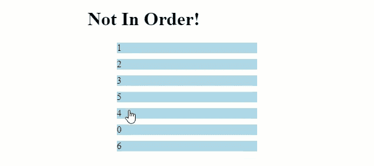
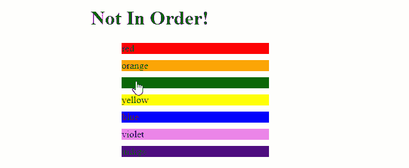

# 使用 JavaScript 制作一个可拖动项目的可排序列表

> 原文：<https://betterprogramming.pub/create-a-sortable-list-with-draggable-items-using-javascript-9ef38f96b258>

## 不需要框架


Ralph Blvmberg 在 [Unsplash](https://unsplash.com/s/photos/drag-racing?utm_source=unsplash&utm_medium=referral&utm_content=creditCopyText) 上拍摄的照片

一个关于栈溢出的问题引起了我的兴趣。它是关于创建一个可以确定项目顺序是否正确的列表。用户拖动项目来改变顺序，直到它是正确的。

在本文中，我将介绍如何用普通的 JavaScript、HTML 和 CSS 来实现这一点。首先，让我们初始化整个代码中需要的变量。

```
var list = document.getElementById('list')
var base, randomized, dragging, draggedOver;
var isRight = 'Not In Order!';
```

现在我们可以编写一个接受数组作为参数的函数。根据这个参数，我们将创建两个数组，`base`将提供数字应该处于的基本顺序，`randomized`将是无序的`base`，它将呈现为一个列表。`base`可以通过对传递的数组进行切片来创建，创建一个新的数组来防止`base`值被绑定到`randomized`。

我们可以根据生成的 0 到 1 之间的随机数是大于还是小于 0.5 来排序所提供的数组，从而随机化`randomized`的顺序。

```
randomized = a.sort(() => Math.random() - 0.5)
```

现在我们有了`base`和`randomized`数组，我们可以检查随机化过程是否错误地返回了相同的顺序。如果它返回相同的顺序，那么我们使用递归再次调用随机化。我们这样做，直到订单不再相同。

现在，我们可以开始使用一个函数来将项目实际呈现为一个列表。我们就叫它`renderItems`。

这是一个函数，它将最初呈现我们的列表，并在用户更改顺序时重新呈现。

首先，我们更新订单指示器的`innerText`以反映`isRight`的值。默认情况下，它被设置为`'Not In Order!'`，如果用户对列表进行了正确的排序，它将在以后被更新。`list.innerText = ''`意在清除列表——否则，每次用户改变顺序时，它只会将新创建的列表项添加到现有列表中。

接下来，我们遍历传递的数组`randomized`，并为数组中的每一项创建一个`li`标签。我们还将`draggable`的值设置为 true。这将允许我们使用鼠标拖动列表项。

接下来，我们为事件`drag`、`drop`和`dragover`添加事件监听器。这些事件允许我们利用 [HTML5 拖放 API](https://www.w3schools.com/html/html5_draganddrop.asp) 。在事件监听器之后，我们将`node`的`innerText`设置为`item`。最后，我们将`node`添加到`list`元素中。现在我们已经生成并呈现了我们的列表，让我们来分解我们将用来管理重新排序的函数。

第一个功能是`setDragging`。这个函数将设置`dragging`的值，它将代表当前被拖动的元素。

```
const setDragging = (e) =>{
  dragging = parseInt(e.target.innerText)
}
```

接下来，我们有`setDraggedOver`，它将为`draggedOver`设置值。`draggedOver`代表用户希望用`dragging`替换的列表项。

```
function setDraggedOver(e) {
  e.preventDefault();
  draggedOver = parseInt(e.target.innerText)
}
```

最后，我们有我们的`compare`函数。这实现了两件事。首先，它用`dragging`替换`draggedOver`并重新排序`randomized`。然后，它根据`randomized`和`base`的顺序是否相同来改变`isRight`的值。

我们可以得到`dragging`和`draggedOver`的索引，我们可以用它们来移动条目。这是通过使用`[splice](https://developer.mozilla.org/en-US/docs/Web/JavaScript/Reference/Global_Objects/Array/splice)`完成的。`splice`允许我们首先从随机列表中删除`dragging`，这样我们就不会生成重复的列表项。然后，我们使用`splice`将`dragging` 插入到列表中的索引`draggedOver`处。我们想要插入新的数字而不替换现有的数字(如果您想要用*替换该索引处的* 数字，您需要将`splice`中的第二个参数改为 1 而不是 0)。

一旦重新排序完成并且分配了`isRight`，我们就可以使用前面的`renderItems`函数按照新的顺序重新呈现项目列表。下面是最终结果:



我们现在有了一个使用普通 JavaScript、HTML 和 CSS 的可拖动和可排序的列表！

# 奖金

通过在我们的`renderItems`函数的循环中添加以下内容，我们可以得到更多的创意并增加对颜色的支持。

```
node.style.backgroundColor = item
node.style.backgroundColor = node.style.backgroundColor.length > 0  
    ? item : 'lightblue'
```

上面的代码试图将列表中的当前项目分配给`node`的背景颜色样式属性。如果提供的值是一个有效的颜色，它将为其分配该颜色，否则不会为其分配该颜色，并且`node.style.backgroundColor`将保持为空字符串。如果是这种情况，我们只需指定一个默认的背景颜色。

我们还需要在`setDraggedOver`和`setDragging`函数中添加以下代码，以验证`innerText`是字符串还是整数:

```
Number.isNaN(parseInt(e.target.innerText)) ? e.target.innerText : parseInt(e.target.innerText)
```

有了更新的字符串支持，我们现在可以处理这样的列表:



这个项目的完整代码可以在[这个代码栏](https://codepen.io/macro6461/pen/RwWemgM)中找到。

点击此处，将你的免费媒体会员升级为付费会员，每月只需 5 美元，你就可以获得数千位作家的无限量无广告故事。这是一个附属链接，你的会员资格的一部分帮助我为我创造的内容获得奖励。谢谢大家！

# 参考

[](https://stackoverflow.com/questions/61853416/how-to-sort-li-elements-and-put-the-results/61855351#61855351) [## 如何对元素进行排序并将结果

### 感谢贡献一个堆栈溢出的答案！请务必回答问题。提供详细信息并分享…

stackoverflow.com](https://stackoverflow.com/questions/61853416/how-to-sort-li-elements-and-put-the-results/61855351#61855351) [](https://www.w3schools.com/html/html5_draganddrop.asp) [## HTML 拖放 API

### 在 HTML 中，任何元素都可以拖放。将 W3Schools 图像拖动到矩形中。拖放是一种非常…

www.w3schools.com](https://www.w3schools.com/html/html5_draganddrop.asp) [](https://developer.mozilla.org/en-US/docs/Web/JavaScript/Reference/Global_Objects/Array/splice) [## Array.prototype.splice()

### 该方法通过移除或替换现有元素和/或在…中添加新元素来更改数组的内容

developer.mozilla.org](https://developer.mozilla.org/en-US/docs/Web/JavaScript/Reference/Global_Objects/Array/splice)