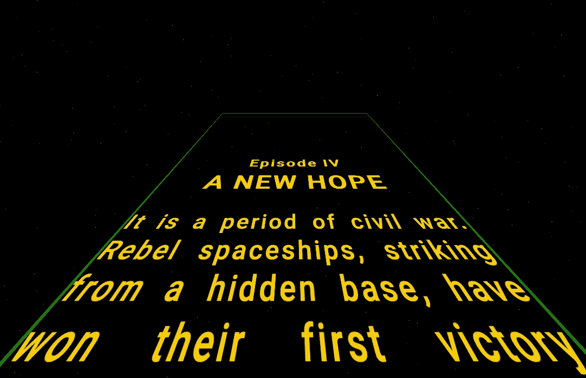
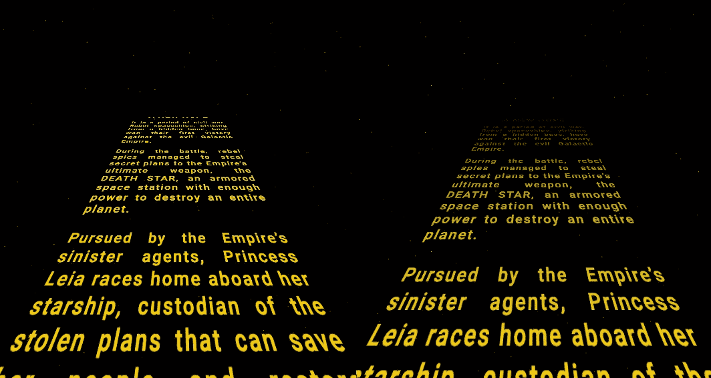
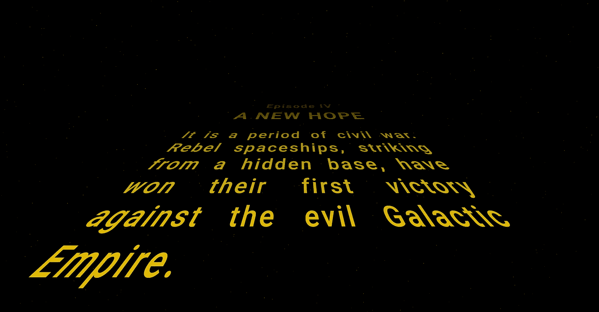

# 创建一个 HTML 格式的星球大战标题抓取

> 原文：<https://betterprogramming.pub/create-a-star-wars-title-crawl-in-html-c25a76fea401>

## 很久很久以前，在一个遥远的浏览器里

在本文中，你将学习如何用 HTML 创建一个星球大战风格的标题抓取，就像上面嵌入的那样。

源代码可在[这里](https://codesandbox.io/s/star-wars-crawl-b2m8u)获得。

该场景由两部分组成:背景中移动的星星和文本爬行。

# 星域背景

动态星星是在画布元素上生成的。我会在另一篇文章中解释星域的机制。

[](https://medium.com/better-programming/fun-with-html-canvas-lets-create-a-star-field-a46b0fed5002) [## HTML 画布的乐趣:让我们创建一个星域

### HTML 画布上效果的分步指南

medium.com](https://medium.com/better-programming/fun-with-html-canvas-lets-create-a-star-field-a46b0fed5002) 

我们这里的星域几乎与上面讨论的相同。不同之处在于:

*   将恒星的数量限制在 2000 颗
*   将现场画布分辨率限制为 1600x900
*   减缓了恒星的运动

较低的恒星密度更符合《星球大战》的审美，没有必要在星域上浪费 CPU 周期。只是背景。

# 文本爬行

让我们看看标记结构:

```
<div id="crawl-container" class="stretch">
  <div id="crawl"> <!-- our plane in 3d -->
    <div id="crawl-content">
      <h1>Episode IV</h1>
      <h2>A NEW HOPE</h2>
      <p>It is a period of civil war. 
      ...
    </div>
  </div>
</div>
```

## 建设原则

我们在`crawl` div 上使用 CSS 3D 转换，使其成为三维空间中的一个平面。我们将把它的底边固定在屏幕的底部，使 div 的高度大约是屏幕的两倍，然后把它推过来，这样 div 的上边就“进入”了显示器。

然后，我们将动画的顶部位置`crawl-content`了，所以它似乎正在远离我们。

作为最后的润色，我们将添加一个透明遮罩，这样文本行看起来会逐渐消失。

其他一切都只是旧的 CSS 试图模仿标志性的文本抓取的字体和颜色。

## 添加视角

我们希望在我们的`crawl` div 平面上有一个明显的透视图。透视倾斜的强度由[透视 CSS 属性](https://developer.mozilla.org/en-US/docs/Web/CSS/perspective)控制。子节点受其影响，而不是节点本身，所以我们在父节点上设置:`crawl-container`

```
#crawl-container {
  perspective: calc(100vh * 0.4);
}
```

我正在使用[视口高度单位](https://developer.mozilla.org/en-US/docs/Web/CSS/length)并将它们缩放 0.4，这看起来不错。我缩小了高度值，所以当调整窗口大小时，爬行的消失点保持在相同的相对高度。

## 创建 3D 平面

让我们看看 3D 文本平面的样式。

```
#crawl { color: #f5c91c;      // yellow color for all text 

  position: absolute;  // fixed in place
  width: 110%;         // a bit broader than screen
  left: -5%;           // symmetric offset to center it in
  bottom: -5%;         // bottom anchored just below screen edge
  height: 200%;        // twice as high as screen
  overflow: hidden;    // don't show scroll bars // the 3D part  

  // plane origin at center of bottom edge
  transform-origin: 50% 100%;  // rotate around x axis by 45 degrees (pushing it over and in)
  transform: rotate3d(1, 0, 0, 45deg);}
```

我们在平面中放置的任何内容看起来都是 3D 转换的。很好。



我们实际构建的 3d 平面

# 淡出远处的线条

作为一个微妙的接触，我们添加了一个[面具](https://developer.mozilla.org/en-US/docs/Web/CSS/mask-image)到我们的三维平面淡出遥远的线。我们使用一个有三个点的[线性渐变](https://developer.mozilla.org/en-US/docs/Web/CSS/linear-gradient):顶部、中部和底部。在顶部，蒙版淡出所有内容，不透明度为 0%。在中间，我们有 66%的不透明度，在底部，我们有 100%的不透明度。

```
 #crawl {
  mask-image: linear-gradient(
    rgba(0, 0, 0, 0),
    rgba(0, 0, 0, 0.66),
    rgba(0, 0, 0, 1)
  );
}
```

如果您还添加了带前缀的定义，这将有助于跨浏览器兼容性。一些浏览器支持它们，但是还不支持通用符号。参见[源](https://codesandbox.io/s/star-wars-crawl-b2m8u)中的示例。



左:不带遮罩—右:带遮罩

## 制作爬行动画

标题爬网内容是绝对定位的，因此可以通过操作`top`属性将其上移。

我们已经为我们的[星空](https://medium.com/better-programming/fun-with-html-canvas-lets-create-a-star-field-a46b0fed5002)设置了一个基本的动画循环。我们可以借此提升标题。一旦我们把它拉出视野，我们就翻转过来。它的要点是:

## 设置文本样式

我试图复制原标题爬行的外观。我选择了中等粗细的机器人作为原始字体的近似字体。

为了更接近原始的感觉，我添加了一些最小的字母间距。

最后，我将缩小屏幕宽度的字体大小。调整窗口大小时，文本会自然地以这种方式缩放。

```
#crawl-content {
  font-family: "Roboto";
  letter-spacing: 0.09em;
  font-size: calc(100vw * 0.074);
}
```

# 结果呢



愿原力与你同在，我的朋友。