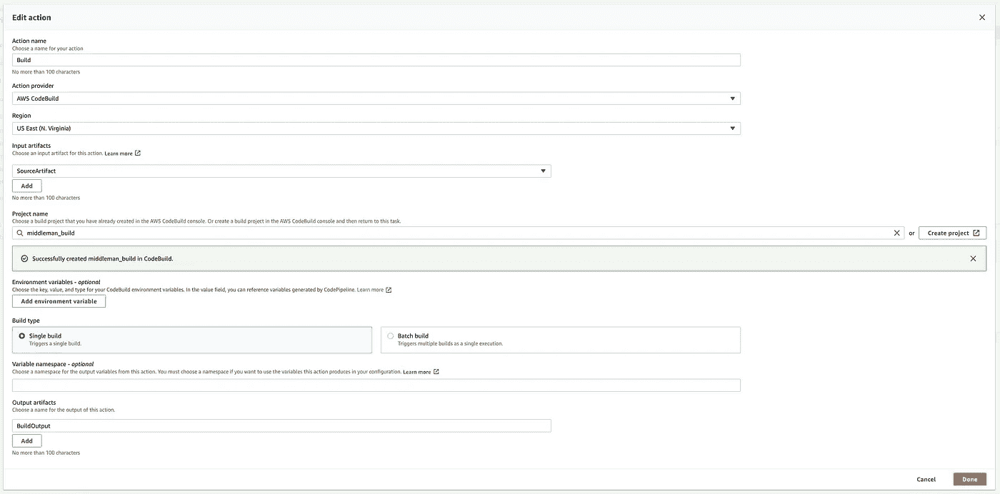
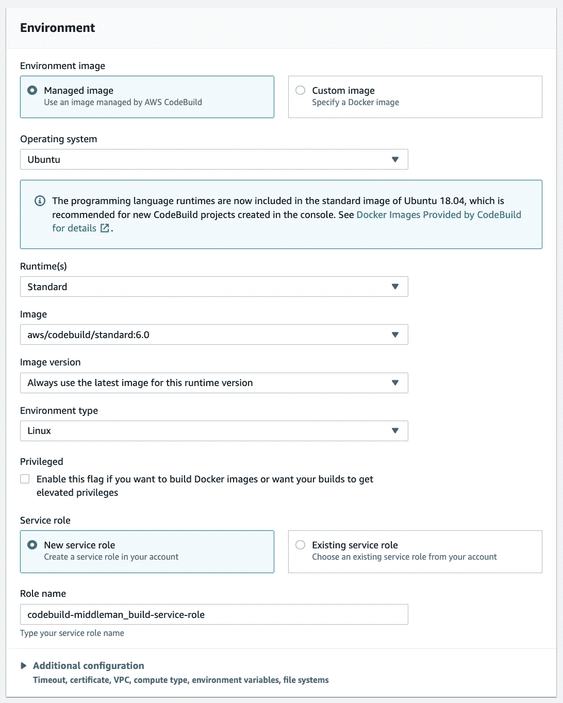
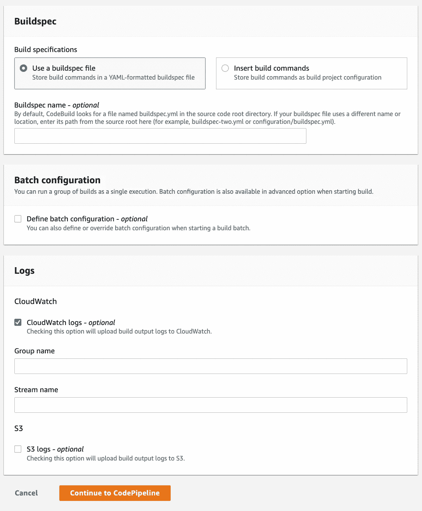

# 用中间人创建一个静态网站，并将其部署在 AWS 上

> 原文：<https://betterprogramming.pub/create-a-static-website-with-middleman-and-deloy-it-on-aws-1060f54d2ba3>

## 构建和托管低成本的登录页面


几乎每个创业公司的起步都是一样的；带有登录页面。然而，许多用于登录页面的无代码解决方案要么价格昂贵，要么不提供用户可能需要的定制水平。我们将讨论如何使用中间人+ AWS 来创建和托管您的登录页面！

按照本教程，你将能够创建一个网站，如下面的。

# 先决条件

为了遵循本教程，将假设一些事情:

1.  您已经按照这里的说明[安装了中间人](https://middlemanapp.com/basics/install/)。
2.  你有一个想要使用的网站模板(HTML、CSS、JS 等)。
3.  你有一个 AWS S3 桶+ AWS Cloudfront 网站托管设置与下面的设置相同的方式:

[](https://thepaulo.medium.com/continuous-deployment-pipeline-for-react-app-on-aws-s3-cloudfront-ac60f455642a) [## AWS S3 + CloudFront 上 React 应用的持续部署渠道

### 简单回顾了如何为单页面应用程序(ReactJS)创建一个连续的部署管道，而不需要…

thepaulo.medium.com](https://thepaulo.medium.com/continuous-deployment-pipeline-for-react-app-on-aws-s3-cloudfront-ac60f455642a) 

# 配置中间人

## 步骤 1:设置文件夹和文件结构

设置以下文件夹结构。

```
my-website/
├── data/
│   └── deploy.sh
├── source/
|   ├── images/
|   ├── javascripts/
|   ├── stylesheets/
│   └── index.js
├── .gitignore
├── buildspec.yml
├── config.rb
└── Gemfile
```

应该创建三个文件，如下所示:

AWS Codebuild 将使用`buildspec.yml`来构建网站。

中间人使用`config.rb`文件来配置其行为。该示例文件配置了一些所需的行为:

1.  `directory_indexes`将使网站路径不以`.html`结尾。
2.  `asset_hash`将确保每个构建生成唯一命名的资产，这样 CDN 缓存就不需要在新构建中失效。
3.  `minify_css`和`minify_javascript`会减小你的 CSS 和 JS 文件的大小。

`Gemfile`将指定您将使用的 [gems](https://rubygems.org/) ,包括对中间人的扩展，如`livereload`,它通过在文件更改后自动重新加载网站来使调试更容易。

## 步骤 2:将 CSS、JS 和图像文件移动到正确的目录中

您应该按照以下方式放置所有资产文件:

1.  `javascripts`文件夹中的 Javascript 文件。中间人惯例是为整个站点的 JavaScript 准备一个名为`site.js`的文件。但是，如果需要，您可以将其重命名。
2.  在`stylesheets`文件夹中的样式文件(CSS，SCSS 等)。你的大部分风格应该在一个名为`site.css`的文件中(或者其他合适的扩展名)。但是，如果需要，您可以将其重命名。
3.  将你所有的图片移动到`images`文件夹。

## 步骤 3:创建你的 HTML 文件

我们将创建两个 HTML 文件。

这个`index.html`文件将是你的网站 HTML 的主要部分。下面的文件来自中间人演示项目。注意顶部`---`里面的部分。此语法允许您声明可以在布局文件中使用的变量。

`layout.erb`将环绕你的`index.html.erb`(和其他)HTML 文件。它将负责导入你的 JS 和 CSS。这个文件还可以用于显示应该出现在网站所有页面上的页眉和页脚。

## 第四步:构建

你现在可以运行`bundle exec middleman build`。这将创建一个新文件夹，其中包含所有已编译的资产，准备好进行部署！

然而，最好是设置一个自动部署，这样你的网站就可以无缝更新了。

# 部署自动化

假设遵循了这里的步骤[和](https://thepaulo.medium.com/continuous-deployment-pipeline-for-react-app-on-aws-s3-cloudfront-ac60f455642a)。我们将对 Codepipeline 进行两项更改，以便它在部署到 S3 之前构建中间人。

## 步骤 1:添加构建阶段

在`source`和`deploy`阶段之间的管道中添加一个构建阶段。它的配置应该如下所示。



点击上面菜单中的“创建项目”按钮。它会将您带到代码构建创建表单。按如下方式填写。



我们已经走过了一条创建静态网站并以低成本部署的道路。这对于登录页面、博客或任何其他静态网站都很有用。