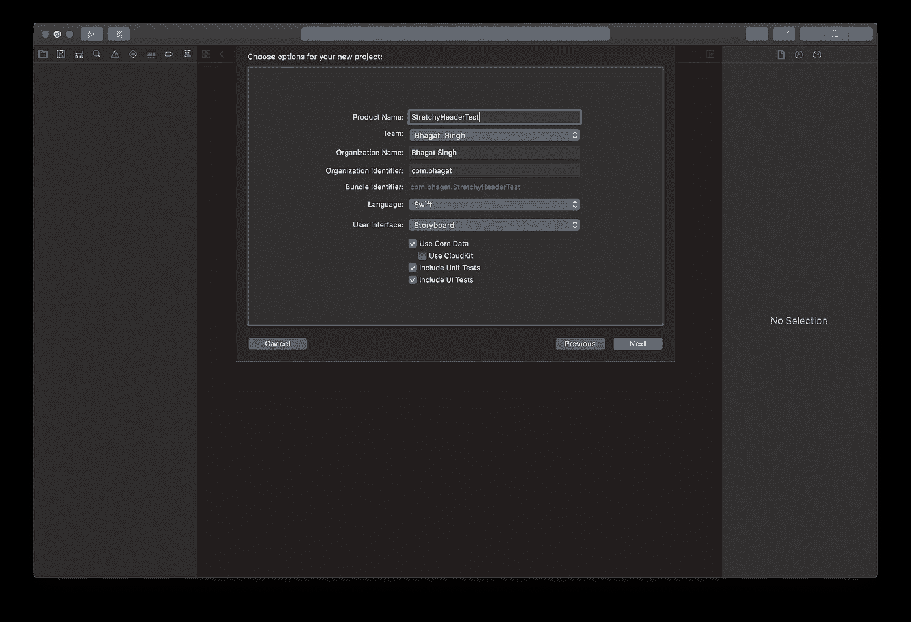
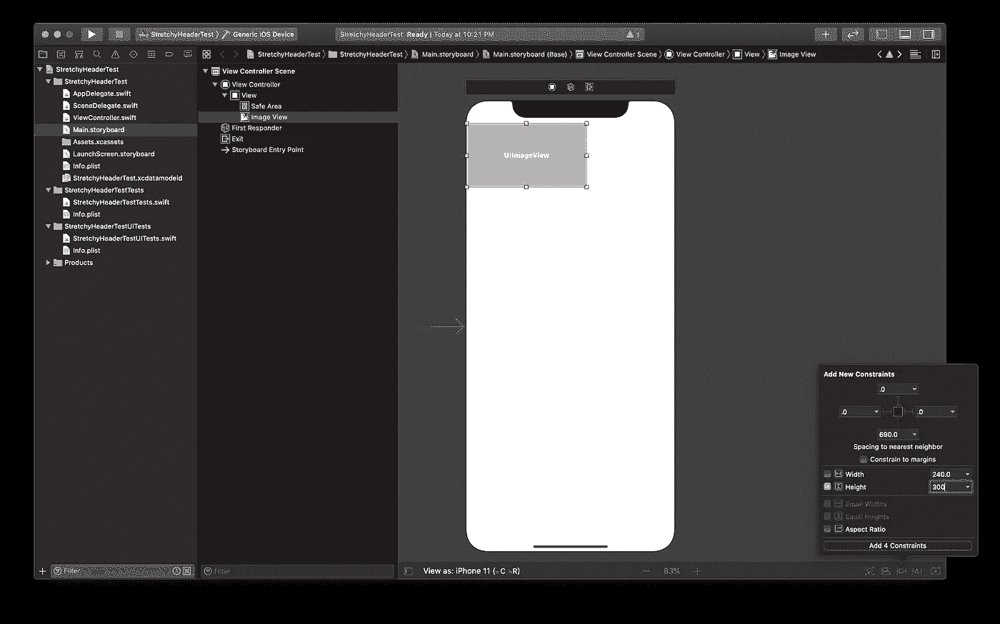
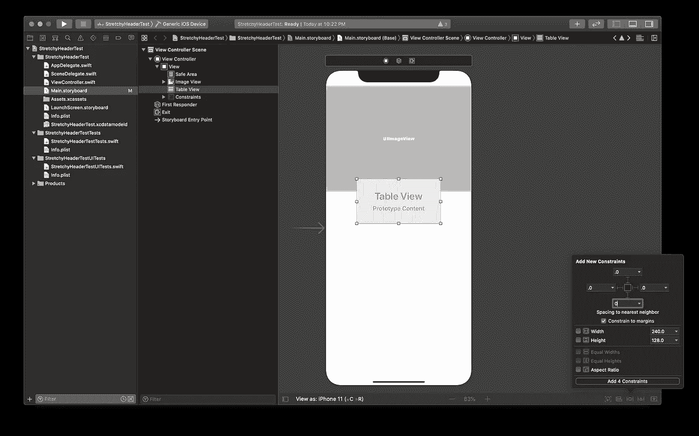
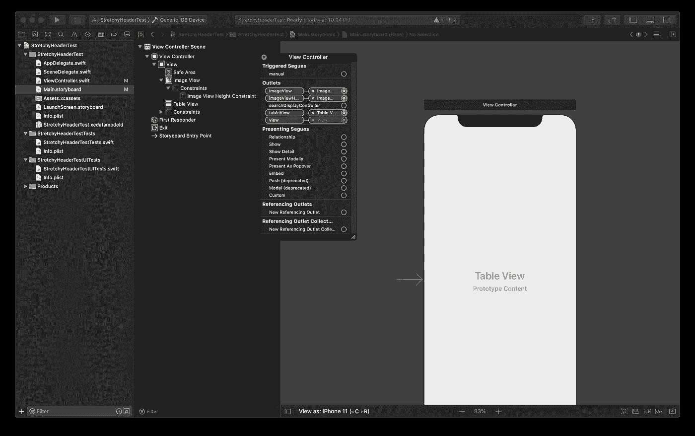
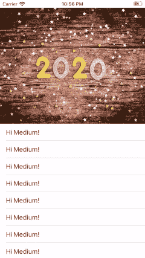

# 在 Swift 中创建弹性标题

> 原文：<https://betterprogramming.pub/create-a-stretchy-header-in-swift-6d840e9d5106>

## 用不到 5 行代码就完成了

克里斯托夫·高尔在 [Unsplash](https://unsplash.com/s/photos/iphone-on-table?utm_source=unsplash&utm_medium=referral&utm_content=creditCopyText) 上拍摄的照片

弹性标题是 Twitter、脸书和 Spotify 等各种应用中常见的 UI 元素。它们给应用程序增加了视觉效果，虽然看起来令人生畏，但是一旦你弄清楚发生了什么，它们真的是小菜一碟。所以今天，我们将在我们自己的应用程序中添加一个可伸缩的标题！

创建新的 Xcode 项目。您可以随意命名它，并将其保存在系统中的任意位置。我们只想快点进入有趣的部分！

创建您的项目！

在您新创建的 Xcode 项目中，转到Main.storyboard 并添加一个 *UIImageView* 到其中。将它固定到超级视图的前沿、后沿和顶边，以便它根据屏幕的宽度扩展，并将自己固定在屏幕的顶部。此外，添加一个高度限制为 300，或任何你喜欢的，到图像。

给出 UIImageView 约束

现在，在 ViewController 中添加一个 UITableView，并将其固定到视图的所有四个边缘，以便它覆盖整个视图。它可能会与您刚刚插入的 UIImageView 重叠，但这没关系！我们将在接下来的步骤中修复它。

给出 UITableView 约束

现在，我们将创建 IBOutlets 来引用代码中的这些元素。我们将为 UITableView、UIImageView 和 UIImageView 的高度约束创建一个 IBOutlet。

用 IBOutlet 连接一切

现在，我们将添加一些设置代码，以便我们的视图看起来像它预期的那样。我在应用程序的 Assets.xcassets 文件夹中添加了一个名为 joker 的图像，并将其设置为 UIImageView 的图像。

# 有趣的部分

获得这种效果的技巧是，我们将创建一个与 UIImageView 高度相同的透明单元格，然后开始我们的实际内容(与给 tableview 一个图像高度的 contentInset 相同)。每当用户向上或向下滚动时，我们将更新 UIImageView 的高度。

在 scrollViewDidScroll 方法中，每当表滚动时，我们都会得到一个回调。因此，我们将覆盖这个方法，并在其中插入我们自己的自定义代码。

我们在上面做了什么:

1.  我们确定了高度，这是从 contentOffset 中减去我们的常规高度。当我们向上滚动时，contentOffset 实际上是负的，所以它被添加到常规高度(减去负的量实际上会添加它)，所以它扩展了。
2.  我们将高度约束处理为我们在第一步中算出的高度。
3.  **鳍。**

几个要点:

*   请确保 UIImageView 的 contentMode 是 scaleAspectFill。
*   确保 UITableView 的*c*ontentadjustmentbehavior 设置为 never。

照片由[杰米街](https://unsplash.com/@jamie452?utm_source=unsplash&utm_medium=referral&utm_content=creditCopyText)在 [Unsplash](https://unsplash.com/s/photos/2020?utm_source=unsplash&utm_medium=referral&utm_content=creditCopyText) 拍摄

你可以添加这个标题效果来提升你的应用程序，让它看起来更有吸引力。您还可以调整图像的标准高度，以获得适合您的像素级完美外观。所有这些只用了不到五行的代码！