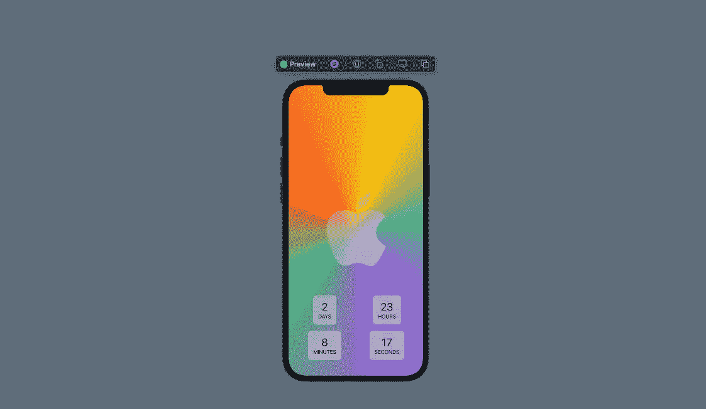

# 创建一个倒计时至 WWDC 2022 的 SwiftUI 时钟

> 原文：<https://betterprogramming.pub/create-a-swiftui-clock-that-counts-down-to-wwdc-2022-cdacdeab97fd>

## 将 Apple 标志绘制成 SwiftUI 形状，并在下方显示剩余时间



作者截图

首先，我将重新创建一个 SwiftUI 路径的苹果标志。为了方便绘制路径，我创建了一个对象，它可以自动创建所有必要的点。

它是通过传递正在绘制的帧的`maxX`和`maxY`值来创建的，因为所有点都是相对于那些最大值来绘制的。

这些点是我选择的估计值，所以你可能不同意整体形状的结果。

如果你想移动形状中的任何点，你可以在这里做，确保乘以`maxX`或`maxY`得到一个相对位置，而不是一个硬编码的位置。形状可以是任何大小，因此固定位置可能在框架之外，不会缩放。

在任一方向上乘以最大值，值 1 等于该最大值。

告诉曲线在哪里弯曲的控制点可以低于 0 或高于 1，因为它们实际上不是作为形状的一部分绘制的。

但是当乘以最大值时，您希望保留在帧内的点数应该在 0 和 1 之间。

让我们把这些点变成一个形状！

这个形状还没有描边或填充，但没关系。

# 倒计时器

这些数字将显示在一个圆角矩形中，下面有一个标签。

这将重复用于日、小时、分钟和秒，因此它需要是一个单独的视图。

现在我可以在一个`LazyVGrid`中将其中的 4 个组合起来，显示为 2 行 2 个。这些列是灵活的，因此它们可以自行调整大小以填充可用空间。

这里还有一个计时器，会计算出每秒钟还剩多少时间。

现在我们可以将视图合并到一个`ZStack`中。

有一个`AngularGradient`背景，因为这样更容易看到`Material.ultraThinMaterial` 被用作`AppleLogoShape`的填充。这意味着它模糊了它下面的东西，但你仍然可以看穿它。如果你使用纯色背景，你将看不到模糊的效果。

当然，你不需要用半透明材质作为`AppleLogoShape`的填充。你实际上可以不带参数调用`.fill()`，你随后应用的`foregroundColor`将是形状的颜色。

你也可以使用修改器`.stroke(lineWidth: 5)` 来绘制形状的轮廓，但是目前不可能同时使用描边和填充。

如果你既想要描边又想要填充，不幸的是，你不得不在`ZStack`中拥有一个单独的描边和填充的形状实例。

或者，您可以添加该形状的描边实例，作为填充实例的覆盖。

```
**Want to Connect?**This story was also published on my Substack channel: [Typesafely](https://typesafely.substack.com/).
```