# 用 Jovo 创建一个电报机器人

> 原文：<https://betterprogramming.pub/create-a-telegram-bot-with-jovo-6a1250e53427>

## 让我们建立一个基于 Jovo 的电报机器人

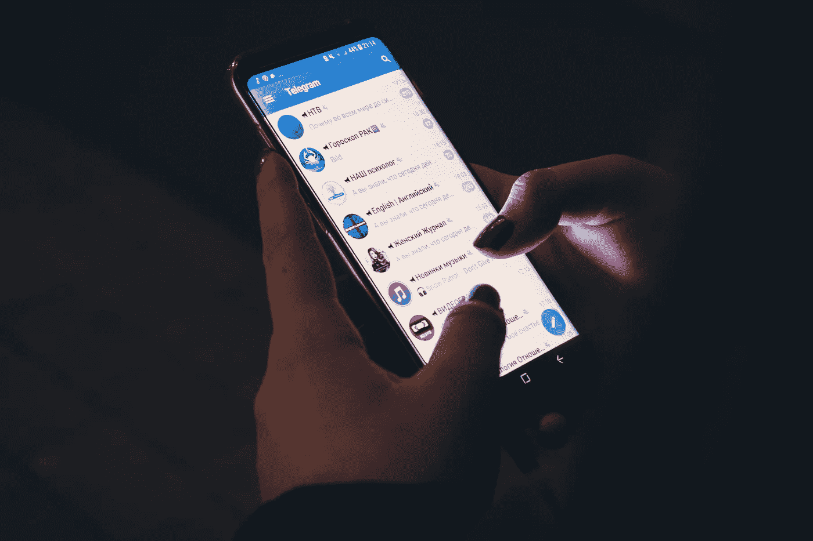

克里斯蒂安·威迪格在 [Unsplash](https://unsplash.com/photos/GWkioAj5aB4) 上拍摄的照片

Telegram 是一个流行的在线消息应用程序，就像 WhatsApp 和 Facebook Messenger 一样。关于 Telegram 有一件事引起了我的注意，那就是在[机器人父亲](https://core.telegram.org/bots)的指导下，用一些简单的命令建立一个机器人并让它运行起来是多么容易。正如 Telegram 所描述的:

> 机器人父亲是统治他们所有人的机器人。它将帮助您创建新的机器人和改变现有的设置。

那么，我们如何创建我们的电报机器人呢？我们开始吧！

# 创建电报帐户

在您创建帐户之前，您需要下载 Telegram 应用程序。请点击以下链接从您喜欢的商店下载:

*   [谷歌 Play 商店](https://play.google.com/store/apps/details?id=org.telegram.messenger&hl=en)
*   [苹果商店](https://apps.apple.com/us/app/telegram-messenger/id686449807)

安装完成后，打开你的浏览器，进入[https://web.telegram.org/](https://web.telegram.org/)。输入您的国家和电话号码，然后单击“下一步”。

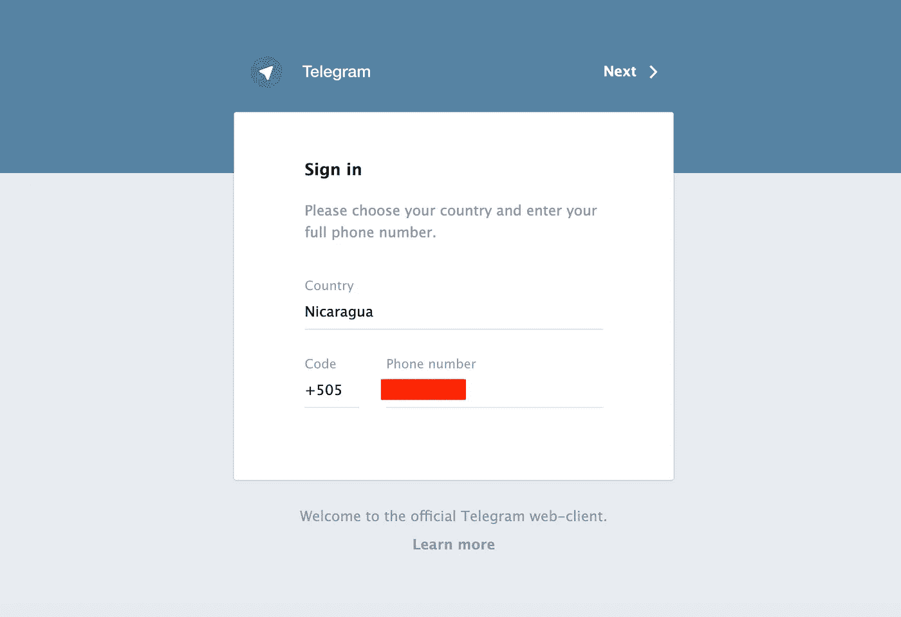

电报签到屏幕

它会要求您确认您的号码。单击“确定”。该代码将被发送到您的手机上—复制并粘贴它以进行确认。

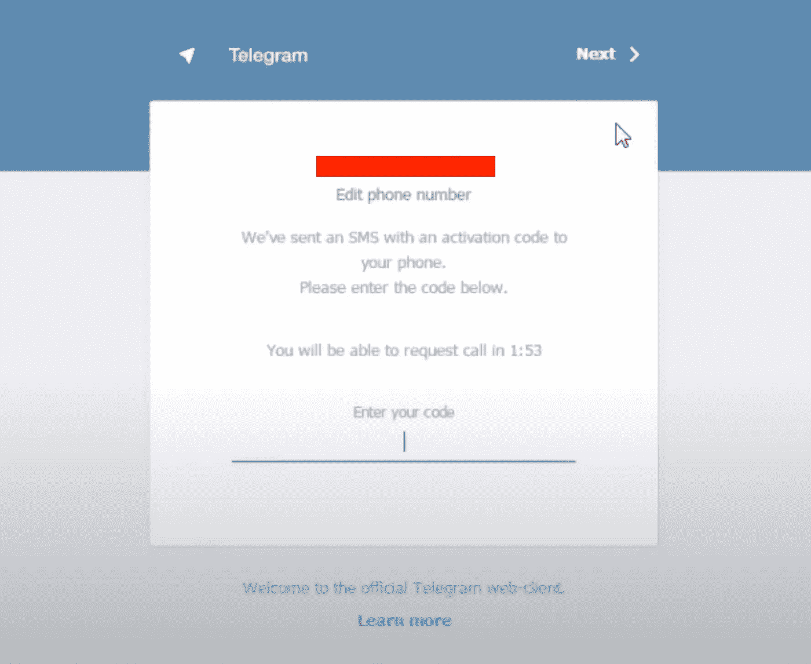

确认代码

确认代码后，您就可以开始使用 Telegram 了。在 Android 手机上，屏幕看起来像这样:

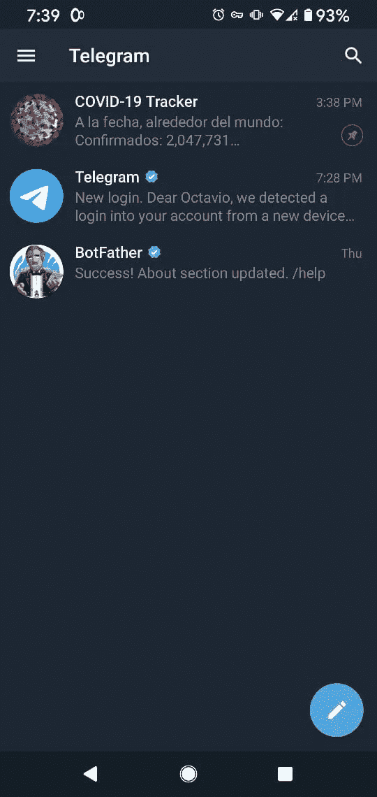

Android 手机上的电报主屏幕

# 创建一个电报机器人

正如你在上面的图片中看到的，我已经和机器人父亲聊天了，因为我之前已经创建了一个机器人。新冠肺炎追踪器机器人。你可以通过点击屏幕右上方的搜索按钮并输入“机器人父亲”来找到机器人父亲这将是第一个结果。

点击它并开始设置你的机器人:

*   点击屏幕底部的“开始”按钮。你会得到一堆命令，作为与机器人父亲对话的指令。
*   键入“/new bot”**开始设置您的第一个机器人。**
*   **为您的机器人键入一个名称。**
*   **最后，输入你的机器人的用户名。**

**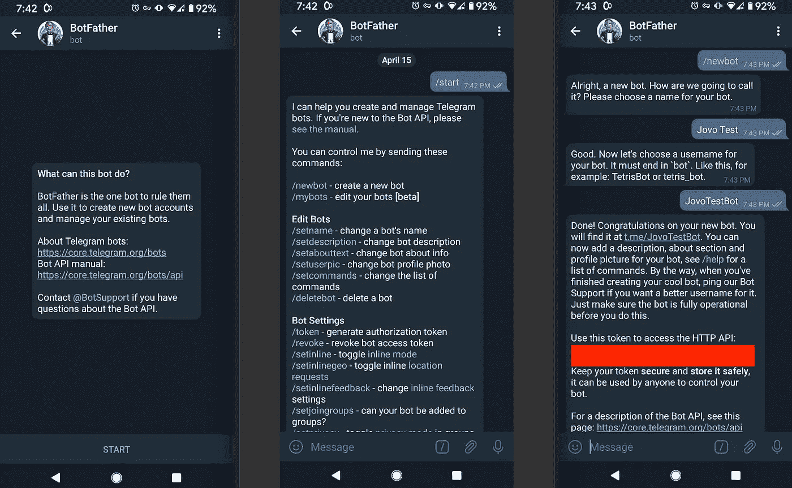**

**设置您的第一个电报机器人**

**复制上一步中的令牌—我们将在下一节中使用它。**

# **将您的 Bot 连接到 Dialogflow**

**Dialogflow 是最流行的自然语言理解引擎之一。你可以从谷歌助手、Facebook Messenger、Slack、Twitter、Skype、Telegram 等平台连接机器人。**

**我们需要做的第一件事是为我们的机器人创建一个新的代理。在左侧面板中，单击“创建新代理”菜单，并为您的代理命名。然后点击“创建”。**

**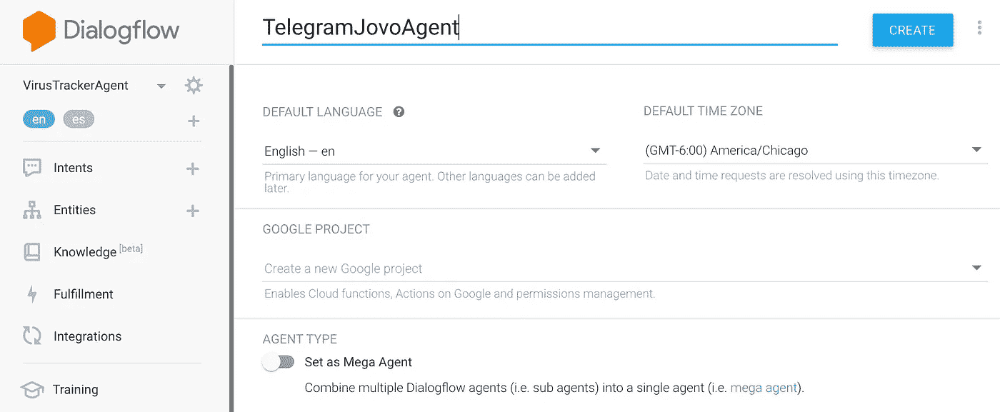**

**创建对话流代理**

**现在，进入“集成”菜单，找到“电报”平台并点击它。在会弹出的对话框中，输入你在 BotFather 中设置 bot 时得到的令牌，点击“开始”。然后点击“关闭”。**

**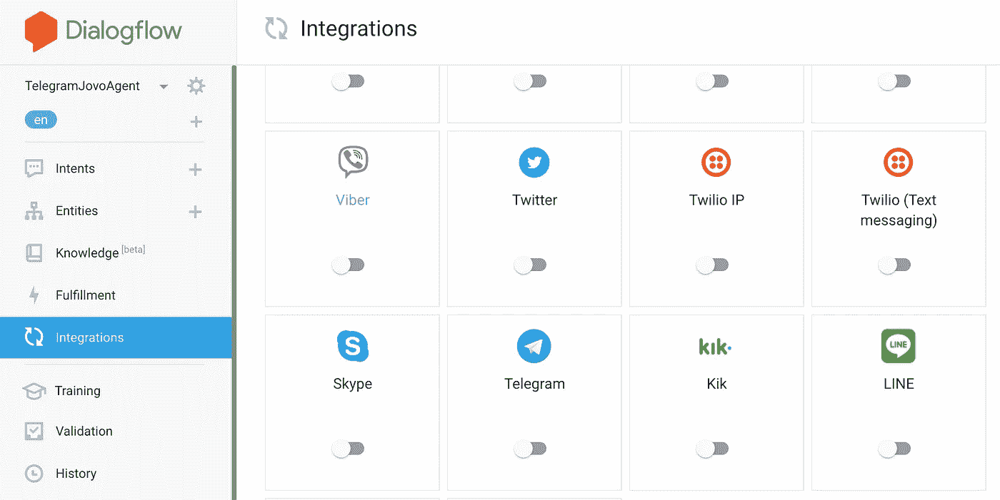****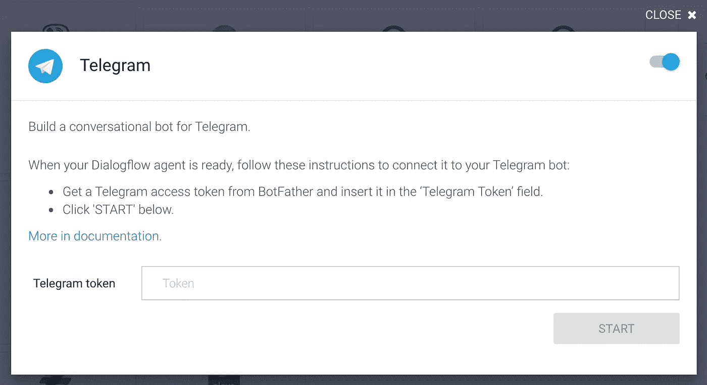**

**输入来自机器人父亲的令牌**

# **运行一个 Jovo 项目来管理对话**

**[Jovo](https://www.jovo.tech/) 是一个跨平台的框架，你可以使用它来构建和运行跨设备和平台的语音体验，包括亚马逊 Alexa、谷歌助手、手机、Raspberry Pi 等等。它还可以轻松连接到 Facebook Messenger、Slack、Telegram 等 bot 平台。**

**既然我们已经准备好与 bot 对话，并且 Dialogflow 代理理解对话，我们需要捕捉用户所说的意图并返回响应。我准备了一个简单的 TelegramJovoHelloWorld 项目，您可以将其用作您的 bot 的模板。继续克隆[库](https://github.com/omenocal/TelegramJovoHelloWorld)。**

**如果你是 Jovo 的新手，我推荐你去看看他们为新手准备的 [HelloWorld](https://www.jovo.tech/courses/project-1-hello-world) 项目。**

**以下假设您熟悉 Jovo 项目结构。我们需要做的第一件事是创建要在 Dialogflow 中恢复的 Dialogflow 代理 zip 文件。为此，运行以下命令:`jovo deploy`。**

**该命令只会在项目的以下路径中创建代理的 zip 文件:/platforms/Google action/dialog flow _ agent . zip。**

**转到 Dialogflow 代理，单击“设置”，单击“导出和导入”选项卡，然后单击“从 ZIP 还原”。**

**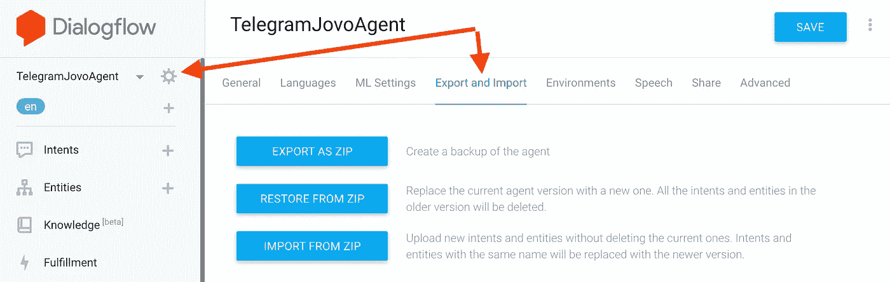**

**从 zip 文件恢复**

**上传您的 zip 文件，在文本框中键入“恢复”以确认操作，然后单击“恢复”按钮。**

**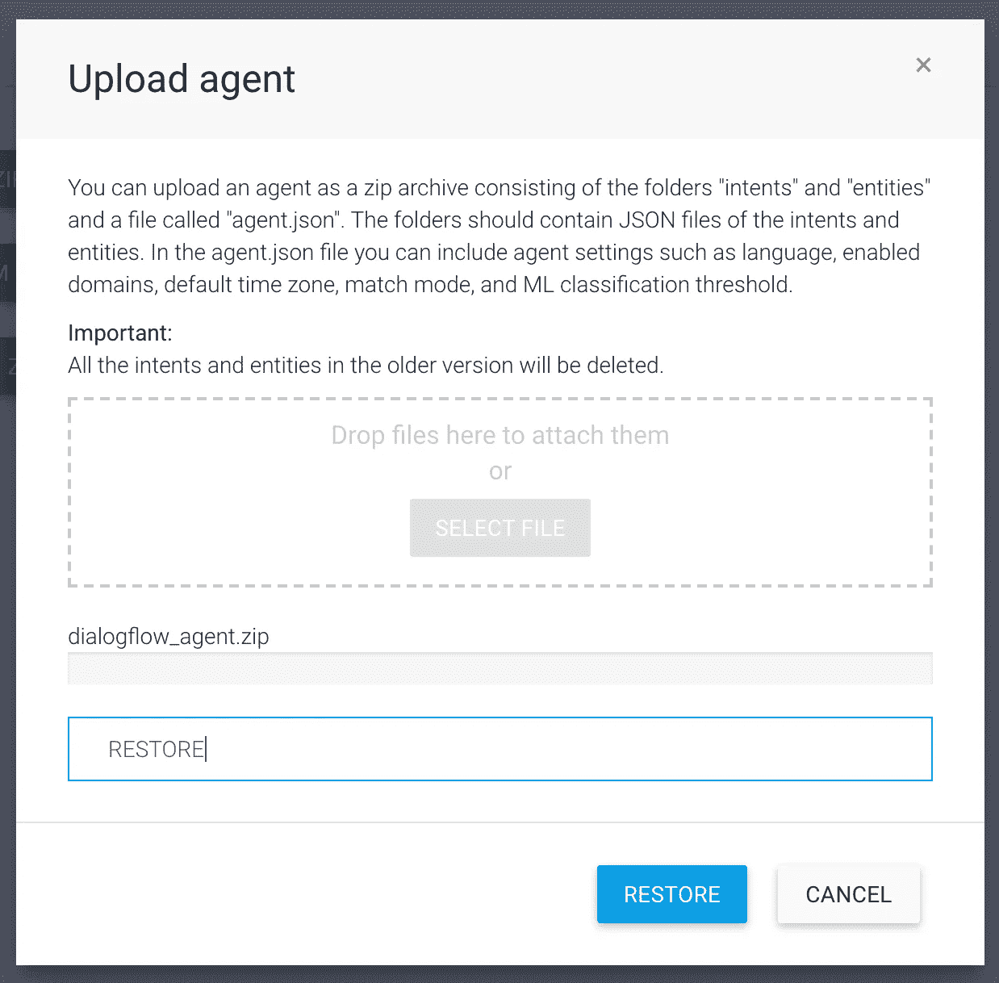**

**确认恢复操作**

**将 Dialogflow 连接到我们的 Jovo 项目的最后一步是添加一个履行 URL。在您的计算机中，转到终端窗口并运行以下命令:**

```
npm install / yarn installjovo run -w
```

**如果您没有安装 Jovo-CLI，您可以运行:**

```
npm install -g jovo-cli
```

**当您的服务器正在运行时，您会在终端窗口中看到您本地机器的 Jovo URL:**

**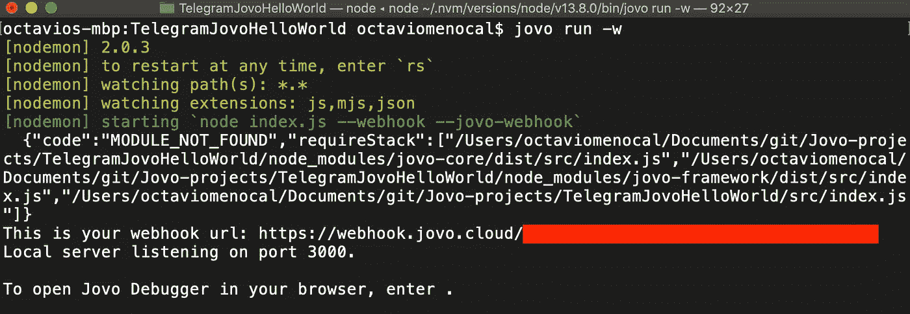**

**在你的终端窗口中运行你的 Jovo 项目**

**复制此 URL，然后在左侧面板的 Dialogflow 代理中，转到 Fulfillment，启用 Webhook 设置，并粘贴您的服务器的 URL。在页面底部，单击“保存”按钮。**

**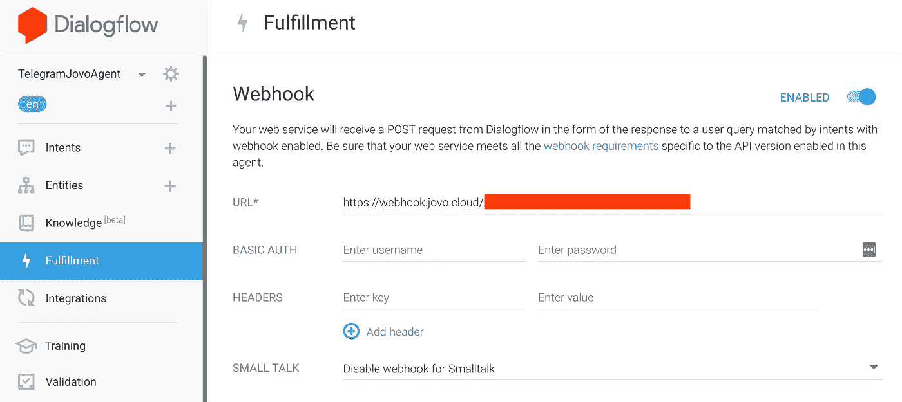**

**对话流代理实现**

# **最后的话**

**在这一点上，你应该能够和你的电报机器人说话，并问:“你好吗？”它会回复:“谢谢你的询问。我过得很好，你呢？”**

**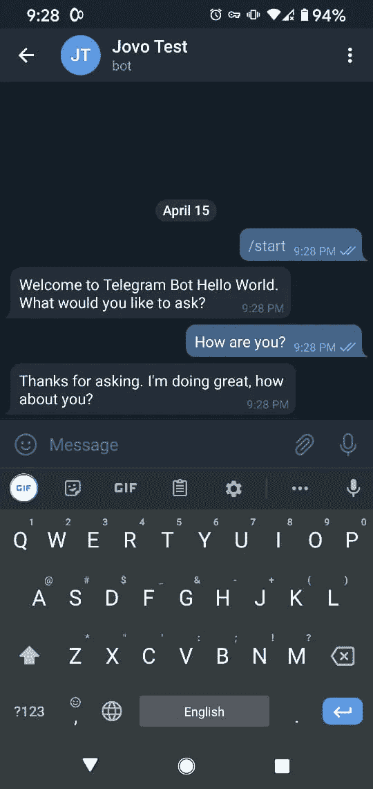**

**电报机器人对话示例**

**你可以把你的 Jovo 项目放在你自己的服务器上，或者如果对你来说更容易的话，你可以把它保存在 Google Cloud 或者 AWS 上。一旦你完成了你的项目，你就可以用你的机器人的电报网址与其他人分享。例如:**

**`[http://t.me/JovoTestBot](http://t.me/JovoTestBot)`**

**这是我在这篇文章中创建的机器人的 URL。如果你测试它，它不会总是工作，因为我没有让我的服务器一直在我的机器上运行！**