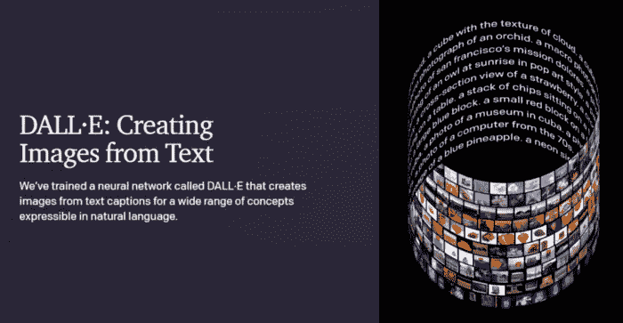
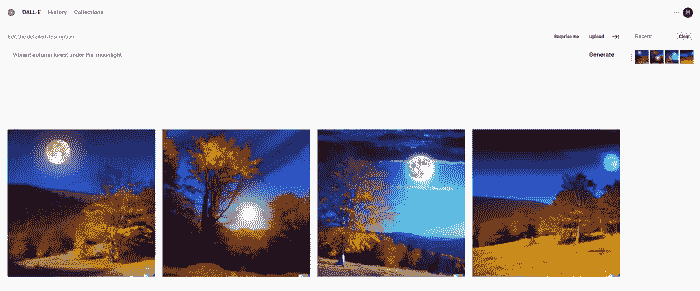
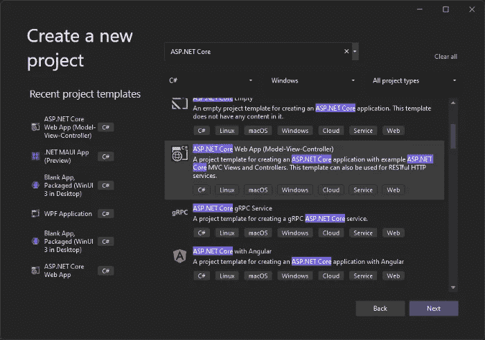
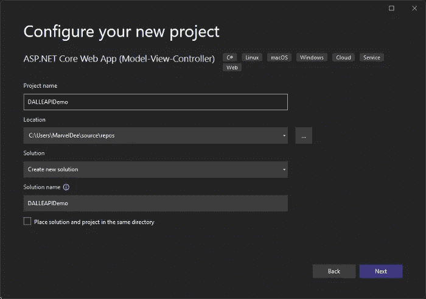
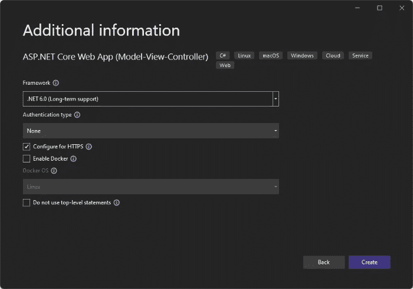
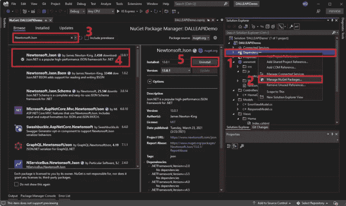
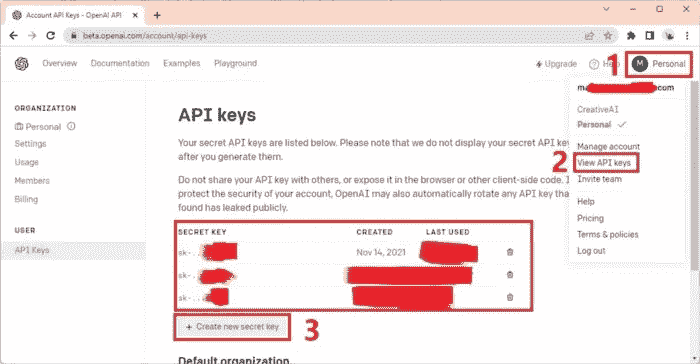
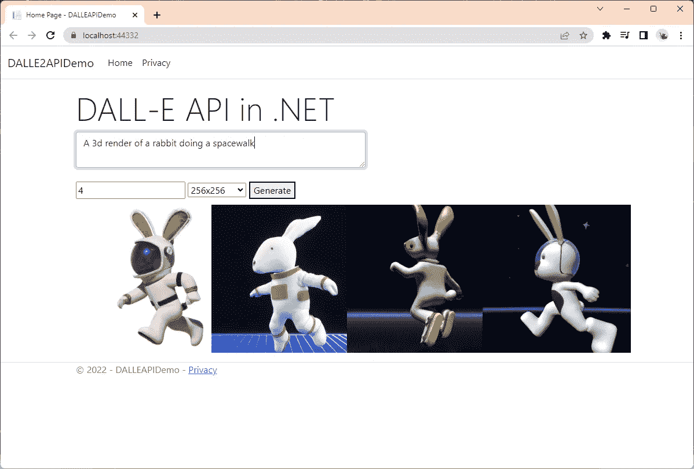

# C#如何使用 DALL-E API？网

> 原文：<https://betterprogramming.pub/create-a-text-to-image-generator-using-dall-e-api-in-c-net-7df58d940e79>

## 制作文本到图像生成器的分步指南



摄影:[https://openai.com/blog/dall-e](https://openai.com/blog/dall-e/)

DALL-E 是一个人工智能系统，可以将自然语言或文本描述转换为现实的图像和艺术。DALL-E 非常棒。它发布后，我在网上看到了无数的讨论。从开发者到艺术家到艺术爱好者，他们中的大多数都同意这项技术确实处于下一个水平。



摄影:漫威·德兰特——使用 DALL-E 预览应用程序生成

上周五，2022 年 11 月 4 日，我收到了一封来自 OpenAI 的电子邮件，宣布 DALL-E API 的可用性。从去年开始我就一直在等这个。现在这个 API 已经可以使用了，我很高兴能尝试一下。

我访问了[网站](https://beta.openai.com/docs/guides/images)并寻找文档。我找到了支持 Node.js、Python 和 curl 的 API 文档。我是一名. NET 开发人员，找不到。所以我决定和你分享我如何在我的 NetCore 项目中使用 DALL-E API。

在本演示中，您不需要在 Netcore 中制作项目。我用的是纯的。NET 库，所以不管你用 NET Standard 还是 NetCore，两者都支持。现在让我们创建一个项目，好吗？:)

在这个演示中，我使用 Visual Studio 2022 预览版创建了这个项目。
该项目是一个 ASP.Net 核心 Web 应用程序(MVC)。



摄影:漫威·德兰特

我准备把它命名为`DALLEAPIDemo`。



摄影:漫威·德兰特

框架是. NET6.0，那么剩下的我就不做改动了。然后点击“创建”



摄影:漫威·德兰特

创建项目后。左侧是“解决方案资源管理器”
右键单击依赖项>管理 Nuget 包>浏览选项卡>搜索 Newtonsoft.json >选择第一个，如下图所示>单击浏览选项卡最右边的安装按钮。

*在下图中,“安装”按钮标记为“卸载”,因为它已经安装。我们将使用 Newtonsoft 库来序列化和反序列化对象。



摄影:漫威·德兰特

## 打开 API 密钥

才能调用 DALL-E API。首先，我们需要保护一个 API 密钥，因为需要将它包含在我们的头中，这样 API 就知道是谁在发送请求。

要获得 API 密钥，我们需要一个 OpenAI 帐户。可以在这里报名[。](https://auth0.openai.com/u/signup/identifier?state=hKFo2SA3RHllVjFhdkFxdlo1MWtXUV9xTnhkUHAxZGxoaDJHM6Fur3VuaXZlcnNhbC1sb2dpbqN0aWTZIElvcm0tMDg3cXVvQVZJNU9XOXV6OVI4ci1xaG5FY200o2NpZNkgRFJpdnNubTJNdTQyVDNLT3BxZHR3QjNOWXZpSFl6d0Q)

成功创建帐户后。登录您的帐户，单击您的个人资料图标，单击下拉菜单中的查看 API 密钥，然后单击“+创建新密钥”按钮。

复制 API 密钥并临时保存在某个地方，例如，在记事本中。我们以后会用到它。

*   使用 DALL-E API 生成图像不是免费的，但是价格非常合理。请参考文档的定价部分。



摄影:漫威·德兰特

现在让我们编码。

## 应用程序设置. json

添加一个`OPEN_API_KEY`项，然后将值设置为您之前保存的 API 键。

## 模特们

在解决方案浏览器中，打开`Models`文件夹，创建一个新项目`ResponseModel.cs`，并在作为我们输入模型的`input`、`Link`和`ResponseModel`中创建三个模型类，其中`ResponseModel`将用于映射 DALL-E API 响应。

## 控制器

在解决方案资源管理器中展开`Controllers`文件夹，并查找`HomeController.cs`。

创建一个字符串变量`APIKEY`并将其值设置为空。在构造函数中，注入`IConfiguration`接口，这样我们就可以访问`appsettings.json`中的元素，然后设置`APIKEY`的值。

```
string APIKEY = string.Empty;
        public HomeController(IConfiguration conf)
        {
            APIKEY = conf.GetSection("OPENAI_API_KEY").Value;
        }
```

现在，让我们创建一个`HTTP POST`动作并将其命名为`GenerateImage`，它接受输入模型作为来自请求体的参数。

在`GenerateImage`方法中，我们创建一个`ResponseModel`的实例，并将其命名为`resp`。然后我们将创建一个新的`HttpClient`实例。接下来，我们将清除默认头，因为我们不希望请求有不必要的头。然后，我们将添加一个授权头，从这里开始，我们将使用`APIKEY`。

然后，我们将使用 apipath 和使用`JsonConvert.SerializeObject`作为主体的序列化输入模型调用`client.PostAsync`方法，并将其 contentType 设置为“application/json”

如果响应代码成功，我们将读取内容，并使用来自`Newtonsoft.json`的`JsonConvert.DeserializeObject`类从内容的反序列化值中设置`resp`的值。

完整的`HomeController`应该是这样的:

## 景色

在您的右侧，解决方案资源管理器>视图>主页>打开`Index.cshtml`

观点很简单。我们将添加一个页面标题“DALL-E API in .NET”，然后我们将添加一个文本区域`txt`用于提示，一个接受数字`quantity`的输入，该数字用于表示您想要生成的图像的数量，一个组合框/选择`sel`用于用户选择图像大小，一个按钮`btn`，以及一个 div `display`用于显示图像。

## JavaScript

在您的解决方案浏览器上，展开`wwwroot`文件夹、`js`文件夹，然后打开`site.js`。

在这里，我们将创建一个按钮点击事件监听器，并实例化一个`input`对象作为我们的请求体。然后我们将向 home controller>generate image 方法发送一个 post 请求，并将`input`对象作为参数。

如果请求成功，我们将得到 JSON 格式的响应，然后我们将遍历包含图像 URL 的数据对象。之后，我们将创建一个带有 img 元素的 div 并从 DALL-E API 生成的响应 URL 中设置其来源，并将其追加到`display` div 中。

## 输出

运行应用程序，输入你的文本，输入你想要生成的图像数量，选择图像大小，然后点击生成按钮，瞧！这是你的文本到图像生成器。NET 与 DALL-E API。



摄影:漫威·德兰特

令人着迷的是。NET 也可以使用 DALL-E API。通过这个演示项目，我们可以探索将 DALL-E 嵌入到各种应用中的其他可能性。Net 项目，如桌面、移动和其他。网络应用之外的网络应用。

如果你喜欢技术和编码主题，请欣赏我更多的作品。这将是我写更多的动力。

谢谢您们。

各位编码愉快。