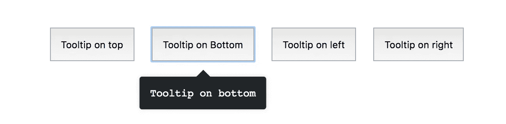

# 使用 React 挂钩创建工具提示组件

> 原文：<https://betterprogramming.pub/create-a-tooltip-component-using-react-hooks-cb9fd00a2ff0>

## 从功能上给你的用户一些方便的信息


如今，每个用 [React](https://reactjs.org/) 编码的人都知道名为[钩子](https://reactjs.org/docs/hooks-intro.html)的新发布特性。

在这篇文章中，我将带你使用这个特性创建一个简单的**工具提示**。

这里有一个来自存储库的屏幕截图，显示了我们将要实际构建的组件:



有关更多详情，请点击以下链接:

[https://3 tmaan . github . io/react-hooks-tooltip/dist/index . html](https://3tmaan.github.io/react-hooks-tooltip/dist/index.html)

# 组件结构

工具提示通常用于在用户将鼠标指针移动到某个元素上时向用户提供一些信息。然而，在本教程中，我们将实现一个点击事件，我们将看到如何处理内的**和**外的**点击。**

我们将创建的组件结构如下:

```
<Tooltip **title**="Tooltip on top" **position**="top">
    **<button>Tooltip on top</button>**
</Tooltip>
```

它会有**三个道具:**、`position`，还有一个**单胎—** `button`，如上图。子道具可以是任何东西，只要是`orphan`。

*   `title`会按住工具提示的内容
*   `position`将处理工具提示的不同位置(`top` | `right` | `left` | `bottom`)
*   `button`将是可点击的元素，以显示额外的内容。

让我们创建`App`文件，我们将在其中导入并使用`Tooltip`组件:

我们将渲染我们的组件四次，以覆盖所有不同的位置，并看到他们的行动。

上面的代码将无法工作，因为没有找到这样的工具提示文件，所以让我们创建它。

# 组件逻辑

让我们从 React 导入所需的**钩子**

```
// Externals
import React, { **useEffect**, **useRef**, **useState** } from 'react';
```

*   `useEffect`类似于`componentDidMount`和`componentDidUpdate`
*   `useRef`向元素返回一个可变的`ref`对象
*   `useState`返回一个`stateful value`，和一个`function`来更新它

然后是组件逻辑:

```
const node = **useRef**();
const [**isVisible**, **setState**] = **useState**(false);
const **handleClick** = ({ target }) => {
    if (node.current.contains(target)) {
        // inside click
        return;
    }
    // outside click
    **setState**(false);
};
```

这里我们启动了负责每个元素的组件逻辑的不同方法，多亏了`useRef()`，它返回了该元素的可变 ref 对象。`handleClick()`将同时负责内的**和**外的**为**当前**安装的元件点击。**

为了调用我们的`handleClick()`，我们需要将它附加到一个**事件监听器**。因为我们使用了**钩子**，所以调用需要在`useEffect()`内部，就像这样:

`useEffect()`方法处理`componentDidMount()`和`componentWillUnmount()`生命周期方法，所以当组件被卸载或从 DOM 中移除时，我们甚至可以*销毁*和`event listener`。

我们快完成了。现在是时候调用 *render 方法了——换句话说，*我们将返回组件布局。

*我们没有使用基于类的组件，所以没有所谓的“渲染”方法，感谢* ***钩子*** *。*

*请注意* `*data-testid*` *仅用于测试目的，您可能不需要。*

工具提示的内容只有在`isVisible`为`true`时才可见，在外部点击时将被设置为`false`。

为了使我们的组件更有弹性，让我们为我们的属性添加一个默认值，如果没有定义，它将被放在元素的右边。我们可以使用`[propTypes](https://reactjs.org/docs/typechecking-with-proptypes.html)`轻松实现。

```
Tooltip.defaultProps = {
    position: 'right',
};
```

说到`propType` s 和韧性，我们应该确保正确地检查我们的道具类型以避免意外。我们可以这样定义对象:

```
const propTypes = {
    title: PropTypes.string.isRequired,
    position: PropTypes.string,
    children: PropTypes.node.isRequired,
};
```

需要`title`和`children`的地方。

最后但同样重要的是，我们可以从**导出`propTypes`和`Tooltip`组件。**

```
Tooltip.propTypes = propTypes;

export default Tooltip;
```

你可以在这里看到整个文件[和](https://github.com/3tmaan/react-hooks-tooltip/blob/master/src/components/Tooltip/Tooltip.js)

# 下一步是什么？

我们可以通过添加更多的功能来进一步推动这个组件，比如添加一个嵌入的 HTML 的可能性。此外，还可以应用不同的大小，或者在移动设备的模式中显示工具提示内容。

# 资源

回购链接:【https://github.com/3tmaan/react-hooks-tooltip】T3

实例:
[https://3 tmaan . github . io/react-hooks-tooltip/dist/index . html](https://3tmaan.github.io/react-hooks-tooltip/dist/index.html)

祝编码愉快！