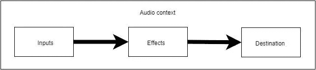
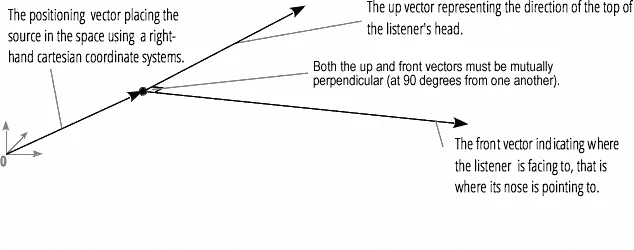

# 通过空间音效创造真正身临其境的元宇宙体验

> 原文：<https://betterprogramming.pub/create-a-truly-immersive-metaverse-experience-through-web3-sound-effects-c6c3645e27fa>

## 使用`AudioListener`和`PannerNode`接口实现空间音频效果(声音在听者头部周围移动)。


随着元宇宙和 3D 游戏(如《皇家战役》)的兴起，对虚拟环境中沉浸式音频体验的需求正在快速增长。空间音频是一种允许用户在虚拟场景中感知周围声源的位置和距离的技术，它正迅速成为创建沉浸式虚拟体验的重要组成部分。

为了应对这种快速增长的沉浸式音频体验需求，我们在 ZEGOCLOUD Express Web SDK(从 v2.10.0 开始)中添加了一个**接近语音**模块，该模块提供以下功能:

*   **邻近语音聊天**:虚拟空间聊天中的一种语音聊天形式，用户只能听到一定邻近范围内其他用户的声音，声音的音量根据听者与声源的距离而变化。
*   **空间音频**:虚拟空间中的用户可以像在现实世界中听到声音一样，感知到声源的位置和距离。
*   **团队语音聊天**:用户可以加入一个团队，随心所欲地在**团队专用**模式(用户的语音只能被同一团队的其他用户听到)和**所有人**模式(用户的语音可以被房间里的所有人听到)之间切换。

在本文中，我们将重点讨论如何使用 web 浏览器提供的 Web 音频 API 来实现空间音频效果。这是一个简单的[空间音频演示页面](https://keen_wang.gitee.io/demo/music3d_en)我们使用网络音频 API 制作的。

*   点击**播放**按钮开始播放音乐。
*   点击**打开/关闭空间音频**按钮，打开或关闭空间音频效果。
*   当打开空间音效时，你可以听到音乐在你的头部周围移动。

(要体验空间音效，您需要使用立体声耳机或扬声器。)

好吧。让我们深入了解更多细节。

## 网络音频 API 简介

Web 音频 API 可用于许多不同的音频操作。例如，它经常被用来代替`<audio>`标签在网络上播放音频。此外，它还提供其他音频处理功能，如音量调节、音频混合和音频空间化。

Web Audio API 允许您在**音频环境**中执行音频操作，并且被设计为允许**模块化路由**。用**音频节点**进行基本的音频操作，这些节点链接在一起形成一个**音频路由图**。一个非常基本的音频路由图如下所示:



在图中，输入、效果和目的模块是三个`AudioNode`,分别代表音频源、中间处理模块和音频目的。

下面描述了简单音频处理工作流程的基本步骤:

## 1.创建音频上下文

一个`AudioContext`代表一个由音频模块链接在一起构建的音频处理图，每个音频模块由一个`AudioNode`代表。它是一个中央处理单元，控制它包含的节点的创建和每个节点的音频处理的执行。

## 2.在创建的音频上下文中创建一个源节点和一个效果节点。

## 3.将源节点连接到效果节点

调用源节点的`connect`方法，将其连接到指定的效果节点。

## 4.将效果节点连接到音频上下文的目标

调用效果节点的`connect`方法，将处理后的音频发送到音频上下文的目的地。在这个例子中，目的节点`audioCtx.destination`代表当前正在使用的扬声器。

## 5.通过更改效果节点的属性来更改音频输出。

## 使用 Web 音频 API 实现空间音频效果

现在，让我们看看如何使用 Web Audio API 实现空间音效。

基本上，要将空间音频效果添加到音频源，您需要结合使用以下两个界面:

`AudioListener`:表示虚拟 3D 空间中唯一的听者。您可以从`AudioContext.listener`属性中获取音频上下文的监听器实例。

`PannerNode`:表示虚拟 3D 空间中的音频源。您可以调用`new`方法或`AudioContext.createPanner()`方法来创建一个`PannerNode`。

下面介绍如何设置`AudioListener`和`PannerNode`以实现您想要的音频空间化效果。

## 1.设置`AudioListener`

一个`AudioListener`描述了一个独特的人听音频空间化中使用的音频场景的位置和方向。一个`PannerNode`可以用来描述音源相对于听众的位置。

`AudioListener`的以下三个属性定义了它在右手笛卡尔坐标系中的位置:

*   `positionX`:表示听者的水平位置。默认值为`0`。
*   `positionY`:表示听者的垂直位置。默认值为`0`。
*   `positionZ`:表示听者的纵向(前后)位置。默认值为`0`。



以下三个属性在与位置值(`positionX`、`positionY`和`positionZ`)相同的右手笛卡尔坐标系中定义收听者的前进方向的位置:

*   `forwardX`:表示收听者前进方向的水平位置。默认值为`0`。
*   `forwardY`:表示听者前进方向的垂直位置。默认值为`0`。
*   `forwardZ`:表示听者前进方向的纵向(前后)位置。默认值为`-1`。

以下三个属性将听者头顶在同一右手笛卡尔坐标系中的位置定义为位置值(`positionX`、`positionY`和`positionZ`):

`upX`:代表听者头顶的水平位置。默认值为`1`。

`upY`:代表听者头顶的垂直位置。默认值为`0`。

`upZ`:表示听者头顶的纵向(前后)位置。默认值为`0`。

通过设置这两个方向向量，可以确定收听者耳朵的位置来创建空间音频效果。

## 2.设置`PannerNode`

`PannerNode`是音频处理模块，用右手笛卡尔坐标描述音频源信号在 3D 音频空间中的位置和移动。它使用音频源信号在`AudioContext`内相对于当前`AudioListener`的位置和方向来对其进行空间化。

以下是`PannerNode`的一些常用属性:

*   `panningModel`:一个枚举值，确定使用哪种空间化算法在 3D 空间中定位音频。默认值为`equalpower`，代表等幂平移算法。我们建议将该属性设置为`HRTF`，这意味着呈现比`equalpower`更高质量的立体声输出。
*   `positionX` / `positionY` / `positionZ`:音频在右手笛卡尔坐标系中的水平/垂直/纵向(前后)位置。
*   `orientationX` / `orientationY` / `orientationZ`:音频源矢量在右手笛卡尔坐标系中的水平/垂直/纵向(前后)位置。
*   `coneInnerAngle`:一个 double 值，描述一个圆锥体的角度，以度为单位，其内部不会有体积减少。默认值为`360`。
*   `rolloffFactor`:一个 double 值，描述当声源远离听者时音量降低的速度。默认值为`1`。
*   `distanceModel`:一个枚举值，确定当音频源远离听众时，使用哪种算法来降低音频源的音量。默认值为`inverse`。

## 3.实现音频平移效果

下面的代码片段显示了如何实现音频平移效果，使听众感觉音频在他们的头上移动。只需在音乐播放时改变`PannerNode`的位置值即可。

该功能仅对 SDK 采集的声音有效。开发人员可以在通话或直播过程中动态调整声音变化、混响、混响回声和虚拟立体声。

## 结论

本文给出了 Web Audio API 的基本介绍，并描述了如何使用`AudioListener`和`PannerNode`接口实现空间音频效果(声音在听者的头部周围移动)。

除了音频空间化，Web 音频 API 还有许多其他强大的音频处理功能。更多细节，你可以查看 MDN 上的[网络音频 API 文档。](https://developer.mozilla.org/en-US/docs/Web/API/Web_Audio_API)

关于 ZEGOCLOUD Express SDK 的邻近语音模块的更多细节，请参见 ZEGOCLOUD 网站上的[相关开发者文档。](https://docs.zegocloud.com/article/12341?_source=medium&article=1)

```
**Want to Connect?**Visit [ZEGOCLOUD website](https://zegocloud.com?_source=medium&article=1) to learn more about what you can build with real-time audio and video!
```