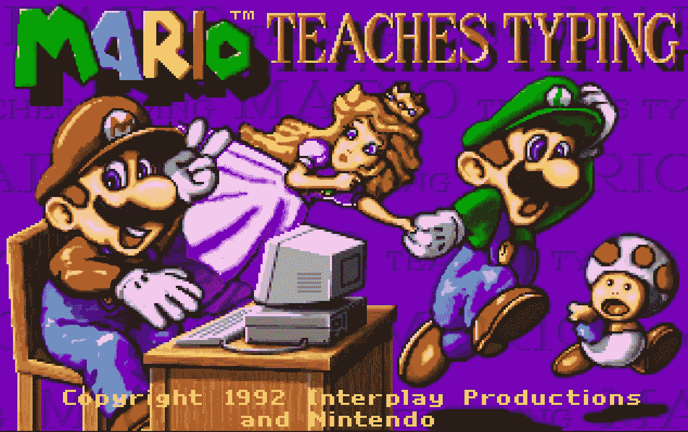
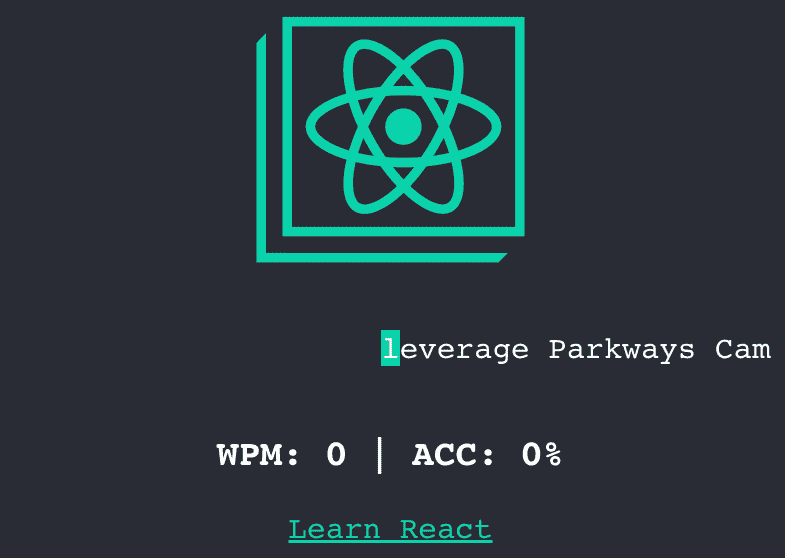
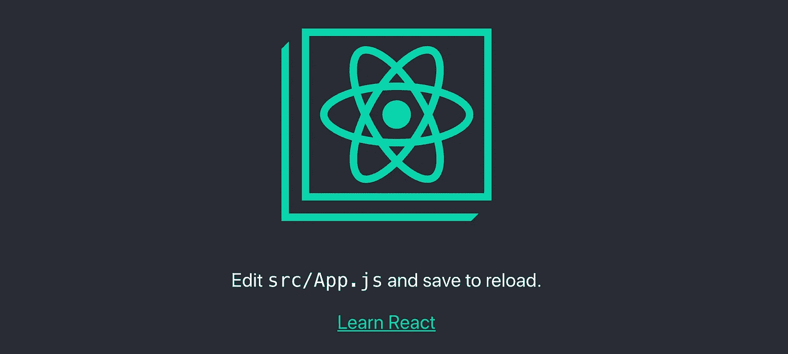
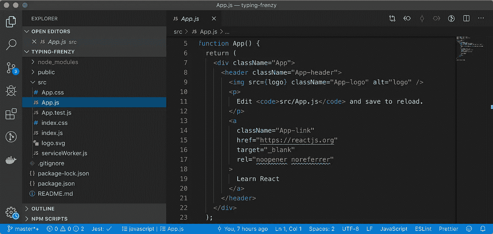
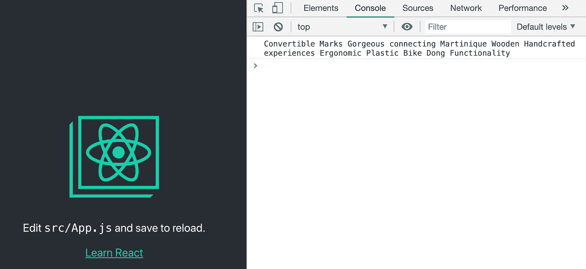
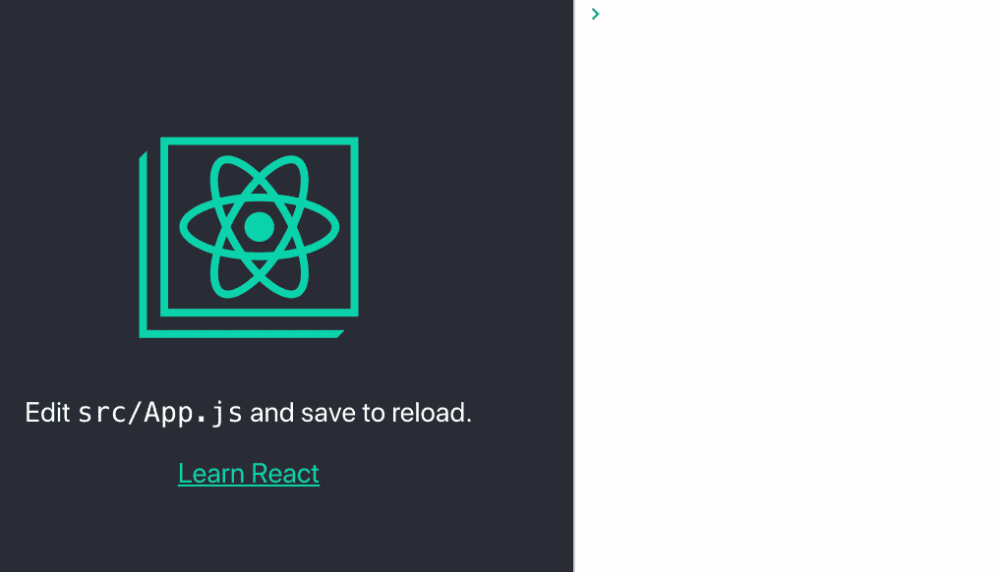
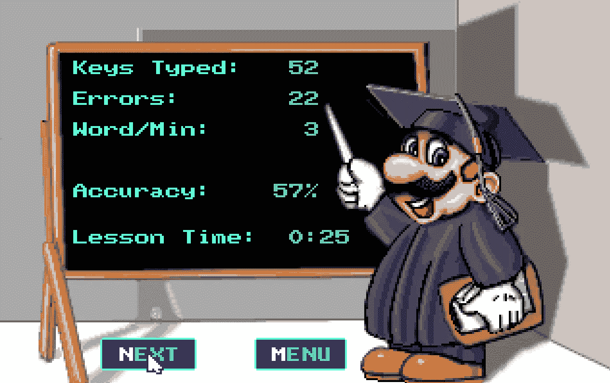
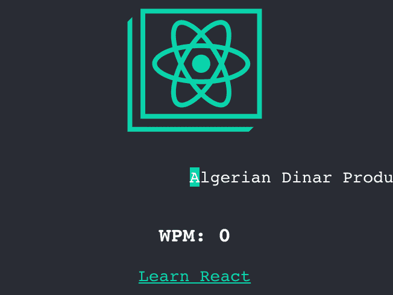

# 用 React Hooks、UseKeyPress 和 Faker 创建一个打字游戏

> 原文：<https://betterprogramming.pub/create-a-typing-game-with-react-hooks-usekeypress-and-faker-28bbc7919820>

## 有趣的 JavaScript 教程



[https://archive.org/details/msdos_Mario_Teaches_Typing_1992](https://archive.org/details/msdos_Mario_Teaches_Typing_1992)

啊，那些美好的旧时光！打字游戏勾起回忆，回忆勾起回忆。如果你是像我一样在 90 年代开始使用电脑的 90 后之一，你可能玩过《马里奥教打字》。

我们所有使用电脑的人一定都玩过至少一个打字游戏。你想过自己造一个吗？

这篇文章将教你如何在不到 10 分钟的时间内使用 [React Hooks](https://reactjs.org/docs/hooks-intro.html) 和 [Faker](https://faker.readthedocs.io/) 创建一个简单的打字游戏。



这将是你的应用程序的最终外观。激动吗？

# 什么是 React 钩子？

React 钩子是在 React 16.8.0 中引入的。钩子为你的无状态组件(也称为功能组件)提供状态。

基本钩有`useState`、`useEffect`、`useContext`。您可以根据不同的目的创建不同的挂钩。只有你的想象力是极限。

这里是 [React Hooks API 参考](https://reactjs.org/docs/hooks-reference.html)。为了避免讲述 React 和 React 钩子如何工作的冗长细节，我假设您已经对 React 和 React 钩子有了基本的了解。

# Faker 是什么？

[Faker](https://www.npmjs.com/package/faker) 是一个 npm 包，它生成随机的、真实的、虚假的输入。它通常用在单元测试中，每次用不同的输入运行测试。您的测试可能会通过`foo bar baz`，但是在其他情况下可能会失败。

例如，如果你的被测函数需要名字参数，你可以使用`faker.name.findName()`，它会给你`Myra Mills`、`Alexandrea Steuber`、`Magdalena Braun`等等。可以在 [Faker 演示页面](https://cdn.rawgit.com/Marak/faker.js/master/examples/browser/index.html#name)上玩。

在你的打字游戏中，你可以把它作为一个 word 数据源。稍后，您将构建一个不断发出单词供用户键入的单词生成器。

# 创建打字狂潮反应应用程序

既然您已经理解了依赖关系，那么是时候动手编写代码了。事不宜迟，在终端中创建您的项目:

```
create-react-app **typing-frenzy**
```

让我们称你的应用程序为*打字狂潮*。等待所有软件包安装完毕，运行以下命令:

```
cd typing-frenzy
npm start
```

你的浏览器应该会弹出一个新的标签并加载`http://localhost:3000`。如果你看到这个屏幕，你就完成了 20%。



紧接在 create-react-app 之后的默认 UI

根据您安装的`[create-react-app](https://github.com/facebook/create-react-app)`版本，您可能会看到不同的屏幕截图。`create-react-app`的版本是 3.1.1。

# 构建单词生成器

在 [VS Code](https://code.visualstudio.com/) 或任何你喜欢的 IDE 中打开项目。您的项目结构应该如下所示:



项目结构

这里保留默认代码。稍后您将充分利用这个默认代码。

运行以下命令安装 Faker:

```
npm i faker
```

在这个位置创建一个新文件夹和一个新文件:`/src/utils/words.js`。打开文件并粘贴以下代码:

*   将默认字数设置为 10。
*   创建一个新的 10 的空数组并填充`undefined`。这是创建具有定义大小的数组的快速方法。
*   调用`faker.random.word()`发出单字或复合词。
*   用空格连接所有单词。

要查看输出，请转到`App.js`，导入新出炉的`generate`函数，并记录输出:

保存文件并等待热重装。切换到浏览器，打开 Chrome 检查器(F12)，点击*控制台*标签。如果看不到任何输出，请刷新页面。



控制台日志显示了单词生成器的输出

如果你看到像这样的随机单词，这意味着你的 Faker 和 word generator 工作正常。

您可以多刷新几次页面来查看不同的一批单词。您应该注意到您的单词生成器具有以下特征:

*   没有复杂的符号。(可能有破折号、撇号、圆括号。)
*   有些单词的首字母是大写的。
*   超过 10 个字是因为`faker.random.word()`每次会发出一个字或者复合词。

当您完成测试后，删除`console.log`语句。

# 建立按键挂钩

在`/src/hooks/useKeyPress.js`创建一个新文件夹和一个新文件。

复制粘贴以下要点，是[https://usehooks.com/useKeyPress/](https://usehooks.com/useKeyPress/)的修改版:

1.  传入一个`callback`作为参数。您将在这个回调中完成大部分逻辑。
2.  调用`useState`钩子为被按下的键创建一个状态。每次按下一个键，你将调用`setKeyPressed`来更新当前的键。
3.  在`useEffect`里面做你的关键更新操作。可以考虑类似于`componentDidMount`或者`componentDidUpdate`的`useEffect`。[更多详情在此](https://reactjs.org/docs/hooks-reference.html#useeffect)。
4.  在`downHandler`中，当一个键被按下时，它是处理程序，您只根据两个条件更新被按下的键。首先，检查它是否是不同的键，以防止当用户长时间按住该键时注册相同的键击。第二，检查是否是单字符键，即不是 CTRL、Shift、Esc、Delete、Return、Arrow 等。
5.  在`upHandler`内部，当一个键被按下(释放)时，将当前键状态设置为`null`。这是为了让它很好地与步骤 4 一起工作。
6.  向浏览器窗口注册处理程序。
7.  在`useEffect`的结尾，返回一个进行清理的函数。在这种情况下，用浏览器窗口注销处理程序。
8.  将`keyPressed`状态返回给调用者。在本教程中，您不必使用这个返回值。

让我们看看它是如何工作的。切换到`App.js`，导入`useKeyPress`，这样使用:

保存并等待热重装。按下键盘上的任意键，查看您的应用程序收到哪个键。



`useKeyPress`挂钩非常好用。以后可以在其他项目中使用。再次删除`console.log`语句。

# 设计打字行的状态

状态取决于你希望你的打字游戏是什么样子的。您希望用户看到一些输入字符(用户必须键入的内容)和一些输出字符(用户已经键入的内容)。

当前字符应该高亮显示，并始终保持在屏幕中央。


回到您的`App.js`并添加以下代码:

*   确保从`react`导入`{ useState }`。使用`useState`创建状态时，可以设置其初始值。
*   `leftPadding`:最初额外的 20 个空格，使`currentChar`保持在打字行的中间。
*   `outgoingChars`:空无一物。
*   `currentChar`:从您的单词生成函数中排除的字符串的第一个字符。
*   `incomingChars`:除第一个字符之外的单词生成器中的单词串。

您将存储`outgoingChars`和`incomingChars`中的所有字符，但是您将在 UI 中仅显示`outgoingChars`的最后 20 个字符*和`incomingChars`的第*20 个字符*。*

# 更新打字行的状态

在`useKeyPress`的回调里面更新上面的四个状态。当您仍在`App.js`中时，更新`useKeyPress`的回调，如下所示:

1.  将`outgoingChars`和`incomingChars`状态分配给临时变量，因为您需要多次使用它们。
2.  检查用户是否点击了正确的按键。否则，打字行的状态不会改变。
3.  将`leftPadding`减少一个字符。对于前 20 次正确的击键，此条件将为真。
4.  将`currentChar`附加到`outgoingChars`上。
5.  用`incomingChars`的第一个字符更新`currentChar`。
6.  删除`incomingChars`的第一个字符。检查`incomingChars`是否还有足够的字数。如果没有，用`generate`功能补充 10 个以上生词。

# 为输入行构建 UI

您将使用您的输入行替换`Edit src/App.js and save to reload.`。将你的注意力转移到你的`App`职能的`return`陈述上。用以下代码替换`<p></p>`标签:

代码基本上是不言自明的。您为打字行的三个部分创建了三个`span`:

*   左图:`leftPadding`和`outgoingChars`的后 20 个字符。
*   中心:`currentChar`。
*   右图:`incomingChars`的前 20 个字。

缺少样式。确保字体系列是等宽的很重要，这样每个字符都有相同的宽度，这保证了`currentChar`的位置总是保持在中心。

将以下样式添加到`App.css`:

*   `font-family: monospace;`:将应用程序中的每个文本设置为等宽。
*   `white-space: pre;`:使尾随空格占据与其他可见字符相同的字符宽度。如果不设置此样式，尾随空格将被视为空白。

这是相当多的编码。让我们测试你的应用程序并开始输入！


它看起来令人满意，但缺乏刺激，这是每分钟字数(WPM)和准确性。

# 构建 WPM



WPM 的计算方法是将*字数*除以*分钟数*。也就是说，你还需要三个新的州:

要获得以毫秒为单位的当前时间，您需要一个简单的 util 函数。使用以下代码创建`/src/utils/time.js` :

将`{ currentTime }`导入`App.js`。用以下代码更新`App.js`:

1.  当用户开始输入第一个字符时，设置`startTime`。在应用程序完全安装之前不要设置它。用户不会高兴的。
2.  当用户将要完成单词时，重新计算 WPM。在这种情况下，您需要检查下一个要键入的字符是否是空格。
3.  增加字数。
4.  以分钟为单位计算运行时间。虽然你会在一分钟之前得到`0.**`分钟，但是 WPM 仍然有效。
5.  设置 WPM。将小数位数限制为两位。

现在您已经有了 WPM 状态，通过添加下面的代码来更新您的 UI，就在`<p></p>`标签的下面:

保存并热重装您的应用程序。当你输入完第一个单词后，你会看到 WPM 更新。每打完一个字都会有波动。



你的 WPM 是多少？

# 构建准确性

准确度是所有击键中正确击键的百分比。您已经有了正确的按键，即`outgoingChars`。用以下代码更新`App.js`:

1.  再宣布两个州。`accuracy`用于显示精度。`typedChars`用于存储所有按下的键。
2.  通过追加所有已按下的键来更新`typedChars`。
3.  用`outgoingChars`的长度除以`typedChars`的长度来设定`accuracy`。将小数位数限制在两位。

WPM 旁边显示精度(ACC ):

保存并重新加载。下面是《打字狂潮》的最终版本:


WPM vs 准确率，你更在乎哪个？

# 还有什么可以补充的？

还有几十个东西要补充。你可以显示一个计时器，将每次打字时间限制在一分钟，增加单词生成器的复杂性，显示前 10 个最常见的错误键，将你的 React 应用上传到 GitHub 页面，等等。

打字狂潮在手机上不起作用，因为没有输入栏你无法调出软键盘。但是，应该有一个解决方法。如果对本教程的反应良好，可能会有第 2 部分。

# 离别赠言

React 钩子改变了你定义和更新状态的方式。所有的操作都可以在不同的钩子中完成，这不需要您将功能组件更改为有状态组件。让你自己上钩吧！

你可以在这里找到[源代码](https://github.com/taingmeng/typing-frenzy)和[现场演示](https://taingmeng.github.io/typing-frenzy/)。我希望你喜欢这个教程！