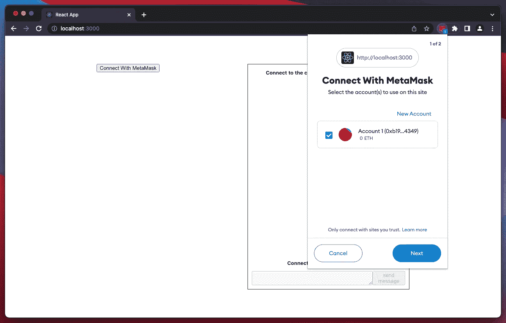
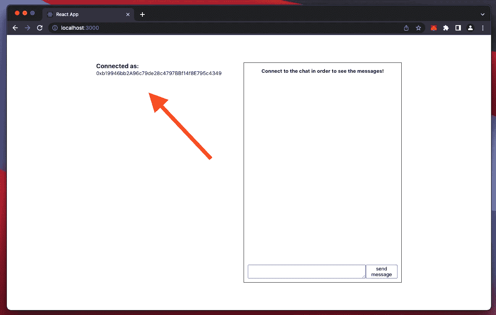
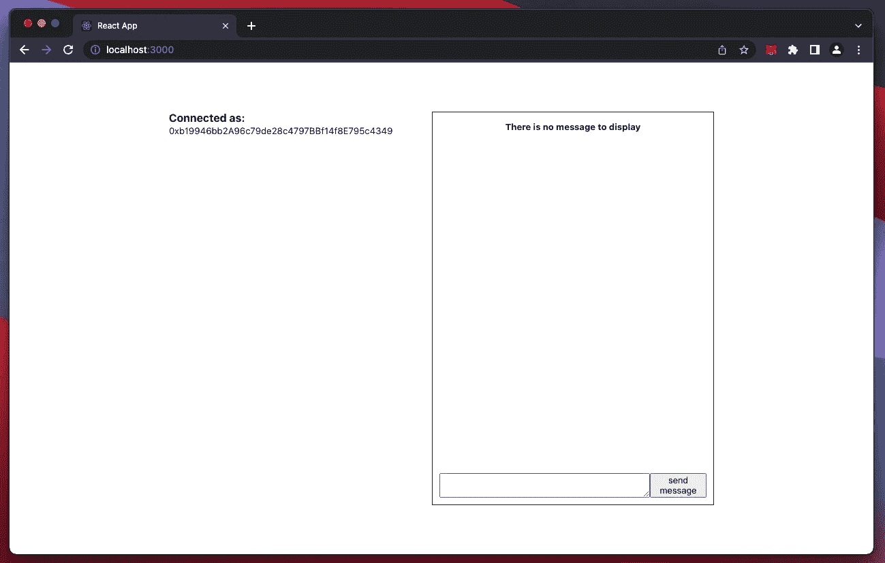
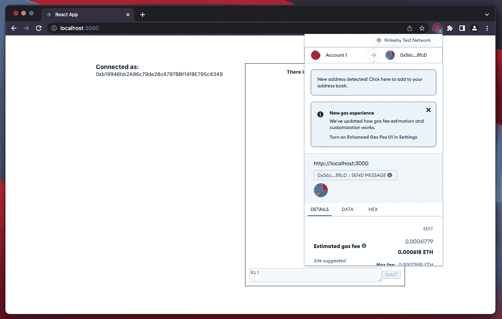
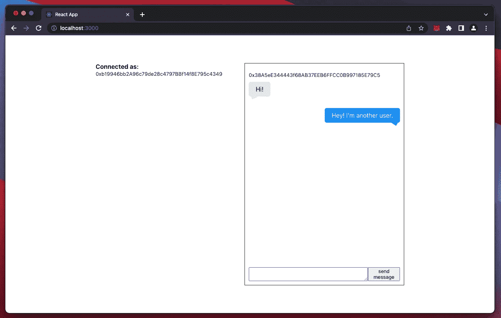

# 创建一个由以太坊支持的 Web3 聊天

> 原文：<https://betterprogramming.pub/create-a-web3-chat-powered-by-ethereum-6886824fad7a>

## 谁能想到会这么容易？


由 [Shubham Dhage](https://unsplash.com/@theshubhamdhage?utm_source=unsplash&utm_medium=referral&utm_content=creditCopyText) 在 [Unsplash](https://unsplash.com/@theshubhamdhage?utm_source=unsplash&utm_medium=referral&utm_content=creditCopyText) 上拍摄

在本文中，您将学习如何将以太坊智能合约连接到 React 应用程序，并使用户能够与之交互。

如果你是以太坊或智能合约开发的新手，我强烈推荐你阅读我以前的文章— [用 Remix Ide](https://medium.com/web3-magazine/create-your-first-ethereum-smart-contract-with-remix-ide-667e46e81901) 创建你的第一个以太坊智能合约。

事实上，我们将重用我们在那里建立的智能契约。它还将为您提供开发、测试以及将智能合约部署到测试网络(Rinkeby)的完整基础知识。

# 先决条件

*   要在浏览器中安装元掩码扩展
*   代码编辑器
*   以下主题的一些知识:以太坊，元掩码，反应，打字稿

> 在以太坊主网**上工作需要真金白银！**
> 
> ⚠️在本教程中，我假设你的元掩码设置为使用 **Rinkeby** 。Rinkeby 是一个 t **est network** 它复制了 Mainnet 并允许我们免费部署和使用智能合约！

# 该项目

我们将为这种基于区块链的聊天构建一个界面，如下所示:


*   一个**侧边栏，左边的**，**，**包含一个按钮，用于连接(上面不可见)聊天或指示连接用户的地址。
*   一个**聊天框，**在右边，在那里显示的消息和一个输入张贴消息到聊天。

> ℹ️:在这篇文章中，我们不会关注如何让用户界面变得漂亮，我们的目标是关注如何以最简单的方式与智能合约交互！

我尽了最大努力让这个教程简单易懂，但是如果有什么地方不行，也不要气馁，你会在本文末尾找到一个 GitHub repo 的链接，里面有已经完成的项目！

# 智能合同

我们将要连接到我们前端的智能合约是我们在上面提到的教程中创建的，有一点小小的不同，如下所示:

```
// SPDX-License-Identifier: MIT
pragma solidity 0.8.12;contract BlockchainChat {
  **event NewMessage(address indexed from, uint timestamp, string message);** struct Message {
    address sender;
    string content;
    uint timestamp;
  } Message[] messages; function sendMessage(string calldata _content) public {
    messages.push(Message(msg.sender, _content, block.timestamp));
    **emit NewMessage(msg.sender, block.timestamp, _content);**
  } function getMessages() view public returns (Message[] memory) {
    return messages;
  }
}
```

`event`、`emit`那些是什么东西？

> ℹ️ **事件**用于通知外部用户区块链上发生了一些事情。

在我们的例子中，“外部用户”是我们的前端应用程序，它将侦听发送到智能合约的新消息，因此我们可以立即在我们的 UI 中显示它们。

这就是变化，让我们在我们的应用程序上工作。

# 前端

我准备了一个样板文件，这样你就可以马上开始编码了！

这样，我们可以专注于重要的事情:将我们的前端连接到我们的区块链聊天智能合约。

下面是一个 Github 到 starter 项目的链接:

[](https://github.com/thmsgbrt/web3-chat-powered-by-ethereum-starter) [## GitHub-thmsgbrt/web 3-chat-powered-by-ether eum-Starter:我的教程如何…

### 这个项目是用 Create React App 引导的。在项目目录中，您可以运行:在…中运行应用程序

github.com](https://github.com/thmsgbrt/web3-chat-powered-by-ethereum-starter) 

一旦你克隆了项目，用`npm install`安装了依赖项，用`npm start`启动了它，花几分钟检查几个文件，看看应用程序是如何构建的。这是非常基本的反应，所以我不打算解释它。

以下是我们的行动计划:

```
A- Enable users to connect to the chat via MetaMaskB- Instantiate the Smart Contract in our frontendC- Fetch the messages from our Smart Contract and display themD- Enable users to post a message to the chatE- Listen to new messages
```

# a-允许用户通过元掩码连接到聊天

为此，我们首先需要确保浏览器上安装了 MetaMask 扩展。

让我们创建一个允许我们这样做的钩子:

。/src/useIsMetaMaskInstalled.ts

很直白！解释:

> ℹ️ MetaMask 在`window.ethereum`注入一个全局 API。该 API 允许网站请求用户的以太坊账户，从用户连接的区块链读取数据，并建议用户签署消息和交易。

既然我们已经准备好了钩子，那就向`Sidebar.tsx`前进，这样我们就可以利用它了:

。/src/components/Sidebar.tsx

好吧！现在，我们有了一种方法来检测是否安装了元掩码，如果没有，我们可以警告用户需要在浏览器上安装元掩码。

接下来，让我们添加一个`onClick`处理程序到“与元掩码**”**按钮:

。/src/components/Sidebar.tsx

太好了，现在，当用户点击使用元掩码连接时，元掩码扩展将提示一个模态，并询问使用哪个帐户:



MetaMask 要求我们连接到我们的聊天



您现在已连接！

🥳祝贺你！侧边栏现在显示你的以太坊地址！

# b–在我们的前端实例化智能合同

为了能够获取消息并使用户能够发送消息，我们需要有一种与我们的智能合约进行通信的方式。

为此我们将使用`ethers`库！

> ℹ️ `ethers`是一个帮助我们的前端与我们的智能合约对话的库。`Ethers`通过一个提供者(在我们的例子中是元掩码)连接到以太坊节点，这允许我们做很多事情！在 npmjs.com[上阅读更多相关信息。](https://www.npmjs.com/package/ethers)

让我们在`ethers`的帮助下创建另一个挂钩，它将允许我们与智能合同进行交互:

。/src/useChatContract.ts

让我们来分解一下:

*   我们首先检查 MetaMask 公开的`window.ethereum`是否存在，并从中获取一个 Web3 提供者，
*   如果`account`被定义，这意味着用户点击了“用元掩码连接”按钮，`webThreeProvider.getSigner()`返回他们的地址。
*   最后，我们返回一个与`new ethers.Contract()`的合同实例

## 实例化我们的智能合同

抬头看`App.tsx`，我们可以使用我们创建的钩子:

。/src/App.tsx

这很好，但是如果你注意的话，这个应用不再渲染了。我们有一个错误，这里有两件事要做:

*   不是合同地址，
*   而`./contract/BlockchainChat-artifact.json`是空的！

## 合同地址

这个地址告诉我们在区块链上哪里可以找到我们的区块链聊天智能合约。

如果您已经遵循了我在本教程开始时提到的前一篇文章，那么您已经拥有了自己部署自己的契约的一切。

否则，您可以使用我为您部署到 Rinkeby 的这些地址之一:

*   `0x56cD072f27f06a58175aEe579be55601E82D8fcD`
*   `0xD99f113cAd1fe2eeebe0E7383415B586704DB5a3`
*   `0x23CAEEA0Bb03E6298C2eAaa76fBffa403c20984f`

选择其中任何一个，它们都是导致部署区块链聊天智能合同的地址。

## **合同的 ABI**

我们的钩子期望一个来自`BlockchainChatArtifact`的`ABI`。这是两个新概念…

当你编译一个智能契约时，你得到的是所谓的工件。

> Remix 中的ℹ️(一个创建、编译、测试和部署智能合约的 IDE)，一旦你的智能合约被编译，你将在`contracts/artifacts`下找到工件。
> [阅读我之前的文章](https://medium.com/web3-magazine/create-your-first-ethereum-smart-contract-with-remix-ide-667e46e81901)我已经在本文开始时发布，以了解更多信息并使用 **Remix** 编译您自己的智能合同

**这个工件**包含了库的链接、字节码、部署的字节码、gas 估计、方法标识符和 ABI。它用于将库地址链接到文件。

**现在，什么是“ABI”:**

ABI 代表*应用二进制接口*。`ethers`需要我们的 BlockchainChat 智能合约的 ABI，以便了解我们的智能合约可以做什么(方法、事件、错误等)。)并为我们的前端提供与之交互的方法。

如果您自己没有部署智能契约，您仍然可以通过复制下面的工件继续本文。

[指向工件的要点链接](https://gist.github.com/thmsgbrt/1db36bc688d6984070badb14652ed65c)

太好了，应用程序现在应该渲染没有错误！

# c–从我们的智能合约中获取消息并显示它们

好吧！既然我们已经在前端实例化了智能契约，我们终于可以获得消息了。打开`Chat.tsx`，增加以下`getMessages`功能:

`Chat.tsx`通过它的 props 接收`chatContract`实例，我们可以用它来调用`chatContract.getMessages()`。收到消息后，我们填充我们的`messages`状态变量。

如果您聊天的智能合同发布了消息，它们应该在聊天框中可见。否则，让我们继续让我们的用户发送消息。以下是到目前为止您应该拥有的内容:



用户已连接，没有消息显示(还没有！)

# d–允许用户在聊天中发布消息

在`Chat.tsx`中，增加以下`sendMessage`函数发布消息:

让我们继续，在`textarea`中键入一条消息并发送它！这应该会提示元掩码，要求验证交易，请继续:



用户界面中的“发送消息”按钮有不同的状态。其内容根据交易状态而变化:

*   **“等待”**表示该交易需要用户批准
*   **“发送”**表示交易正在验证中。

要查看您刚刚发布的消息，请重新加载页面。而且应该补充一下。

太棒了。但是对于 UX 来说，必须重新加载页面来查看是否有新消息发布，这并不是非常友好的🤔。

救援事件！

# 听新消息

回到我们的智能合同。如您所见，当用户发布消息时，会发出一个事件:

```
contract BlockchainChat {
  **event NewMessage(address indexed from, uint timestamp, string message);** // ... function sendMessage(string calldata _content) public {
    messages.push(Message(msg.sender, _content, block.timestamp));
    **emit NewMessage(msg.sender, block.timestamp, _content);**
  } //...}
```

我们可以通过添加下面的`setupMessageListener`函数来监听这个事件:

继续，发送一条新消息，这一次，您不必重新加载页面就可以看到您刚刚发布的消息。如果另一个用户发送消息，这显然是有效的。



我们的聊天有效！

# 这里是最终项目

祝贺您完成本教程。我希望一切对你有用。正如我所承诺的，这是最终项目的链接:

[](https://github.com/thmsgbrt/web3-chat-powered-by-ethereum-finished-project) [## GitHub-thmsgbrt/web 3-chat-powered-by-ether eum-Finished-project:我的教程的完成项目…

### 这个项目是用 Create React App 引导的。在项目目录中，您可以运行:在…中运行应用程序

github.com](https://github.com/thmsgbrt/web3-chat-powered-by-ethereum-finished-project) 

感谢阅读！