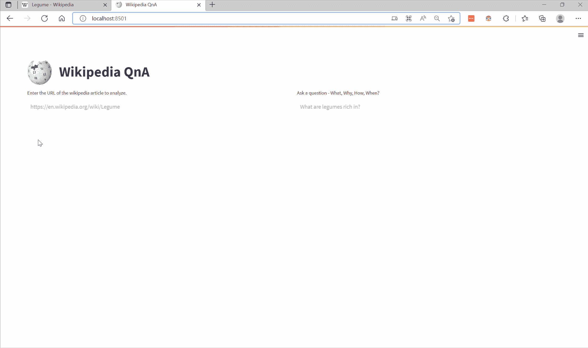
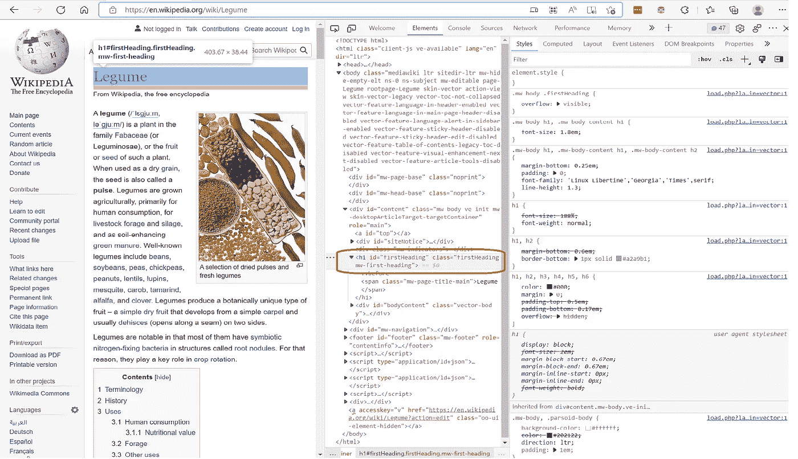
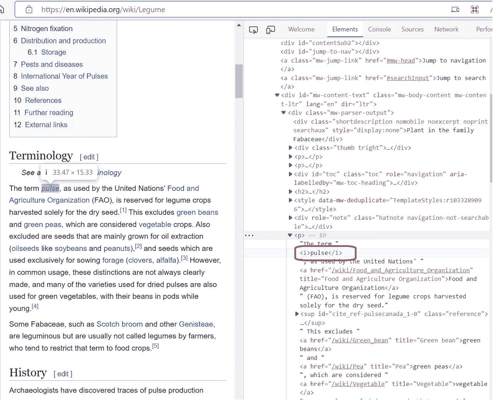
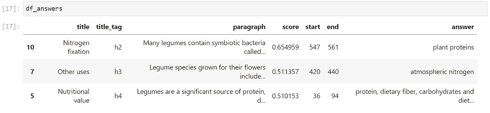
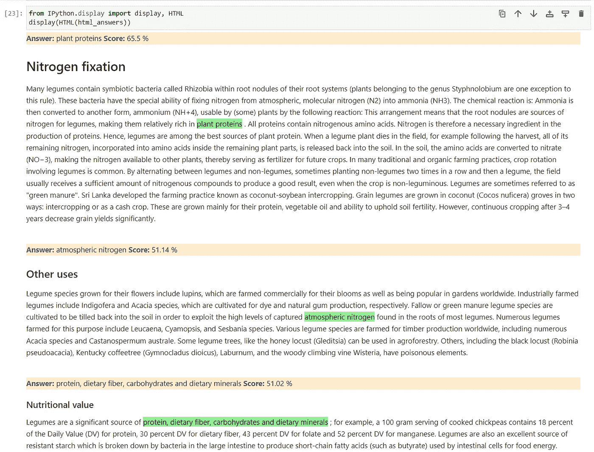
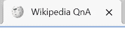

# 用 Python 创建一个维基百科问答应用

> 原文：<https://betterprogramming.pub/create-a-wikipedia-question-answering-app-with-python-2401e1789d6c>

## 有趣项目的逐步指南


罗伯特·林德在 [Unsplash](https://unsplash.com?utm_source=medium&utm_medium=referral) 上的照片

```
Table of Contents[Prerequisites](#ade3)[Demo of What we are Going to Build](#3748)[Project Setup](#384c)[Parsing Wikipedia Data With Beautiful Soup](#20b8)[Performing Questioning and Answering With Transformers](#399d)[Creating a Frontend User Interface With Streamlit](#15ae)
```

# 先决条件

您应该对 Python 和用 Python 创建环境有一些基本的经验。虽然我会详细讨论所有步骤，但是您将受益于以前使用任何命令行界面(CLI)的经验、Git 版本控制知识以及一些 HTML 和 CSS 知识。您还需要一个代码编辑器。我使用了 [VSCode](https://code.visualstudio.com/) 作为我的编辑器。我用 VSCode 的[终端窗口](https://code.visualstudio.com/docs/editor/command-line)作为我的 CLI。

# 我们将要构建的演示

我们的维基百科问答应用程序的演示如下所示。



我们将首先在左上角的输入中提供一个维基百科文章的 URL。一旦我们提供了这个输入并按下回车键，文章将被加载到屏幕左侧的 URL 输入下方。在我们上面的演示中，我们使用了'[https://en.wikipedia.org/wiki/Legume](https://en.wikipedia.org/wiki/Legume)'文章的 URL。

然后，我们可以在右侧的右上角的文本输入中提出一个问题。我们问的问题是，“豆类富含什么？”。当我们按 enter 键时，应用程序会找到三个答案及其相对分数。该应用程序还会突出显示每个答案的答案，并显示答案在文章中出现的部分。

现在让我们来看看如何创建这个应用程序。

# 项目设置

## 计算机编程语言

您需要在系统上安装 Python。可以按照官方[文档](https://www.python.org/downloads/)安装 Python。我安装了 [Python 3.10.7](https://www.python.org/downloads/release/python-3107/) 来创建这篇文章。安装后，您可以在命令行中使用“python — version”命令检查 Python 的版本。

```
vscode ➜ /workspace $ python --version 
Python 3.10.7
```

## 饭桶

您需要在系统上安装 git。你可以从官方文档[这里](https://git-scm.com/book/en/v2/Getting-Started-Installing-Git)安装 git。安装完成后，您可以在下面查看 git 的版本:

```
vscode ➜ /workspace $ git --version
git version 2.38.0
```

对于本文，我已经创建了一个 [git 存储库](https://github.com/MausamGaurav/NLP_Wikipedia_QnA_App)，其中包含了本文中使用的全部代码。您应该使用‘git clone<repository>命令克隆这个存储库，如下所示。

```
vscode ➜ /workspace $ git clone [https://github.com/MausamGaurav/NLP_Wikipedia_QnA_App.git](https://github.com/MausamGaurav/NLP_Wikipedia_QnA_App.git)
Cloning into 'NLP_Wikipedia_QnA_App'...
remote: Enumerating objects: 15, done.
remote: Counting objects: 100% (15/15), done.
remote: Compressing objects: 100% (9/9), done.
remote: Total 15 (delta 4), reused 15 (delta 4), pack-reused 0
Receiving objects: 100% (15/15), 472.47 KiB | 5.43 MiB/s, done.
Resolving deltas: 100% (4/4), done.
```

下面是我们的应用程序的结构，就像它在克隆的存储库中的样子。有两个文件叫做`Pipfile`和`Pipfile.lock`。这些文件包含我们的文章所需的所有包的信息。我们应用程序的代码包含在一个名为`src`的文件夹中。

```
.
├── Pipfile
├── Pipfile.lock
└── src
    ├── __init__.py
    ├── app.py
    ├── logo.png
    └── wikipedia.py
```

## Pipenv

对于本文，我已经使用`pipenv`创建了一个 python 环境。你可以从官方文件[中了解更多关于`pipenv`的信息。对于本文，您需要执行几个步骤。](https://pipenv.pypa.io/en/latest/)

*   在 CLI 中，使用命令`pip install pipenv`在您的基本 Python 环境中安装`pipenv`。

```
vscode ➜ /workspace $ pip install pipenv
```

*   为您的项目文件夹创建一个环境。导航到项目文件夹`NLP_Wikipedia_QnA_App`，它是在您从命令行克隆了上面的存储库之后创建的，并执行命令`pipenv shell`。

```
vscode ➜ /workspace $ cd NLP_Wikipedia_QnA_App/
vscode ➜ /workspace/NLP_Wikipedia_QnA_App (master) $ pipenv shell
Launching subshell in virtual environment...
 . /home/vscode/.local/share/virtualenvs/NLP_Wikipedia_QnA_App-ThmWYYmN/bin/activate
vscode ➜ /workspace/NLP_Wikipedia_QnA_App (master) $  . /home/vscode/.local/share/virtualenvs/NLP_Wikipedia_QnA_App-ThmWYYmN/bin/activate
(NLP_Wikipedia_QnA_App) vscode ➜ /workspace/NLP_Wikipedia_QnA_App (master) $
```

这将为您的项目创建一个虚拟环境。我们可以通过执行`pipenv install`简单地安装所有需要的 Python 库。这使用`Pipfile.lock`来安装所有需要的库。

```
(NLP_Wikipedia_QnA_App) vscode ➜ /workspace/NLP_Wikipedia_QnA_App (master) $ pipenv install
Installing dependencies from Pipfile.lock (c1f875)...
```

我们的项目使用的主要库如下:

1.  Streamlit: Streamlit 是数据科学社区中一个流行的框架，用于为各种数据科学项目搭建前端。你可以在这里了解更多关于 Streamlit [的信息。这很容易学。](https://streamlit.io/)
2.  美汤:美汤是一个 python 库，可以快速解析网页的 HTML 内容。图书馆的官方文档在这里。在本文中，我们将使用内置的 Python“requests”库来获取网页的 HTML 内容，然后使用 Beautiful Soup 来解析 HTML 内容。
3.  变形金刚:根据[官方文档](https://huggingface.co/docs/transformers/index),“变形金刚提供 API 和工具来轻松下载和训练最先进的预训练模型。”脸书维护着变形金刚库，官方网站包含各种自然语言处理任务的预训练模型。对于本文，我们将使用一个预先训练好的[“问答”模型](https://huggingface.co/models?pipeline_tag=question-answering&sort=downloads)。

项目配置完成后，我们现在解释创建应用程序的步骤。

# 用美汤解析维基百科数据

我们做的第一件事是获取给定维基百科文章 URL 的 HTML。这可以通过使用内置`requests`模块的 get 方法来实现。

然后我们使用 Beautiful Soup 解析页面内容。

我们可以编写一个名为`*get_soup*`的函数来实现这一点，如下所示。

一旦有了汤，我们就可以遍历维基百科文章中的所有 HTML 标签。我们的目标是挑选维基百科文章的所有部分。我所说的节是指标题和该节中的后续段落。如果您在浏览器中打开维基百科的 URL 并检查文章的源代码，您会看到所有的标题都包含在 HTML 标记中，如`h1`、`h2`、…、`h6`，所有的段落都包含在`p`标记中。



作者图片

对于每一段，内容都不直截了当。大多数情况下，段落包含更多的 HTML 标记来设置段落文本的样式。请参见下面的示例:



作者图片

因此，我们需要编写一个类似下面的函数来整理给定段落的所有子标签的内容。注意，在下面，参数`p`需要是一个使用 Beautiful Soup 提取的标签。

我还编写了一个函数来删除方括号中的所有数字`[]`，并从维基百科文本中删除`[edit]`。

我们希望创建一个包含标题和段落内容的所有部分的列表。正如已经解释过的，一个标题后面可以跟着多个段落，所以一旦我们发现一个标题后面有一个段落，我们就寻找后面的段落，直到我们到达该部分的结尾(也就是说，我们找不到任何其他后面的标题)。为了实现这一点，我们创建了一个名为`get_wiki_extract`的函数，如下面代码片段的底部所示。

在上面的`get_wiki_extract`函数中，我们使用`soup.find_all()`函数遍历所有标签。然后我们检查标签是否是一个标题，并且那个部分不是“内容”部分。我们会整理标题后面所有段落的文本，直到到达节尾。我们在一个名为`section`的列表中存储小节信息——清除的标题、标题标签和清除的段落文本。然后，我们将所有部分添加到一个名为`wiki_extract`的主列表中。该函数返回这个主列表。

为了演示这个函数的作用，我们对 URL '[https://en.wikipedia.org/wiki/Legume](https://en.wikipedia.org/wiki/Legume')'运行上面的函数并打印输出。

如果我们检查输出，我们返回从维基百科文章解析的所有部分的列表。每个部分都包含标题、标题标签和段落内容。

下一节讨论我们如何使用 transformers 库从提取的维基百科文章部分中寻找可能的答案。

# 用变形金刚表演问题和回答

我们将使用变形金刚库来执行问答。首先我们去官方[抱脸网站](https://huggingface.co/)选择一个合适的[问答预训模型](https://huggingface.co/models?pipeline_tag=question-answering&sort=downloads)。在我们的例子中，我们使用[‘Roberta-base-squad 2’](https://huggingface.co/deepset/roberta-base-squad2)模型。

这个模型使用起来很简单。我们首先下载预训练的模型，并使用`transformers`库中的`pipeline`对象将其加载到内存中。然后我们为加载的模型提供一个`question`和一个`context`。就是这样。该模型将预测答案、答案在上下文中的开始和结束位置以及预测的相对分数。这方面的演示如下所示:

上面的结果如下:

```
# Output
{'score': 0.30402547121047974,
 'start': 548,
 'end': 562,
 'answer': 'plant proteins'}
```

对于给定的问题和上下文，我们得到一个答案`plant proteins`,它带有一个分数以及在所提供的上下文中的开始和结束位置。

我们可以使用上述策略遍历维基百科文章的每一部分，找到一个可能的答案。为此，我们创建了一个名为`get_answers`的函数，如下所示。

如果我们运行上面的函数，这将返回一个答案列表。该列表中的每个答案都是一个字典，包含部分标题、部分标题 HTML 标记、段落和预测结果，即分数、开始和结束位置以及答案。从上面返回的带有示例 URL 和示例问题的答案列表对象如下所示:

我们可以在维基百科文章的不同部分预测答案。现在，我们需要以人类可读的格式呈现这些预测。

为此，我们希望只显示得分最高的前 n 个预测。我们可以通过将从上面的`get_answers`函数返回的 answers 对象转换成一个 [pandas](https://pandas.pydata.org/) dataframe，并使用`nlargest`方法按分数对 dataframe 进行排序来实现这一点。

例如，如果我们使用值为 3 的`top_n`,我们将得到下面的数据帧作为输出。



作者图片

接下来，对于顶部`n`答案中的每个答案，我们希望在相应的维基百科部分中突出显示该答案，以便用户可以看到该答案的上下文。我们也在维基百科的相应部分显示答案和分数。

这可以通过遍历上面创建的数据框架并使用特定的 HTML 和 CSS 样式来格式化部分和答案来实现。

从上面的代码生成的 HTML 在呈现时将如下所示。现在，答案的格式更易于阅读。



作者图片

获得前 n 个答案并将答案格式化为人类可读格式的上述功能可以通过一个函数`get_html_answers`来实现。代码如下:

本节之前的所有 Python 代码都被封装在一个名为`wikipedia.py`的模块中，该模块位于我们项目文件夹的`src`目录中。这个模块位于 git 库的[这里](https://github.com/MausamGaurav/NLP_Wikipedia_QnA_App/blob/master/src/wikipedia.py)。

在下一节中，我们将讨论如何创建一个前端 UI 来给我们的应用程序一个最终的形状。

# 使用 Streamlit 创建前端用户界面

前端的代码在`src`文件夹的`app.py`文件中。

我们首先导入`streamlit`，然后使用`streamlit.set_page_config()`方法设置页面的配置。我们设置页面标题，为页面提供一个 favicon，并将 Streamlit 应用程序的布局设置为 wide。

当应用程序在浏览器中运行时，上面将创建页面标题和 favicon。



作者图片

然后我们使用一些 CSS 和 HTML 来创建应用程序标题。CSS 和 HTML 可以使用`streamlit.markdown()`方法来呈现。注意，在下面的 HTML 中，我们打开了`src`文件夹中的`logo.png`图像，并使用内置的`base64` Python 库对其进行渲染。

上面的代码会产生下面的应用程序标题。


作者图片

然后我们在应用程序中添加两个`streamlit`栏，如下所示:

在第一列中，我们添加了`streamlit`文本输入。文本输入将包含维基百科文章的 URL。

当用户在 URL 文本输入中输入 URL 时，该 URL 被传递给文本输入下面的 iframe 对象。iframe 呈现维基百科文章。

在第二列中，我们为问题添加了一个文本输入。在这下面，我们添加一个旋转器。微调器将一直运行，直到我们的代码可以从维基百科文章中获得答案。我们需要导入前面创建的`wikipedia.py`模块来寻找答案。微调器将显示`Finding answer…`，直到来自`wikipedia.py`模块的函数`get_html_answers`完成处理维基百科文章以提供可能的答案。

就是这样。我们的 Streamlit 应用程序随时可用。`app.py`文件的内容如下所示:

要从 CLI 运行我们的应用程序，我们只需切换到`src`目录并运行命令`streamlit run app.py`。

```
(NLP_Wikipedia_QnA_App) vscode ➜ /workspace/NLP_Wikipedia_QnA_App (master ✗) $ cd src
(NLP_Wikipedia_QnA_App) vscode ➜ /workspace/NLP_Wikipedia_QnA_App/src (master ✗) $ streamlit run app.pyCollecting usage statistics. To deactivate, set browser.gatherUsageStats to False.You can now view your Streamlit app in your browser.Network URL: [http://localhost:8501](http://172.18.0.2:8501)
External URL: [http://152.37.88.161:8501](http://152.37.88.161:8501)
```

一旦上面的命令完成，我们在浏览器中打开 URL `[http://localhost:8501](http://localhost:8501)`，我们的维基百科问答应用程序应该启动并运行了！


作者图片

我希望你喜欢这篇文章！