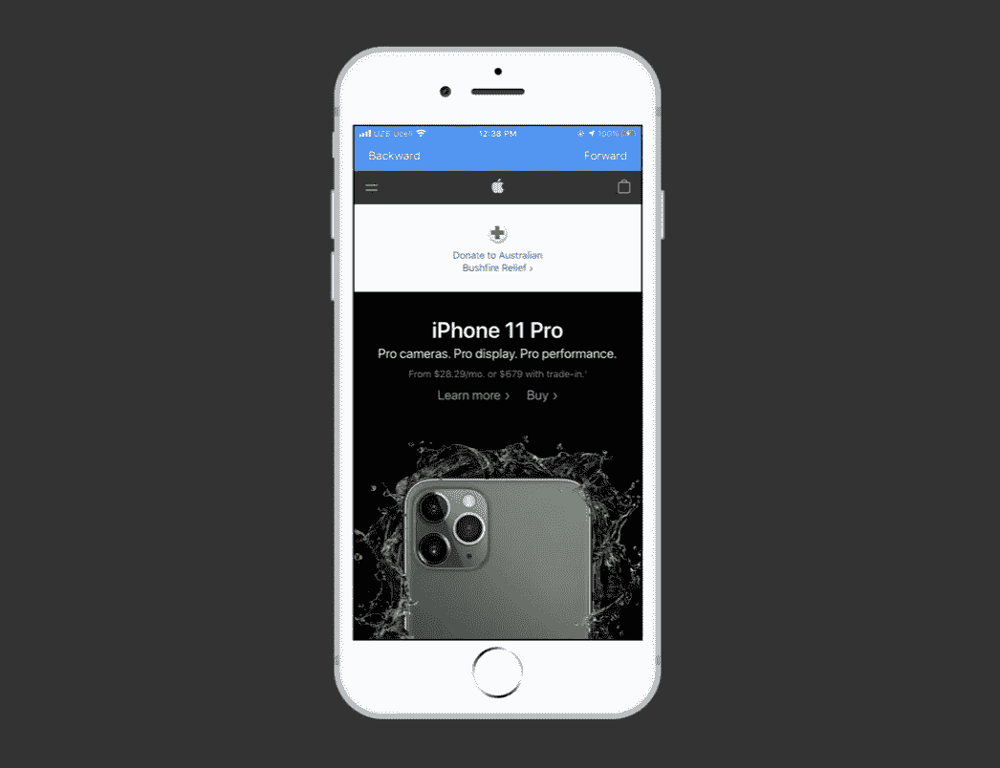
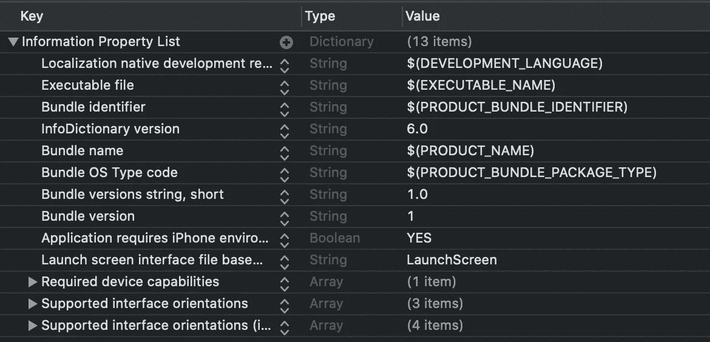
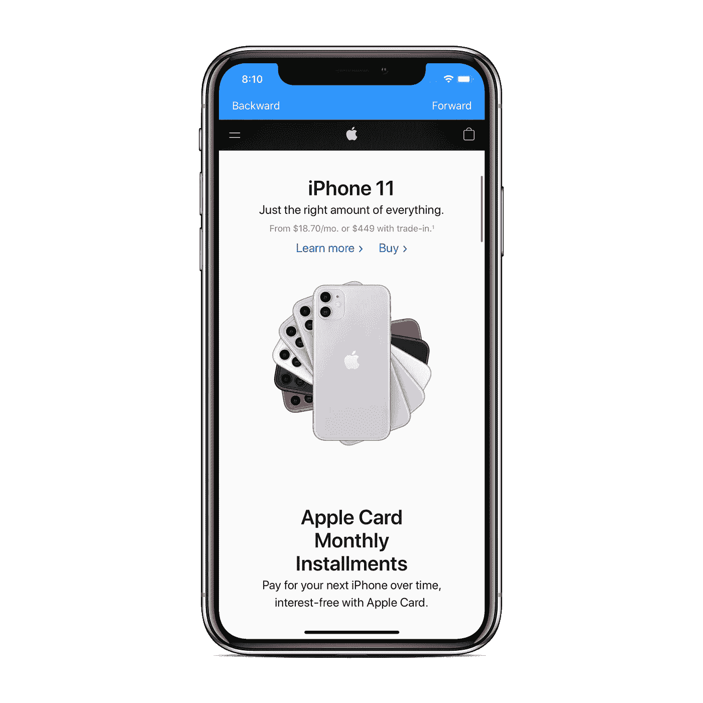

# 在 Swift 5 中以编程方式创建 WKWebView

> 原文：<https://betterprogramming.pub/create-a-wkwebview-programmatically-in-swift-5-fc08c8ad8708>

## 使用 NSLayoutConstraint 和自定义导航

在本文中，我将向您展示如何使用 Swift 5 在您的 iOS 应用程序中以编程方式实现一个 [WKWebView](https://developer.apple.com/documentation/webkit/wkwebview) 。

GitHub 上的[提供了最终实现的源代码。](https://github.com/zafarivaev/WKWebView-Demo)

# 我们开始吧

首先，我们应该创建一个全新的 Xcode 项目，我们可以随意命名。让我们按照一些简单的步骤来设置项目:

1.  连同`SceneDelegate.swift`一起删除`Main.storyboard`文件。
2.  删除`AppDelegate.swift`中的****两种`UISceneSession`生命周期方法:****

****3.在`Info.plist`中，选择并删除`Application Scene Manifest`、`Main storyboard file base name`。结果将如下所示:****

********

****我们需要为`AppDelegate.swift`文件中的`window`设置`rootViewController`。****

****我们将把`rootViewController`设置为一个`ViewController`嵌入到一个`UINavigationController`中，以便将来添加工具栏按钮项:****

****现在我们可以创建实际的`WKWebView`:****

## ****ViewController.swift****

****首先，导入`WebKit`库并创建一个`webView`属性。不要忘记将`translatesAutoresizingMaskIntoConstraints`设置为`false`，否则约束将不起作用:****

****现在，符合`WKUIDelegate`协议:****

****接下来，让我们通过实现`setupUI()`方法并创建约束来将`webView`定位在屏幕上:****

****我们终于可以展示我们的`WKWebView`了！为了在`webView`中显示实际的互联网资源，我们应该在`viewDidLoad`方法中执行以下操作:****

1.  ****调用我们新创建的`setupUI()`方法。****
2.  ****创建一个`URL`。****
3.  ****配置一个`URLRequest`。****
4.  ****在`webView`上调用`load(_ request: URLRequest)`方法。****

****现在，如果我们构建并运行该应用程序，我们将(在一段时间后)看到苹果网站的移动版本。****

# ****配置导航****

****让我们添加两个栏按钮项目，`forwardBarItem`和`backBarItem`:****

****为每个人创建操作:****

****现在相应地将它们设置为`leftBarButtonItem`和`rightBarButtonItem`。调用`viewDidLoad`中的`setupNavItem`方法和`viewWillAppear`中的`setupNavBar`:****

****现在我们可以在页面之间来回导航了！****

****最后，我们在应用中实现了 WKWebView:****

********

****更多信息，请查看[苹果官方的 WKWebView 文档](https://developer.apple.com/documentation/webkit/wkwebview)。****

****感谢您的阅读！****