# 创建机器学习 API 的零停机部署

> 原文：<https://betterprogramming.pub/create-a-zero-downtime-deployment-of-your-machine-learning-api-6486cb6394c3>

## 只要你愿意，随时可以毫不犹豫地用新型号替换旧型号


照片由[李宗盛](https://unsplash.com/@sarahleejs?utm_source=unsplash&utm_medium=referral&utm_content=creditCopyText)在 [Unsplash](https://unsplash.com/s/photos/taking-off?utm_source=unsplash&utm_medium=referral&utm_content=creditCopyText) 上拍摄。

机器学习 API 的独特之处之一是，随着新数据的到来，底层模型需要不断地重新训练。这导致频繁的重新部署，结果是频繁的停机。

在本文中，我将向您介绍一个解决这个问题的方案。下面的 GIF 展示了该解决方案的实际应用。左边是运行(重新)部署脚本的 API 服务器。右边是不断 ping 该 API 的客户端:

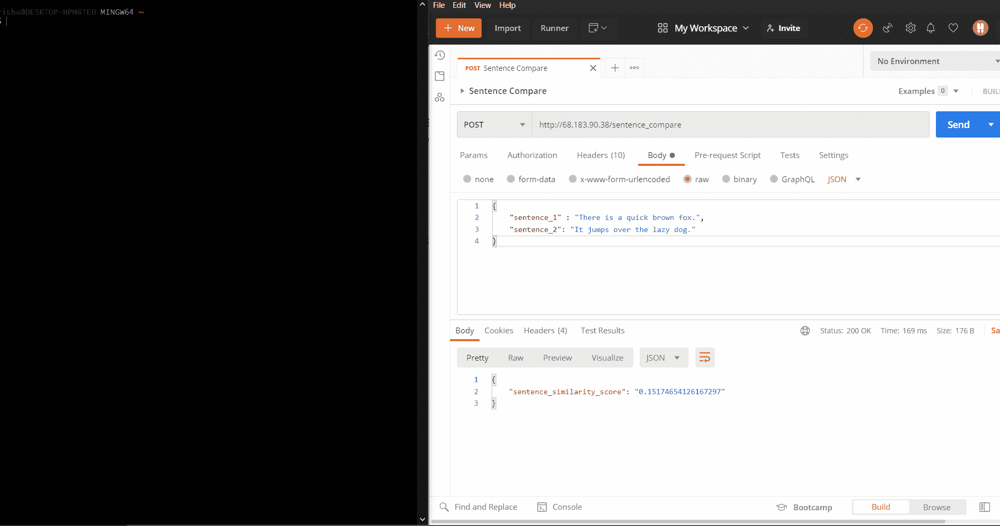

零停机时间。

即使部署脚本正在服务器上运行，API 也不会返回错误！

这个的代码可以在我的 GitHub 上找到。它实际上是我正在开发的[模板项目](https://github.com/RishabhMalviya/ml-deployment-template)的一部分。很快会有更多。

# 蓝绿色部署

我想出的解决方案受到一种叫做[蓝绿色部署](https://medium.com/@dantwining_26268/zero-downtime-blue-green-deployments-for-microservices-7896558623b2)的技术的启发。

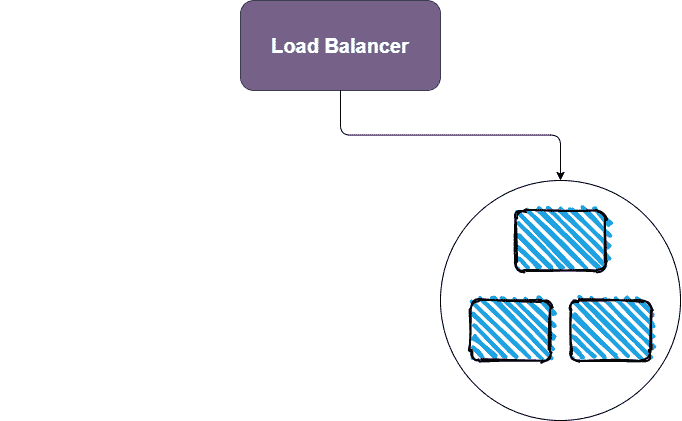

基本的想法很简单:你用你的新模型旋转容器，等待它准备好。然后，负载平衡器将流量从旧部署(本动画中的蓝色)转移到新部署(绿色)。

本文的其余部分将解释这是如何实现的，包括使用的技术和来自[模板项目](https://github.com/RishabhMalviya/ml-deployment-template/)的相关代码。

# 负载平衡器— Traefik 代理

大多数人自动使用 Nginx 进行负载均衡，但免费的 Nginx 负载均衡器无法动态检测下游服务器的变化。这对我们来说是一个问题，因为这使得蓝绿部署策略的最后一步不可能实现。

这就是为什么我们将使用名为 [Traefik 代理](https://doc.traefik.io/traefik/)的替代产品。

## 基本抽象

在理解 Traefik 如何解决我们的问题之前，我们需要熟悉它的底层抽象。

这一段和随后的图表(都直接取自 [Traefik 代理文档](https://doc.traefik.io/traefik/routing/overview/))提供了一个很好的起点:

> 当您启动 Traefik 时，您定义了[入口点](https://doc.traefik.io/traefik/routing/entrypoints)(在它们最基本的形式中，它们是端口号)。然后，连接到这些入口点，[路由器](https://doc.traefik.io/traefik/routing/routers)分析传入的请求，看它们是否匹配一组[规则](https://doc.traefik.io/traefik/routing/routers#rule)。如果是这样，路由器可能会在将请求转发到您的[服务](https://doc.traefik.io/traefik/routing/services/)之前，使用[中间件](https://doc.traefik.io/traefik/middlewares/overview/)来转换请求。”

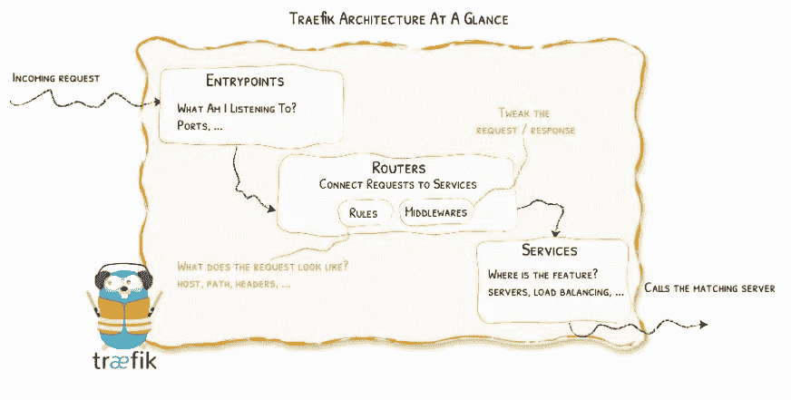

摘自 [Traefik 代理文档](https://doc.traefik.io/traefik/routing/overview/)。

上图在概念上可以进一步分为两个部分，每个部分都单独配置。

入口点是*静态配置*的一部分，而路由器和服务在*动态配置*中定义。这意味着您可以动态地添加和删除路由器和服务，Traefik 将确保流量始终正常流动。

就蓝绿色部署而言，这意味着我们可以启动绿色容器并关闭蓝色容器，而不必重新初始化 Traefik。由于下游容器是动态配置的一部分，Traefik 将自动为我们注册这些更改。

我们来了解一下这是如何一步步实现的。

## 静态配置

Traefik 负载平衡器在它自己的容器中启动。这是描述如何创建容器的 docker-compose 服务:

`command`键下的条目构成静态配置。这些在 Traefik 第一次启动时生效，以后不能更改。

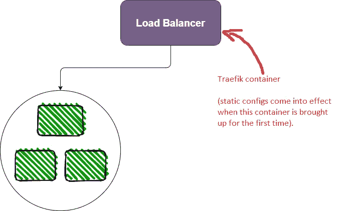

可能的静态配置的完整列表可以在文档中找到[。如果您浏览列表，您会注意到没有路由器或服务的配置选项。这是因为这些是动态组件。](https://doc.traefik.io/traefik/reference/static-configuration/cli/)

如果继续深入，您将开始看到名为`providers`的配置。

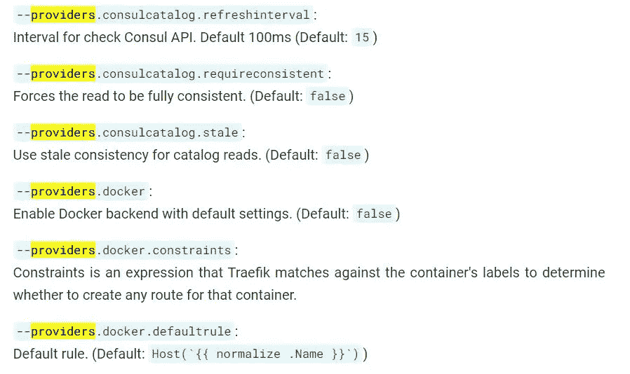

## 提供者和动态配置

提供者使得 Traefik 中的动态配置成为可能。文档[在配置发现标题下详述了提供者](https://doc.traefik.io/traefik/providers/overview/):

> “提供商是现有的基础设施组件，无论是编排器、容器引擎、云提供商还是键值存储。这个想法是，Traefik 将查询提供者的 API，以便找到关于路由的相关信息，并且每次 Traefik 检测到变化时，它都会动态地更新路由。"

在我们的例子中，提供者是 Docker 守护进程(如果您回到静态配置，您会发现条目`providers.docker=True`)。Traefik [与 Docker 守护进程](https://docs.docker.com/engine/api/)通信，以收集关于活动 Docker 容器的信息。

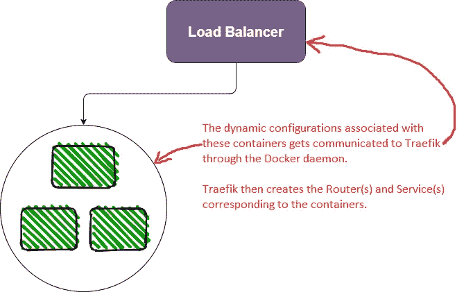

那么，我们如何在 Docker 容器和 Traefik 概念(如路由器和服务)之间进行转换呢？首先，我们有来自[文档](https://doc.traefik.io/traefik/routing/providers/docker/#general)的保证:

> Traefik 为每个容器创建一个相应的[服务](https://doc.traefik.io/traefik/routing/services/)和[路由器](https://doc.traefik.io/traefik/routing/routers/)

为了指定服务和路由器的配置，我们使用 Docker 容器标签。看看来自`docker-compose.yml`文件的服务定义:

动态配置都在`labels`键下提供。Traefik 使用它们来动态创建路由器和服务。动态配置选项的完整列表可在文档中查看[。](https://doc.traefik.io/traefik/reference/dynamic-configuration/docker/)

## 动态配置详细信息(可以跳过):负载平衡器

您会注意到所有的动态配置键中都有`loadbalancer`。这是因为可以部署单个容器的多个副本(使用 `[docker-compose up](https://docs.docker.com/compose/reference/scale/)` [命令](https://docs.docker.com/compose/reference/scale/)的`[--scale](https://docs.docker.com/compose/reference/scale/)` [选项)。因此，Traefik 自动将对应于一个容器(或一组副本)的服务配置为负载平衡器。](https://docs.docker.com/compose/reference/scale/)

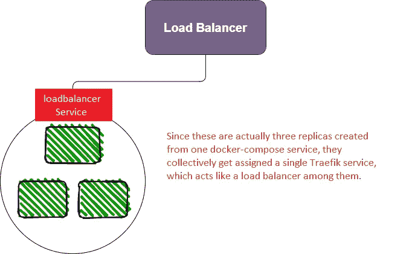

## 动态配置详情(可跳过)**:健康检查**

每个容器都需要一些时间来准备自己并准备好它的 API。为了避免向尚未准备好的容器发送请求，Traefik 允许您配置[健康检查](https://doc.traefik.io/traefik/routing/services/#health-check)。从文档中:

> “Traefik 将认为您的服务器是健康的，只要它们对健康检查请求返回在`2XX`和`3XX`之间的状态代码。”

我已经在 API 的`app.py`文件末尾添加了一个健康检查端点:

因为它是文件中定义的最后一个端点，所以我们可以确定如果`/health`端点正在响应，那么所有其他端点和资源都已经成功初始化。

# 部署脚本的演练

有了这些背景知识，让我们一行一行地浏览[部署脚本](https://github.com/RishabhMalviya/ml-deployment-template/blob/master/deploy.sh)并理解整个过程。

## 初始设置

首先，设置:

我已经设计了部署，以便所有的容器都部署在一个 Docker 网络上，`deployed-containers`。如果我们是第一次部署，许多资源会被初始化:

1.  第一，Docker 网(`deployed-containers`)。
2.  然后是反向代理(Traefik)。这是在`docker-compose up -d reverse-proxy`行中完成的。这将加载前面显示的静态配置，并设置 Traefik 来监视来自 Docker 守护进程的更改。
3.  最后，我们需要初始化一个名为`.colors`的文件，该文件跟踪当前/下一次部署的颜色。我从蓝绿色部署中借用了彩色部署的概念。这是我们将要运行的部署开始时的`.colors`文件的示例:

```
export DEPLOYED_COLOR="blue"
export IDLE_COLOR="green"
```

## 调出新的(绿色)容器

开始时，事情会处于这种状态:

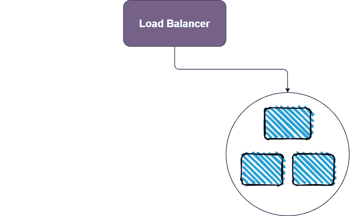

我们将从绿色部署开始:

这里有两件事需要注意:

1.  `— scale model=$REPLICAS`。它告诉 docker-compose 构建“绿色”部署的`$REPLICAS`副本。
2.  `[— p $IDLE_COLOR](https://docs.docker.com/compose/reference/overview/#use--p-to-specify-a-project-name)`。它用于给`docker-compose`指定一个项目名称空间。这对于隔离绿色和蓝色部署非常重要。

这会把我们带到这一点:

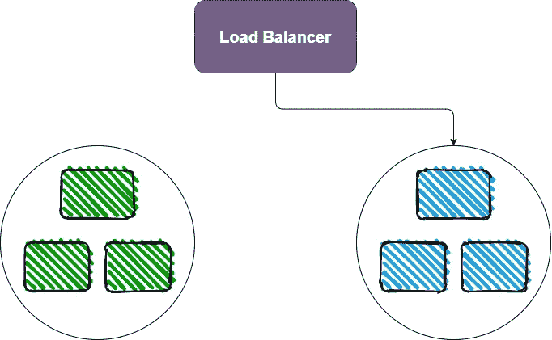

一旦绿色部署就绪(即，一旦运行状况检查通过)，Traefik 也将开始向这些绿色部署发送流量。那么我们将处于这种状态:

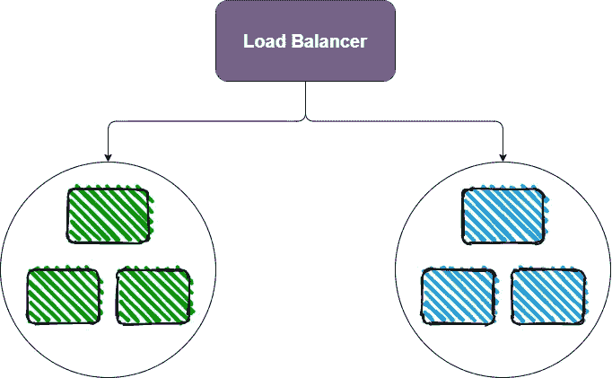

## 取下旧的(蓝色)容器

下一步是取下蓝色的容器。我们必须手动操作，但只能在绿色容器准备好之后。不幸的是，没有办法从 Traefik 外部单独 ping 绿色或蓝色容器的健康端点。

为了解决这个问题，我在 API 中创建了一个`/deployment_color`端点。使用它，我们可以 ping Traefik 负载平衡器，并确定做出响应的容器的颜色。一旦我们得到`green`响应，我们就会知道绿色容器已经打开，我们可以继续关闭蓝色容器:

还记得我们如何使用`docker-compose`的`-p`标志将蓝色和绿色容器隔离到单独的名称空间中吗？现在，我们可以在不影响新部署的绿色容器的情况下，关闭蓝色容器。下面是在我的本地机器上演示的过程:

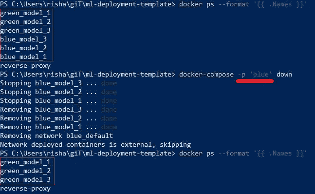

所以在放下蓝色容器后，我们将到达我们想要的最终状态:

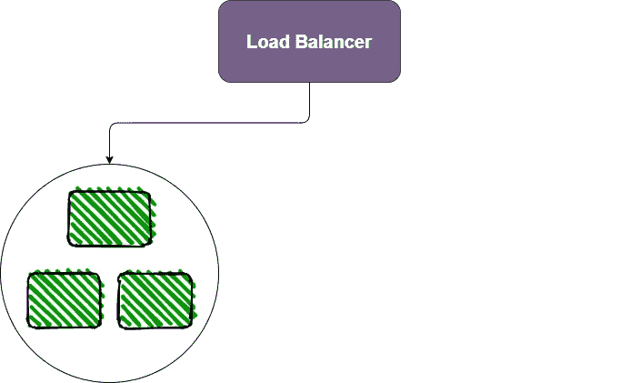

## 清除

现在剩下唯一要做的事情就是重置`.colors`文件中的值:

并清理任何悬挂的资源:

# 最终演示

下面是在我从 Digital Ocean 租用的 Linux 服务器上运行的重新部署过程的最终演示:


没错，就是和文章开头那张一样的 GIF。但是现在你有了背景。和欣赏。

这就是您的零停机部署！感谢阅读。

# 资源

*   [https://github.com/RishabhMalviya/ml-deployment-template](https://github.com/RishabhMalviya/ml-deployment-template)
*   https://doc.traefik.io/traefik/routing/overview/
*   [https://doc . trae fik . io/trae fik/reference/static-configuration/CLI/](https://doc.traefik.io/traefik/reference/static-configuration/cli/)
*   [https://doc . traefik . io/traefik/reference/dynamic-configuration/docker/](https://doc.traefik.io/traefik/reference/dynamic-configuration/docker/)
*   [https://github . com/RishabhMalviya/ml-deployment-template/blob/master/deploy . sh](https://github.com/RishabhMalviya/ml-deployment-template/blob/master/deploy.sh)