# 使用帧运动在 React 中创建令人惊叹的动画

> 原文：<https://betterprogramming.pub/create-amazing-animations-in-react-using-framer-motion-34c803f60c6f>

## 集成帧运动，为您的 React 应用增添趣味

来源: [Mick Truyts](https://unsplash.com/@mcktrts) 关于 [Unsplash](http://unsplash.com)

# 本文的目标

在本文中，我们将了解以下内容:

*   什么是框架运动
*   何时使用它
*   框架运动的基础
*   更高级的题目:`useCycle`、`AnimatePresence`和变体。

# 介绍

让你的 web 应用程序变得更有趣并增强用户体验的最好方法之一就是使用动画。有几个库可以将动画引入 React 应用程序。可以说，最好的一个是[框架器动作](https://www.framer.com/motion/)。

这个库的语法直观且易于使用。根据 LogRocket 的说法，默认情况下，Framer Motion 使用弹簧动画，这种动画很受欢迎，因为它们更平滑，看起来更自然。

我们开始吧！

# 入门指南

首先，我们需要初始化我们的项目存储库:

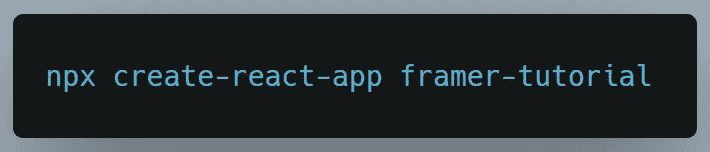

正在初始化项目存储库

完成之后，让我们继续安装这个项目所需的库。

## 安装依赖项

在本文中，我们将使用以下库:

*   `framer-motion`:将动画引入我们项目的核心库。

要安装此库，请运行以下终端命令:

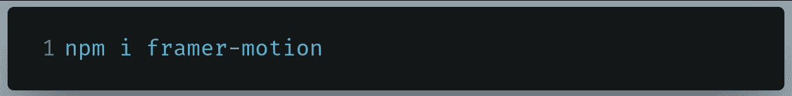

安装成帧器的命令-运动

完成后，我们将学习框架运动的基础知识。

# 框架运动:基础

## 设置

在这一节中，我们将介绍框架库的基础。首先，让我们将`framer-motion`库中的`motion`模块导入到我们的`App.js`文件中，如下所示:

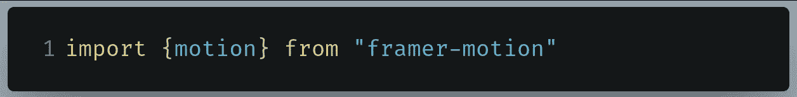

要在 App.js 中编写的代码

是时候编码了！在开始之前，在`App.js`中找到您的`return`块:

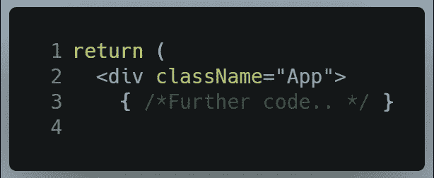

要在 App.js 中查找的代码

删除`div`开始和结束标签之间的所有代码。最后，`return`块应该是这样的:

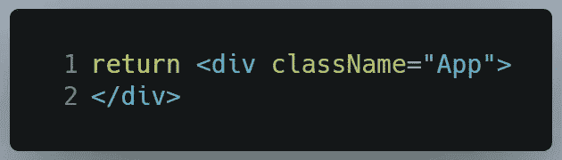

App.js 中要替换的代码

作为第一步，让我们用框架器使用`motion` 组件和`animate`道具来制作基本动画。

## 运动分量

运动部件是成帧器的核心。该团队为每个 HTML 元素构建了一个单独的`motion`组件。因此，您不需要编写额外的样板代码来激活您的元素。

例如，如果您想制作一个`p`标签的动画，您可以用它的关联`motion`组件替换它，如下所示:

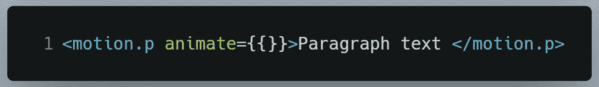

要在 App.js 中编写的代码

这会产生以下输出:

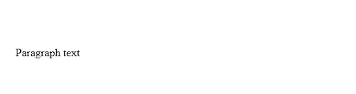

代码的输出

如你所见，这是一个普通的段落元素。唯一不同的是，它可以使用动画。要制作一个`div`元素的动画，你应该写`motion.div`。

此外，注意我们还在我们的`motion.p`组件中使用了一个`animate`道具。`animate`道具是做什么的？

要找到它，请转到`App.js`并找到我们刚刚编写的代码行:

现在像这样编辑它:

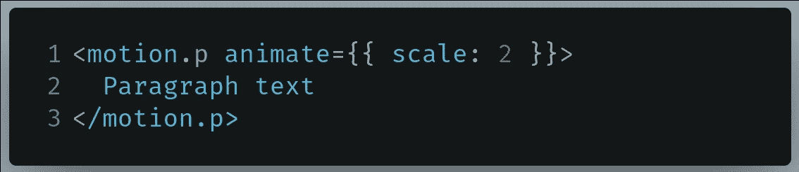

*   第 1 行:这里，我们告诉 Framer 将文本的尺寸放大两倍。

这将是结果:

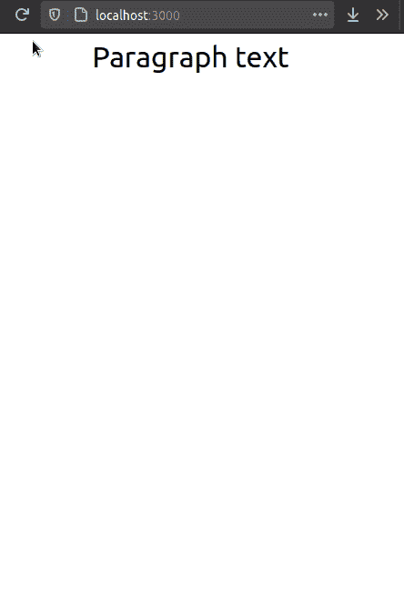

代码的输出

正如您所看到的，当`motion.p`将自己安装到 DOM 时，它在增加文本大小的同时播放动画。

这意味着`animate`属性实质上是在改变组件属性的同时播放动画。它接受我们想要激活的键值对。

让我们加快步伐。我们可以改变`motion.p`的`x`坐标，同时增加其文本大小，如下所示:

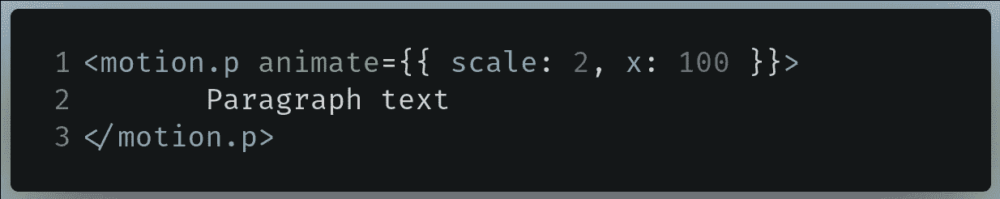

要在 App.js 中编写的代码

*   第 1 行:在动画过程中改变比例和`x`坐标。

这将是输出:

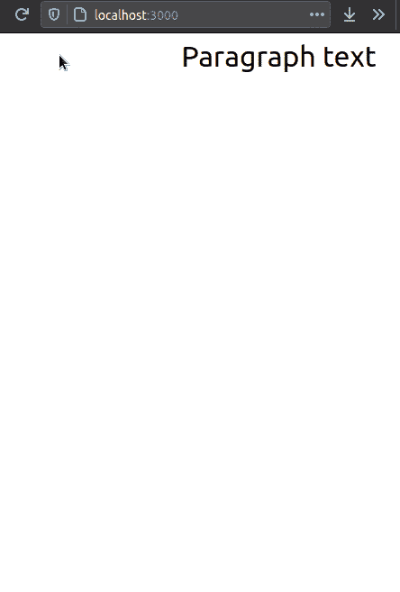

代码的输出

瞧吧！我们的代码起作用了。如你所见，用 Framer 写动画真的很容易。

让我们来了解一下`initial`道具。

## 最初的支柱

`initial`属性指定组件的起点或*初始*点。换句话说，它告诉成帧器元素在哪里从开始制作*的动画。另一方面，`animate`道具告诉成帧器元素在哪里制作*到*的动画。*

为了演示其功能，在`App.js`中编写以下代码:

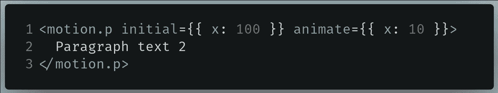

要在 App.js 中编写的代码

*   `1`线:组件的初始`x`坐标为`100`。在动画过程中，将`x`坐标改为`10`。
*   第`3`行:`motion.p`元素的结束标签。

总之，这段代码使我们的文本从右向左移动。

运行代码。这将是结果:

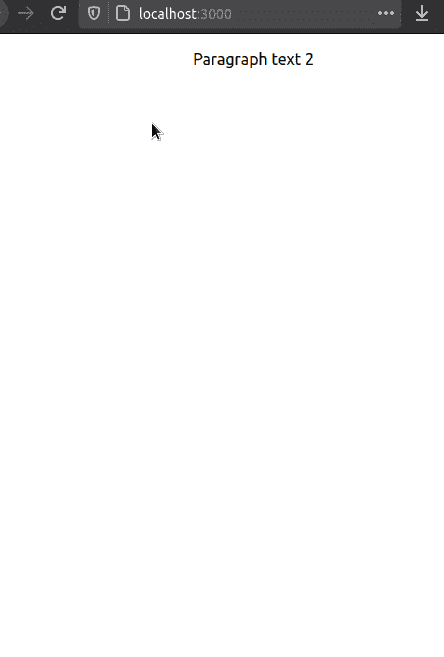

代码的输出

太好了！我们的代码有效。让我们用`initial`道具做更多的实验。

这段代码将给我们的文本一个很好的缩小效果:

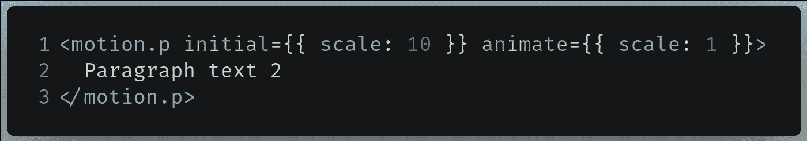

要在 App.js 中编写的代码

*   第`1`行:文本的初始尺寸应该是其原始尺寸的十倍。在动画过程中，将比例恢复到`1`。

这将是代码的输出:

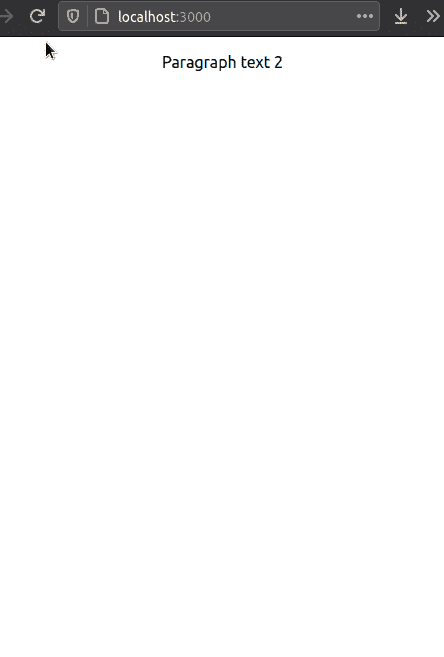

代码的输出

太神奇了！我们的代码有效。

在下一部分，我们将通过`transition`道具定制我们的动画。

## 过渡道具

现在我们已经制作了动画，如果我们对它们有更细粒度的控制，那就更好了。那改变它的持续时间，改变它的类型，甚至让动画永远循环呢？这就是`transition`属性的用武之地。

在`App.js`中，编写以下代码:

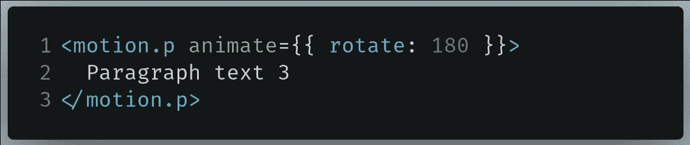

要在 App.js 中编写的代码

*   第`1`行:将文本旋转 180 度。

这将是结果:

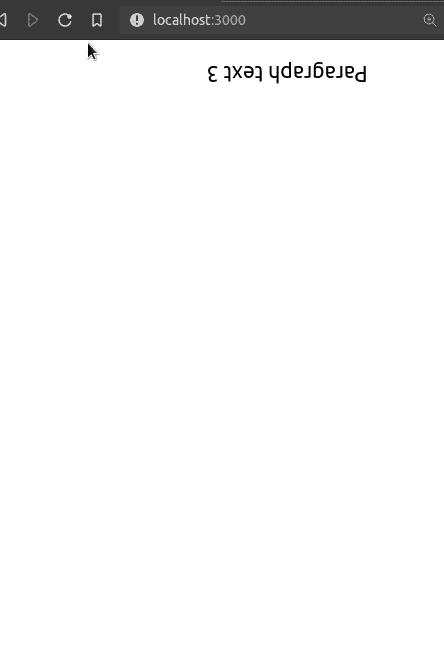

代码的输出

正如你所看到的，动画真的很快。让我们通过将持续时间改为两秒钟来使它变慢。

首先，回溯到我们刚刚编写的代码:

要在 App.js 中查找的代码

现在改变它，像这样:

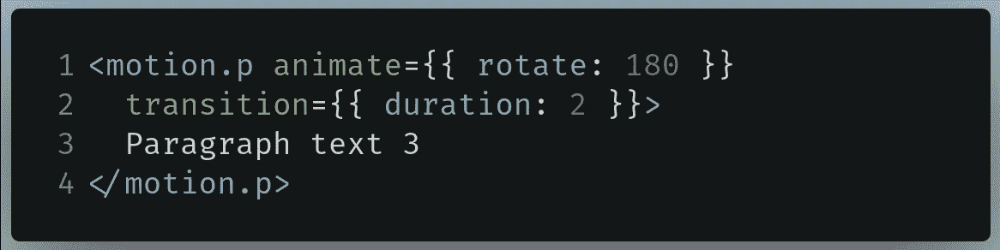

要在 App.js 中编写的代码

*   第`2`行:将动画时长改为两秒。默认情况下，持续时间为 0.3。

这将是结果:

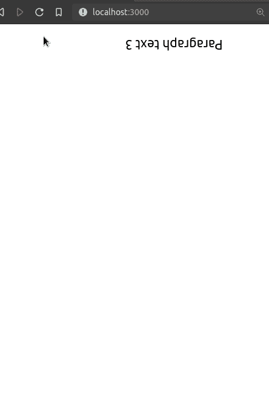

代码的输出

太好了！我们的代码有效。如你所见，我们的动画速度较慢。

让我们给我们的文本一个漂亮而缓慢的缩放效果:

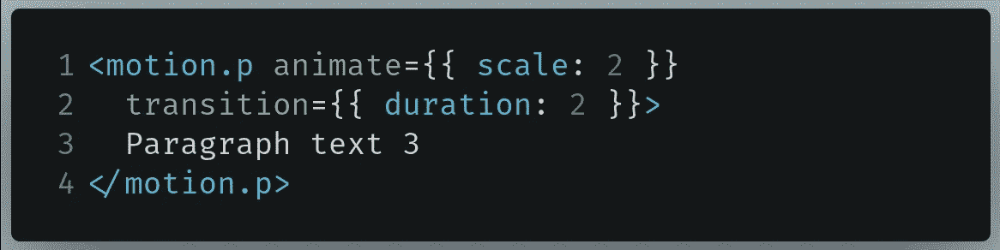

要在 App.js 中编写的代码

*   第`1`行:在动画过程中将文本尺寸放大两倍。
*   第`2`行:将动画时长延长至两秒。

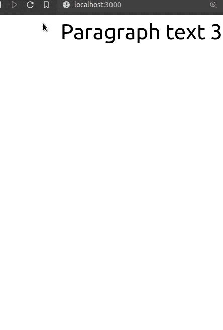

代码的输出

太好了！如您所见，我们得到了期望的输出。

让我们改变动画的类型。现在，我们将给我们的动画一个春天般的效果。

在`App.js`中，编写以下代码:

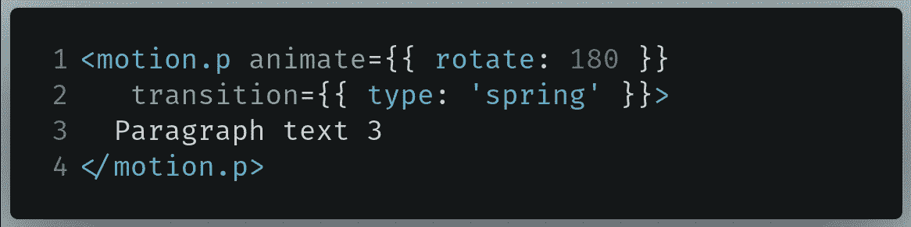

要在 App.js 中编写的代码

*   第 1 行:将文本旋转 180 度。
*   第 2 行:将动画类型改为`spring`。

这将是结果:

代码的输出

正如你所看到的，我们的动画有一种春天般的感觉。这意味着我们成功了！

我们甚至可以改变这种效果的弹性，就像这样:

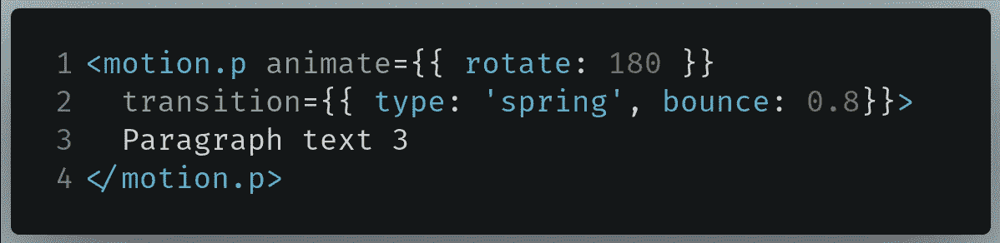

要在 App.js 中编写的代码

*   第 2 行:增加动画的弹性到`0.8`。默认值为`0.25`。如果`bounce`属性设置为 1，则动画非常有弹性，如果为`0`，则动画没有弹性。

这将是代码的输出:

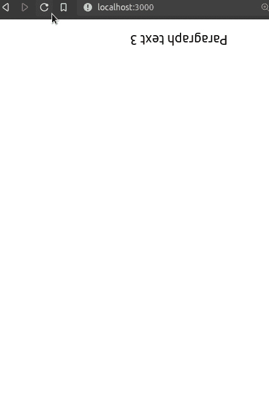

代码的输出

太好了！我们的代码有效。我们的动画有很好的弹簧效果。我建议你通过自定义其他属性来进一步玩`transition`道具，你可以在[官方文档](https://www.framer.com/api/motion/types/)中找到。

让我们继续为各种手势创建动画。

## 处理手势

在本文中，我们将介绍两种手势:

*   将鼠标悬停在将由`whileHover`属性处理的元素上。
*   点击或点击将由`whileTap`属性处理的组件。

先用`whileHover`道具吧。在`App.js`中，编写以下代码:

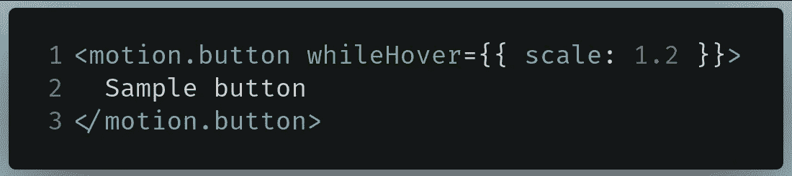

要在 App.js 中编写的代码

*   第`1`行:创建一个`motion.button`组件。此外，我们告诉 Framer，当用户悬停在按钮上时，将该元素放大 1.2 倍。

如果您将鼠标悬停在按钮上，将会出现以下结果:

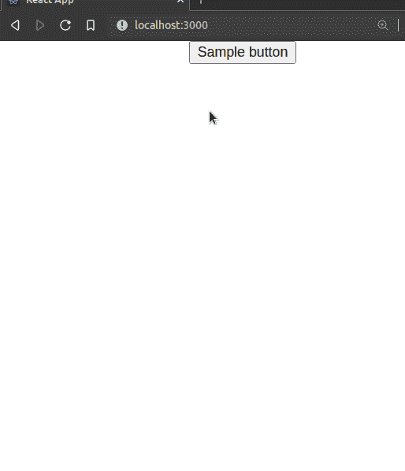

代码的输出

太好了！我们的代码有效。

下一步，我们使用`whileTap`道具。在`App.js`中，编写以下代码:

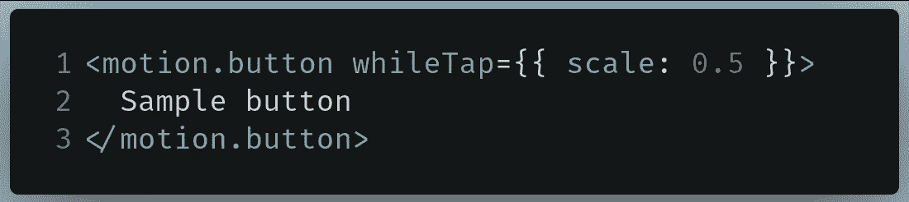

要在 App.js 中编写的代码

*   Line `1`:当用户点击或轻敲该按钮时，将其尺寸缩小一半。

如果您单击按钮，将会出现以下结果:

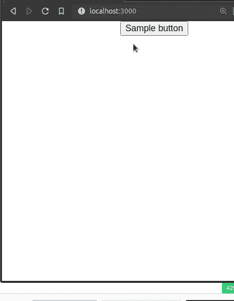

代码的输出

如您所见，当我们点击按钮时，组件的尺寸缩小了。当我们停止单击该元素时，组件会自动恢复到原始状态。

现在，我们已经了解了 React 中帧运动的基本原理，是时候深入了解帧运动中更复杂的主题了。

最后，`App.js`应该是这样的:

# 帧运动:动画表现，变体和使用周期

## 设置

在本节中，我们将创建另一个组件来演示 Framer 的高级主题。在您的`src`文件夹中，创建一个名为`FramerAdvanced.js`的文件。在那里，编写以下代码:

这只是一个空的组件。现在我们需要将它呈现给 DOM。

现在转到`index.js`并找到下面这段代码:

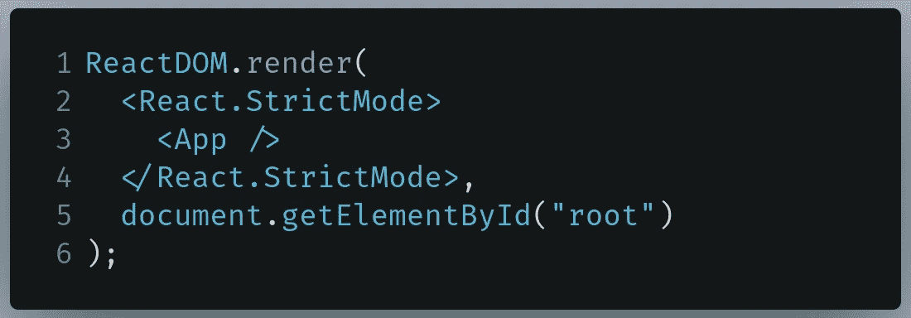

要在 index.js 中查找的代码

像这样改变它:

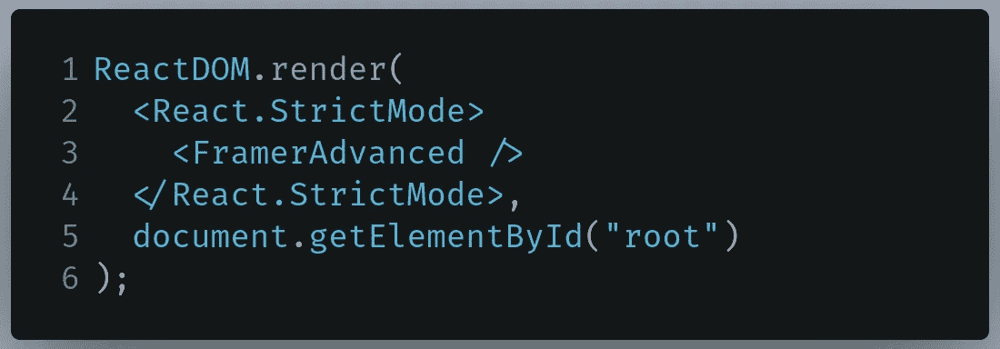

要写入 index.js 的代码

*   第`3`行:不渲染`App`组件，而是渲染`FramerAdvanced`组件。

这将在浏览器中呈现一个空白页面:

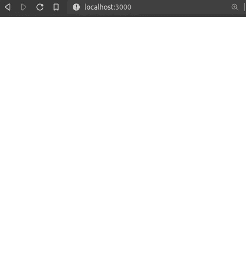

代码的输出

完成后，让我们学习一下`useCycle`钩子。

## useCycle 挂钩

在某些情况下，您希望组件的可视属性在不同的值之间交替。此外，在动画之间切换也是令人愉快的。例如，假设我们希望文本的`scale`属性围绕 1、2 或 4 旋转——我们该如何做呢？

这就是`useCycle`钩子变得有用的地方。在`FramerAdvanced`，首先进口的`useCycle`和`motion`是这样的:

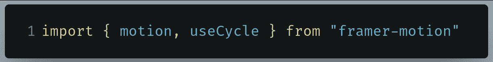

要在 FramerAdvanced.js 中编写的代码

我们现在可以在我们的项目中使用它。现在在您的`FramerAdvanced`组件中写下这行代码:

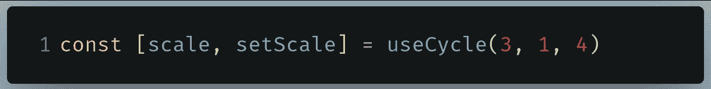

要在 FramerAdvanced.js 中编写的代码

*   第`1`行:这里，`3`、`1`和`4`是循环通过的数字。初始值是这个数组中的第一项— `3` —它存储在`scale`变量中。`setScale`函数将`scale`的值更改为数组中的下一项。

在`FramerAdvanced.js`中，找到以下代码:

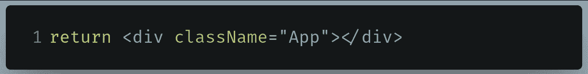

要在 FramerAdvanced.js 中查找的代码

现在把它改成这样:

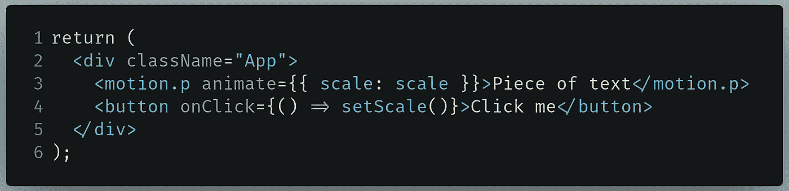

要在 FramerAdvanced.js 中编写的代码

*   第`3`行:将我们`motion.p`的`scale`属性设置为我们之前在`useCycle`钩子中定义的`scale`变量。当`scale`的值改变时，动画会重新播放。
*   线`4`:点击后，调用`setScale`功能。这会将`scale`的值更改为数组中的下一项。

这将是输出:

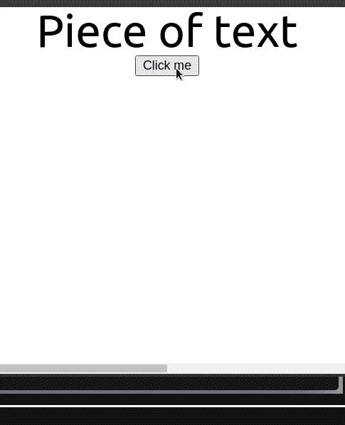

代码的输出

瞧，我们的代码成功了！如您所见，当我们单击按钮时，文本的大小也发生了变化。

我们甚至可以找出`scale`变化时的值。在`App.js`中，找到我们刚刚编写的代码行:

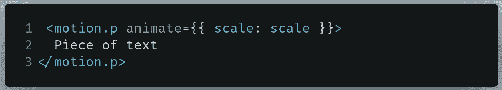

要在 FramerAdvanced.js 中查找的代码

现在把它改成这样:

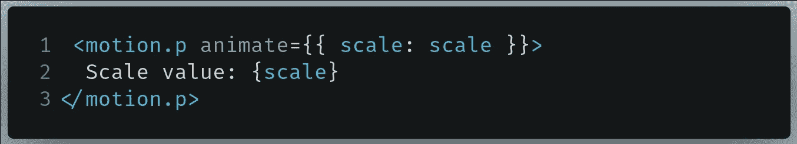

要在 FramerAdvanced.js 中编写的代码

这将是输出:

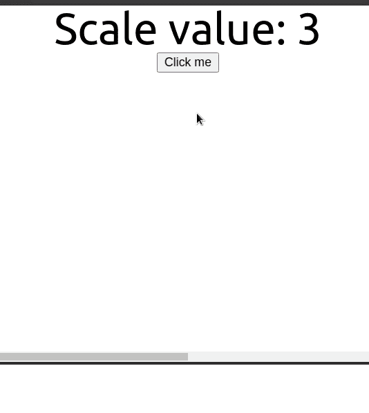

代码的输出

正如你所看到的，我们现在可以看到`scale`钩子的值在变化。

让我们更进一步地玩`useCycle`钩子。这段代码将让文本的`x`坐标在一组选定的值之间交替变化:

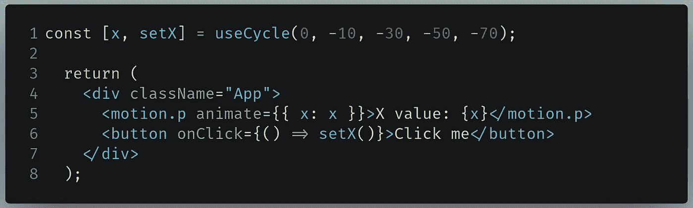

要在 FramerAdvanced.js 中编写的代码

*   线`1`:使用`useCycle`钩。`x`的初始值将为 0。
*   第`6`行:点击后，`x`的值将被修改为数组中的下一个值。

这将是结果:

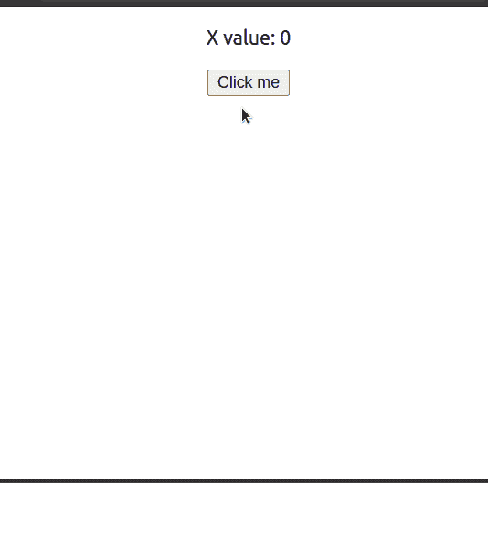

代码的输出

太好了！如您所见，我们的代码是有效的。

完成后，让我们学习一下`AnimatePresence`组件。

## AnimatePresence 组件

通过[条件渲染](https://reactjs.org/docs/conditional-rendering.html)，组件进入 DOM 或从 DOM 中删除。在某些情况下，动画也用于可视化这一过程，这也可以改善用户体验。这就是`AnimatePresence`组件有用的地方。

开始之前，记得将`AnimatePresence`添加到您的导入中:

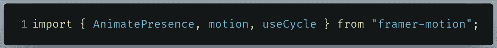

要在 FramerAdvanced.js 中编写的代码

在`FramerAdvanced.js`中，使用`useState`声明以下钩子:

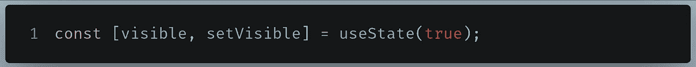

要在 FramerAdvanced.js 中编写的代码

*   这个`visible`钩子将让我们使用条件渲染来删除或显示 React 树中的组件。

在您的`return`块中，编写以下代码:

*   `2`线:验证`visible`钩的值是否为`true`。
*   第`3`行:如果上述条件为真，那么我们的`motion.div`组件将被渲染。否则，它不会被渲染。
*   第`4`行:设置背景颜色为蓝色，设置高度和宽度为 100 像素。
*   第`5`–`6`行:初始不透明度应为 0。但是，在动画过程中将`opacity`设置更改为 1。
*   Line `7`:当组件从 React 树中移除时，`exit`道具会播放动画。在这种情况下，我们将把`opacity`的值设置为`0`。
*   第 11 行:点击时，翻转`visible`钩子的值，显示或移除`motion.div`组件。

运行代码。这将是结果:

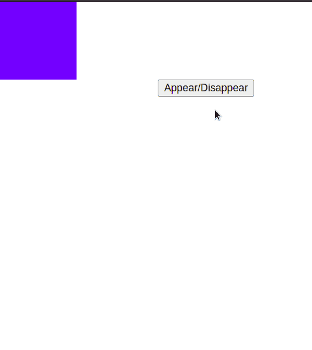

代码的输出

我们的代码有效！如您所见，我们的`motion.div`元素已经消失了。这是因为当组件由于条件渲染而从 DOM 中移除时，`exit` prop 触发了一个动画来将`opacity`值设置为 0。

我们甚至可以为我们的`div`组件创建一个动画，让它在 React 树中来回滑动，就像这样:

*   线`4`:如果你设置`initial`道具为`false`，那么动画将从`animate`定义的状态开始。换句话说，它将忽略我们的`motion.div`组件中的`initial`道具，而使用`animate`道具作为我们的起点。
*   `9`线:我们的组件现在从`100`的`x`坐标开始，从`1`的`opacity`坐标开始。
*   第`10`行:删除元素后，运行一个动画，将`x`坐标改为`-100`，将`opacity`坐标改为`0`。

这将是代码的输出:

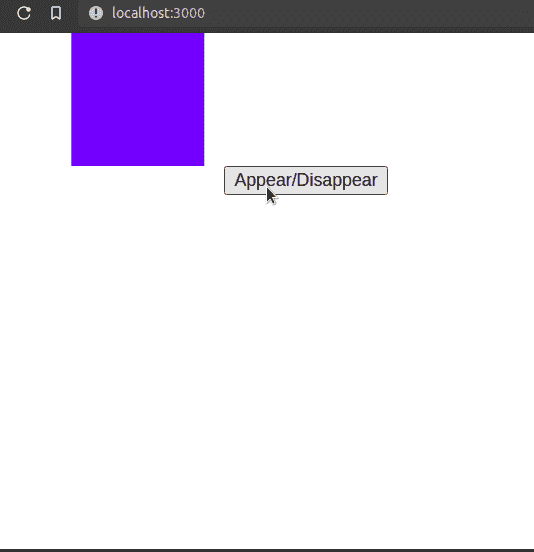

代码的输出

太好了—我们的代码起作用了！

在继续之前，建议您自行解构代码示例并创建动画，以便全面掌握 Framer 的概念。

现在让我们继续讨论变体。

## 变体

假设我们有一些具有以下属性的`motion.p`元素:

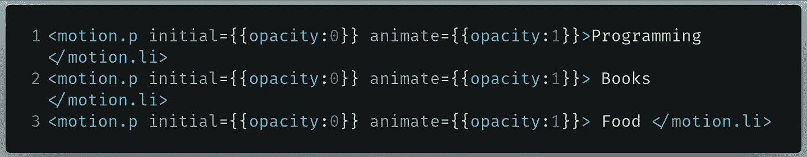

示例代码

虽然这段代码完全有效，但是我们多次写入了相同的`initial`和`animate`值。这使得我们的代码看起来不整洁，更复杂，甚至重复。

这就是变体概念有用的地方。根据 Framer 文档，变体是组件可以处于的预定义可视状态。

在`FramerAdvanced.js`中，编写以下代码:

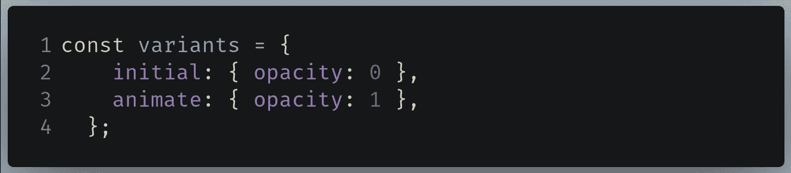

要在 FramerAdvanced.js 中编写的代码

在这里，我们定义我们的属性。`initial`和`animate`是我们稍后会用到的标签。如果一个组件使用了`initial`标签，那么`opacity`就是`0`。否则，如果组件正在使用`animate`标签，那么`opacity`就是`1`。

现在，在您的`return`块中，编写以下代码:

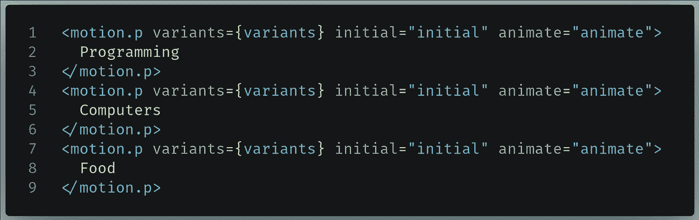

要在 FramerAdvanced.js 中编写的代码

*   第 1，4，7 行:指定我们将使用`variants`对象作为变量。对于`initial`点，我们希望它引用存在于`variants`对象中的`initial`标签。同样，对于`animate`点，我们希望它引用存在于`variants`对象中的`animate`标签。

运行代码。这将是结果:

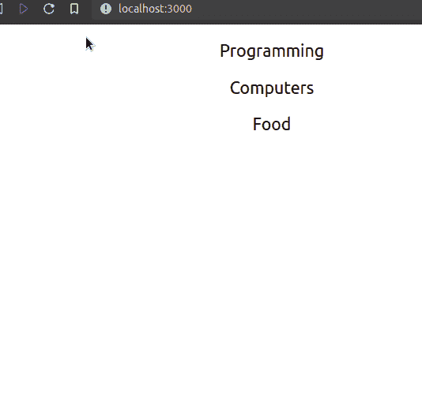

代码的输出

如你所见，我们的产量和以前一样。这证明了变体可以帮助我们使代码更干净。

在代码中使用变体还有一个额外的好处:我们可以访问额外的`transition`道具，比如`staggerChildren`和`delayChildren`。如果你在列表项上渲染动画，这些道具会很有帮助。

在本文中，我们将使用`staggerChildren`属性。该属性指定子组件交错的持续时间。

在`FramerAdvanced.js`中，编写以下代码:

*   线`1`:我们的`container`变种。它有两个标签叫做`hidden`和`show`。
*   第`2`行:当我们的组件为动画使用`hidden`标签时，那么`opacity`属性被设置为`0`。
*   第`3`行:当我们的组件使用`show`标签时，将`opacity`属性设置为`1`。此外，使用`transition`道具定制动画。这里，我们使用了`staggerChildren`属性，它将子元素的动画错开半秒。
*   第`10`行:我们的`item`变体。它有两个标签叫做`hidden`和`show`，分别改变`x`坐标和`opacity`。
*   第`17`行:`motion.ul`将有一个`container`的变体。在其`initial`状态下，它将使用`hidden`标签。在其`animation`状态下，它将使用`show`标签。
*   第`18`–`20`行:`motion.li`元素将有一个`item`的变体。在它们的`initial`状态下，将使用`hidden`标签。在他们的`animation`状态中，他们将使用`show`标签。

运行代码。这将是结果:

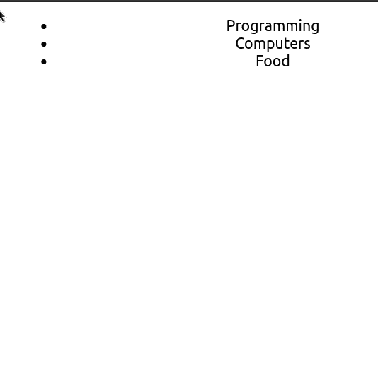

代码的输出

如您所见，我们的代码有效！当列表项目交错时，我们的动画看起来真的很好看。

当您在 React 项目中使用成帧器运动时，需要记住一些事项以防止出错。我们将在下一节讨论它们。

最终，`FramerAdvanced.js`应该是这样的:

# 要记住的重要事情

## 父和子变体标签应该匹配

当我们之前使用变体时，回溯到我们编写的下面这段代码:

这里，注意这两个变体中的标签名称(`hidden`和`show`)是相同的。确保使用这些变体的父组件和子组件应该具有匹配的标签名称，否则动画将无法正确渲染。

# 所有代码和其他资源

## 本文的代码

我们的`App.js`文件涵盖了框架运动的基础知识。它应该是这样的:

在`AdvancedFramer.js`中，我们学习了更复杂的成帧器运动主题。它包含以下代码:

## 其他资源

*   [网络忍者的成帧器动作播放列表](https://www.youtube.com/playlist?list=PL4cUxeGkcC9iHDnQfTHEVVceOEBsOf07i)
*   [成帧器运动文件](https://www.framer.com/api/motion/)
*   [为什么你应该使用 Framer Motion- LogRocket 博客](https://blog.logrocket.com/another-react-animation-library-heres-why-you-should-use-framer-motion/)
*   [成帧器运动粉碎杂志简介](https://www.smashingmagazine.com/2020/10/introduction-to-framer-motion/)

# 结论

如果您在使用 Framer Motion 库时遇到任何困难，建议您解构代码，使用它，并广泛研究以完全掌握概念。这是一项非常强大的技术，不仅易于使用，而且对于增强用户体验非常有用。

非常感谢你坚持到最后！

下一步:[next . js 中的路由和数据获取](/routing-and-data-fetching-in-next-js-aa3c7f3e2481)

上一篇:[在 NodeJS 中使用 GraphQL 的完整指南](https://medium.com/better-programming/the-complete-guide-to-using-graphql-in-node-js-with-apollo-server-aef347a7a0ee)