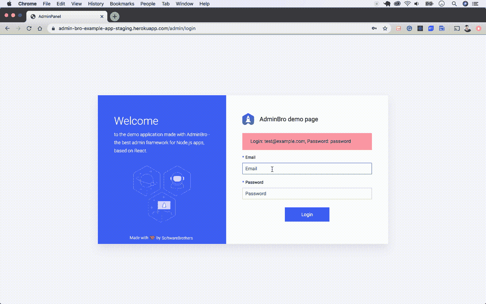
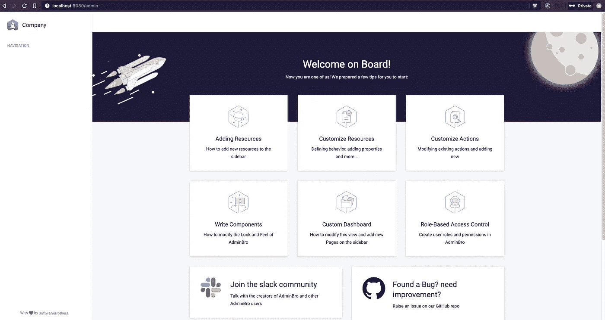
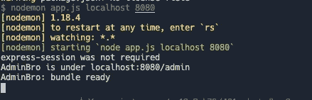

# 用 Node.js 和 AdminBro 创建一个管理面板

> 原文：<https://betterprogramming.pub/create-an-admin-panel-with-node-js-and-admin-bro-1dbbbaecfd81>

## 以下是如何用几行代码为您的节点应用程序构建后端管理仪表板



来自 [GitHub](https://github.com/SoftwareBrothers/admin-bro) 的 AdminBro 演示。

Node.js 的伟大之处在于[有用包](https://medium.com/better-programming/12-useful-packages-every-node-js-developer-should-know-2746db760e)的巨大经济性。例如， [AdminBro](https://softwarebrothers.github.io/admin-bro-dev/) 是一个用于创建管理界面的包，可以插入到您的应用程序中。

您提供数据库模型或模式(如博客帖子、用户评论等。)和 AdminBro 为您生成用户界面。

您可以通过这个用户界面管理内容，并直接与数据库对话。这对于支持非技术团队和委派日常工作非常有用。

# AdminBro 包解决的问题

假设您有一个构建在 Node 中的工作服务。该服务使用 [Hapi.js](https://hapijs.com/) 来呈现几条休息路线，并使用[mongose](https://mongoosejs.com/)作为数据库的连接器。

一切正常，但现在您需要执行以下操作:

*   在应用程序的一个用户界面中查看所有数据集合。
*   尝试并测试数据库的所有功能。
*   用初始数据引导和播种表。
*   基于数据构建自定义报表页面。
*   允许其他团队成员看到应用程序的数据是什么样子的。

如果是这样的话，这就是适合你的套餐。

# 下面是 AdminBro 包包含的内容

*   在任何资源中创建、读取、更新、删除(CRUD)数据。
*   基于架构的表单验证。
*   带有小部件的全功能仪表板。
*   自定义资源装饰器。
*   查看[文档](https://adminbro.com/docs)或尝试[现场演示](https://admin-bro-example-app.herokuapp.com/admin)以发现所有可用功能。

# 入门指南

通过添加几行代码，您就有了一个运行的管理界面。我们开始吧！

由于 AdminBro 使用您现有的框架来呈现其路线，您必须使用我们的插件之一。以下 Node.js 应用程序有插件:

*   [快递](https://adminbro.com/module-@admin-bro_express.html)
*   [哈比神](https://adminbro.com/module-@admin-bro_hapi.html)
*   [Koajs](https://adminbro.com/module-@admin-bro_koa.html)

我们将在 AdminBro 中使用 Express。如果您想在不同的框架中使用 AdminBro，请参阅上面的文档了解安装步骤。

# 快速安装

继续安装`express`和`express-formidable`包。`express-formidable`是 AdminBro 的对等依赖项:

```
yarn add express express-formidable
```

## 安装 AdminBro 和 AdminBro [express 插件](https://adminbro.com/module-@admin-bro_express.html)

```
yarn add admin-bro @admin-bro/express
```

## 创建一个将处理所有 AdminBro 路由的快速路由器

## 接下来，为`app`使用路由器中间件

## 就是这样！您成功设置了仪表板

继续前进，前往[http://localhost:8080/admin](http://localhost:8080/admin)路径。仪表板应该准备好了，可以工作了。



继续前进，前往[http://localhost:8080/admin](http://localhost:8080/admin)。

如果你好奇，这里有完整的`app.js`文件:

如果您做的一切都正确，您应该在终端中看到下面的控制台日志。



Express 和 AdminBro 应用程序终端

# 安装数据库适配器并添加资源

AdminBro 可以连接到许多不同类型的资源。目前，它们支持以下选项:

*   [猫鼬](https://adminbro.com/module-@admin-bro_mongoose.html)
*   [顺序化](https://adminbro.com/module-@admin-bro_sequelize.html)
*   [字体](https://adminbro.com/module-@admin-bro_typeorm.html)

要向 AdminBro 添加资源，首先必须为要使用的资源注册一个适配器。现在让我们用猫鼬解决方案。

# 猫鼬装置

```
yarn add @admin-bro/mongoose
```

## 适配器的注册

## 下面是如何将资源传递给 AdminBro 的方法

有什么问题吗？[阅读官方文档](https://adminbro.com/tutorial-installation-instructions.html)获取深入的安装指南。

了解我最新内容的最好方式是通过我的新闻简报。成为第一个得到通知的人。


我的[简讯](https://wholesomedev.substack.com/welcome)。成为第一个得到通知的人。

感谢阅读。编码快乐！