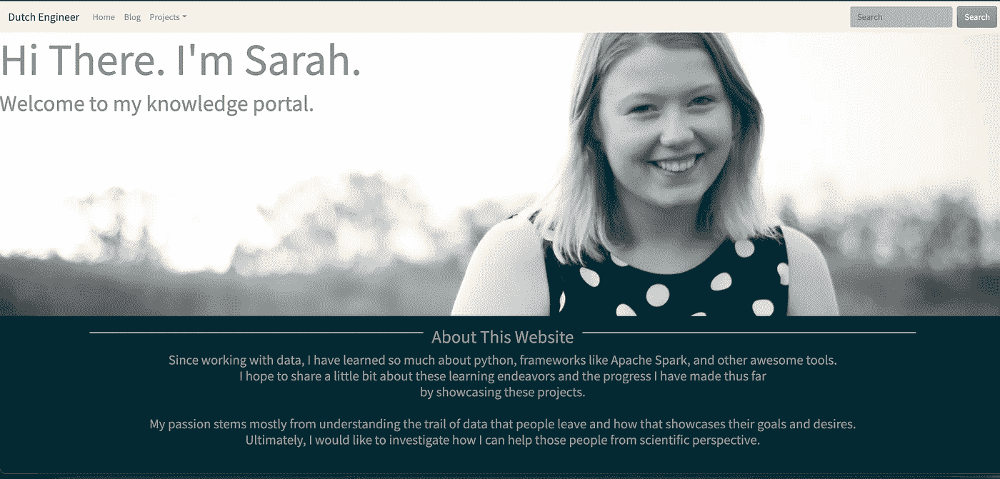

# 使用 Python 从头开始创建分析网站

> 原文：<https://betterprogramming.pub/create-an-analytical-website-from-scratch-in-python-2e034c015ee9>

## Flask 网站模板，包括博客、dash 应用程序和 Jupyter 笔记本的位置



作者网站截图

我想创建自己的网站，这样我就可以创建博客，展示我的仪表盘，还可以运行 jupyter 笔记本。

我找到了如何创建 Dash 应用程序本身，但是我找不到一个能描述所有这三者的程序。这就是我今天打算提供的。

*这里的模板代码是*[](https://github.com/sdf94/flask-dash-blog)**，用这个模板，我建立了我的* [*网站*](http://example.dutchengineer.org) *。**

# *介绍*

*我最初设计的这个网站是用 Dash 写的，只是下面显示的仪表盘。*

**

*作者网站截图*

*这些仪表板是使用 Dash 和 Plotly 创建的。*

*不幸的是，当我意识到我无法呈现 markdown 博客帖子时，我不得不想出另一种方法来创建网站。*

*然后，我不得不开始谷歌搜索，找到一个例子来渲染 markdown，并利用 Dash 的仪表板，我找不到一个。*

*相反，我找到的是詹姆斯·哈丁的一篇精彩的文章([链接](https://www.jamesharding.ca/posts/simple-static-markdown-blog-in-flask/)),我用它来建立主网站，并添加了一些技巧来使仪表板与网站对齐。*

# *文件夹结构*

*所有这些代码和设置都在[这里](https://github.com/sdf94/flask-dash-blog)提供。基本结构是这样的:*

```
*.
|-- virtualenv/
|-- main/
|   |-- content
|   |   |-- posts
|   |   |   `-- about_website.md
|   |-- dash
|   |-- data
|   |-- static
|   |-- templates
|   |-- __init__.py
|-- app.py
|-- Dockerfile
|-- .pylintrc
`-- requirements.txt*
```

*在`__init__.py`中，建立 flask 服务器，并注册平面页面和仪表板组件。*

*网站分为静态文件和 HTML 文件。网站上显示的图像或 CSS 和 javascript 文件位于静态文件夹中，而 HTML 文件将位于模板文件夹中。*

# *注册 flask 应用程序*

*应用程序将从`app.py`中调用，它调用位于`__init__.py`文件中的`create_app()`函数。*

*在这个功能中，我做的第一件事是设置服务器，并确定静态文件在哪里给出了我的网站的独特特征。*

*注意:如果没有添加`static_url_path`作为参数，Flask 服务器可能不知道在哪里寻找 CSS 和 js 文件。如果您在调用这些文件时遇到 404，这可能是您的问题。*

*在 Flask 服务器注册之后，我现在可以添加 dash 组件和 Flatpages markdown 页面了。*

# *添加仪表板*

*在`__init__.py`中，功能`register_dashapps`如下所示。*

*常规破折号和这个函数的一个主要区别是额外的 flask 上下文。仪表板现在可以通过烧瓶`app_context()`运行。想知道为什么增加这个额外步骤的细节吗？这里是[链接](https://flask.palletsprojects.com/en/1.1.x/appcontext/)。*

# *添加博客*

*大多数博客文章在关系数据库中维护它们的内容，这是存储文章内容的一般方法。*

*同时，我的博客文章简单而“平淡”,并且来自源代码中的文件。Flatpages 是为这种用例完美设计的，它可以快速地将渲染器添加到 flask 应用程序的配置中，将 markdown 翻译或代码转换为 HTML。*

*此外，我们必须注册指向帖子的网站路径。*

*詹姆斯·哈丁已经彻底解释了博客代码的其余部分。*

# *添加 Jupyter 笔记本*

*最后一步是添加 jupyter 笔记本。*

*在我们可以在`__init__.py`文件中添加重定向之前，我们需要确保 Jupyter 笔记本可以从网站访问。我用了 nbviewer，让我可以免费托管这个 Jupyter 笔记本。然后可以在重定向(< URL >)中使用这个 URL，如下例所示。*

*我希望这篇文章对将 Flask、Dash 和 Jupyter Notebook 结合成一个漂亮的网站有所启发。如果你有任何问题让我知道。*

```
***Want to Connect?**Updated from the original blog post at [https://dutchengineer.org](https://dutchengineer.org/posts/about-website/).*
```