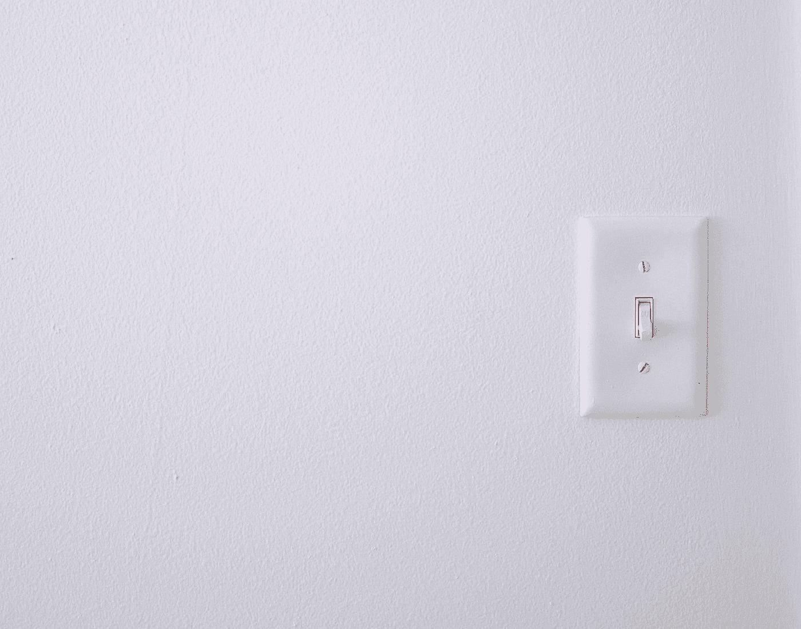
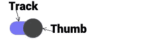
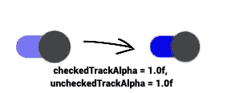

# 使用 Jetpack Compose 创建一个 Android 开关

> 原文：<https://betterprogramming.pub/create-an-android-switch-using-jetpack-compose-351eddbf5828>

## 设计可组合用户界面



由 [Isabella 和 Zsa Fischer](https://unsplash.com/@twinsfisch?utm_source=medium&utm_medium=referral) 在 [Unsplash](https://unsplash.com?utm_source=medium&utm_medium=referral) 上拍摄的照片

在上一个教程中，我们讨论了[创建定制的 Jetpack 合成芯片](/custom-jetpack-compose-chips-5609e742c54b)。在本文中，我们将讨论如何在 Jetpack Compose 中创建一个开关。

基本上，当我们需要像开/关这样的双态选项时，就会用到 Switch。

首先，我们将在 Compose 中创建一个默认开关，如下所示


上述开关包含两个参数:

1.`checked`:组件是否检查

2.`onCheckedChange`:这是一个回调函数，只要用户点击开关就会被调用。



跟踪和拇指

如果我们想改变轨迹和拇指的颜色，那么我们需要添加第三个参数`(colors: SwitchColors)`

在上面的代码中，我们添加了接受`SwitchDefaults`类型对象的颜色参数。我们已经为选中和未选中状态定制了缩略图和轨迹的颜色。

如果你注意到上面的图像，`Track`的颜色看起来并不全是蓝色，尽管我们已经给了它合适的蓝色。等待..这里好像发生了什么事。

在`SwitchDefaults.colors`下，得到这两个参数`checkedTrackAlpha` 和`uncheckedTrackAlpha`的默认值

```
checkedTrackAlpha: Float = 0.54f,
uncheckedTrackAlpha: Float = 0.38f,
```

所以我们也可以在`SwitchDefaults.colors`中传递这些参数，如果我们想要显示完整的蓝色轨道



有时我们需要显示一个显示信息的开关，而用户不能对其采取行动，因此，我们也可以通过增加一个参数`(enabled=false)`来简单地禁用开关


是...搞定了！就这样。谢谢你阅读它。