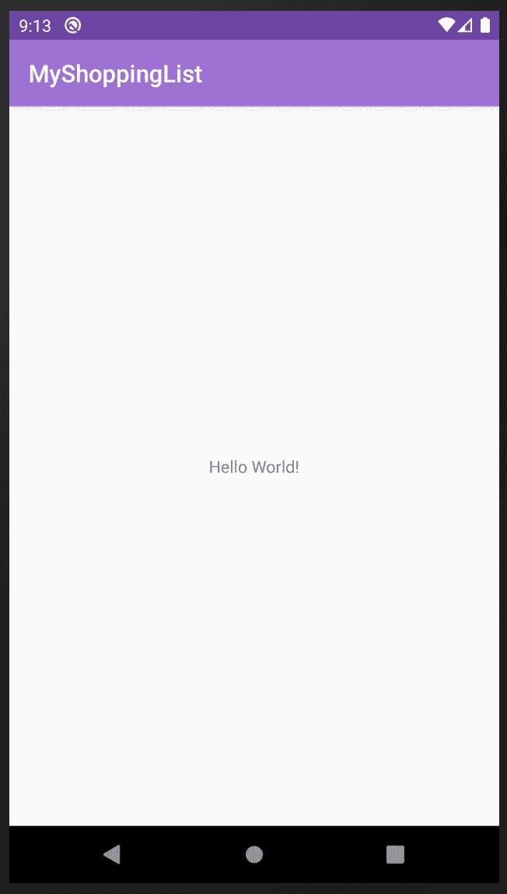
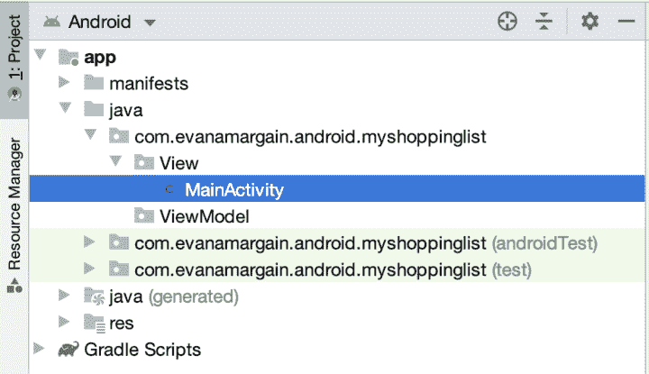
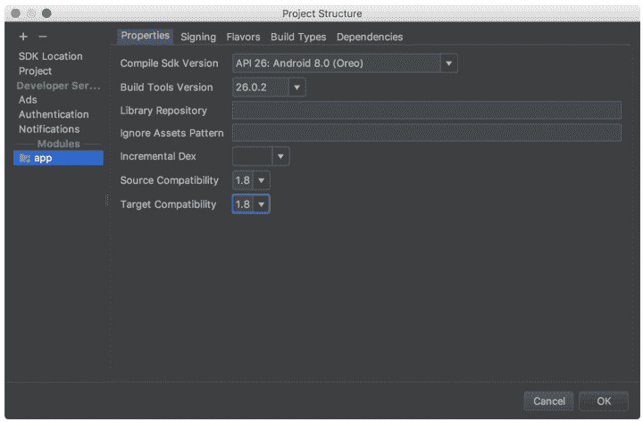
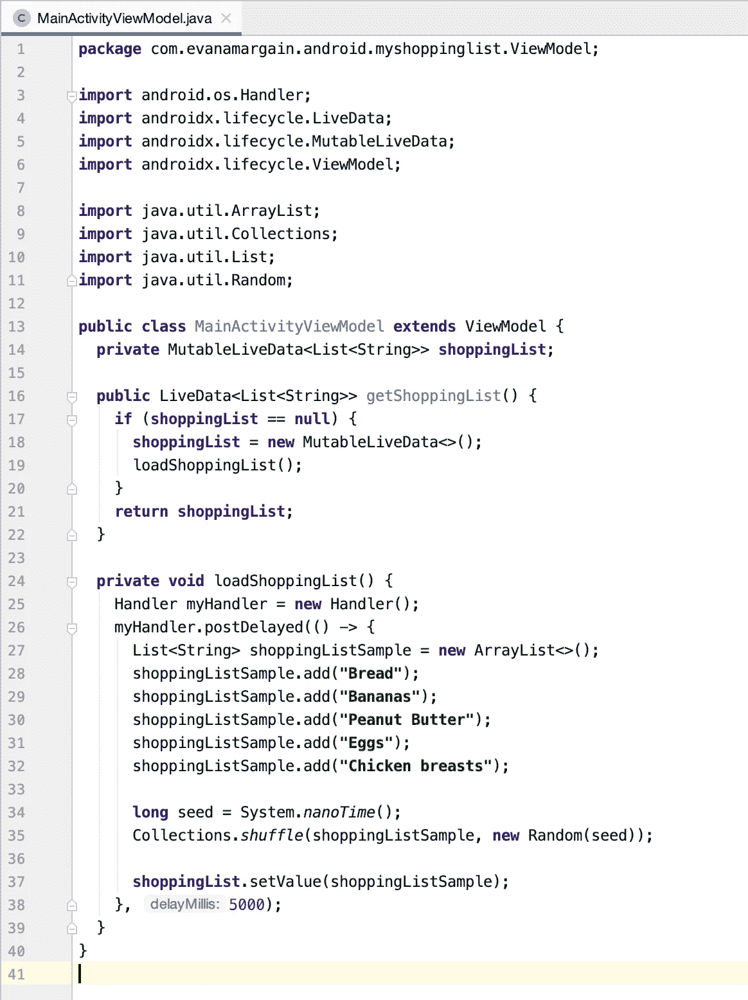
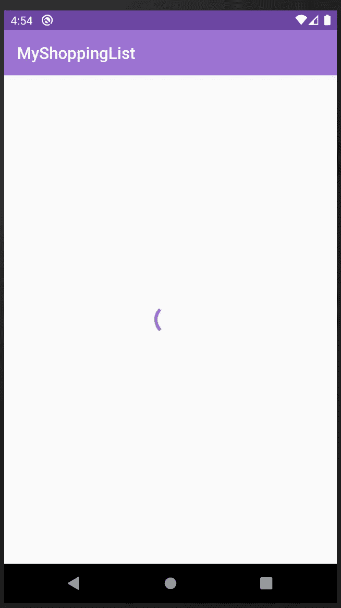
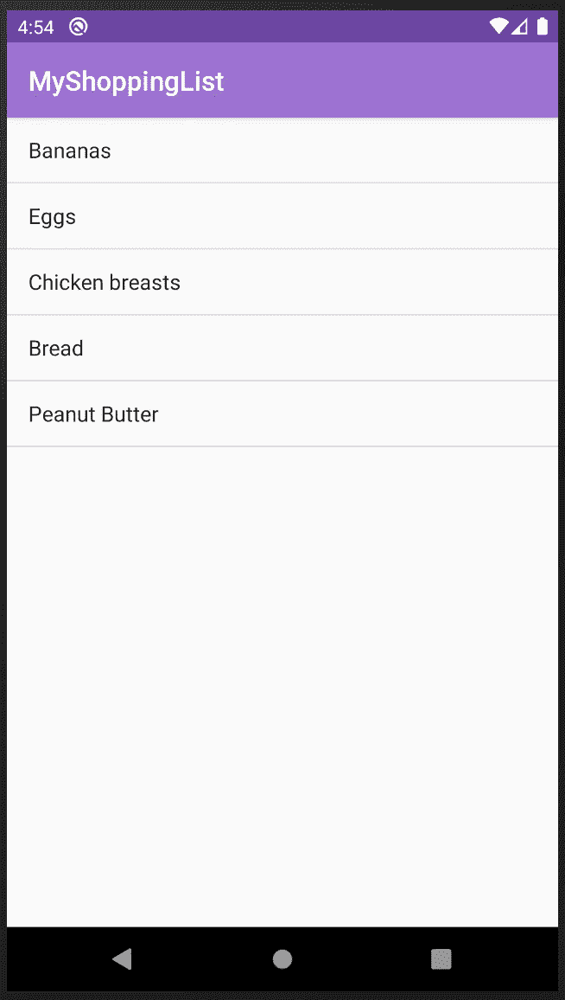

# 在 Java 中创建一个使用 LiveData 和 ViewModel 的应用程序

> 原文：<https://betterprogramming.pub/create-an-app-that-uses-livedata-and-viewmodel-in-java-f8086ca94229>

## 使用 Android 架构组件


安德斯·吉尔登在 [Unsplash](https://unsplash.com?utm_source=medium&utm_medium=referral) 拍摄的照片。

在 Android Jetpack 发布的众多工具中，Android 架构组件、LiveData 和 ViewModel 尤其有用。我创建这个教程是为了回应阿什顿·琼斯(Ashton Jones)的观点，他表示将这些架构组件与谷歌 Firestore 集成的例子非常少。

在本教程中，您将学习所有这些元素如何交互，创建一个基于谷歌技术的具有后端(Firestore)和前端(Android 应用)的全功能应用程序。

在第一部分中，我们将从构建 Android 项目开始。为了演示 LiveData 和 ViewModel 的使用，我们将创建一个模拟购物清单的应用程序。

从我的网站下载启动项目[。](http://www.evanamargain.com/blog/wp-content/uploads/2020/05/MyShoppingList-Starter.zip)

这是一个简单的 Android Java 项目。它只包含一个`MainActivity.java`文件和相应的布局。一旦 Gradle sync 完成，运行应用程序，您应该会看到一个 HelloWorld 屏幕，如下图 1 所示:



图 1:应用程序的初始视图。

# 设置项目的架构

一旦你得到这个工作，你将创建应用程序的文件夹结构。移动架构被广泛讨论，但是由于 Android 引入了架构组件，他们给了我们一个指向 MVVM 的指导方针。在项目的第一部分，您将关注视图和视图模型。

在左侧面板的 Android 项目视图下，创建两个新包:一个名为“view”，另一个名为“ViewModel”。然后在视图包内拖动`MainActivity.java`。生成的项目结构应类似于下图 2 所示:



图 2:添加视图和视图模型包后的结果结构。

下一步是创建视图模型。右键单击 ViewModel 包并选择 New > Java Class。给它起个名字，最好是带后缀 ViewModel 的——我将把它命名为`MainActivityViewModel.java`。有了这两个文件，我们可以同时使用 LiveData 和 ViewModel。


托马斯·格里尔迈尔在 [Unsplash](https://unsplash.com/s/photos/view-model?utm_source=unsplash&utm_medium=referral&utm_content=creditCopyText) 上拍摄的照片。

# 创建视图模型

首先创建您的视图模型。你需要做的第一件事是扩展 [Android 架构组件视图模型库](https://developer.android.com/topic/libraries/architecture/viewmodel)。您的类定义应该如下所示:

```
public class MainActivityViewModel extends ViewModel {
```

如果它不是自动导入的，也用下面的代码行添加所需的依赖项:

```
import androidx.lifecycle.ViewModel;
```

然后，您将创建一个对象来保存购物清单。这个对象需要是一个类型为`String`的可变数据列表，因为您的购物列表项目将只是项目的名称。

在一个更现实的场景中，您可能会在您的“model”包(不是我们创建的)下有一个 ShoppingItem 对象，并获取该项目的属性，但是我试图创建一个最小的示例。使用`MainActivityViewModel`类中的这行代码创建列表:

```
private MutableLiveData<List<String>> shoppingList;
```

上述变量的目的是将所有购物清单项目保存在一个 LiveData 对象中。

# 异步获取 LiveData

在这个项目的第一部分，您将使用计时器模拟数据的异步调用。您需要做的第一件事是检索列表，然后将它添加到上一步创建的`shoppingList`变量中。在`MainActivityViewModel.java`类中添加该函数:

这段代码验证`shoppingList`是否为空，如果是，它创建一个新对象并将购物清单加载到其中。

您将需要另一个函数来加载列表。将其添加到`getShoppingList()`下方，代码如下:

让我们单独回顾一下上面的代码，因为它有点长:

1.  你创建一个处理程序。这个处理程序的目的是保存函数中的代码，以便它在一段时间后执行。
2.  您在第二个参数(第 6 行)中告诉处理程序延迟执行秒数。
3.  在这几行中，您创建了一个示例购物清单，该清单将由第三方服务 Firestore 填充。
4.  shuffle 的目的是查看数据是否在任一点被刷新。LiveData 的一个重要方面是，与其他类型的数据不同，当发生某些操作时(例如，当方向发生变化时)，它不会丢失。
5.  这行代码将“下载的”(模拟的)数据分配到`MutableLiveData`的本地对象中。
6.  如第 2 点所述，这是为数据“加载”设置了 5k 毫秒的延迟


照片由[在](https://unsplash.com/@drew_saurus?utm_source=unsplash&utm_medium=referral&utm_content=creditCopyText) [Unsplash](https://unsplash.com/s/photos/view?utm_source=unsplash&utm_medium=referral&utm_content=creditCopyText) 上画出了 Saurus 。

# 解决纷争

如果您在执行上述步骤后在项目中遇到错误，请阅读本部分进行故障排除。否则，您可以跳到下一部分。

这些是你可能遇到的最常见的问题。

## 项目应该设置为 Java 8

在第 2 点的`loadShoppingList()`中，你可能会注意到我们有一个箭头(`->`)。这被称为 lambda 表达式，仅在 Java 8 中受支持。要解决这个问题，进入文件>项目结构，在源兼容性和目标兼容性字段中选择 Java 1.8:



图 3:将项目设置为 Java 1.8。

## 导入不正确的依赖关系

在 Android 和 Java 中，对不同的功能有相似的依赖是很常见的。Android Studio 自动导入依赖项时，有时会得到错误的依赖项。确保您的导入如下所示:

如果您仍然有问题，请查看下面的 ViewModel 代码:



图 4:完整的视图模型类。


马特·米尔顿在 [Unsplash](https://unsplash.com/s/photos/view-model?utm_source=unsplash&utm_medium=referral&utm_content=creditCopyText) 上拍摄的照片。

# 测试应用程序

添加上面的代码后，应用程序应该没有任何变化。它应该能够成功编译和运行，但是您仍然会看到 HelloWorld 空屏幕。这是因为我们只实现了 ViewModel，它是模型和视图之间的通信，但我们仍然没有将它绑定到视图本身。



图 5:添加视图模型后的应用程序。

## 将视图连接到视图模型

如上所述，现在您将使用视图，以便正确显示从 ViewModel 加载的数据。

## 配置视图的 XML

打开位于 app > res >布局中的`activity_main.xml`。删除“Hello World”文本视图，并添加以下代码:

这段代码包含两个 XML 项:

1.  进度条就是通常所说的“微调器”，只要信息延迟加载(对于我们已经编码的内容为 5k 毫秒)，它就会显示在屏幕上。
2.  ListView，加载后将显示购物清单项目。

如果您此时运行应用程序，您将在屏幕上看到进度条(微调器)，但它永远不会显示列表，因为它仍然没有与`MainActivity.java`中的视图代码配对。运行它来查看这一点，并验证您的代码正在工作。您的应用程序应该如下图所示:


图 6:进度条旋转的屏幕。

## 添加 Android 生命周期依赖项

为了让 ViewModel 工作，您需要将生命周期扩展依赖项添加到`build.gradle(Module: app)`:

```
implementation 'androidx.lifecycle:lifecycle-extensions:2.0.0'
```

Android Studio 将请求 Gradle 进行同步。去做，应该会成功。

## 显示数据

现在打开`MainActivity.java`，我们把它移到你的视图文件夹中。在`setContentView()`行下面的`onCreate`方法中，添加以下代码:

让我们再次回顾每一行:

1.  您初始化 ListView 并从 XML 中获取它。
2.  进度条也是一样:我们初始化它并从 XML 中获取视图。然后将它设置为 visible——在加载数据时显示。
3.  接下来，使用 Android Jetpack 提供的`[ViewModelProvider](https://developer.android.com/reference/androidx/lifecycle/ViewModelProvider)`初始化您的视图模型。简而言之，`ViewModelProvider`是一个存储 ViewModel 并使其在整个应用程序中可用的类，因此所有需要它的类都可以访问这些信息。
4.  一旦有了 ViewModel，就调用`getShoppingList()`方法。您可能还记得，该方法是异步的。这需要五秒钟，然后返回数据。这就是你观察反应的原因。
5.  一旦收到购物清单，您就可以创建一个数组适配器来创建列表视图。您将使用`layout.simple_list_item_1`，它是一个[预提供的 XML，用于 Android 操作系统](https://github.com/aosp-mirror/platform_frameworks_base/tree/master/core/res/res/layout)的 ListViews。
6.  然后，将上一步中创建的适配器分配给 ListView。
7.  最后，隐藏进度视图并显示数据。

## 必需的进口

这段代码需要一些导入才能工作。一些将由 Android Studio 自动完成，你需要手动添加其他。以下是`MainActivity.java`应该有的全部导入:

所有这些工作完成后，您应该能够测试应用程序，并在等待五秒钟后看到您的列表出现:



图 7:屏幕上显示的购物清单。

# 结论

太好了！我们现在有一个实现 LiveData 和 ViewModel 的应用程序。在下一部分中，我们将把 Firestore 集成到这个应用程序中，以便从远程数据源加载数据。如果你想看看项目完成后应该如何工作，你可以从我的网站下载完成的项目[。](http://www.evanamargain.com/blog/wp-content/uploads/2020/05/MyShoppingList-End.zip)

如果你有任何疑问，不要犹豫，留下评论，我会尽快回复。

下次见，感谢阅读！