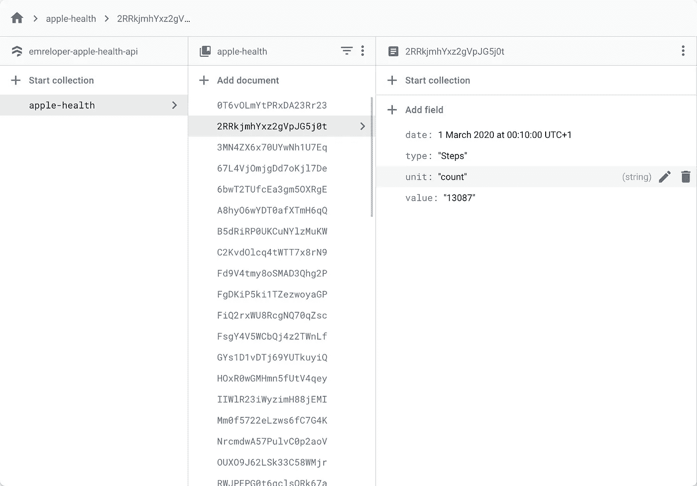
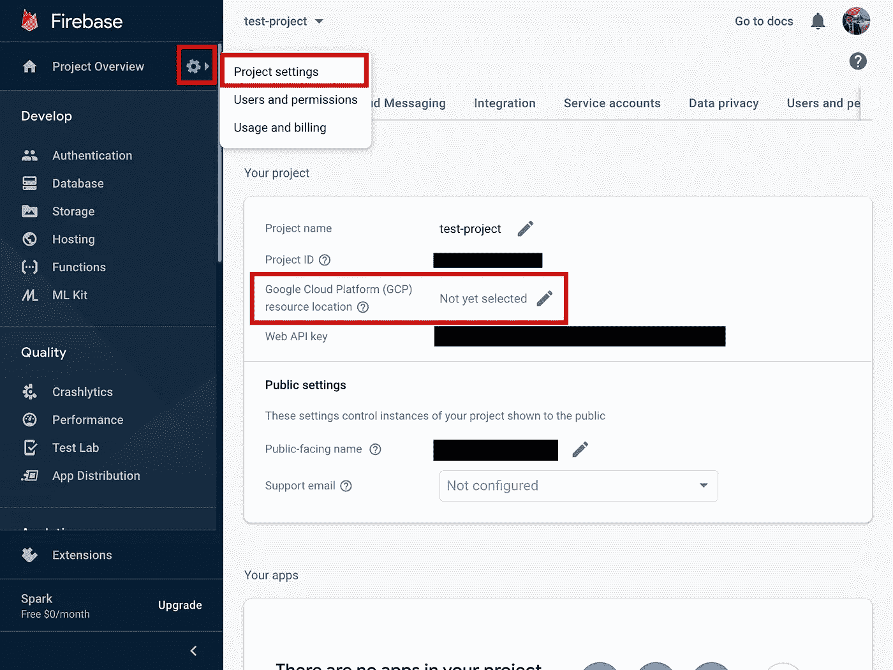
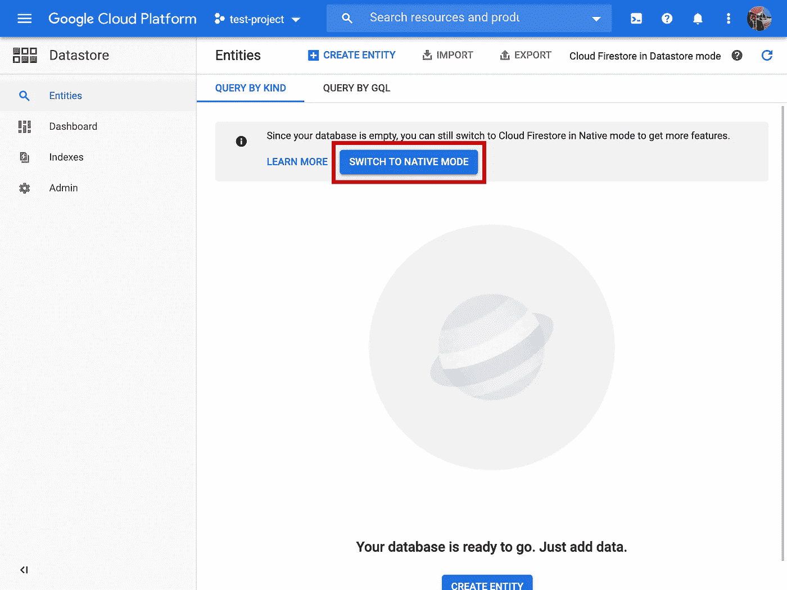
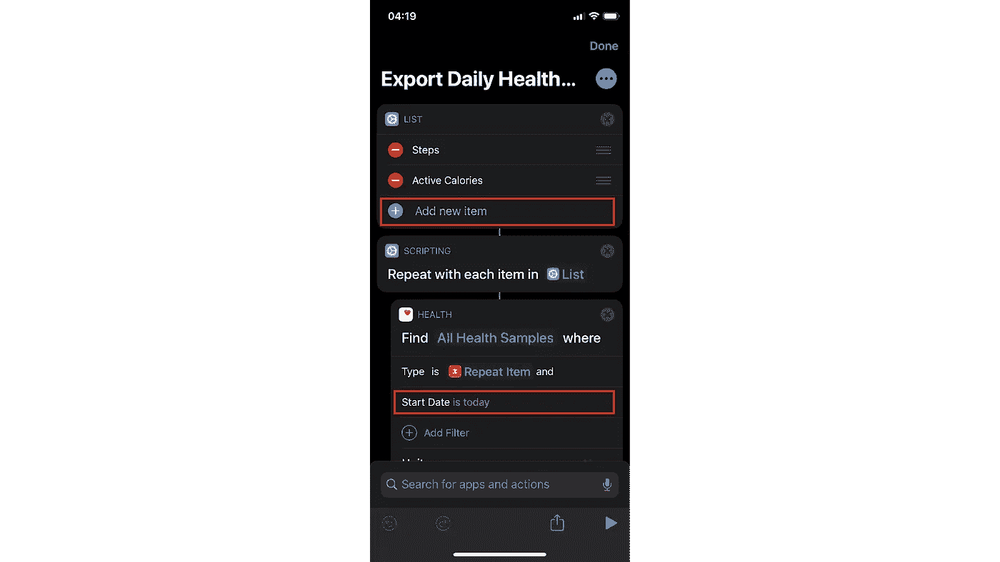
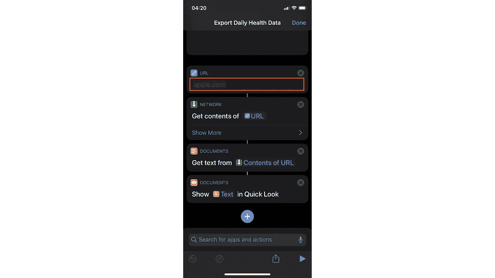

# 用快捷方式和 Firebase 创建一个苹果健康 API

> 原文：<https://betterprogramming.pub/create-an-apple-health-api-with-shortcuts-and-firebase-a76d178319b7>

## 了解如何为自己创建个人 Apple Health API


照片由[米莎·莫里涅](https://www.pexels.com/@miphotography?utm_content=attributionCopyText&utm_medium=referral&utm_source=pexels)从[佩克斯](https://www.pexels.com/photo/blue-colors-food-fruit-437805/?utm_content=attributionCopyText&utm_medium=referral&utm_source=pexels)拍摄

我看到了克雷格·卡莱尔的一篇鼓舞人心的文章。他创建了一个仪表板来记录他的生活。他可以跟踪自己的心率、卡路里、咖啡杯数、开源贡献等。在大日历视图中一天一天地显示。这是一个非常酷的项目。我强烈建议你看一看。

我想为自己拥有一个类似的仪表板，所以我决定一步一步地构建它，因为它需要大量的工作来涵盖不同的功能。我也决定与你分享我的旅程，这样我们可以一起努力。

首先，我想跟踪我每天的步数、卡路里等。我有一部 iPhone 和 Mi Band 4 来提供这些数据。Apple Health 收集了所有的东西，但是没有办法在 iOS 设备之外访问它。所以我们需要一种方法来提取这些数据。

健康应用中有一个`Export All Health Data`选项。此选项以 XML 格式导出您的所有健康数据。对于一次性使用来说是个不错的选择。但是，如果您希望每天或每小时都将数据与仪表板同步，这并不是最佳选择。我们需要更好的选择。

苹果在 2018 年随 iOS 12 发布了快捷方式应用。Shortcuts 应用程序允许您在 iOS 设备上创建宏和自动化任务。天空是无限的。你真的可以为之疯狂。

我想出了一个使用快捷方式和 Firebase 的解决方案。我们可以创建一个 Firebase HTTP 函数将健康数据写入 Firestore，然后我们可以创建一个快捷方式将健康数据导出并发送到这个 Firebase 函数。这样，我们可以随时将数据与仪表板同步。

我将介绍创建这个 API 的每个步骤。开始了。

# 要导出的数据结构

Firestore 中的数据会像这样。



Firestore 预览

但是首先，我们需要一个数据结构来导出数据。快捷方式将以以下 JSON 格式导出数据:

# 重火力点

Firebase 的免费层对于我们的需求来说已经足够了。首先，我们需要创建一个 Firebase 项目，并在 [Firebase 控制台](https://console.firebase.google.com/)中进行一些配置。

如果你已经有了 Firebase 的经验，你可以直接从我的 GitHub 库获得代码。您可以在参考资料部分找到链接。

访问 Firebase 控制台，点击“添加项目”按照说明完成。项目创建完成后，点击齿轮图标打开“项目设置”进入“项目设置”后，选择“谷歌云平台(GCP)资源位置”我选择了“eur3(欧洲-西方)”，因为我位于德国柏林。



选择 Firebase 资源位置

选择资源位置后，单击左侧控制台菜单上的“数据库”打开 Firestore。一旦您进入 Firestore 登录页面，您将看到以下警告:

```
This project is set up to use Cloud Firestore in Datastore mode. This mode can only be accessed from Google Cloud Platform
```

点击“转到云平台”按钮。一旦你进入“云平台”页面，你会看到一个蓝色的“切换到本机模式”按钮。单击该按钮，并按照说明完成操作。



切换到 Firestore 本地模式

我们已经完成了 Firebase 控制台的设置。在深入研究代码之前，我们需要创建项目样板文件。

我们将使用 Firebase CLI 来创建项目样板文件。我将使用 [npx](https://github.com/npm/npx) 来跳过任何安装步骤。请随意查看[Firebase CLI 文档](https://firebase.google.com/docs/cli)上的安装选项。

首先，我们需要在终端中登录我们的 Firebase 帐户，以便使用 CLI。运行以下命令，然后按照说明完成。

```
npx firebase-tools login
```

登录后，执行以下命令来创建项目样板文件:

```
mkdir apple-health-api
cd apple-health-api
npx firebase-tools init
```

运行`init`命令后，将打开一个交互式 CLI。使用空格键选择“Firestore”和“Functions”，然后按回车键。接下来，通过选择“使用现有项目”选项来选择我们新创建的 Firebase 项目。之后，只需按照说明完成即可。顺便说一下，我使用 TypeScript 作为项目语言。

因为我们将使用 Firestore 来存储我们的数据，所以我们需要 [firebase-admin](https://github.com/firebase/firebase-admin-node) 包。运行以下命令进行安装:

```
cd functions
npm i firebase-admin
```

恭喜你。我们都准备好了。现在我们可以开始编码了。

我们将编写一个 Firebase HTTP 函数，以 JSON 格式接受 POST 请求主体中的数据。然后，我们将解析这些数据并将其存储在 Firestore 中。

获取以下代码，并将其放入`functions/index.ts`文件中。您可以浏览代码，看看发生了什么。

现在，是时候部署了。运行以下命令进行部署。

```
npx firebase-tools deploy
```

部署之后，您将在终端中看到该功能的已部署端点。或者，您也可以访问 Firebase 控制台中的“函数”部分来查看它。把它带走，存放在方便的地方。我们在寻找捷径时会用到它。

一旦有了数据，就可以进行查询和提取，如下所示:

```
collection('apple-health').where('type', '==', 'Steps').get()
collection('apple-health').where('type', '==', 'Active Caloriies').get()
...
```

# 快捷指令

我创建了一个从健康应用程序导出每日数据的快捷方式。首先，下载到你的手机上。然后，我们可以根据您的需要进行调整。

 [## 捷径

### 编辑描述

www.icloud.com](https://www.icloud.com/shortcuts/1617296a8c8546b49be47740be2550b3) 

快捷方式配置为导出您当天的步数和活动卡路里。您可以配置这些设置来添加更多数据或更改时间范围。



以快捷方式添加健康类型和更改时间范围

最重要的设置是 Firebase 函数 URL。我们需要提供它来发送导出的健康数据。当快捷方式运行时，它会将健康数据导出为 JSON，然后发布到提供的 URL。



在快捷方式中设置 Firebase 函数 URL

完成设置后，运行快捷方式将数据存储在 Firestore 中。然后转到 Firebase 控制台中的“Firestore”部分，查看导出的数据。

# 结论

作为创建生活跟踪仪表板的第一步，我很满意。解决方案非常简单，但功能强大。Firestore SDK 很棒。你可以每天使用 Siri 运行快捷方式，或者你可以尝试在快捷方式应用程序的“自动化”部分自动化它。

如果你想在空闲时间找一个项目，这里就是。我在黑客马拉松模式下开发了这个。接受并改进它以适应您的项目。

我想完成这个仪表板项目，并写下每个步骤。如果你感兴趣，请继续关注。

编码快乐！

# 资源

[](https://github.com/emreyilmaz7c6/apple-health-api) [## emreyilmaz7c6/apple-health-api

### 一个 Firebase 项目，用于解析和存储来自 iPhone 的苹果健康数据。使用 Firebase HTTP 函数解析…

github.com](https://github.com/emreyilmaz7c6/apple-health-api) [](https://support.apple.com/en-in/guide/shortcuts/welcome/ios) [## 快捷方式用户指南

### 快捷方式是使用应用程序完成一项或多项任务的快捷方式。快捷方式应用程序可让您创建自己的…

support.apple.com](https://support.apple.com/en-in/guide/shortcuts/welcome/ios) [](https://firebase.google.com/) [## 重火力点

### Firebase 为您提供了分析、数据库、消息传递和崩溃报告等功能，因此您可以快速移动并…

firebase.google.com](https://firebase.google.com/)