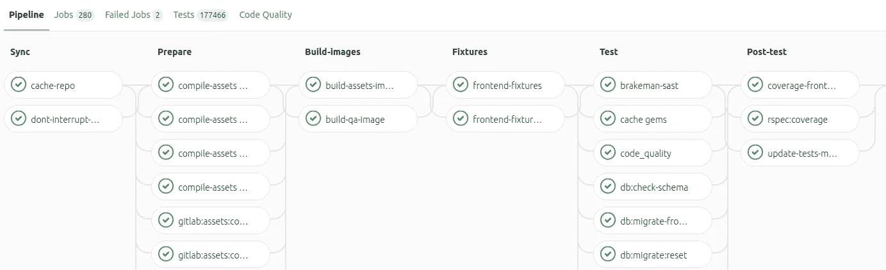
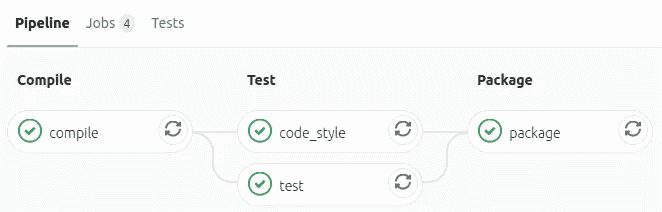

# 在 Gitlab 中为 Kotlin 创建一个自动化构建管道

> 原文：<https://betterprogramming.pub/create-an-automated-build-pipeline-for-kotlin-in-gitlab-3a163d2cf270>

## 利用 Gitlab pipelines 和 Gradle 自动化构建和测试您的 Kotlin 代码

潘卡杰·帕特尔在 [Unsplash](https://unsplash.com/s/photos/gitlab?utm_source=unsplash&utm_medium=referral&utm_content=creditCopyText) 上的照片

在过去的几个月里，为了工作中的一个新项目，我学习了一些 Gradle 和 Kotlin 的知识。

在工作中，我们使用没有任何持续集成或自动化构建过程的内部代码库，因此由我们在本地机器上手动运行测试。不幸的是，我们经常忘记这样做，错误可能会被忽视。

当从事个人项目时，我试图从我们的工作中学习(好的和坏的)，并且我努力总是建立测试自动化。在大多数情况下，这意味着使用 Gitlab 管道来构建和测试每一个提交。这篇文章描述了我是如何为 Kotlin 设置的。

# 什么是 Gitlab 管道？

Gitlab 管道背后的想法很简单:定义一组构建和测试代码的步骤，将这些步骤存储在存储库中的一个文件中，使用 Docker 容器运行定义的步骤，最后报告结果。这是一个简单的概念，但它非常强大。

下面的截图显示了用于构建和测试 Gitlab 自己的代码库的大规模构建管道的一部分。

Gitlab 构建管道截图

*注:Gitlab 软件是开源的，托管在*[*gitlab.com*](https://gitlab.com/gitlab-org/gitlab)*上。Gitlab 就是用这些管道来建造自己的。*

通过查看管道，您可以了解它正在做的所有事情。编译各种资产，运行测试，生成覆盖报告，等等。涉及数百个步骤，分布在多个阶段。它们都是自动化的，每次提交时都会运行。

这对你有什么帮助？

管道的灵活性给了你无限的可能性。您可以定义使用什么 Docker 容器、需要什么阶段、每个阶段适合什么步骤，以及每个阶段要运行什么命令。有各种各样的事情可以自动化。例如:

*   测试您的代码。
*   运行静态代码分析来寻找反模式。
*   运行样式检查器来查找样式错误。
*   运行漏洞扫描。
*   检查过时的依赖关系。
*   验证提交消息以确保它们遵循给定的标准。
*   在不同的分支/标签上运行不同的步骤(例如，仅在主分支上运行特殊的发布脚本)。
*   构建并托管一个静态站点([文档](https://docs.gitlab.com/ee/user/project/pages/index.html))。
*   针对多个数据库引擎运行测试以确保兼容性。

还有很多其他的。您可以阅读[文档](https://docs.gitlab.com/ee/ci/README.html)获取灵感，或者查看[示例](https://docs.gitlab.com/ee/ci/examples/README.html)页面。

# 运用到科特林身上

自从开始在工作中使用 Kotlin 和 Gradle，我也开始在一些个人项目中使用它。为我的 Kotlin 代码找出一个可以在 Gitlab 中使用的管道是我的首要任务。

出于本文的目的，我创建了一个演示项目来演示我提出的解决方案。你可以在这里找到它: [Kotlin 构建管道](https://gitlab.com/org.hsmith.medium/kotlin-build-pipeline)

演示项目构建管道的屏幕截图

在高层次上，这就是它所做的。

第一阶段是编译代码。这个阶段有一个使用 Gradle 编译的步骤。

第二阶段是测试代码。我把它分成两种类型:

*   运行 [Ktlint](https://github.com/pinterest/ktlint) 查找样式错误——此处的失败将被解释为警告，流水线将继续运行。
*   运行项目中定义的所有单元测试——这里的失败意味着管道失败。

最后，用要发布的所有依赖项构建一个“fat jar”文件。

为此，我只需要用正确的指令在存储库的根目录下创建`.gitlab-ci.yml`文件。Gitlab 处理剩下的。

。Kotlin 的 gitlab-ci.yml 文件

那么这个文件实际上在做什么呢？

*   `image`:第一行是定义使用哪个 Docker 容器。在本例中，我使用一个安装了 Java JDK 11 的容器。演示应用程序是针对 Java 版本 11 构建的，但是可以针对不同版本的 Java 进行调整。
*   `stages`:下一部分定义了构建过程的各个阶段。对于一个简单的项目，我定义了三个阶段:编译、测试和打包。
*   `before_script & cache:``before_script`部分定义了在每一步之前运行的命令。在这种情况下，我将系统变量`GRADLE_USER_HOME`设置为正确的路径。这补充了下面的`cache`部分，在步骤之间将`.gradle/`文件夹存储在共享缓存中。这些步骤不是必需的，但是它们使流水线运行得更快。
*   `compile`:`compile`部分是第一个实际的构建步骤。它属于`compile`阶段，其目的是编译代码并确保没有构建错误。该步骤运行`gradle assemble`命令。
*   `test`:顾名思义，`test`部分的目的是运行测试。这一步运行`gradle test`命令来运行所有的测试。在这个项目中，测试是使用 JUnit5 框架创建的。
*   `code_style` : 本节定义了如何检查代码中的代码风格错误。我用`Ktlint`是因为它很容易设置和使用。t 是在`build.gradle`文件中配置的，我对默认配置做了以下两处调整。
*   用`build/ktlint.xml`的结果生成一个输出文件
*   允许通配符导入。默认情况下`Ktlint`会将通配符导入标记为错误。然而，这与我的 IDE ( `IntelliJ`)的默认行为相冲突，它将尽可能使用通配符导入。这是一个有争议的话题，但我选择允许他们。您可以通过更新`build.gradle`文件来重新启用此规则，并删除 Ktlint 设置:`"--disabled_rules=no-wildcard-imports"`中禁用规则的标志
*   这是构建的最后一步。这是`package`阶段的一部分，它的目的是将项目编译成一个单独的“胖罐子”,并作为工件存储起来以备后用。这一步使用[影子 Jar](https://github.com/johnrengelman/shadow) Gradle 插件来生成 Jar 文件。如果对您的项目有意义，您可以更新这个文件，只在某些分支上运行这个步骤(例如，只在主分支上)，以避免为仍在开发中的代码生成构建工件。

如果你想了解更多关于用这个文件设置构建管道的信息，你可以在[文档](https://docs.gitlab.com/ee/ci/yaml/README.html)中阅读更多。

# 结论

在本文中，我主要关注构建和测试 Kotlin 代码，但是 Gitlab 管道功能并不局限于 Kotlin 或 Gradle。有很多其他创造性的方法可以将管道用于各种语言。

我希望这有助于您为自己的个人或专业项目设置构建自动化。或者至少让你思考一下。

如果出于某种原因，你执意使用 Github，Gitlab 甚至提供了为 Github 上托管的外部项目运行管道的选项。在[文档](https://gitlab.com/help/user/project/integrations/github)中了解更多信息。

感谢您的阅读。你会建造什么？

# 资源

*   [演示项目](https://gitlab.com/org.hsmith.medium/kotlin-build-pipeline)
*   [Gitlab 文档](https://docs.gitlab.com/)
*   [关于构建管道的文档](https://docs.gitlab.com/ee/ci/README.html)
*   `[.gitlab-ci.yml](https://docs.gitlab.com/ee/ci/yaml/README.html)` [参考](https://docs.gitlab.com/ee/ci/yaml/README.html)
*   [git lab 静态网站上的文档](https://docs.gitlab.com/ee/user/project/pages/index.html)
*   [Github 项目的 git lab CI](https://gitlab.com/help/user/project/integrations/github)
*   [Ktlint](https://github.com/pinterest/ktlint)
*   [暗影箭](https://github.com/johnrengelman/shadow)