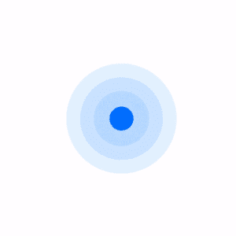

# 使用 SwiftUI 创建一个令人敬畏的加载状态

> 原文：<https://betterprogramming.pub/create-an-awesome-loading-state-using-swiftui-9815ff6abb80>

## 美丽的装载状态

在苹果全新的框架 **SwiftUI** 中，创建一个直观的动画非常简单高效。在开始之前，请观看下面的视频，了解我们将要讨论的内容。

动画片

在上面的视频中，你看到了五个简单的活动动画，它们使用了 SwiftUI 中不同的内置[立体形状](https://www.hackingwithswift.com/quick-start/swiftui/swiftuis-built-in-shapes)。

在 SwiftUI 中，我们可以使用 ***添加动画来查看可动画的属性。*动画()**修改器。视图中有一系列可设置动画的属性，如:

1.  不透明
2.  抵消
3.  规模
4.  基本框架
5.  等等…

您应该将任何一个可动画化的属性应用到您的视图中，以使用`.animation()`修改器获得动画效果。带有`.animation()` 修改器的视图没有任何动画属性。话虽如此，我们还是开始吧。

> 注:动画 gif 仅供参考。运行 Xcode 中的代码或检查上面的视频，以获得实际的动画流畅度。

# 3 个滑动圆圈

3 个滑动圆圈 GIF

1.  使用 SwiftUI 中的**圆形**形状创建三个宽和高均为 20x20 的圆。
2.  这里，我们正在制作圆形的**偏移**动画，这使得圆形从左边移动到 right(➡️)和从右边移动到 left(⬅️).
3.  我们添加了一个**定时器**，它将每 1.6 秒触发一次，以交换偏移值。最初，偏移会在 **100** (leftOffset)，使圆从左向右移动；1.6 秒后，leftOffset 将交换为 **-100** ，使圆从右向左移动。
4.  为什么是 1.6 秒-秒计时器？ ***1.6*** *秒= 1 圈动画时长(****1****)+2 圈延时(****0.2****)+3 圈延时(****0.4****)。*
5.  我们降低了圆圈的不透明度，以增加从一边移动到另一边时的良好感觉。
6.  你注意到第二圈和第三圈的**延迟**了吗？是的，延迟有助于在等待上述延迟后启动动画。在我们的例子中，延迟帮助我们一个接一个地转圈。如果我们不提延迟，所有的圈都会同时移动。
7.  我们使用默认的 **easeInOut** 动画，持续时间为**一秒钟**。默认情况下有很多可用的动画，像 easeIn，easeOut，spring 等等…继续玩吧。

# 水平滑杆

水平滑动条 GIF

1.  创建一个**圆角矩形**形状，圆角半径为 **10** ，边框为 80x20 的**T5。**
2.  这里我们正在制作视图的**偏移**的动画。但这一次，我们实现了没有**定时器的动画。**我们增加了**should animate***@ State*变量来代替。
3.  每当我们改变 **shouldAnimate** 值时，SwiftUI 将再次重新呈现视图的 body 属性。最初，我们将它设置为 false 和 [***。onAppear()***](https://medium.com/better-programming/view-life-cycle-methods-in-swiftui-b7fa9f0e8dfb) 我们已经将其设置为 true，从而触发动画。
4.  视图如何在不交换偏移的情况下返回？🤔可能是因为**。repeat forever(auto reverses:true)**(🔁).这使得视图动画永远继续与漂亮的反向动画。
5.  尝试将 autoreverses 更改为 **false** ，看看会发生什么。😅
6.  我们使用默认的 **easeInOut** 动画，持续时间为 **1 秒**。

# 5 条竖线

5 条竖线 GIF

1.  创建一个样式为 10x50 的**连续**和帧的**胶囊**形状。
2.  在这里，我们通过基于 **shouldAnimate** 状态变量改变容器视图 **HStack** 的宽度和间距来动画化容器视图**而不是胶囊。**
3.  看看当我们改变容器视图的宽度和间距时，子视图是如何被很好地动画化的。
4.  使用 **easeInOut** 动画。**repeat forever(auto reverses:true)**获得一个好看的反转动画，时长 **1 秒**。

# 3 个刻度圆

3 个缩放圆 GIF

1.  在 SwiftUI 中使用 **Circle** 形状创建三个宽度和高度均为 20x20 的圆。
2.  这里我们使用 ***制作圆形的**比例**属性的动画。基于**的 scaleEffect()***** 修改器应该激活状态变量
3.  第二个和第三个圆圈中的延迟避免了所有圆圈同时放大和缩小。
4.  使用 **easeInOut** 动画。**repeat forever(auto reverses:true)**获得一个漂亮的反向动画，持续时间为 **0.5** 秒。

# 带波浪的圆圈

带波浪的圆圈 GIF

1.  使用 SwiftUI 中的**圆**形状创建一个宽度和高度均为 30x30 的基圆。
2.  这里我们使用 ***制作叠加圆的**比例**属性的动画。scaleEffect()*** 基于**的修改器应该激活**状态变量。
3.  我们为叠加圆添加了不同的比例值，以获得波浪效果。
4.  ***stroke()*** 像边框，推荐用于形状。 ***stroke()*** 应用形状一半内一半外的边框。
5.  使用 **easeInOut** 动画。**repeat forever(auto reverses:false)**获得持续时间为 **1** 秒的单向动画。

# 结论

使用 SwiftUI，我们可以用更少的代码和工作创建任何复杂的动画。我们已经看到了它的基本水平。播放 SwiftUI 提供的默认动画，使用 ***制作您的动画。*动画()**根据需要修改器。

完整的代码可在[这里](https://github.com/karthironald/ActivityAnimations)获得。

谢谢👨🏻‍💻