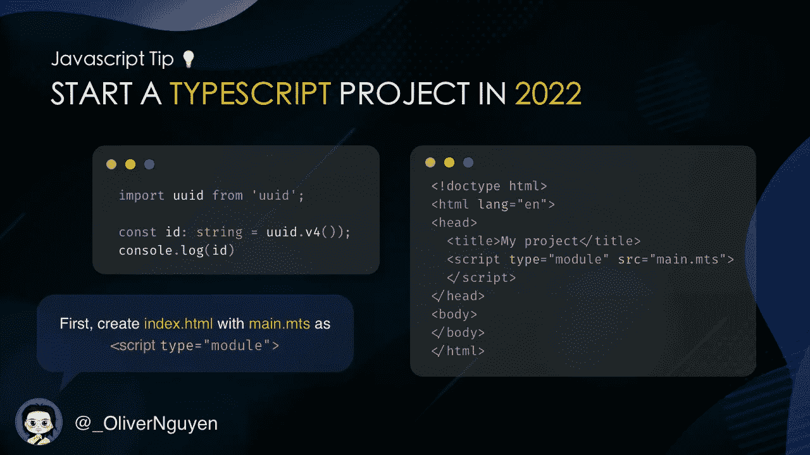
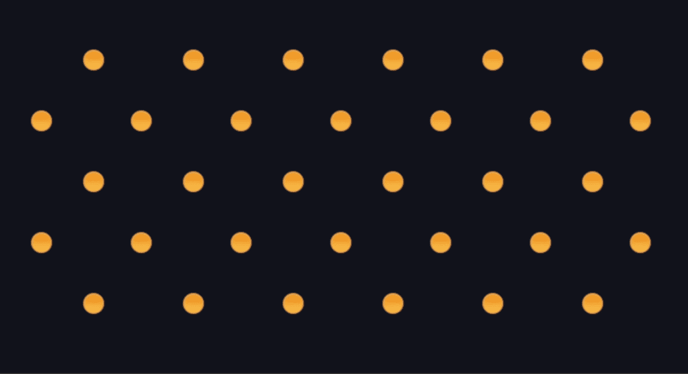

# 用 Matter.js 创建一个表情符号投球游戏

> 原文：<https://betterprogramming.pub/create-an-emoji-ball-drop-game-with-matter-js-9ffb6b873f26>

## 把这些点连接起来


有时候，走出自己的舒适区，接手一些兼职项目是提高开发人员素质的好方法。你获得的技能越多，你能做的就越多。将来的某一天你可能会需要它们。

在这篇文章中，我将向你展示如何用 2D 的网络物理引擎 [Matter.js](https://brm.io/matter-js/) 创建一个简单的游戏。叫做[表情符号滴](https://olivernguyen.io/w/emoji.drop/play.html)。

# 用 Vite 启动一个新的 TypeScript 项目



为了快速进入项目，让我们使用 [Vite](https://vitejs.dev/) 。它是现代 web 开发的工具，对 TypeScript 有很好的支持。

它非常容易设置和使用。让我们用`index.html`创建您的项目:

```
<!doctype html>
<html lang="en">
<head>
  <title>Emoji Drop</title>
  <script type="module" src="index.mts"></script>
</head>
<body>
<canvas id="canvas"></canvas>
</body>
</html>
```

和`index.mts`:

```
import Matter from 'matter-js'const {Bodies, Composite, Engine, Render, Runner, Svg} = Matter;console.log('Hello, Matter.js!');
```


然后运行这些命令:

```
yarn init
yarn add vite matter-js
yarn vite
```

转到`localhost:5137`，你应该会在控制台中看到这条消息。就是这样！现在您已经有了一个项目，它可以实时重载、npm 包支持、TypeScript 类型检查等等。([代码](https://github.com/iOliverN/emoji.drop/commit/6b58ebf5c6309a76ff28f9cfb6a811981f42bd64))

对于生产构建，运行`yarn vite build`。

# Matter.js 入门

`[Matter.js](https://brm.io/matter-js/)`是一个为网络创建 2D 物理引擎的伟大的库。它很容易使用，而且有很多功能。你可以用它在几分钟内创建一个简单的游戏。

现在让我们用一些身体创建一个`Matter.js`世界:

```
import Matter from 'matter-js'const {Bodies, Composite, Engine, Render, Runner, Svg} = Matter;const canvas = document.getElementById('canvas') as HTMLCanvasElement
canvas.width = 791;
canvas.height = 500;const engine = Engine.create();const render = Render.create({
  engine: engine,
  canvas: canvas,
  options: {
    width: 791,
    height: 500,
    wireframes: false
  }
});const ground = Bodies.rectangle(395, 505, 791, 10, {isStatic: true});
const leftWall = Bodies.rectangle(-11, 0, 10, 1000, {isStatic: true});
const rightWall = Bodies.rectangle(792, 0, 10, 1000, {isStatic: true});Composite.add(engine.world, [ground, leftWall, rightWall]);Render.run(render);
const runner = Runner.create();
Runner.run(runner, engine);for (let i = 0; i < 10; i++) {
  setTimeout(() => {
    const body = Bodies.rectangle(350 + i, 0, 40, 40);
    Composite.add(engine.world, [body]);
  }, i * 500)
}
```

只需几行代码，您就可以准备好一个 Matter.js 项目:


现在是时候给这个世界增加一些球和障碍了。我将此作为读者的一个练习。你可以用`[Bodies.cirle()](https://brm.io/matter-js/docs/classes/Bodies.html#method_circle)`把它们放到世界里。([代码](https://github.com/iOliverN/emoji.drop/commit/7875f1b8d5f481108968c3b3f6781141f29eff36))

# 加载 SVG 图像

让我们用心形图标作为我们的球。

```
const heartPath = document.getElementById('path-heart');
const heartVertices = Svg.pathToVertices(heartPath, 1)const heartBall = Bodies.fromVertices(
  random(300, 491), 0,
  [heartVertices],
  {
    restitution: random(0.5, 0.9),
    render: {
      sprite: {
        texture: "heart.png",
        xScale: 1,
        yScale: 1
      }
    }
  }
);function random(a: number, b: number) {
  return Math.random() * (b - a) + a;
}
```

这有两个部分:心形和心形纹理。

1.  心形是一个 SVG 路径。要将其添加到世界中，我们需要将其转换为顶点。

*   将 svg 路径放在 HTML 中。用`document.getElementById()`取回。
*   使用`Svg.pathToVertices()`将其转换为顶点。
*   并使用`Bodies.fromVertices()`创建一个 Matter.js 体。
*   您需要在项目中包含 [pathseg.js](https://www.npmjs.com/package/pathseg) 来使`Svg.pathToVertices()`工作。


2.心脏纹理是 png 图像。我们可以用它作为`render.sprite.texture`身体的精灵。

在这一步，游戏应该看起来如下:([代码](https://github.com/iOliverN/emoji.drop/commit/792228815bca48c5cb934f8e4cfc81f17b3e6c8b))



# 得分

为了得到一个球的分数，让我们等待球停下来，然后从 x 位置计算分数。

*我们怎么知道球什么时候停？*

有`Body.velocity`、`Body.speed`、`Body.angularSpeed`。等他们足够小了再算分数。

```
const didBallStop = (body: Matter.Body) => {
  const {speed, angularSpeed} = body;
  return speed < 0.1 && angularSpeed < 0.1;
}
```

恭喜你！你已经用 [Matter.js](https://brm.io/matter-js) 创建了一个简单的游戏。享受你的工作！参见示例[此处](https://olivernguyen.io/w/emoji.drop/sample.html)与[源代码](https://github.com/iOliverN/emoji.drop) *。*

我还创建了一个 Twitter 版本。在此尝试:

```
**Want to Connect?**I’m [Oliver Nguyen](https://olivernguyen.io/). I share about programming, JavaScript, and Go. I created [OneSidebar](https://onesidebar.com/) — a browser extension for navigating GitHub. Follow me for more content.
```