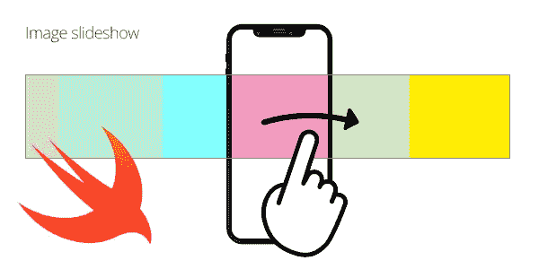
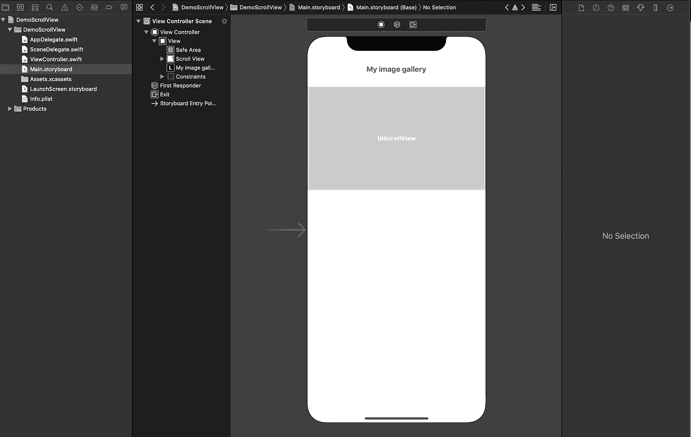
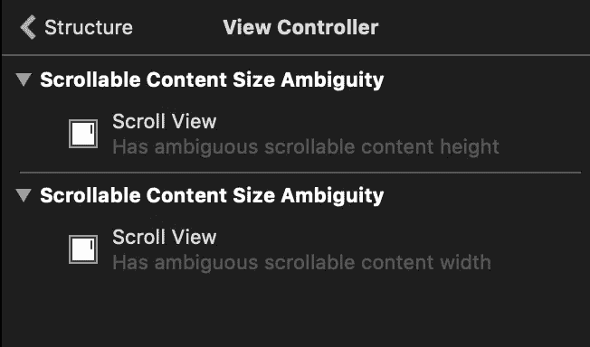

# 在 Swift 中创建图像幻灯片

> 原文：<https://betterprogramming.pub/create-an-image-slideshow-in-swift-b21af9f4ecf3>

## 在你的应用中制作一个漂亮的幻灯片



作者照片。

在开发 iOS 应用程序时，在一个水平幻灯片中包装多个图像是一项常见的任务。不要认为它是你在网页上看到的同样的旧滑块。幻灯片可能比你想象的更常见、更有用。

# 应用程序

幻灯片对于帖子、竞赛、旋转木马(不是真正的旋转木马，而是类似的东西)等 feed 内容非常有用。我在各种各样的 iOS 应用程序中使用过幻灯片，当我需要在小视图中显示多个图像时，它们总是能帮我。

此外，您可以使用手势识别器轻松地将用户交互应用于它们，提供滑动行为来显示容器内的下一个和上一个项目，甚至点击或长按手势来应用事件。

# UIScrollView —这是您所需要的一切

首先我们来看看这个`UIView`子类。`UIScrollView`整合了封装内容的行为，即简单地水平或垂直“滚动”。`UITableViews`、`UICollectionViews`和类似的 UI 对象只是`UIScrollView`类的子类。实际上，它们都以相似的方式滚动。

使用`UIScrollViews`的好处在于，它们提供了委托方法，让您从拥有“钩子”中受益，并在`UIScrollView`滚动、停止滚动、开始滚动甚至减速时定制行为和代码应用程序。

让我们来看看`UIScrollView`对象的基本属性:

*   `contentSize` : `CGSize`。确定`UIScrollView`的内容大小。它用于指定`UIScrollView`中的内容有多长。
*   `contentOffset` : `CGPoint`。它使用具有`x`和`y`坐标的`CGPoint`来指定内容的偏移量。它用于偏移内容(例如“移动”`UIScrollView`内的内容)。
*   `contentInset` : `UIEdgeInsets`。与任何`UIEdgeInset`对象一样，它用于在`UIScrollView`内部设置一个嵌入空间。这就像在`UIScrollView`内部应用填充一样。
*   `isScrollEnabled` : `Bool`。确定`UIScrollView`是否应该滚动。当您必须锁定或解锁`UIScrollView`上的用户交互时非常有用。
*   `isPagingEnabled` : `Bool`。如果启用，它使用分页使 UIScrollView 滚动，并避免自由和不确定的滚动行为。例如，如果你向左滑动，`UIScrollView`会滑动到下一页内容。
*   `bounces` : `Bool`。如果启用，当`UIScrollView`的内容到达结尾或开始时，会使其反弹，提供您可以在许多 UI iOS 控件中看到的经典反弹效果。

# 将我们的 UIScrollView 构建为幻灯片容器

很明显，您可以使用故事板或编程方式构建一个`UIScrollView`,当然，您甚至可以使用 SwiftUI 声明性方法创建一个`UIScrollView`。

让我们使用界面构建器和遗留的 Autolayout 方法尝试第一种方法:



在本例中，我们将使用:

*   顶部有一个`UILabel`，对安全区域有一个顶部约束，也有一个相对于安全区域的中心水平约束。
*   标签正下方的`UIScrollView`对象。我们应用相对于上面`UILabel`的顶部约束边界，以及相对于安全区域或超级视图(我们`UIViewController`的主`UIView`)的尾部和前导约束。



你会注意到 Xcode 会提示两个关于宽度和高度不明确的`UIScrollView`内容大小的警告。我们没有在滚动视图中设置任何内容，也不可能确定这个对象实际上会显示多少内容。这些可以被认为是 XIB 的错误(即自动布局问题)。不要太担心它们，因为 XIB 会显示错误，忽略您将在控制器内部编码的内容。显然，我们将包含提供关于`UIScrollView`内容大小的规范的代码。

如果您没有 XIB，或者更喜欢对布局进行编码，那么基本原理是一样的。根据项目的规格，我经常用 Swift 而不是 Interface builder 来构建我的 UI。只要确保以正确的方式放置对象，并使用 Swift 类或库(如 [SnapKit](https://snapkit.io) )应用其约束即可。

# 用图像填充滚动视图并应用推送行为

一旦你在`UIViewController`中有了对象，你就可以用图像填充它。图像通常由 web 服务器作为资源提供，并且是动态的。这就是为什么我会假设您有一个从任何地方(存储、互联网、缓存等)检索的图像集合。)只是想把它们放在幻灯片里面。

以下是步骤:

1.  遍历`UIImages`的数组。
2.  创建一个与`UIScrollView`的水平边界宽度相同的`UIImageView`，并在其中添加图像。
3.  使用`UIScrollView`上的`addSubview()`方法将`UIImageView`添加到滚动视图中。在这一步，你必须考虑水平偏移，因为每个`UIImageView`必须在前一个之后插入。
4.  当循环完成时，设置`UIScrollView`的`contentSize`。该步骤不是自动的，必须进行编码。`UIScrollView`对象不会根据其内部的内容获取其`contentSize`。它必须以编程方式设置。

正如您所看到的，您可以通过设置我们之前讨论过的基本属性，用几行代码构建一个幻灯片。唯一棘手的部分是实例化`UIImageView`并设置偏移量使它们水平堆叠的块。你甚至可以尝试使用一个`UIStackView`来使它更加舒适和易于编码，但这并没有太大的不同。

请记住，如果您需要使用分页滚动效果使幻灯片水平滑动，您必须设置`isPagingEnabled`属性。否则，它将只是一个 scrollview，不会将滚动动画粘贴到其中的每一页。

如果你想添加一个`UIPageControl`来显示当前页面指示器，你只需要使用一个最重要的`UIScrollViewDelegate`协议方法:

```
func scrollViewDidEndDecelerating(_ scrollView: UIScrollView) {
        let x = scrollView.contentOffset.x
        let w = scrollView.bounds.size.width
        pager.currentPage = Int(ceil(x/w)) 
}
```

其中名为`pager`的对象就是你的`UIPageControl IBOutlet`。

# 结论

首先，不要“原样”复制/粘贴代码。试着理解这个实现的登录和输出。一些特性和规范应该取决于你想要达到的目标和整个应用的外观和感觉。

其中一个关键因素是`UIImageView`设置。改变框架，改变每个`UIImageView`中图像的`contentMode`，甚至在那个物体上应用效果，都会让你的应用看起来大不相同。您可以尝试在每个图像、标题、渐变、点击效果等上添加阴影层。所以把这当成一个模拟幻灯片，试着从中获得更多的乐趣吧！