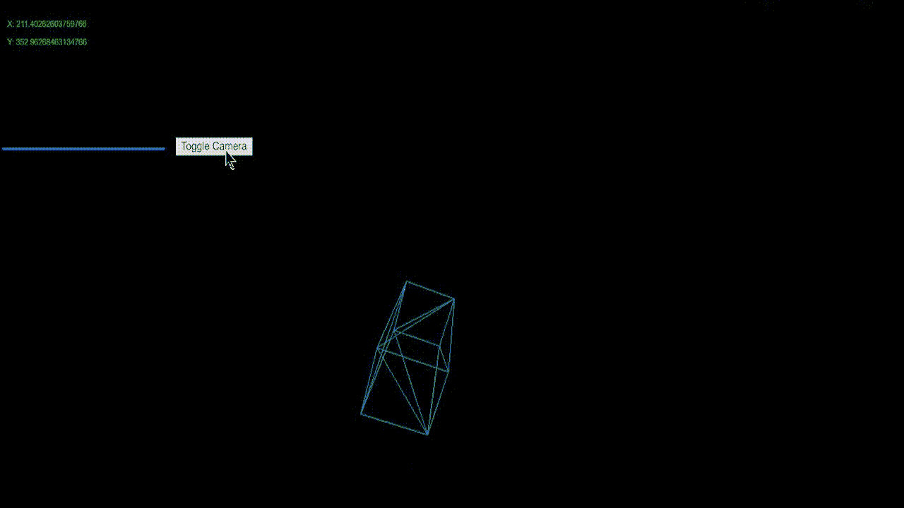
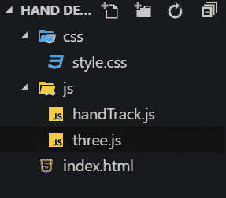
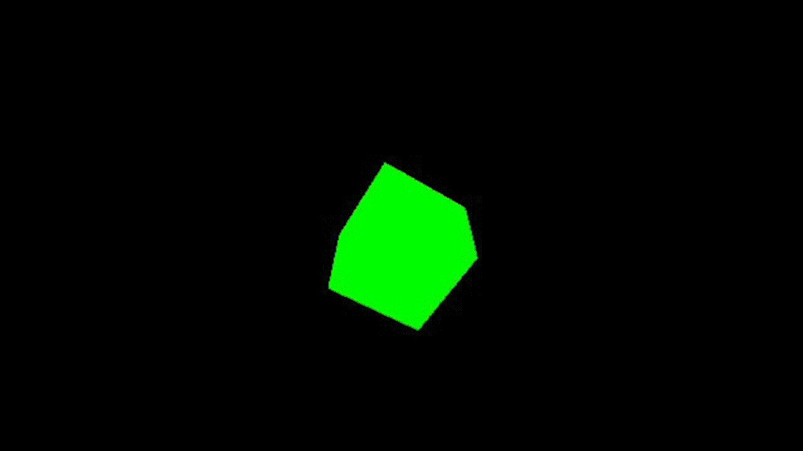
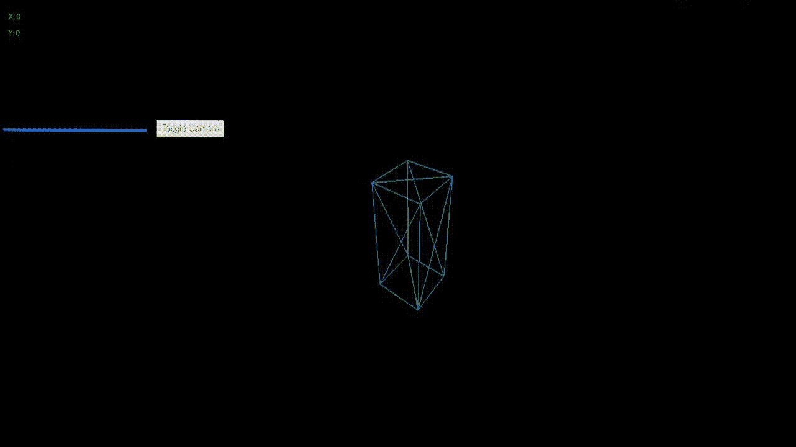
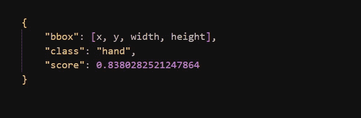
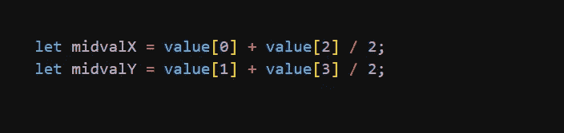

# 创建一个受钢铁侠启发的交互式 JavaScript 3D 模型

> 原文：<https://betterprogramming.pub/create-an-interactive-javascript-3d-model-inspired-by-iron-man-8328982b7fd8>

## 想过穿托尼·斯塔克的喷气动力靴子吗？

想过穿托尼·斯塔克的鞋子会是什么样吗？

我在这里告诉你，你可以做到。你不需要成为亿万富翁、天才、花花公子、慈善家——你只需要一点点 JavaScript。

在本文中，我将带您完成一个很酷的项目，我们将探索一些很棒的 JavaScript 模块。多亏了 JavaScript，我们可以插入任何模块，用它创造出令人惊叹的东西。

事不宜迟，让我们开始吧！

# 先决条件

尽管我将解释我遵循的几乎所有流程，但仍有一些事情您应该了解:

*   一个 IDE(可以是任何你习惯使用的东西)，我将在这个项目中使用 VS 代码。
*   *JavaScript 基础知识*
*   带有工作网络摄像头的 PC 或笔记本电脑
*   你应该是漫威的粉丝，因为*权力越大，责任越大。*

# 绝对初学者的资源

如果你刚刚听说过 JavaScript，不知道它是如何工作的，我建议你在开始这个项目之前，看看这个免费视频系列，获得一些见解和基础知识。

另外，你可以去 programmingwithmosh.com***，*** 看看他，他是个很棒的老师，他在那里上传了很多很棒的内容。

***现在我们来谈建筑这个事情吧！***

# 您需要的模块

在整个项目中，我们将只使用两个模块。你没看错:只要两个模块就可以了。

## 三. js

看到缩略图视频中那个看起来很酷的盒子了吗？我们可以用这个 JavaScript 库创建类似的东西——一个易于使用的，*轻量级的*，带有默认 WebGL 渲染器的 3D 库。它还提供画布 2D、SVG 和 CSS3D 渲染器。

***Web GL****(Web Graphics Library)是一个 JavaScript API，用于在任何兼容的 Web 浏览器中渲染交互式 3D 和 2D 图形，无需使用插件。我们可以直接将其集成到 HTML < canvas >元素中。*

你可以用这个库创造一些令人惊奇的东西。自己去实验吧。如果你想了解更多关于 **three.js** 的内容，请访问他们的[网站](https://threejs.org/)或者阅读他们的[文档](https://threejs.org/docs/index.html#manual/en/introduction/Creating-a-scene)。

 [## three.js - Javascript 3D 库

### 一个可怕的易于使用的三维轻量级图书馆

threejs.org](https://threejs.org/) 

## Handtrack.js

> 这是一个用于直接在浏览器中原型化实时手部检测(边界框)的库。在底层，它使用一个经过训练的卷积神经网络，为图像中手的位置提供边界框预测。卷积神经网络(ssdlite，mobilenetv2)使用 TensorFlow 对象检测 API 进行训练。

它提供了一个包装器，允许您在 web 应用程序中构建基于手势的交互原型。它接受一个 HTML 图像元素(`img`、`video`、`canvas`元素)，并返回一个包含边界框、类名和置信度得分的数组。

你可以用这个库做很多其他的事情。我建议你阅读他们的 [***文档***](https://github.com/victordibia/handtrack.js/) 以了解更多关于他们的信息，但是如果你只想坚持这个项目，那么这就足够了。

 [## victordibia/handtrack.js

### 点击此处，在您的浏览器中观看现场演示。js 是一个实时手部检测原型库

github.com](https://github.com/victordibia/handtrack.js/) 

# 文件结构

我们总是建议很好地组织您的文件夹和组件，这样当您的项目增长并变得可伸缩时，它就易于阅读和维护。

遵循这个文件结构

对于这个项目，我们将首先构建我们的组件。如果你想保持你的结构和我的一样，那么就按照这个方法，但是你可以自由地制作你自己的结构。只需在脚本和 CSS 文件中提及准确的来源。

# HTML 方面

在本节中，我们将创建**index.html**和 **style.css** 页面。这两个文件是我们整个项目的根文件，非常容易阅读和理解。让我们看一下代码:

这是一个非常简单的文件，只有我们将在这个项目中使用的库和 cdn。

在部门*追踪器*中，我们正在创建自定义 id，它将成为浏览器左上角的网络摄像头屏幕。*数据*部门在浏览器中渲染摄像机画面，并显示更新后的 X 和 Y 坐标。

这个项目的 CSS 是不言自明的:

`#myvideo`标签有一个设置为 *none* 的显示属性，这将在以后派上用场。想法是使默认视频显示为无，然后用户点击“*切换摄像机*”按钮，视频屏幕出现。这使得工作体验更加人性化。

# JS 这边

现在是这个项目有趣的部分。为了在屏幕上显示任何 3D 图形，我们需要 three.js，但是仅仅导入脚本是没有用的。要真正在屏幕上看到一些东西，你需要三样东西:场景、摄像机和渲染器。

## 设置三个对象

让我们在项目中创建这三个元素:

使用这些命令，我们现在已经设置好了相机、场景和渲染器。`Three.js`为我们提供了各种各样的相机，但对于这个特殊的项目，我们将使用`Perspective Camera`。

让我们看看这是怎么回事。在上面的代码中，我们已经用`perspective camera`初始化了 camera 对象，这给了我们以下配置:`PerspectiveCamera({Field of View}, {aspect ratio}, {near clipping pane}, {far clipping pane});`

最后但同样重要的是，我们将`renderer` 元素添加到 HTML 文档中。这是渲染器用来向我们显示场景的画布元素。

但是如果你运行这个，你可能会得到一个黑色的屏幕，上面有一条蓝线，X 和 Y 坐标在左上角。

但是我们还没有看到这个物体。为什么？

让我们解决这个问题。

## 创建和显示 3D 对象

为了添加立方体，我们将创建一个`BoxGeometry`。该对象由立方体的顶点和面组成。

同样，对于材质，three.js 附带了很多，但是我们将在这个项目中使用`MeshBasicMaterial` 。我们需要的第三样东西是一个网格。网格是一个对象，它接受一个几何体并对其应用一种材质，然后我们可以将它插入到我们的场景中，并自由移动。

当我们调用`scene.add()` 时，立方体会自动添加到坐标(0，0，0)中。这将导致相机和立方体都在彼此内部——为了避免这种情况，我们简单地将相机移出一点点`camera.position.z = 5;`

但是如果运行这个， ***还是看不到立方体！*** 真让人沮丧，我知道，再坚持一点点！

实际上，您已经在项目中创建了立方体，但是它还不可见。要使其可见，请编写以下内容:

这将创建一个名为`animate()`的函数。该函数内部有一个渲染调用，用于渲染场景，从而允许您实际看到立方体。

但老实说，它只是一个无聊的绿色立方体，对吗？你可能想知道*“我也可以用简单的 CSS 来做，为什么要通过所有这些 WebGL 和渲染…*

请允许我向你展示三个 js 的魔力…

尝试在您的项目中键入以下代码:

瞧，你有了一个三维立方体

基本三维立方体

## 自定义多维数据集

我们已经设计好了立方体，但是它看起来不像演示中的样子，是吗？演示版看起来更好——让我们定制我们的立方体来匹配它。

您所要做的只是更改代码中的一些设置:

这是从一开始的整个文件，代码中有一些额外的元素。此外，我们还添加了一个线框，这给了它钢铁侠全息的感觉。在这个文件的末尾，您应该会看到这样的内容:

最终三维立方体

我们已经成功了一半。👐 👆

## 让我们玩一下 handtrack.js

首先，我们需要在库的帮助下加载一个模型。我们还定义了一些参数，但这一步完全是可选的:

如果我们只使用了`handTrack.load()`方法，这个过程也是可行的，但是我们想给我们的项目添加更多的定制，所以我们定义了额外的参数。

一旦我们完成了 handtrack.js 模型的加载，我们需要在画布中加载视频流，就像 HTML 中定义的那样。为此，我们使用一种叫做`handTrack.startVideo()`的方法

*注意:我们有一个布尔变量* `*isVideo*` *来帮助流的切换。这是一种更好且用户友好的处理摄像机访问的方式，而不是让摄像机一直开着。*

现在到了我们需要一点机器学习的部分…但是不要担心，你不需要做任何事情！handtrack.js 将在*谷歌的 TensorFlow* 的帮助下为你检测/预测数据。

这是从 handtrack.js 获取预测的代码:

现在的技巧是跟踪手在视频画布上的坐标，并对三个 js 对象进行相应的更改。

来自`model.detect()`的`prediction`对象返回以下结果:

`bbox`键给出围绕手绘制的方框的坐标、宽度和高度值。但是我们试图获得手的中心点坐标，为此我们使用一个简单的公式:

另一个问题是对象的画布和跟踪器的画布的比例非常大。此外，两个源的中心点原点不是中心。要做到这一点，我们首先要移动坐标，这样视频画布的原点就可以在中心。

一旦做到这一点，解决规模问题就容易了。最终的结果是这样的:

这就对了。你自己的 3D 物体，你可以用手控制它。

做所有艰苦的工作并得到令人惊讶的最终结果难道不有趣吗？史塔克先生，去拯救世界吧。