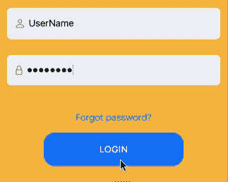
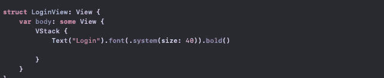
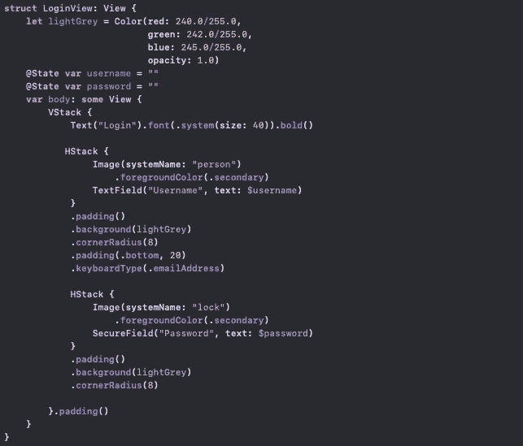
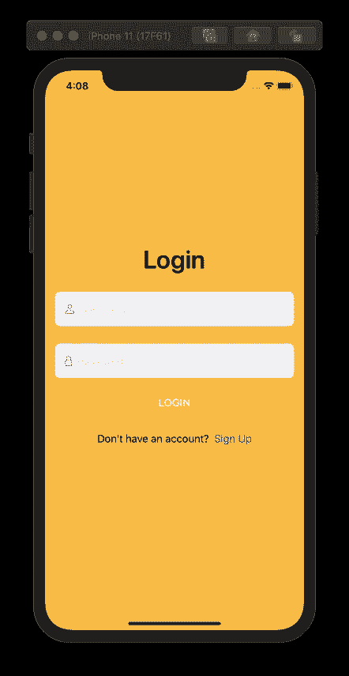
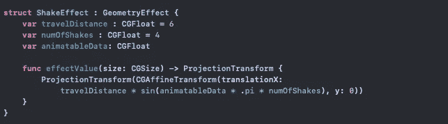
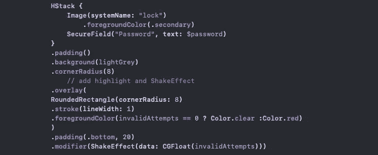
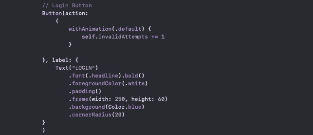
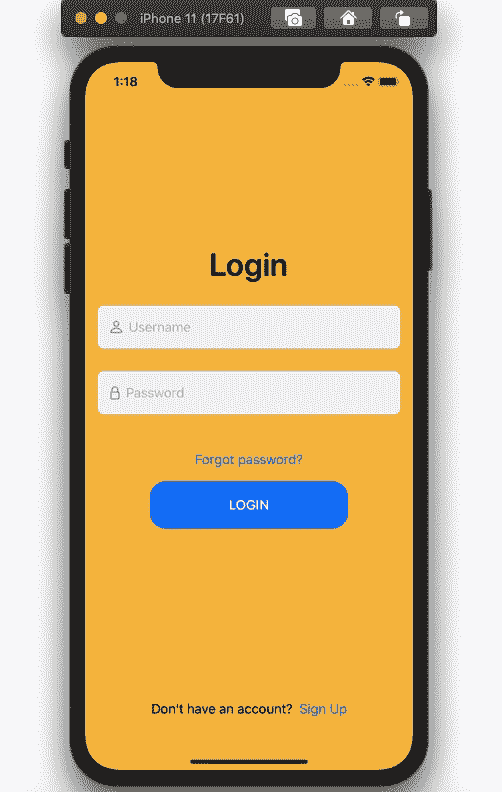

# 在 SwiftUI 中创建无效用户名和密码动画

> 原文：<https://betterprogramming.pub/create-an-invalid-username-and-password-animation-in-swiftui-72fb4c52f7b6>

## 当输入错误的凭据时，高亮显示并摇动文本栏



代码示例结果

在本教程中，我们将创建代码来查看密码字段的登录尝试次数。最好不要让用户知道*哪个*字段有错误的数据。相反，突出显示用户名/电子邮件和密码字段——这使得入侵帐户更加困难。当然，还有其他安全措施，如双因素身份验证，但我将把这些留给另一个教程。

# 简单用户界面

我们将从在 VStack 中创建一个带有登录文本的视图结构开始。



声明用户名/电子邮件和密码变量以存储用户输入的值，然后创建用户名/电子邮件和密码字段并将其添加到 VStack 中。使`Password`字段成为`SecureField`。


您可以使用一些 SF 符号来自定义您的字段。下面我有一个名为`person`的用户名和`lock`的密码符号。用相关的`TextField`将图像插入`HStacks`内。



将忘记密码、登录和注册按钮添加到同一个 VStack 以完成 UI，如下所示:


现在我们已经设置好了所有的 UI 元素。



应用程序的简单用户界面

# 动画

接下来，我们使用`GeometryEffect`制作震动效果。根据需要调整变量。`travelDistance`将影响`TextField`水平移动的距离。`numOfShakes`是`TextField`会晃动的次数。`animatableData`是从`LoginView`获取的尝试次数。



声明一个变量来记录无效登录尝试的次数。添加一个覆盖来为包含我们的`TextField`的`HStacks`创建一个边界，然后添加一个修改器到接受我们的`ShakeEffect`的同一个`HStack`。

```
@State **var** invalidAttempts = 0
```



在`withAnimation`中，每次用户点击登录按钮时，增加无效尝试的次数。



全部完成！接下来，您可以限制失败登录尝试的次数，以防止用户滥用您的服务器。



最终代码结果—高亮和摇动动画