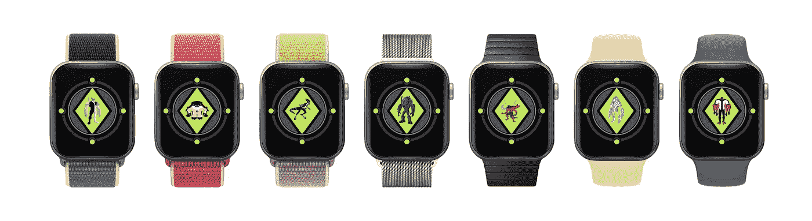
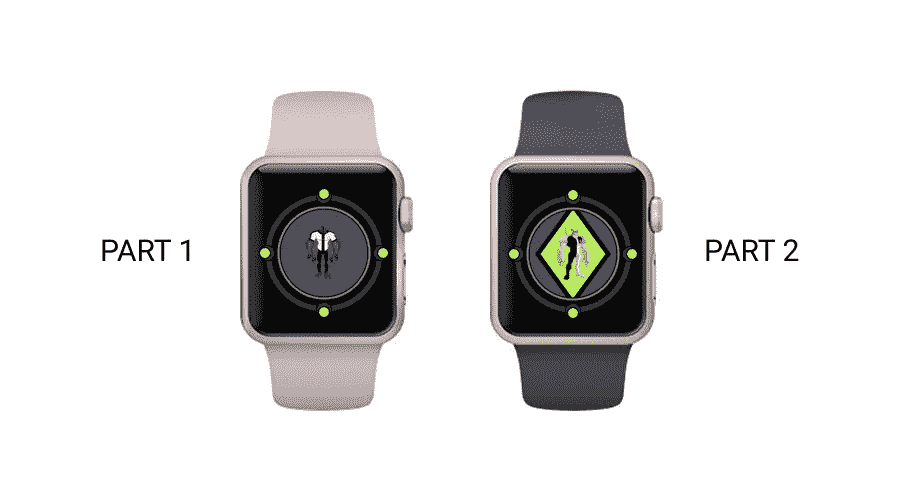
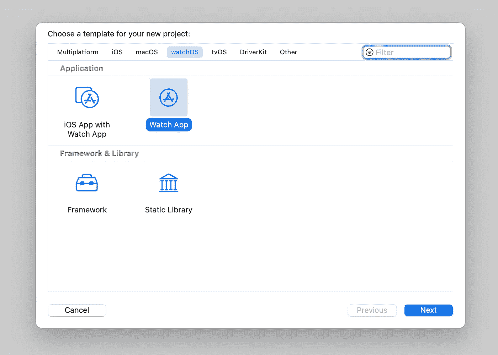
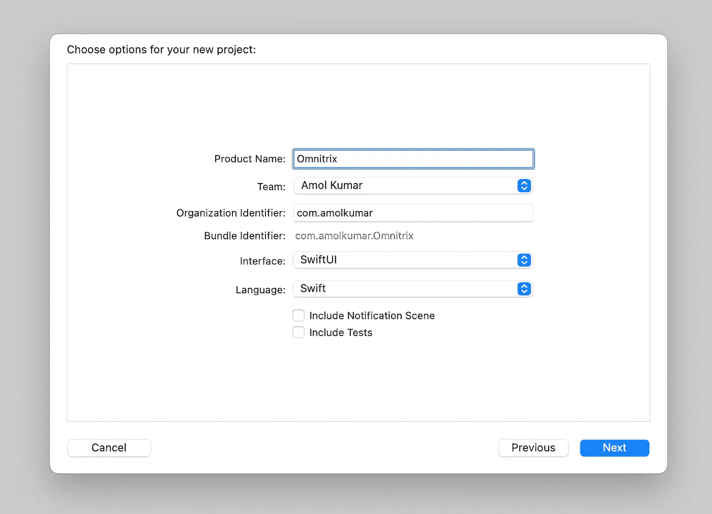
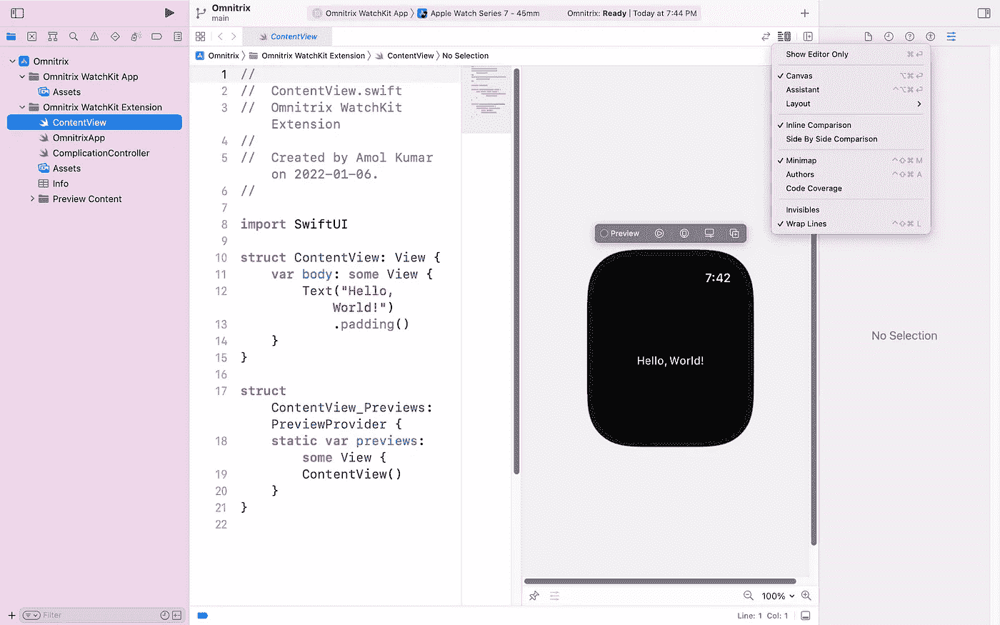
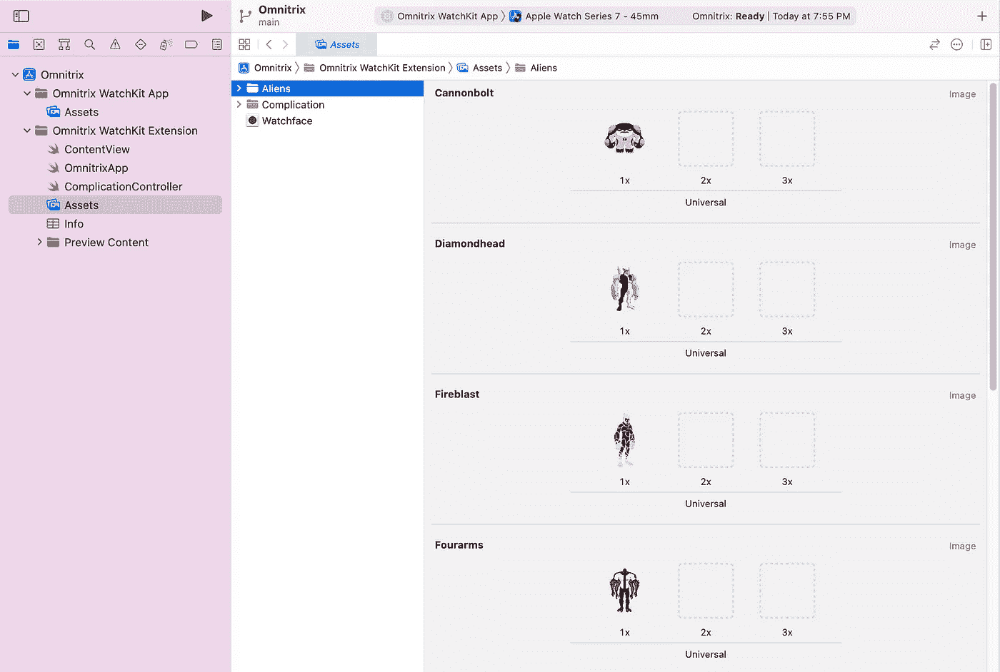
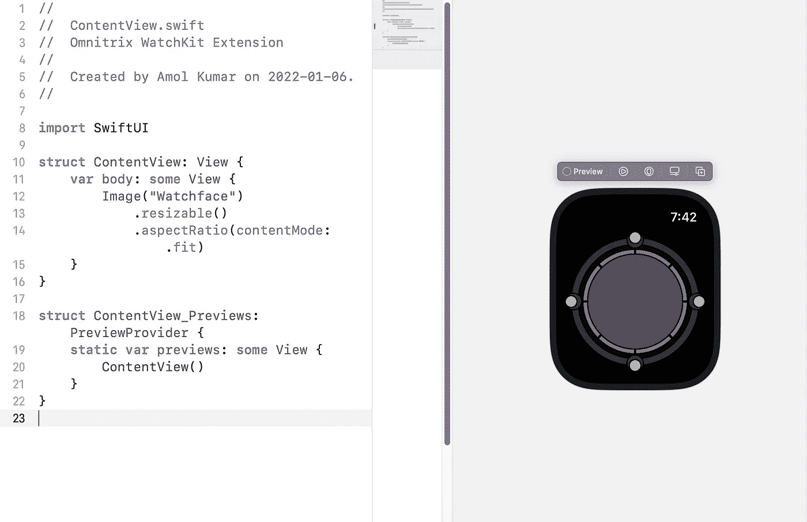
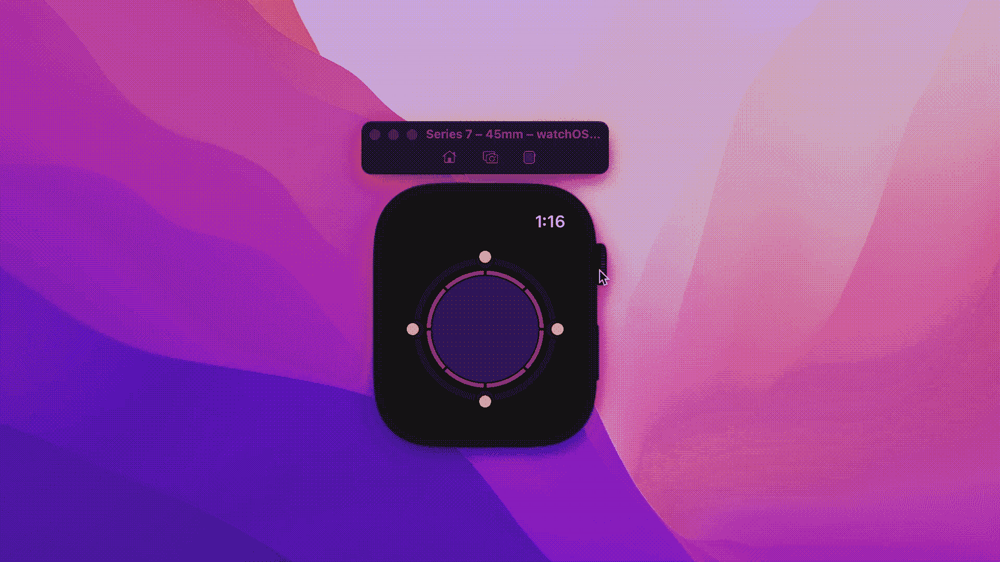
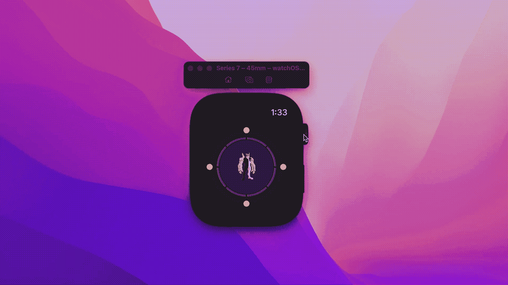

# 使用 SwiftUI 创建 Omnitrix watchOS 应用程序

> 原文：<https://betterprogramming.pub/create-an-omnitrix-app-for-your-apple-watch-using-swiftui-d694a9c5fb80>

## 为你的 Apple Watch 打造一款应用



作者图片

在本教程中，我们将为 Apple Watch 开发一个 Omnitrix 应用程序。是的，你猜对了。这款 app 的灵感来源于漫画系列，`Ben 10`！！

# 结构

这是由两部分组成的系列。第一部分涵盖了基本的设置，这相对来说比较容易开发。并将为用户提供该应用程序的最简单的实现。而后一部分提供了可选的实现，使应用程序按照系列更加卡通准确。

项目所需的所有资产都在[链接](https://www.dropbox.com/sh/p7ua8vcdfymsp48/AAB-7ot14UolnKrHw-KwSYLsa?dl=0)中提供。



# 项目设置

启动 [Xcode](https://developer.apple.com/xcode/) ，选择新建 Xcode 项目，选择 watchOS 下的 Watch App 创建项目。我们将跳过另一个选项，因为我们需要为此项目创建一个独立的手表应用程序。



在下一个提示中，命名您的项目，并确保将接口设置为 SwiftUI。您也可以取消最后两个选项，因为在开发过程中不需要它们。



瞧啊。！您刚刚创建了您的 SwiftUI 项目。要预览它，请单击右侧拆分编辑器中的 Resume 选项。如果您没有看到它，请确保从调整编辑器选项中启用画布选项。一旦成功构建，您将看到带有 Hello World 消息的手表预览。



# 创建手表外观

从 UI 的角度来看，这部分由两层组成。底部是表盘，它会根据数字表冠的输入旋转。上面一个是图像视图，用来存放外星人的图像。所以先从最下面的开始吧。

将[图像集](https://www.dropbox.com/home/Omnitrix)导入到项目的资产文件中。



让我们回到`ContentView`文件来实现表脸层。在文件中，删除`Text`元素，添加带有`[resizable](https://developer.apple.com/documentation/SwiftUI/Image/resizable(capInsets:resizingMode:))`和`[aspect ratio](https://developer.apple.com/documentation/swiftui/view/aspectratio(_:contentmode:)-5ehx6)`修饰符的`Image`。

```
Image("Watchface")
    .resizable()
    .aspectRatio(contentMode: .fit)
```



# 向观察面添加旋转动画

我们希望表盘根据数字表冠的输入旋转。相同的读数将存储在`scrollOffset`变量中。

```
@State var scrollAmount = 0.0
```

接下来，我们将添加`[digitalCrownRotation](https://developer.apple.com/documentation/swiftui/view/digitalcrownrotation(_:))`修饰符来注册和更新变量。

此外，`Image`必须放在`ZStack`中，因为我们希望在彼此之上实现多个层。然后给`ZStack`添加 digitalCrownRotation 修改器。

由于我们想添加 10 个外星人，我们将设置范围从 0 到 9，步长值为 1。

之后，我们还会添加一个`[focusable](https://developer.apple.com/documentation/swiftui/view/focusable(_:))`修饰符。这将使表盘聚焦，无需选择即可响应数字表冠输入。将[偏移](https://developer.apple.com/documentation/swiftui/text/offset(_:))添加到`ZStack`修饰符中，将元素平移到稍低的位置，以便利用空的屏幕空间。

```
.offset(y: 15)
.focusable(true)
```

侦听器被设置，动画可以添加到表盘本身。为此，添加`[rotationEffect](https://developer.apple.com/documentation/swiftui/view/rotationeffect(_:anchor:))`修改器到图像中。

```
.rotationEffect(.degrees(scrollAmount*90))
```

这样，图像将在数字表冠的一个进程中旋转 90 度。完整的代码现在应该是这样的:

在模拟器或设备上运行应用程序。数字表冠旋转时，表盘会产生动画效果，产生表盘变化的效果。

> 在模拟器上，将光标移动到双冠上，并上下滚动以旋转它。



注意:在开发过程中，iPhone 和 Apple Watch 之间的连接丢失是相当常见的。您可以通过在 Apple Watch 上打开相机应用程序来强制同步过程。

# 外星人！

最后一步，我们将添加外来图像到项目中。为此，创建一个`enum`来存放 integer 作为原始值的数据。

在此之后，在表盘下方再加一个`Image`。对于图像名称，我们将添加以下逻辑。

```
Image("\(Aliens(rawValue: Int(scrollAmount))!)")
```

在这里，`scrollOffset`变量被用来匹配来自 enum 的使用原始值的相应 alien。由于偏移量是 double 类型，我们需要将它转换成整数。

然后，添加下面的修饰符来调整图像的大小，并使其保持在表盘框架内。

```
.resizable()
.padding(.all, 45)
.aspectRatio(contentMode: .fit)
```

到目前为止，您的项目代码必须如下所示:

现在，你已经完成了这个应用程序的第一部分。你可以在实体 Apple Watch 上运行它，并在你的手腕上体验一个版本的 Omnitrix！！



项目代码可在 [GitHub](https://github.com/Rockindash/Omnitrix-Part1) 上获得。

# 下一步是什么

你可以跟随本教程的[第二部分](https://medium.com/@amol.kmr05/create-an-omnitrix-app-for-your-apple-watch-using-swiftui-part-2-474a3745b713)来创建一个更加卡通化的版本。其中包括添加带有打开和关闭动画的附加层。