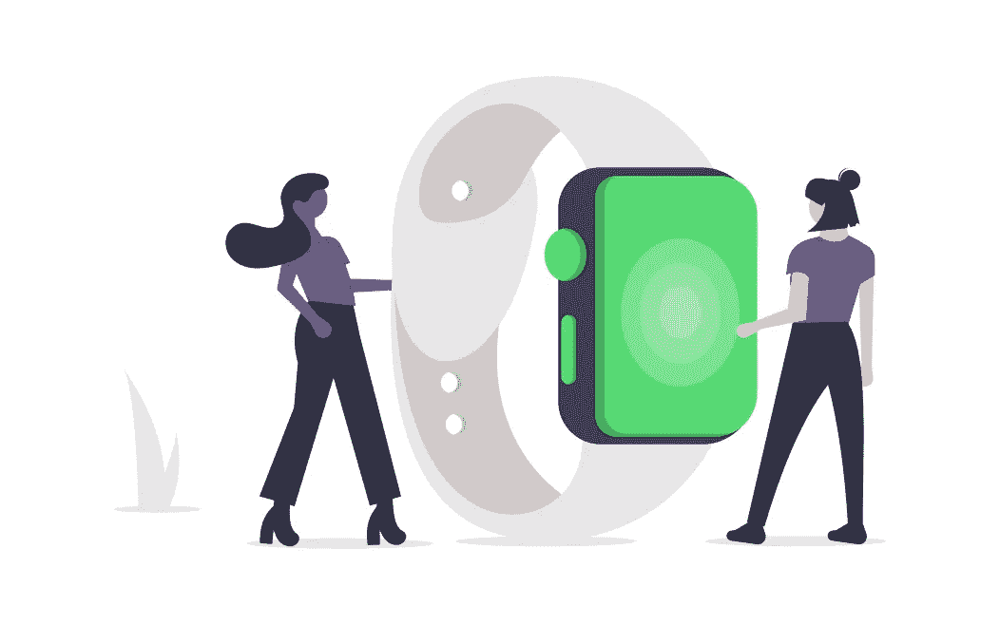
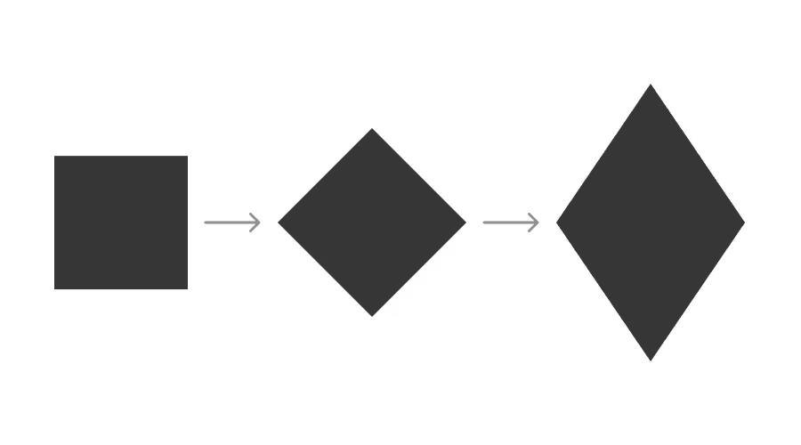
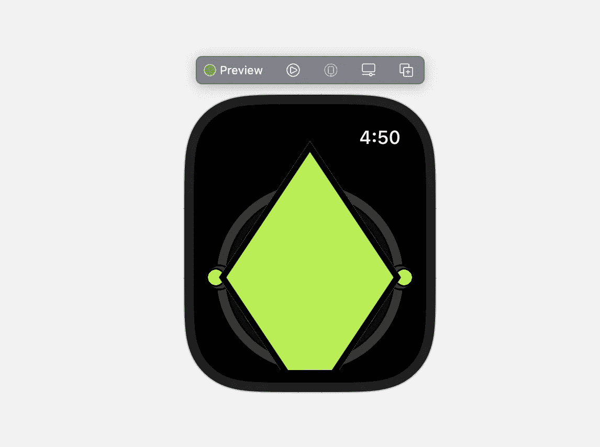
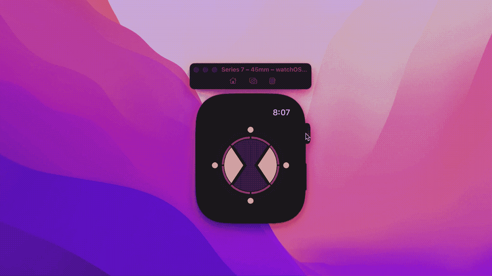

# 在 Omnitrix SwiftUI watchOS 应用程序中添加形状和背景

> 原文：<https://betterprogramming.pub/create-an-omnitrix-app-for-your-apple-watch-using-swiftui-part-2-474a3745b713>

## 让我们用形状来掩盖我们的表盘



来源: [undraw](https://undraw.co/)

欢迎回到 Omnitrix 项目的第二部分。在这一部分，我们将添加开幕和闭幕动画的应用程序。

请注意，这部分从我们之前停止[的地方继续向前](/create-an-omnitrix-app-for-your-apple-watch-using-swiftui-d694a9c5fb80)。

或者，您可以[下载](https://github.com/Rockindash/Omnitrix-Part1)上一部分的模板并从那里继续。那么，我们开始吧。

# 修改

在这一部分中，我们将在手表表面上添加另一层，以掩盖打开和关闭动画。为了适应这种情况，需要对前一部分的某些元素进行更改。让我们从头开始。

首先，通过以下方式更新`enum`以添加新屏幕。

那么`[digitalCrownRotation](https://developer.apple.com/documentation/swiftui/view/digitalcrownrotation(_:))`修饰符的范围需要从 0 更新到 10，以适应新的屏幕。

# 添加形状

上表面由 2 个`rhombi`组成，它们将左右平移以模仿打开和关闭的动画。

除此之外，底部还会有另一个`rhombus`，它将作为一个底座，为外星人图像提供更好的对比度。

所以，总共有 3 个`rhombi`我们需要为这个部分添加。先说动画的吧。

用下面的修改器在外星人图像下面添加一个`Rectangle`形状。

我们来了解一下刚刚发生了什么！！这里我们取了一个正方形，因此具有相同的高度和宽度值。

将其旋转 45 度，然后沿 y 轴拉伸，以获得菱形形状。



对于`foregroundColor`,逻辑确保当看到外星人时填充是透明的。如果您运行预览，它必须看起来像这样。



因为我们需要它们的两个副本，所以再次复制并粘贴整个`Rectangle`代码。

现在，为了让它工作，我们需要抵消和掩盖他们。

为此，分别向它们添加以下偏移逻辑，以便它们基于`scrollOffset`移入和移出帧。

```
//Rhombus 1
.offset(x: scrollAmount==0 ? 90 : 30)//Rhombus 2
.offset(x: scrollAmount==0 ? 90 : 30)
```

对于动画来说，剩下的就是将它们遮罩成一个`Circle`形状。为此，可以在两个矩形上添加一个遮罩修改器。

```
.mask(Circle())
```

至此，`Rectangle`的代码必须如下所示:

您可以在模拟器或实际设备上运行项目来检查进度:



# 添加背景

最后一步，我们需要添加背景基础，并在看到外星人时显示出来。

要实现在表盘正下方添加另一个矩形:

它遵循同样的菱形逻辑。唯一不同的是，当`scrollOffset`为 0 时，我们想要隐藏它。

因此在`foregroundColor`修改器下的不透明度是合理的。

好了，你的苹果手表 Omnitrix 应用程序完成了。您可以在实际设备上运行它，也可以在社交媒体上展示它:


该项目的完整代码可在 [Github](https://github.com/Rockindash/Omnitrix-Part2) 上获得。

如果你有任何进一步的疑问或者在教程的任何一点上卡住了，你也可以通过推特[联系我。](https://twitter.com/amolkmr05)