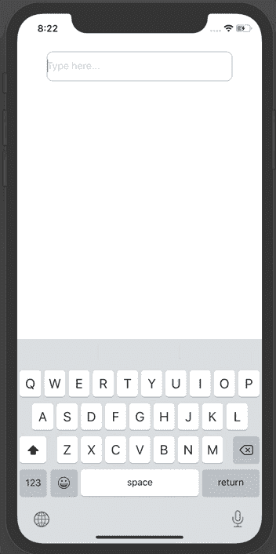

# 在 RxSwift 中创建和链接可观察序列

> 原文：<https://betterprogramming.pub/create-and-chain-observable-sequences-in-rxswift-fae9c5bbbc49>

## 缩短你的代码，让它更有效率


鲍里斯·米塞维奇在 [Unsplash](https://unsplash.com?utm_source=medium&utm_medium=referral) 上的照片

在这个简短的教程中，我们将学习如何创建两个 [RxSwift 的](https://github.com/ReactiveX/RxSwift) `Observable`序列并链接它们。

示例应用程序在屏幕顶部显示一个`UITextField`。它等待用户输入，当用户输入了包含“rx”的五个字母时，`UITextField`闪烁绿色并刷新:



项目的[源代码可以在 GitHub 上获得。](https://github.com/zafarivaev/RxSwift-Chaining)

# 我们开始吧

首先，让我们快速创建并在屏幕上定位我们的`textField`:

现在，在文件顶部添加以下导入:

```
import RxSwiftimport RxCocoa 
```

我们必须添加`disposeBag`属性，以便将来取消分配订阅:

```
private let disposeBag = DisposeBag()
```

我们现在准备创建我们的序列。

# 创建可观察的序列

让我们从第一个任务开始:在输入的字符串中查找“rx ”:

在用户输入一个字母后，我们将调用这个搜索方法。如果成功，它将发出一个`true`值。否则，将发出`false`值。

为了创建第二个任务的方法，动画和清除`textField`，我们编写以下代码:

正如我们所看到的，这个方法执行了一个 0.2 秒的简短动画，改变了`textField`的`backgroundColor`属性。完成后，我们执行另一个动画，将`backgroundColor`返回到它以前的状态，并将`true`事件发送到`observer`。

现在是时候把这些全新的可观察物连接起来了。

# 链式可观测量

我们需要创建一个方法来保存`textField`的绑定:

下面是这种方法中发生的事情的分类:

*   使用`.orEmpty`方法，我们将可选的`String?`类型转换为`String`。
*   我们过滤掉所有`textField`的文本计数不等于 5 的事件。当它等于 5 时，我们执行`.flatMap`方法。
*   `.flatMap`方法将序列的类型从`Observable<String>`更改为`Observable<Bool>`，因为这是`findSubstring(in: )`方法返回的类型。
*   我们只允许`true`事件通过 next，这意味着找到了“rx”子串。
*   在下一个`.flatMap`方法中，我们制作了`textField`的动画并返回一个新的`Observable<Bool>`类型的序列，它在动画完成时发出一个`true`事件。
*   当动画完成后，我们通过`.filter`方法要求。
*   在`.subscribe`中，我们简单地打印“Subscribed”来调试实现。
*   最后，我们将订阅添加到`disposeBag`中，它将解除对它的分配。

不要忘记将`bindTextField()`方法添加到`viewDidLoad`中:

我们已经成功地创造并链接了可观测的序列。

我们最终的`ViewController.swift`文件现在看起来像这样:

# 包扎

我们已经看到使用`.flatMap`函数链接不同的可观察序列是多么容易。如果您想了解更多关于 RxSwift 的功能，请随时查看我的其他相关文章:

[](https://medium.com/better-programming/replace-delegation-with-rxswift-32ad18d75140) [## 用 RxSwift 替换委托

### 不再有协议一致性，只有简单的可观察性

medium.com](https://medium.com/better-programming/replace-delegation-with-rxswift-32ad18d75140) [](https://medium.com/better-programming/reactive-mvvm-and-the-coordinator-pattern-done-right-88248baf8ca5) [## 反应式 MVVM 和协调模式做对了

### 使用 Swift 5、RxSwift 和 RxDataSources

medium.com](https://medium.com/better-programming/reactive-mvvm-and-the-coordinator-pattern-done-right-88248baf8ca5) [](https://medium.com/better-programming/how-to-implement-uitableview-and-uicollectionview-with-rxdatasources-1afcd68729bf) [## 如何用 RxDataSources 实现 UITableView 和 UICollectionView

### 以及为什么您再也不会直接使用 UITableViewDataSource

medium.com](https://medium.com/better-programming/how-to-implement-uitableview-and-uicollectionview-with-rxdatasources-1afcd68729bf) 

非常感谢您的阅读！