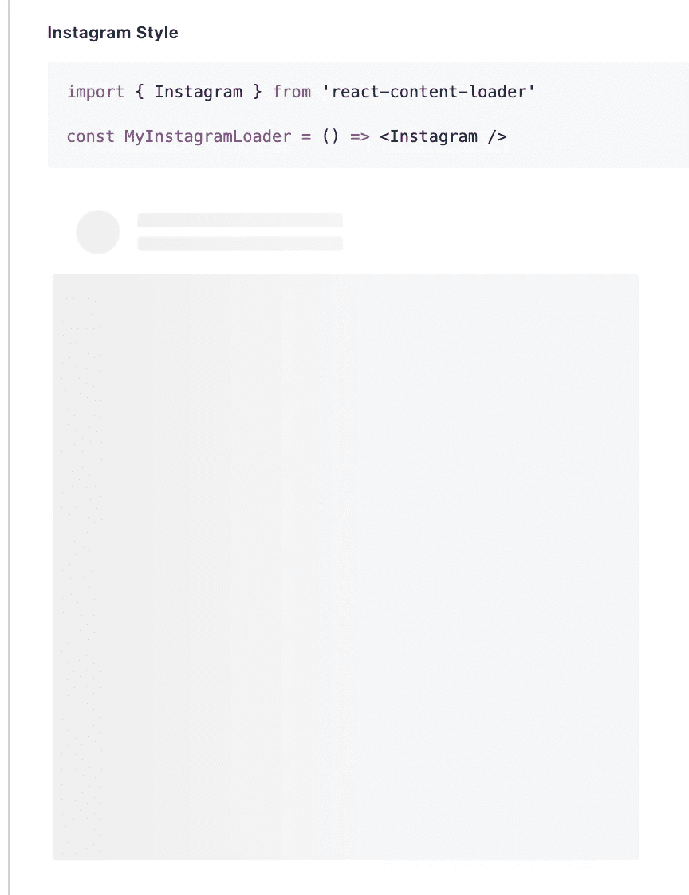
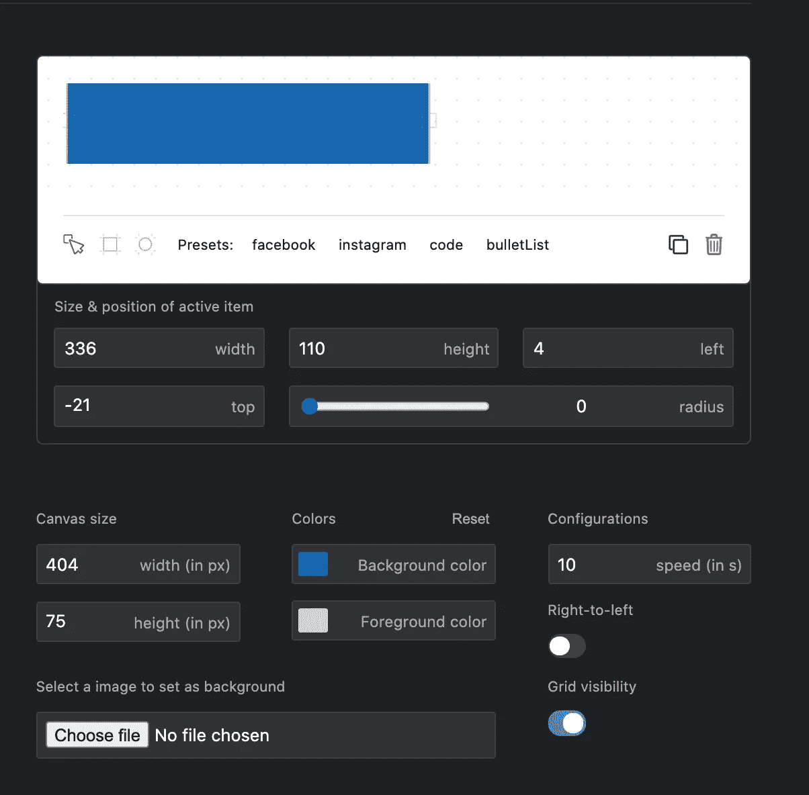

# 如何创建和定制 react-content-loader

> 原文：<https://betterprogramming.pub/create-and-customize-react-content-loader-c630a3b917ac>

## 创建一些有趣的东西，供用户在数据加载时查看


照片由[诺德伍德主题](https://unsplash.com/@nordwood?utm_source=unsplash&utm_medium=referral&utm_content=creditCopyText)在 [Unsplash](https://unsplash.com/s/photos/waiting?utm_source=unsplash&utm_medium=referral&utm_content=creditCopyText) 上拍摄

在 React 和 React Native 或一般的单页面应用程序中构建应用程序的一个优点是，我们可以非常快速地在页面之间导航。然而，在某些情况下，当我们需要`fetch`和`Get`来自 API 或后端的数据时，我们需要等待`respond`。有一个伟大的设计原则表明，当事情需要一段时间时，我们应该让用户知道。

使用 [react-content-loader](https://github.com/danilowoz/react-content-loader) 或者一个框架屏幕，你可以向用户展示它已经快完成了，并且正在发生一些事情。在这篇博客中，我将演示如何使用脸书和 Instagram 等 react-content-loader 预置，或者创建和定制一个 SVG 驱动的组件，以与实际内容相似的形状显示页面的加载元素。

**优点:**

*   您可以使用任何 SVG 形状来创建加载器元素。
*   创建一个从左到右发光的动画占位符很容易。
*   它有一些预先设计好的内容加载器(比如脸书，Instagram)。
*   因为 SVG 支持许多形状，所以它可以用于任何复杂的 UI。

首先，我从应用程序中的预设内容加载器开始。首先，我们需要安装软件包(npm):

```
npm i react-content-loader — save
```

或者

```
yarn add react-content-loader
```

然后我们从 react-content-loader 导入内容:

```
import ContentLoader, {  Instagram } from 'react-content-loader';class Bookings extends React.Component { return requests ? (
    <div>
      //
      //
   </div> ):(
      <>
        <h3>Loading ...</h3> <Instagram /> </>)}
```

它看起来会像这样:



以下是一些预设示例，您可以通过导入来使用它们。你可以[看到这里的形状](https://github.com/danilowoz/react-content-loader#examples):

```
import { Facebook } from 'react-content-loader'

const MyFacebookLoader = () => <Facebook />-------------------------------------import { Instagram } from 'react-content-loader'

const MyInstagramLoader = () => <Instagram />-------------------------------------import { Code } from 'react-content-loader'

const MyCodeLoader = () => <Code />--------------------------------------import { List } from 'react-content-loader'

const MyListLoader = () => <List />---------------------------------------import { BulletList } from 'react-content-loader'

const MyBulletListLoader = () => <BulletList />
```

如果你想基于你的容器风格创建你自己的加载器，你可以很容易地使用这个在线工具:[React 内容加载器的创建者](https://danilowoz.com/create-content-loader/)。你只需要使用画布或代码进行实时编辑。

使用这个 SVG 生成器创建内容加载器非常容易。您可以简单地根据页面设计加载器，并编辑大小、背景和前景。此外，您可以为边框添加半径，添加或删除矩形和圆形等形状，以及选择动画的速度。



然后，它会为您生成代码，准备好作为组件进行复制和添加，以便导入和使用:

```
import React from "react"
import ContentLoader from "react-content-loader"const MyLoader = (props) => (
  <ContentLoader 
    speed={10}
    width={404}
    height={75}
    viewBox="0 0 404 75"
    backgroundColor="#1766ab"
    foregroundColor="#b9d2e4"
    {...props}
  >
    <rect x="118" y="91" rx="0" ry="0" width="1" height="0" /> 
    <rect x="4" y="-21" rx="0" ry="0" width="336" height="110" /> 
    <circle cx="68" cy="199" r="28" /> 
    <rect x="121" y="183" rx="0" ry="0" width="237" height="19" /> 
    <rect x="123" y="216" rx="0" ry="0" width="235" height="18" /> 
    <rect x="271" y="170" rx="0" ry="0" width="1" height="21" /> 
    <rect x="219" y="35" rx="0" ry="0" width="4" height="32" />
  </ContentLoader>
)export default MyLoader
```

您可以在您想要显示内容加载器的页面上使用它:

```
{image ?  setOpen(true)} className={classes.image} src={image} alt={title} /> : <MyLoader/>}
```

很简单，对吧？一旦你学会了如何用卡片加载来替换内容(也称为 *skeleton UI* )，你就可以建立一个适应性很强的类库来替换加载器内容，并快速创建加载器屏幕。

感谢阅读！